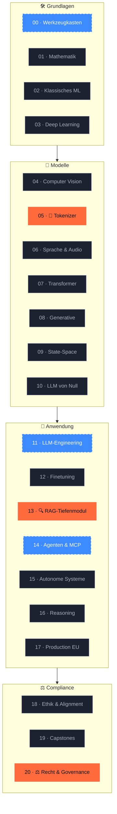
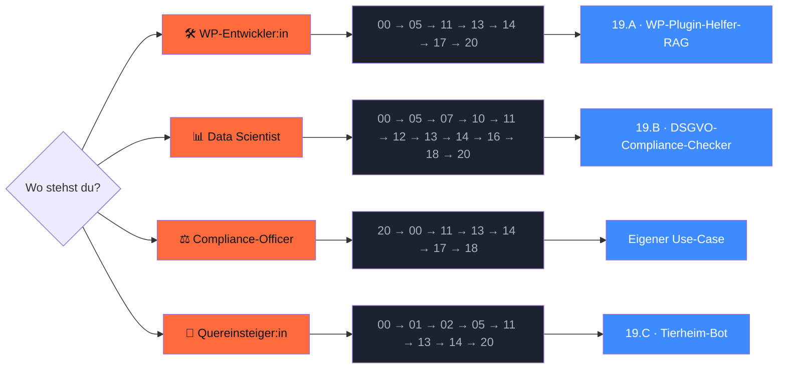

<div align="center">


# `ki-engineering-werkstatt`

### **20 Phasen KI-Engineering. Auf Deutsch. Mit Quellen, die Stand halten.**

*Eine Werkstatt, die in der EU funktioniert — Code, Quellen, Compliance, kein Marketing.*

[](LICENSE)
[](https://www.python.org/downloads/)
[](https://marimo.io)


[](CONTRIBUTING.md)

[**Schnellstart**](#-schnellstart) ·
[**Showcase**](#-showcase--3-module-sind-am-launch-tag-fertig) ·
[**Curriculum**](#-curriculum-21-phasen) ·
[**Lernpfade**](#-lernpfade--w%C3%A4hle-deinen-einstieg) ·
[**Compliance**](#%EF%B8%8F-dach--eu-compliance-anker) ·
[**Markt**](#-marktrealit%C3%A4t-dach-stand-recherche-q12026) ·
[**Quellen**](docs/quellen.md)

</div>

---

> [!IMPORTANT]
> **Was dieses Repo nicht ist.** Kein Newsletter-Funnel. Kein Discord. Keine Kurs-Verkaufsseite. Kein „werde KI-Engineer in 30 Tagen". Hier sind **21 Phasen Curriculum, ~80 Primärquellen mit Datum, EU-Compliance-Anker und lauffähiger Code**. Wer Marketing will, liest woanders.

---

## 🔥 Warum dieses Repo?

<table>
<tr>
<td width="33%" valign="top">

### 🇪🇺 DACH-Lücke geschlossen

Englische Curricula erklären Transformers — und ignorieren EU-AI-Act, DSGVO, deutsche Datasets, EU-Hosting. Hier nicht.

</td>
<td width="33%" valign="top">

### ⚖️ Compliance ist Leitmotiv

Jede Phase hat einen `compliance.md`-Anker mit konkreten Artikel-Referenzen. Vom Tokenizer bis zum Multi-Agent-System.

</td>
<td width="33%" valign="top">

### 📚 Belegbar, keine Bauchgefühle

Alle Markt-Aussagen mit **Bitkom / KfW / VDMA / IfM**-Quelle und Datum. ~80 kuratierte Primärquellen.

</td>
</tr>
</table>

---

## 📊 By the numbers (Stand 27.04.2026)

<table>
<tr>
<td align="center" width="20%"><strong>21</strong><br/>Phasen-Module</td>
<td align="center" width="20%"><strong>3 / 21</strong><br/>am Launch komplett</td>
<td align="center" width="20%"><strong>~80</strong><br/>Primärquellen</td>
<td align="center" width="20%"><strong>7</strong><br/>lauffähige Marimo-Notebooks</td>
<td align="center" width="20%"><strong>18</strong><br/>KI-Crawler geblockt</td>
</tr>
<tr>
<td align="center"><strong>4</strong><br/>Persona-Lernpfade</td>
<td align="center"><strong>8</strong><br/>CI-Workflows</td>
<td align="center"><strong>23</strong><br/>pytest-Tests</td>
<td align="center"><strong>5</strong><br/>EU-Modell-Setups</td>
<td align="center"><strong>0</strong><br/>API-Keys im Repo</td>
</tr>
</table>

---

## 🚀 Schnellstart

```bash
# 1. Repo klonen
gh repo clone s-a-s-k-i-a/ki-engineering-werkstatt
cd ki-engineering-werkstatt

# 2. Setup (uv + pre-commit + Pflicht-Deps in unter 2 Min.)
just setup

# 3. Smoke-Test — alles grün?
just smoke

# 4. Erstes Showcase-Modul öffnen
just edit 05-deutsche-tokenizer
```

> **Voraussetzungen**: Python 3.13, [`uv`](https://docs.astral.sh/uv/), [`just`](https://just.systems/), 8+ GB RAM. Optional: Apple-Silicon-Mac, NVIDIA-GPU oder einer der EU-Cloud-Anbieter aus [`infrastruktur/eu-modelle/`](infrastruktur/eu-modelle/).

---

## 🎯 Was du in 60 Minuten lernst

> Stop wasting tokens on German compound words. — drei konkrete Quick-Wins, jeder als ausgearbeitetes Modul.

| ⏱️ | Showcase | Du machst | Du sparst |
|---|---|---|---|
| 30 min | [**Phase 05 · Tokenizer-Showdown**](phasen/05-deutsche-tokenizer/) | Vergleiche GPT-5 vs. Pharia auf 10kGNAD | 30 % API-Kosten auf Deutsch |
| 60 min | [**Phase 13 · Vanilla-RAG**](phasen/13-rag-tiefenmodul/) | Bau ein 4-Schritte-RAG mit Quellen-Attribution | Halluzinations-Risiko |
| 30 min | [**Phase 20 · AI-Act-Klassifizierung**](phasen/20-recht-und-governance/) | CLI-Klassifizierung deines Use-Cases | Bußgeld bis 35 Mio. € |

---

## ✨ Showcase — 3 Module sind am Launch-Tag fertig

<table>
<tr>
<td width="33%" valign="top">

### 🧩 Phase 05<br/>Deutsche Tokenizer

**Token-Effizienz-Showdown** mit GPT-5, Claude 4.7, Llama 4, Mistral Large, Pharia-1, Teuken-7B auf 10kGNAD — inkl. EUR-Kosten-Vergleich.

→ [Modul](phasen/05-deutsche-tokenizer/)
→ [Lektion 01](phasen/05-deutsche-tokenizer/lektionen/01-bpe-und-deutsch.md)
→ [Marimo-Notebook](phasen/05-deutsche-tokenizer/code/01_tokenizer_showdown.py)

</td>
<td width="33%" valign="top">

### 🔍 Phase 13<br/>RAG-Tiefenmodul

**Vanilla → Hybrid → ColBERT → GraphRAG → LazyGraphRAG → Agentic** auf deutschem Wikipedia-Subset mit Pharia-1 + Qdrant.

→ [Modul](phasen/13-rag-tiefenmodul/)
→ [Lektion 01](phasen/13-rag-tiefenmodul/lektionen/01-vanilla-rag.md)
→ [Marimo-Notebook](phasen/13-rag-tiefenmodul/code/01_vanilla_rag.py)

</td>
<td width="33%" valign="top">

### ⚖️ Phase 20<br/>Recht & Governance

**AI-Act-CLI**, AVV-Checkliste, DSFA-Template, AI-Literacy-Onboarding, Audit-Logging — alles, was im Original fehlt.

→ [Modul](phasen/20-recht-und-governance/)
→ [Lektion 01](phasen/20-recht-und-governance/lektionen/01-ai-act-risk.md)
→ [CLI-Demo](phasen/20-recht-und-governance/code/01_ai_act_demo.py)

</td>
</tr>
</table>

```bash
# CLI-Demo — lauffähig in CI ohne LLM-Account
$ ki-act-classifier --modell-karte phasen/20-recht-und-governance/vorlagen/model-card-tierheim-bot.yaml

╭─ AI-Act-Klassifizierung — Tierheim-Hannover-Adoptions-Bot ────────────╮
│ Risikostufe: BEGRENZT                                                  │
╰────────────────────────────────────────────────────────────────────────╯
  Begründung: Transparenzpflicht: Art. 50 Abs. 1 — Chatbot-Hinweis
  Pflichten:  Endnutzer:innen klar informieren · Synthetische Inhalte
              technisch markieren (C2PA o. Ä.)
```

---

## 🗺️ Curriculum (21 Phasen)



**Legende**: 🟧 ✅ fertig · 🟦 🚧 in Arbeit · ⬛ ⏳ geplant

Vollständige [Roadmap](ROADMAP.md) mit Q2/Q3/Q4-2026-Plan.

---

## 👥 Lernpfade — wähle deinen Einstieg



| Profil | Empfohlener Pfad | Aufwand | Detail |
|---|---|---|---|
| 🛠️ WordPress-Entwickler:in | 00 → 05 → 11 → 13 → 14 → 17 → 20 → 19.A | ~ 50 h | [docs/lernpfade/wp-entwicklerin.md](docs/lernpfade/wp-entwicklerin.md) |
| 📊 Data Scientist | 00 → 05 → 07 → 10 → 11 → 12 → 13 → 14 → 16 → 18 → 20 | ~ 100 h | [docs/lernpfade/data-scientist.md](docs/lernpfade/data-scientist.md) |
| ⚖️ Compliance-Officer / DSB | 20 → 00 → 11 → 13 → 14 → 17 → 18 | ~ 30 h (Konzept) | [docs/lernpfade/compliance-officer.md](docs/lernpfade/compliance-officer.md) |
| 🌱 Quereinsteiger:in | 00 → 01 → 02 → 05 → 11 → 13 → 14 → 20 → Capstone | ~ 60 h | [docs/lernpfade/quereinsteigerin.md](docs/lernpfade/quereinsteigerin.md) |

---

## ⚖️ DACH- / EU-Compliance-Anker

> Stop hoping no one notices. — der größte Differenziator dieses Repos.

| Bereich | Datei |
|---|---|
| 📅 EU AI Act Tracker (Inkrafttretens-Stufen, Behörden, Sanktionen) | [`docs/rechtliche-perspektive/ai-act-tracker.md`](docs/rechtliche-perspektive/ai-act-tracker.md) |
| 🛡️ DSGVO-Checklisten (vor/während/nach Projekt) | [`docs/rechtliche-perspektive/dsgvo-checklisten.md`](docs/rechtliche-perspektive/dsgvo-checklisten.md) |
| 📜 AVV-Mustervorlagen pro Cloud-Anbieter | [`docs/rechtliche-perspektive/avv-musterklauseln.md`](docs/rechtliche-perspektive/avv-musterklauseln.md) |
| 📚 Urheberrecht & TDM-Opt-out | [`docs/rechtliche-perspektive/urheberrecht-trainingsdaten.md`](docs/rechtliche-perspektive/urheberrecht-trainingsdaten.md) |
| 🐉 Asiatische LLMs aus DACH-Sicht | [`docs/rechtliche-perspektive/asiatische-llms.md`](docs/rechtliche-perspektive/asiatische-llms.md) |
| ⚠️ Disclaimer „Kein Rechtsrat" | [`docs/rechtliche-perspektive/disclaimer.md`](docs/rechtliche-perspektive/disclaimer.md) |

### Modell-Anbieter im Vergleich

| Modell | Land | Lizenz | EUR/1M Input | DSGVO/AVV | Server |
|---|---|---|---|---|---|
| **Aleph Alpha** Pharia-1 | 🇩🇪 DE | proprietär | ~5,00 | ✅ | Heidelberg (BSI C5) |
| **Mistral** Large 2 | 🇫🇷 FR | proprietär | ~2,00 | ✅ | Frankreich |
| **IONOS** Llama-4-Maverick | 🇩🇪 DE | Llama CL | ~0,80 | ✅ | Karlsruhe (BSI C5) |
| **OpenAI** GPT-5 | 🇺🇸 US | proprietär | ~10,00 | DPA + EU-Datazone | USA (Routing) |
| **Anthropic** Claude 4.7 | 🇺🇸 US | proprietär | ~2,80 | DPA + EU-Datazone Q1/26 | USA (Routing) |
| **Qwen3** | 🇨🇳 CN | Apache 2.0 | je nach Hoster | je nach Hoster | bei Self-Hosting: lokal |
| **DeepSeek-R1** | 🇨🇳 CN | MIT | je nach Hoster | je nach Hoster | bei Self-Hosting: lokal |
| **Pharia / Mistral / Llama** lokal | — | — | nur Strom | ✅ | deine Hardware |

> ⚠️ **Asiatische Open-Weights**: lokale Inferenz auf EU-Hardware ist DSGVO-vertraeglich. Offizielle CN-API nicht. Self-Censorship-Audit Pflicht für News/Politik. → Details in [asiatische-llms.md](docs/rechtliche-perspektive/asiatische-llms.md).

---

## 📈 Marktrealität DACH (Stand Recherche Q1/2026)

> Wer KI-Engineering lernt, sollte wissen, wo der Markt steht. Belegt mit Primärquellen aus H2/2025 und Q1/2026 — keine Bauchgefühle.

<table>
<tr>
<td width="50%" valign="top">

### 🇩🇪 Adoption Deutschland

- **41 %** der DE-Unternehmen ab 20 MA nutzen KI aktiv ([Bitkom, 15.09.2025](https://www.bitkom.org/Presse/Presseinformation/Durchbruch-Kuenstliche-Intelligenz))
- **20 %** im echten KMU (~780 k Firmen, [KfW Fokus 533, 11.02.2026](https://www.kfw.de/PDF/Download-Center/Konzernthemen/Research/PDF-Dokumente-Fokus-Volkswirtschaft/Fokus-2026/Fokus-Nr.-533-Februar-2026-KI-Mittelstand.pdf))
- **>60 %** der Großunternehmen ≥500 MA
- **43 %** im DACH-Maschinenbau ([VDMA / Strategy& 2025](https://www.vdma.eu/documents/34570/4888559/Studie_GenAI-Implications_Web_DE.pdf))

</td>
<td width="50%" valign="top">

### 🚧 Top-3-Hindernisse

- **53 %** rechtliche Unsicherheit
- **53 %** fehlendes Know-how
- **48 %** Datenschutzsorgen

> Genau die Lücken, die dieses Curriculum schließt.

**70 %** haben Innovationen wegen Datenschutz-Vorgaben gestoppt ([Bitkom „Innovations-Bremse"](https://www.bitkom.org/Presse/Presseinformation/Datenschutz-Innovations-Bremse))

</td>
</tr>
<tr>
<td valign="top">

### 🌍 Anbieter-Landschaft (Tendenz)

- **OpenAI / ChatGPT** führt Web-Traffic (~ 81 %, *Methodik = Web-Traffic, NICHT Enterprise-Lizenzen*)
- **Microsoft Copilot** dominiert Enterprise via M365-Integration
- **Anthropic** eröffnet Münchner Office 07.11.2025 — DE in den globalen Top-20 bei Claude-Nutzung pro Kopf ([Anthropic Newsroom](https://www.anthropic.com/news/new-offices-in-paris-and-munich-expand-european-presence))
- **Aleph Alpha** verlässt Foundation-Model-Rennen, Pivot zu Sovereign-AI; Cohere-Merger 04/2026

</td>
<td valign="top">

### 🇦🇹🇨🇭 Österreich + Schweiz

- **AT-KMU** (≥10 MA): nur **8,9 %** nutzen KI (KMU Forschung Austria / WKÖ 2025)
- **CH-KMU**: **22 % → 34 %** (2024 → 2025, [SECO 05.11.2025](https://www.kmu.admin.ch/kmu/en/home/new/news/2025/ai-gains-ground-swiss-smes.html))
- **CH-Arbeitsmarkt**: in stark KI-exponierten Berufen seit Nov 2022 +27 % stärkere Arbeitslosenzahl ([KOF ETH Studie 186, 10/2025](https://ethz.ch/content/dam/ethz/special-interest/dual/kof-dam/documents/newsletter/KOF_Studie_KI_Schweizer_Arbeitsmarkt.pdf))

</td>
</tr>
</table>

📊 Vollständig in [`phasen/00-werkzeugkasten/markt-und-realitaet.md`](phasen/00-werkzeugkasten/markt-und-realitaet.md) (alle 18 Kennzahlen, 5 Direkt-Zitate, Quellen-Liste).

---

## 🧰 Tooling-Stack 2026

<table>
<tr>
<td><strong>Sprache & Build</strong></td>
<td><code>Python 3.13</code> · <code>uv</code> · <code>Ruff</code> · <code>Ty</code></td>
</tr>
<tr>
<td><strong>Notebooks</strong></td>
<td><code>Marimo</code> (.py source-of-truth + .ipynb Auto-Build für Colab)</td>
</tr>
<tr>
<td><strong>LLM-Frameworks</strong></td>
<td><code>Pydantic AI</code> · <code>LangGraph</code> · <code>DSPy</code> · <code>MCP</code></td>
</tr>
<tr>
<td><strong>Vector DB</strong></td>
<td><code>Qdrant</code> 🇩🇪 · <code>pgvector</code> · <code>LanceDB</code></td>
</tr>
<tr>
<td><strong>Inference</strong></td>
<td><code>vLLM</code> · <code>Ollama</code> · <code>llama.cpp</code> · <code>MLX</code> (Mac) · <code>LiteLLM</code></td>
</tr>
<tr>
<td><strong>Eval</strong></td>
<td><code>Promptfoo</code> · <code>Ragas</code> · <code>Inspect-AI</code></td>
</tr>
<tr>
<td><strong>Tracing</strong></td>
<td><code>OpenTelemetry GenAI</code> · <code>Phoenix</code> · <code>Langfuse</code> (EU-self-hosted)</td>
</tr>
<tr>
<td><strong>EU-Modelle</strong> 🇪🇺</td>
<td>Aleph Alpha Pharia · Mistral · IONOS AI Model Hub · StackIT · Black Forest Labs FLUX · DeepL</td>
</tr>
<tr>
<td><strong>US-Modelle</strong> 🇺🇸</td>
<td>OpenAI GPT-5 · Anthropic Claude 4.7 · Google Gemini 3 (mit AVV / EU-Zone)</td>
</tr>
<tr>
<td><strong>Asiatische Open-Weights</strong> 🐉</td>
<td>Qwen3 · DeepSeek-R1 · GLM-5 · Kimi K2.6 · MiniCPM (mit DACH-Compliance-Disclaimer)</td>
</tr>
</table>

---

## 📚 Quellenbibliothek

~ **80 kuratierte Primärquellen**, kategorisiert in 13 Bereiche: Bücher · Foundational Papers · 2024–2026 SOTA · DACH-spezifisch · Recht & Compliance · Tooling-Docs · Datasets · Blogs · Video-Kurse · Markt-Studien DACH · Asiatische LLMs · China-Compliance · Sonstiges Tooling.

→ [`docs/quellen.md`](docs/quellen.md) · **Stand: 27.04.2026**

---

## 🔄 Wartungsversprechen

> AI-Act-Tracker monatlich · Curriculum-Module wöchentliche PRs · Quellenbibliothek quartalsweise · Hotfix-Issues bei AI-Act-Stand-Updates binnen 7 Tagen.

---

## 🤝 Mitwirken

[Diskussionen](https://github.com/s-a-s-k-i-a/ki-engineering-werkstatt/discussions) > Issues > Pull Requests, in dieser Reihenfolge.

Vor jedem PR: `just smoke` lokal grün — **Pflicht-Gate**. Details in [`CONTRIBUTING.md`](CONTRIBUTING.md) und [`docs/stilrichtlinien.md`](docs/stilrichtlinien.md).

---

## 👤 Über die Macherin

<table>
<tr>
<td width="120" valign="top">
<a href="https://github.com/s-a-s-k-i-a"></a>
</td>
<td valign="top">

**Saskia Teichmann** baut seit 2010 WordPress- und WooCommerce-Software in Hannover ([isla-stud.io](https://isla-stud.io)) und entwickelt mit [citelayer®](https://citelayer.ai) Tools, die WordPress-Inhalte für LLMs zitierfähig machen.

🛠️ Public Code u. a.: [`devctx`](https://github.com/s-a-s-k-i-a/devctx) · [`openclaw`](https://github.com/s-a-s-k-i-a/openclaw) · [`cloudpanel-mail-addon`](https://github.com/s-a-s-k-i-a/cloudpanel-mail-addon) · [`localized-sitemap-indexes`](https://github.com/s-a-s-k-i-a/localized-sitemap-indexes) · [`freellmapi`](https://github.com/s-a-s-k-i-a/freellmapi)

🐦 Twitter / X: [@SaskiaLund](https://twitter.com/SaskiaLund)

</td>
</tr>
</table>

---

## 📄 Lizenz & Attribution

[**MIT**](LICENSE).

Strukturelle Inspiration durch [`rohitg00/ai-engineering-from-scratch`](https://github.com/rohitg00/ai-engineering-from-scratch) (MIT). **Inhaltlich eigenständig**: deutschsprachig, DACH-/EU-Compliance-zentriert, mit lauffähigen Marimo-Notebooks, deutschen Datasets und EU-LLM-Stack.

Vollständige Attribution in [`NOTICE`](NOTICE).

---

## 🌐 English readers

This repo is German-first by design. Brief English stub: [`README.en.md`](README.en.md). Full English fork planned for Q4/2026.

<div align="center">

---

*Made in Hannover · MIT-Lizenz · Stand 27.04.2026 · Kein Marketing.*

</div>
