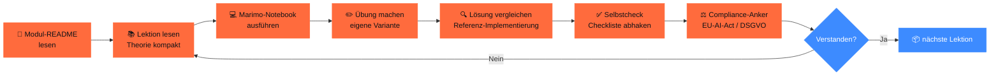
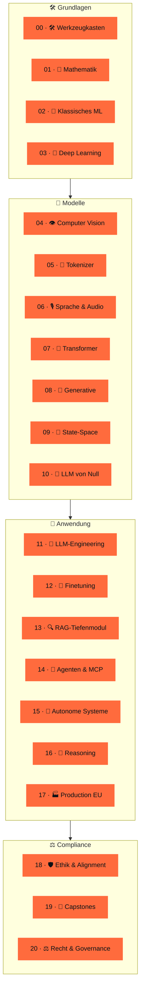
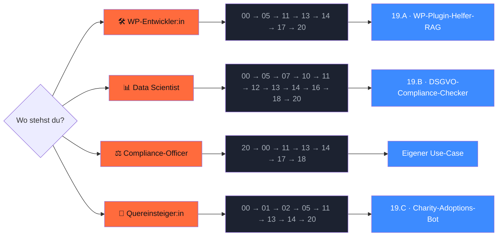

<div align="center">


# `ki-engineering-werkstatt`

### **KI-Anwendungen bauen, die im EU-Rechtsraum funktionieren — auf Deutsch.**

*21 Phasen · 5 Capstone-Projekte · 20+ Marimo-Notebooks · ~ 80 Primärquellen mit Datum.*

[](LICENSE)
[](https://www.python.org/downloads/)
[](https://marimo.io)


[](CONTRIBUTING.md)

[**Was kann ich damit?**](#-was-kann-ich-damit-konkret-bauen) ·
[**Schnellstart**](#-schnellstart-in-5-min-laufen) ·
[**Curriculum**](#%EF%B8%8F-curriculum-21-phasen) ·
[**Lernpfade**](#-w%C3%A4hle-deinen-einstieg) ·
[**Workshops**](#-workshop-formate) ·
[**Wer ich bin**](#-wer-hinter-dem-repo-steht)

</div>

---

## 🎯 Für wen ist das?

Du **baust** oder **berätst zu** KI-Anwendungen — und du arbeitest in **Deutschland, Österreich oder der Schweiz**. 

Dieses Repo ist kein Marketing-Funnel oder irgendein Crashkurs ala „werde KI-Engineer in 30 Tagen". Stattdessen: **21 Phasen Curriculum + 5 Real-World-Capstones**, EU-Stack-First, jede Aussage mit Quelle und Datum, alles MIT-lizenziert.

<table>
<tr>
<td width="25%" valign="top" align="center">

🛠️<br/>**Backend / WP-Devs**

du baust LLMs in Plugins, APIs, SaaS

</td>
<td width="25%" valign="top" align="center">

📊<br/>**Data Scientists**

du willst Production-LLMs statt nur Notebooks

</td>
<td width="25%" valign="top" align="center">

⚖️<br/>**Compliance / DSB**

du musst KI-Projekte einschätzen können

</td>
<td width="25%" valign="top" align="center">

🌱<br/>**Quereinsteiger:innen**

du startest grade mit KI von Null

</td>
</tr>
</table>

→ Vier vorbereitete [**Lernpfade**](#-w%C3%A4hle-deinen-einstieg) führen dich je nach Profil durch das Curriculum. Plus drei [**Workshop-Formate**](#-workshop-formate) für Trainer:innen.

---

## 🛠️ Was kann ich damit konkret bauen?

Fünf vollständig durchdokumentierte Capstone-Projekte mit echten DACH-Use-Cases. Jeder Capstone hat README, Stub-Implementierung, Compliance-Anker und ist mit den Curriculum-Phasen verlinkt.

<table>
<tr>
<td width="50%" valign="top">

### 🛠️ 19.A · WordPress-Plugin-Helfer-RAG

**Was du baust**: einen Multi-Agent, der dir bei eigenen WordPress- und WooCommerce-Plugins hilft — AST-basiertes Code-Splitting, Issue-Triage, lokale RAG-Pipeline.

**Real-World-Bezug**: Saskias eigener Use-Case bei [`isla-stud.io`](https://isla-stud.io) und [`citelayer®`](https://citelayer.ai).

→ [`projekte/19-A-wp-plugin-helfer-rag/`](projekte/19-A-wp-plugin-helfer-rag/)

</td>
<td width="50%" valign="top">

### 🛡️ 19.B · DSGVO-Compliance-Checker

**Was du baust**: einen Playwright-Crawler, der deine Website auf DSGVO-Anker prüft (Cookies, Drittland-Embeds, AVV-Hinweise) und einen DSFA-Light-Bericht ausspuckt.

**Real-World-Bezug**: erstes Mini-Audit für KMU-Websites vor der Beauftragung einer Anwaltskanzlei.

→ [`projekte/19-B-dsgvo-compliance-checker/`](projekte/19-B-dsgvo-compliance-checker/)

</td>
</tr>
<tr>
<td width="50%" valign="top">

### 🐾 19.C · Charity-Adoptions-Bot

**Was du baust**: einen Voice-Agent für ein Tierheim — LangGraph-Multi-Agent mit Whisper + F5-TTS + HITL bei Adoptions-Entscheidung, mit Auto-Lösch-Pipeline.

**Real-World-Bezug**: gemeinnützige Variante eines Voice-Bots; § 201 StGB + DSGVO Art. 9 als Pflicht-Pattern.

→ [`projekte/19-C-charity-adoptions-bot/`](projekte/19-C-charity-adoptions-bot/)

</td>
<td width="50%" valign="top">

### ⚖️ 19.D · Aktiengesetz-RAG

**Was du baust**: ein Hybrid-RAG-System auf dem deutschen Aktiengesetz — mit Multi-Hop-Erkennung, Reasoning-Modell-Vergleich und § RDG-Disclaimer.

**Real-World-Bezug**: Vorlage für jedes Recht-/Steuer-/Compliance-RAG, das den Rechtsdienstleistungsgesetz-Rahmen einhält.

→ [`projekte/19-D-aktiengesetz-rag/`](projekte/19-D-aktiengesetz-rag/)

</td>
</tr>
<tr>
<td colspan="2" valign="top">

### 🌍 19.E · Mehrsprachiger Voice-Agent (DE ↔ EN ↔ TR)

**Was du baust**: einen Realtime-Voice-Agent mit LiveKit + Whisper + Voxtral, mit Auto-Lösch-Pipeline (DSGVO Art. 17 binnen 30 Tagen) und Sprachen-Switching.

**Real-World-Bezug**: KMU mit internationaler Kundschaft — der Bot kommuniziert in der Sprache der Anrufer:in, ohne aufgenommene Daten dauerhaft zu speichern.

→ [`projekte/19-E-voice-agent-multi/`](projekte/19-E-voice-agent-multi/)

</td>
</tr>
</table>

> **Status**: Alle 5 Capstones sind als **Stub-Skelette** ausgearbeitet (README, Architektur, Compliance-Anker, Smoke-Test-tauglicher Code-Stub). Production-Reife (Tests, Deployment, echtes Plugin-Packaging) ist iterativ — siehe [ROADMAP.md](ROADMAP.md).

---

## 🚀 Schnellstart (in 5 Min lauffähig)

```bash
# 1. Repo klonen
gh repo clone s-a-s-k-i-a/ki-engineering-werkstatt
cd ki-engineering-werkstatt

# 2. Setup (uv + pre-commit + Pflicht-Deps in unter 2 Min.)
just setup

# 3. Smoke-Test — alles grün?
just smoke

# 4. Erstes Modul öffnen (Empfehlung für Erst-Besuch)
just edit 11-llm-engineering
```

**Voraussetzungen**: Python 3.13, [`uv`](https://docs.astral.sh/uv/), [`just`](https://just.systems/), 8+ GB RAM. Optional: Apple-Silicon-Mac, NVIDIA-GPU oder einen der EU-Cloud-Anbieter aus [`infrastruktur/eu-modelle/`](infrastruktur/eu-modelle/).

**Kein `just`?** Geht auch direkt: `uv sync --extra dev --extra tokenizer && uv run pytest tests/ -q`.

→ Volle Anleitung mit Troubleshooting in [`GETTING_STARTED.md`](GETTING_STARTED.md).

---

## 📊 Stand v0.3.0 (29.04.2026)

<table>
<tr>
<td align="center" width="20%"><strong>21 / 21</strong><br/>Phasen-Module ✅</td>
<td align="center" width="20%"><strong>5 / 5</strong><br/>Capstones ✅</td>
<td align="center" width="20%"><strong>20 / 20</strong><br/>Phasen mit Übung ✅</td>
<td align="center" width="20%"><strong>3 / 3</strong><br/>Workshop-Formate ✅</td>
<td align="center" width="20%"><strong>~ 80</strong><br/>Primärquellen mit Datum</td>
</tr>
<tr>
<td align="center"><strong>20+</strong><br/>Marimo-Notebooks</td>
<td align="center"><strong>23</strong><br/>pytest-Tests in CI</td>
<td align="center"><strong>8</strong><br/>GitHub-Workflows</td>
<td align="center"><strong>5</strong><br/>EU-Modell-Setups</td>
<td align="center"><strong>0</strong><br/>API-Keys im Repo</td>
</tr>
</table>

---

> [!IMPORTANT]
> **Was dieses Repo nicht ist.** Kein Newsletter-Funnel · Kein Discord-Server · Keine Kurs-Verkaufsseite · Kein „werde KI-Engineer in 30 Tagen". Kein Rechtsrat (siehe [`disclaimer.md`](docs/rechtliche-perspektive/disclaimer.md)). Wer Marketing will, liest woanders.

---

## 🔄 So lernst du

Jede Phase folgt dem gleichen Muster. Plane mit ~ 1–4 Stunden pro Lektion (lesen + Übung + Selbstcheck).



---

## 🗺️ Curriculum (21 Phasen)

> Vier didaktische Bänder: **Grundlagen → Modelle → Anwendung → Compliance**. Jede Phase mit Lernzielen, Marimo-Notebook, Übung, Lösung, Compliance-Anker und Quellen. Stack: Python 3.13, uv, Marimo, Pydantic AI, Qdrant, vLLM, Pharia / Mistral / Llama / Qwen.



→ Volle [Roadmap](ROADMAP.md) mit Releases, Wartungs-Kadenz und nächsten Iterations-Items.

---

## 👥 Wähle deinen Einstieg



| Profil | Empfohlener Pfad | Aufwand | Detail |
|---|---|---|---|
| 🛠️ WordPress-Entwickler:in | 00 → 05 → 11 → 13 → 14 → 17 → 20 → 19.A | ~ 50 h | [docs/lernpfade/wp-entwicklerin.md](docs/lernpfade/wp-entwicklerin.md) |
| 📊 Data Scientist | 00 → 05 → 07 → 10 → 11 → 12 → 13 → 14 → 16 → 18 → 20 | ~ 100 h | [docs/lernpfade/data-scientist.md](docs/lernpfade/data-scientist.md) |
| ⚖️ Compliance-Officer / DSB | 20 → 00 → 11 → 13 → 14 → 17 → 18 | ~ 30 h (Konzept) | [docs/lernpfade/compliance-officer.md](docs/lernpfade/compliance-officer.md) |
| 🌱 Quereinsteiger:in | 00 → 01 → 02 → 05 → 11 → 13 → 14 → 20 → Capstone | ~ 60 h | [docs/lernpfade/quereinsteigerin.md](docs/lernpfade/quereinsteigerin.md) |

---

## 🎓 Workshop-Formate

Drei aus dem Curriculum abgeleitete Formate für Trainer:innen, Inhouse-Schulungen und Hochschul-Lehre. Adaptierbar unter MIT, Attribution erbeten.

| Format | Dauer | Zielgruppe | Datei |
|---|---|---|---|
| 🚀 **Crashkurs** | 4 h | Entscheider:innen, Compliance-Officer, technische Generalist:innen | [`docs/workshops/4h-crashkurs.md`](docs/workshops/4h-crashkurs.md) |
| 🛠️ **Tagesworkshop** | 8 h | Backend-Devs (Python, 1+ Jahr) | [`docs/workshops/8h-tagesworkshop.md`](docs/workshops/8h-tagesworkshop.md) |
| 🏗️ **Zweitagesworkshop** | 16 h | KI-Engineers, ML-Quereinsteiger:innen | [`docs/workshops/16h-zweitagesworkshop.md`](docs/workshops/16h-zweitagesworkshop.md) |

→ Format-Übersicht + Trainer:innen-Checkliste in [`docs/workshops/`](docs/workshops/).

---

## ⚖️ Compliance-Anker — DACH/EU als Leitmotiv

> Das Herzstück. Jede Phase hat einen `compliance.md`-Anker, der konkret an EU-AI-Act-Artikeln, DSGVO-Pflichten und UrhG-Schranken hängt — nicht als Anhang, sondern als Leitmotiv durch das gesamte Curriculum.

| Bereich | Datei |
|---|---|
| 📅 EU AI Act Tracker (Inkrafttretens-Stufen, Behörden, Sanktionen) | [`docs/rechtliche-perspektive/ai-act-tracker.md`](docs/rechtliche-perspektive/ai-act-tracker.md) |
| 🛡️ DSGVO-Checklisten (vor / während / nach Projekt) | [`docs/rechtliche-perspektive/dsgvo-checklisten.md`](docs/rechtliche-perspektive/dsgvo-checklisten.md) |
| 📜 AVV-Mustervorlagen pro Cloud-Anbieter | [`docs/rechtliche-perspektive/avv-musterklauseln.md`](docs/rechtliche-perspektive/avv-musterklauseln.md) |
| 📚 Urheberrecht & TDM-Opt-out | [`docs/rechtliche-perspektive/urheberrecht-trainingsdaten.md`](docs/rechtliche-perspektive/urheberrecht-trainingsdaten.md) |
| 🐉 Asiatische LLMs aus DACH-Sicht | [`docs/rechtliche-perspektive/asiatische-llms.md`](docs/rechtliche-perspektive/asiatische-llms.md) |
| ⚠️ Disclaimer „Kein Rechtsrat" | [`docs/rechtliche-perspektive/disclaimer.md`](docs/rechtliche-perspektive/disclaimer.md) |

### Modell-Anbieter im DSGVO-Vergleich

| Modell | Land | Lizenz | EUR / 1M Input | DSGVO / AVV | Server |
|---|---|---|---|---|---|
| **Aleph Alpha** Pharia-1 | 🇩🇪 DE | proprietär (post-Cohere) | ~ 5,00 | ✅ | Heidelberg (BSI C5) |
| **Mistral** Large 3 | 🇫🇷 FR | proprietär | ~ 2,00 | ✅ | Frankreich |
| **IONOS** Llama-4-Maverick | 🇩🇪 DE | Llama CL | ~ 0,80 | ✅ | Karlsruhe (BSI C5) |
| **Anthropic** Claude Sonnet 4.6 | 🇺🇸 US | proprietär | ~ 3,00 | DPA + EU-Datazone | USA (EU-Routing, München-Office) |
| **OpenAI** GPT-5.5 | 🇺🇸 US | proprietär | ~ 5,00 | DPA + EU-Datazone | USA (EU-Routing) |
| **Qwen3** Apache 2.0 | 🇨🇳 CN | Apache 2.0 | je nach Hoster | je nach Hoster | bei Self-Hosting: lokal |
| **DeepSeek-R1** MIT | 🇨🇳 CN | MIT | je nach Hoster | je nach Hoster | bei Self-Hosting: lokal |
| **Pharia / Mistral / Llama** lokal | — | — | nur Strom | ✅ | deine Hardware |

> ⚠️ **Asiatische Open-Weights**: lokale Inferenz auf EU-Hardware ist DSGVO-vertraeglich. Offizielle CN-API nicht. Self-Censorship-Audit Pflicht für News / Politik. → Details in [asiatische-llms.md](docs/rechtliche-perspektive/asiatische-llms.md).

---

## 🧰 Tooling-Stack 2026

| Bereich | Tools |
|---|---|
| **Sprache & Build** | `Python 3.13` · `uv` · `Ruff` · `Ty` |
| **Notebooks** | `Marimo` (.py source-of-truth + .ipynb Auto-Build für Colab) |
| **LLM-Frameworks** | `Pydantic AI` · `LangGraph` · `DSPy` · `MCP` |
| **Vector DB** | `Qdrant` 🇩🇪 · `pgvector` · `LanceDB` |
| **Inference** | `vLLM` · `Ollama` · `llama.cpp` · `MLX` (Mac) · `LiteLLM` |
| **Eval** | `Promptfoo` · `Ragas` · `Inspect-AI` |
| **Tracing** | `OpenTelemetry GenAI` · `Phoenix` · `Langfuse` (EU-self-hosted) |
| **EU-Modelle 🇪🇺** | Aleph Alpha Pharia · Mistral · IONOS AI Model Hub · STACKIT · BFL FLUX · DeepL |
| **US-Modelle 🇺🇸** | Anthropic Claude · OpenAI GPT · Google Gemini (mit AVV / EU-Zone) |
| **Asiatische Open-Weights 🐉** | Qwen3 · DeepSeek-R1 · GLM-5 · Kimi K2.6 · MiniCPM (mit DACH-Compliance-Disclaimer) |

---

## 📈 Marktrealität DACH (Kurzfassung)

> Wer KI-Engineering lernt, sollte wissen, wo der Markt steht. Belegt mit Primärquellen aus H2 / 2025 und Q1 / 2026 — keine Bauchgefühle.

- **41 %** der DE-Unternehmen ab 20 MA nutzen KI aktiv ([Bitkom 09/2025](https://www.bitkom.org/Presse/Presseinformation/Durchbruch-Kuenstliche-Intelligenz)) · **20 %** im echten KMU ([KfW 02/2026](https://www.kfw.de/PDF/Download-Center/Konzernthemen/Research/PDF-Dokumente-Fokus-Volkswirtschaft/Fokus-2026/Fokus-Nr.-533-Februar-2026-KI-Mittelstand.pdf))
- **Top-3-Hindernisse**: Recht 53 % · Know-how 53 % · Datenschutz 48 % — *genau die Lücken, die dieses Curriculum schließt*
- **70 %** der DE-Unternehmen haben Innovationen wegen Datenschutz-Vorgaben gestoppt ([Bitkom „Innovations-Bremse"](https://www.bitkom.org/Presse/Presseinformation/Datenschutz-Innovations-Bremse))
- **AT-KMU**: 8,9 % · **CH-KMU**: 22 % → 34 % ([SECO 11/2025](https://www.kmu.admin.ch/kmu/en/home/new/news/2025/ai-gains-ground-swiss-smes.html))
- **Aleph Alpha** pivotierte zu Sovereign-AI / PhariaAI; **Cohere-Übernahme angekündigt 24.04.2026** mit Schwarz-Gruppe als Hauptbacker, „Command-Pharia 1" für Q4/2026 geplant
- **Anthropic** eröffnete Münchner Office 07.11.2025 ([Anthropic Newsroom](https://www.anthropic.com/news/new-offices-in-paris-and-munich-expand-european-presence))

📊 Vollständige Zahlen + Quellen in [`phasen/00-werkzeugkasten/markt-und-realitaet.md`](phasen/00-werkzeugkasten/markt-und-realitaet.md).

---

## 📚 Quellenbibliothek

~ **80 kuratierte Primärquellen**, kategorisiert in 13 Bereiche: Bücher · Foundational Papers · 2024–2026 SOTA · DACH-spezifisch · Recht & Compliance · Tooling-Docs · Datasets · Blogs · Video-Kurse · Markt-Studien · Asiatische LLMs · China-Compliance · Sonstiges.

→ [`docs/quellen.md`](docs/quellen.md) · **Stand: 29.04.2026**

---

## 🔄 Wartungsversprechen

> AI-Act-Tracker monatlich · Curriculum-Module nach Bedarf · Quellenbibliothek quartalsweise · Hotfix-Issues bei AI-Act-Stand-Updates binnen 7 Tagen.

Alle Stand-Daten sind in den jeweiligen Dateien als YAML-Frontmatter gepflegt. CI prüft monatlich, dass keine Quelle älter als 180 Tage ist (Warnung).

---

## 🤝 Mitwirken

[Diskussionen](https://github.com/s-a-s-k-i-a/ki-engineering-werkstatt/discussions) > Issues > Pull Requests, in dieser Reihenfolge.

Vor jedem PR: `just smoke` lokal grün — **Pflicht-Gate**. Details in [`CONTRIBUTING.md`](CONTRIBUTING.md) und [`docs/stilrichtlinien.md`](docs/stilrichtlinien.md).

---

## 👤 Wer hinter dem Repo steht

<table>
<tr>
<td width="120" valign="top">
<a href="https://github.com/s-a-s-k-i-a"></a>
</td>
<td valign="top">

**Saskia Teichmann** baut seit **2010** WordPress- und WooCommerce-Software in **Hannover** ([isla-stud.io](https://isla-stud.io)) — über 16 Jahre Praxis im DACH-Mittelstand. Mit [**citelayer®**](https://citelayer.ai) entwickelt sie Tools, die WordPress-Inhalte für LLMs zitierfähig machen.

🛠️ **Vertrauensanker: aktive Open-Source-Projekte**

- [`devctx`](https://github.com/s-a-s-k-i-a/devctx) — Project-Context-CLI für AI-Agents
- [`openclaw`](https://github.com/s-a-s-k-i-a/openclaw) — lokaler AI-Assistant
- [`cloudpanel-mail-addon`](https://github.com/s-a-s-k-i-a/cloudpanel-mail-addon) — DKIM/SPF/DMARC-Addon, real eingesetzt im DACH-Hosting
- [`localized-sitemap-indexes`](https://github.com/s-a-s-k-i-a/localized-sitemap-indexes) — TranslatePress + Rank Math Sitemap-Bridge
- [`freellmapi`](https://github.com/s-a-s-k-i-a/freellmapi) — OpenAI-kompatibler Multi-Provider-Proxy
- [`claude-code-timestamps`](https://github.com/s-a-s-k-i-a/claude-code-timestamps) — Timestamps-Plugin für Claude Code

🐦 Twitter / X: [@SaskiaLund](https://twitter.com/SaskiaLund)

</td>
</tr>
</table>

> **Warum vertrauen?** — Weil ich nichts verspreche, was ich nicht selbst nutze. citelayer® läuft auf demselben EU-Stack, den ich hier lehre. Die Quellen sind primär (kein Aggregator-Blog, sondern eur-lex, BfDI, Bitkom, KfW, ETH Zürich, Anthropic-Newsroom). Wenn du Fehler findest: Issue oder PR, ich schaue regelmäßig rein.

---

## 📄 Lizenz

[**MIT**](LICENSE) — frei nutzbar, frei forkbar, kommerziell verwendbar.

Drittlizenzen (Datasets, Modelle, didaktische Vorbilder) sind in [`NOTICE`](NOTICE) dokumentiert.

---

## 🌐 English readers

This repo is German-first by design. Brief English stub: [`README.en.md`](README.en.md). Full English fork planned if there is demand — open a [Discussion](https://github.com/s-a-s-k-i-a/ki-engineering-werkstatt/discussions) to nudge.

<div align="center">

---

*Made in Hannover · MIT-Lizenz · Stand 29.04.2026 · Kein Marketing.*

</div>
