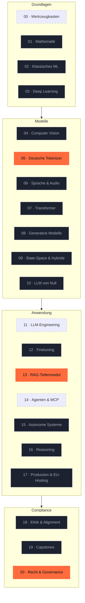

# ki-engineering-werkstatt

> **20 Phasen KI-Engineering. Auf Deutsch. Mit Quellen, die Stand halten.**
> KI-Engineering ohne Marketing-Layer.

> [!IMPORTANT]
> **Was dieses Repo nicht ist.** Kein Newsletter-Funnel. Kein Discord. Keine Kurs-Verkaufsseite. Kein „werde KI-Engineer in 30 Tagen". Hier sind 20 Phasen Curriculum, Quellen mit Datum, EU-Compliance-Anker und Code, der läuft. Wenn du Marketing willst, lies woanders.

[](LICENSE)
[](https://www.python.org/downloads/)
[](https://marimo.io)


[](CONTRIBUTING.md)

---

## Warum dieses Repo?

- **DACH-Lücke geschlossen**: Englischsprachige Curricula erklären Transformers, ignorieren aber EU-AI-Act, DSGVO, deutsche Datasets, EU-Hosting. Das hier ist die Antwort.
- **Compliance ist Leitmotiv, nicht Anhang**: jede Phase hat einen `compliance.md`-Anker mit konkreten Artikel-Referenzen — vom Tokenizer bis zum Multi-Agent-System.
- **Belegbar, keine Bauchgefühle**: alle Markt-Aussagen mit Bitkom/KfW/VDMA/IfM-Quelle und Datum. ~80 kuratierte Primärquellen in [`docs/quellen.md`](docs/quellen.md).

## Schnellstart

```bash
# 1. Repo klonen
gh repo clone s-a-s-k-i-a/ki-engineering-werkstatt
cd ki-engineering-werkstatt

# 2. Setup (uv + pre-commit)
just setup

# 3. Smoke-Test — alles grün?
just smoke

# 4. Erstes Showcase-Modul öffnen
just edit 05-deutsche-tokenizer
```

Voraussetzungen: Python 3.13, [`uv`](https://docs.astral.sh/uv/), [`just`](https://just.systems/), 8+ GB RAM. Optional: Apple-Silicon-Mac, NVIDIA-GPU oder einer der EU-Cloud-Anbieter aus [`infrastruktur/eu-modelle/`](infrastruktur/eu-modelle/).

## Showcase — drei Module sind heute schon vollständig

| Modul | Was du bekommst | Wow-Effekt |
|---|---|---|
| 🧩 [**Phase 05 — Deutsche Tokenizer**](phasen/05-deutsche-tokenizer/) | Token-Effizienz-Showdown mit GPT-5, Claude 4.7, Llama 4, Mistral, Pharia, Teuken auf 10kGNAD + EUR-Kosten-Vergleich | „Hier sparen wir ab Tag 1 30 % API-Kosten." |
| 🔍 [**Phase 13 — RAG-Tiefenmodul**](phasen/13-rag-tiefenmodul/) | Vanilla → Hybrid → ColBERT → GraphRAG → LazyGraphRAG → Agentic, alle auf deutschem Wikipedia-Subset | „Komplettes RAG-Spektrum 2026 für deutsche Daten." |
| ⚖️ [**Phase 20 — Recht & Governance**](phasen/20-recht-und-governance/) | AI-Act-Risk-Klassifizierung-CLI, AVV-Checkliste, DSFA-Template, AI-Literacy-Onboarding, Audit-Logging | „Das einzige Curriculum mit AI-Act-Praxis." |

```bash
# CLI-Demo (ohne LLM-Account, lauffähig in CI)
ki-act-classifier --modell-karte phasen/20-recht-und-governance/vorlagen/model-card-tierheim-bot.yaml
```

## Curriculum-Übersicht



Vollständige [Roadmap](ROADMAP.md).

## Lernpfade — wähle deinen Einstieg

| Profil | Empfohlene Reihenfolge | Gesamt-Aufwand |
|---|---|---|
| 🛠️ [WordPress-Entwickler:in](docs/lernpfade/wp-entwicklerin.md) | 00 → 05 → 11 → 13 → 14 → 17 → 20 → Capstone 19.A | ~ 50 h |
| 📊 [Data Scientist](docs/lernpfade/data-scientist.md) | 00 → 05 → 07 → 10 → 11 → 12 → 13 → 14 → 16 → 18 → 20 | ~ 100 h |
| ⚖️ [Compliance-Officer / DSB](docs/lernpfade/compliance-officer.md) | 20 → 00 → 05 → 11 → 13 → 14 → 17 → 18 | ~ 30 h (nur Konzept) |
| 🌱 [Quereinsteiger:in](docs/lernpfade/quereinsteigerin.md) | 00 → 01 → 02 → 05 → 11 → 13 → 14 → 20 → Capstone | ~ 60 h |

## DACH- / EU-Compliance-Anker

| Bereich | Wo im Repo |
|---|---|
| EU AI Act 2024/1689 | [`docs/rechtliche-perspektive/ai-act-tracker.md`](docs/rechtliche-perspektive/ai-act-tracker.md) |
| DSGVO-Checklisten | [`docs/rechtliche-perspektive/dsgvo-checklisten.md`](docs/rechtliche-perspektive/dsgvo-checklisten.md) |
| AVV-Mustervorlagen | [`docs/rechtliche-perspektive/avv-musterklauseln.md`](docs/rechtliche-perspektive/avv-musterklauseln.md) |
| Urheberrecht & TDM | [`docs/rechtliche-perspektive/urheberrecht-trainingsdaten.md`](docs/rechtliche-perspektive/urheberrecht-trainingsdaten.md) |
| Asiatische LLMs | [`docs/rechtliche-perspektive/asiatische-llms.md`](docs/rechtliche-perspektive/asiatische-llms.md) |
| Disclaimer | [`docs/rechtliche-perspektive/disclaimer.md`](docs/rechtliche-perspektive/disclaimer.md) |
| EU-Modelle (Pharia, Mistral, IONOS, Ollama, vLLM) | [`infrastruktur/eu-modelle/`](infrastruktur/eu-modelle/) |

## Markt-Realität DACH (Stand H2/2025)

- **41 %** der DE-Unternehmen ab 20 MA nutzen KI aktiv ([Bitkom 09/2025](https://www.bitkom.org/Presse/Presseinformation/Durchbruch-Kuenstliche-Intelligenz))
- **20 %** im echten KMU (~780k Firmen, [KfW Fokus 533](https://www.kfw.de/PDF/Download-Center/Konzernthemen/Research/PDF-Dokumente-Fokus-Volkswirtschaft/Fokus-2026/Fokus-Nr.-533-Februar-2026-KI-Mittelstand.pdf))
- Top-3-Hindernisse: **rechtliche Unsicherheit (53 %), Know-how (53 %), Datenschutz (48 %)** — genau die Lücken, die dieses Curriculum schließt
- **70 %** haben Innovationen wegen Datenschutz-Vorgaben gestoppt — [Bitkom](https://www.bitkom.org/Presse/Presseinformation/Datenschutz-Innovations-Bremse)
- **Anthropic-München-Office** angekündigt 07.11.2025; Anthropic Germany GmbH (HRB 300701); DE in den globalen Top-20 bei Claude-Nutzung pro Kopf
- **AT-KMU**: nur 8,9 % nutzen KI · **CH-KMU**: 22 % → 34 % (2024 → 2025)

Vollständig in [`phasen/00-werkzeugkasten/markt-und-realitaet.md`](phasen/00-werkzeugkasten/markt-und-realitaet.md).

## Tooling-Stack 2026

`Python 3.13` · `uv` · `Ruff` · `Ty` · `Marimo` · `Pydantic AI` · `LangGraph` · `DSPy` · `Qdrant` · `vLLM` · `Ollama` · `MLX` · `LiteLLM` · `OpenTelemetry GenAI` · `Phoenix` · `Langfuse` · `Promptfoo` · `Ragas`

EU-Modelle: `Aleph Alpha Pharia` · `Mistral` · `IONOS AI Model Hub` · `StackIT` · `Black Forest Labs FLUX` · `DeepL`

US-Modelle (mit AVV / EU-Zone): `OpenAI GPT-5` · `Anthropic Claude 4.7` · `Google Gemini 3`

Asiatische Open-Weights: `Qwen3` (Apache 2.0) · `DeepSeek-R1` (MIT) · `GLM-5` (MIT) · `Kimi K2.6` · `MiniCPM` — mit DACH-Compliance-Disclaimer.

## Quellenbibliothek

~ 80 kuratierte Primärquellen, kategorisiert in 13 Bereiche (Bücher, Foundational Papers, 2024–2026 SOTA, DACH-spezifisch, Recht & Compliance, Tooling-Docs, Datasets, Blogs, Video-Kurse, Markt-Studien DACH, asiatische LLMs, China-Compliance, sonstiges Tooling).

→ [`docs/quellen.md`](docs/quellen.md) (Stand: 2026-04-27)

## Wartungsversprechen

> **AI-Act-Tracker**: monatlich. **Curriculum-Module**: neue PRs wöchentlich, soweit Zeit. **Quellenbibliothek**: Review alle 3 Monate. Bei größeren AI-Act-Updates: Hotfix-Issue mit Datum.

## Mitwirken

[Diskussionen](https://github.com/s-a-s-k-i-a/ki-engineering-werkstatt/discussions) > Issues > Pull Requests, in dieser Reihenfolge.

Vor jedem PR: `just smoke` lokal grün — Pflicht-Gate. Details in [`CONTRIBUTING.md`](CONTRIBUTING.md) und [`docs/stilrichtlinien.md`](docs/stilrichtlinien.md).

## Über die Macherin

**Saskia Teichmann** baut seit 2010 WordPress- und WooCommerce-Software in Hannover ([isla-stud.io](https://isla-stud.io)) und entwickelt mit [citelayer®](https://citelayer.ai) Tools, die WordPress-Inhalte für LLMs zitierfähig machen. Public Code u. a. [`devctx`](https://github.com/s-a-s-k-i-a/devctx), [`openclaw`](https://github.com/s-a-s-k-i-a/openclaw), [`cloudpanel-mail-addon`](https://github.com/s-a-s-k-i-a/cloudpanel-mail-addon), [`localized-sitemap-indexes`](https://github.com/s-a-s-k-i-a/localized-sitemap-indexes), [`freellmapi`](https://github.com/s-a-s-k-i-a/freellmapi). Twitter/X: [@SaskiaLund](https://twitter.com/SaskiaLund).

## Lizenz & Attribution

[MIT-Lizenz](LICENSE).

Strukturelle Inspiration durch [rohitg00/ai-engineering-from-scratch](https://github.com/rohitg00/ai-engineering-from-scratch) (MIT). Inhaltlich eigenständig: deutschsprachig, DACH-/EU-Compliance-zentriert, mit lauffähigen Marimo-Notebooks und EU-LLM-Stack.

Vollständige Attribution in [`NOTICE`](NOTICE).

## English readers

Bitte beachten: dieses Repo ist primär deutsch. Kurzer EN-Stub: [`README.en.md`](README.en.md). Vollübersetzung als Schwesterrepo geplant.
