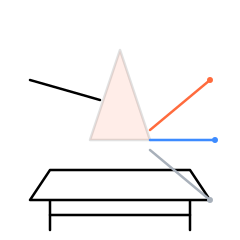
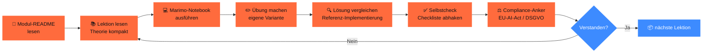
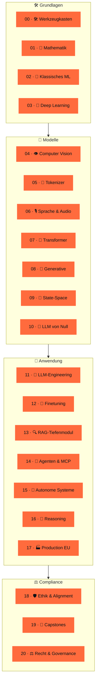
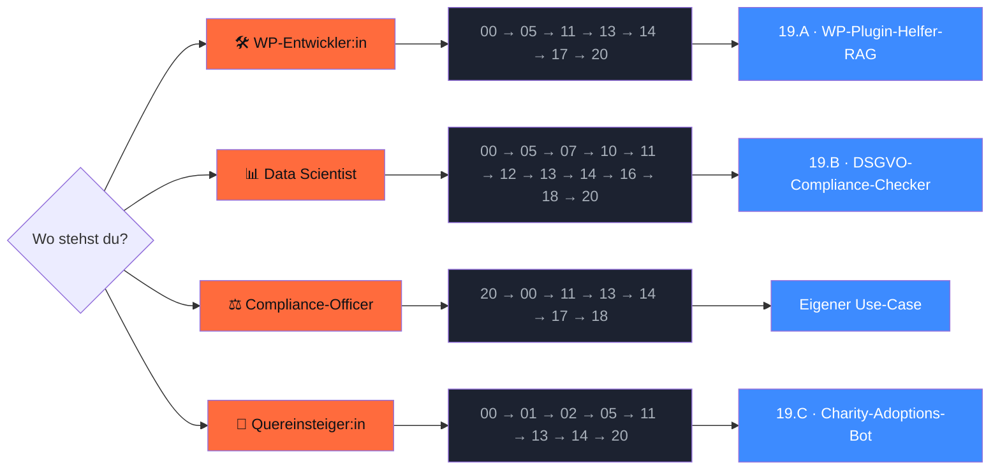

<div align="center">



# `ki-engineering-werkstatt`

### **Von linearer Algebra bis zum Agenten-Schwarm. KI mit KI lernen — und Werkzeuge bauen, die im EU-Rechtsraum funktionieren.**

*21 Phasen. ~80 Primärquellen. 7 lauffähige Marimo-Notebooks. Kein Marketing.*

[](LICENSE)
[](https://www.python.org/downloads/)
[](https://marimo.io)


[](CONTRIBUTING.md)

[**Was ist das?**](#-was-ist-das) ·
[**So lernst du**](#-so-lernst-du-der-lern-loop) ·
[**Schnellstart**](#-schnellstart) ·
[**Showcase**](#-showcase--3-module-sind-am-launch-tag-fertig) ·
[**Curriculum**](#%EF%B8%8F-curriculum-21-phasen) ·
[**Wer ich bin**](#-wer-hinter-dem-repo-steht)

</div>

---

## 🧭 Was ist das?

> Stop hoping no one notices. — Compliance ist 2026 das größte Risiko für KI-Projekte im DACH-Mittelstand.

Die **KI-Engineering-Werkstatt** ist ein Open-Source-Curriculum für Entwickler:innen, IT-Verantwortliche und Compliance-Officer in **Deutschland, Österreich und der Schweiz**. Du lernst Schritt für Schritt, wie man KI-Anwendungen baut, die:

- ✅ **technisch funktionieren** (mit modernem 2026-Stack: Python 3.13, Marimo, Pydantic AI, Qdrant, vLLM)
- ✅ **rechtssicher sind** (EU AI Act, DSGVO, UrhG-TDM-Schranke, NIS2)
- ✅ **deutsch verstehen** (Tokenizer, deutsche Datasets, Pharia / Mistral / Llama / Qwen für deutschen Text)
- ✅ **dokumentiert sind** (~ 80 Primärquellen, alle mit Datum, monatlich gepflegt)

> [!IMPORTANT]
> **Was dieses Repo nicht ist.** Kein Newsletter-Funnel · Kein Discord · Keine Kurs-Verkaufsseite · Kein „werde KI-Engineer in 30 Tagen". Kein Rechtsrat (siehe [`disclaimer.md`](docs/rechtliche-perspektive/disclaimer.md)). Wer Marketing will, liest woanders.

### Für wen?

<table>
<tr>
<td width="25%" valign="top" align="center">

🛠️<br/>**WP- & Backend-Devs**

du baust LLMs in Plugins, APIs, SaaS

</td>
<td width="25%" valign="top" align="center">

📊<br/>**Data Scientists**

du willst Production-LLMs statt Notebooks

</td>
<td width="25%" valign="top" align="center">

⚖️<br/>**Compliance / DSB**

du musst KI-Projekte einschätzen

</td>
<td width="25%" valign="top" align="center">

🌱<br/>**Quereinsteiger:innen**

du startest grade mit KI

</td>
</tr>
</table>

→ Vier vorbereitete [**Lernpfade**](docs/lernpfade/) führen dich durch das Curriculum, je nach Profil.

### Was bekommst du konkret?

| Output | Wo | Status |
|---|---|---|
| **21 voll ausgearbeitete Phasen-Module** mit Marimo-Notebooks, Übungen, Lösungen | [`phasen/`](phasen/) | ✅ |
| **5 Capstone-Projekte** (WP-Plugin-RAG, DSGVO-Checker, Charity-Bot, AktG-RAG, Voice-Agent) | [`projekte/`](projekte/) | ✅ |
| **3 lauffähige CLI-Werkzeuge** (`ki-act-classifier`, `ki-ai-txt`, `ki-compliance-lint`) | [`werkzeuge/`](werkzeuge/) | ✅ |
| **DACH-Compliance-Layer** mit AI-Act-Tracker, DSGVO-Checklisten, AVV-Mustern, Asiatischen-LLM-Disclaimer | [`docs/rechtliche-perspektive/`](docs/rechtliche-perspektive/) | ✅ |
| **EU-Modell-Setups** (Pharia, Mistral, IONOS, Ollama, vLLM) | [`infrastruktur/eu-modelle/`](infrastruktur/eu-modelle/) | ✅ |
| **Quellenbibliothek** mit ~ 80 kuratierten Primärquellen, monatlich gepflegt | [`docs/quellen.md`](docs/quellen.md) | ✅ |
| **CI / Tests** mit 8 Workflows, 23 pytest-Tests, gitleaks, Marimo-Smoke | [`.github/workflows/`](.github/workflows/) | ✅ |

---

## 🔄 So lernst du — der Lern-Loop

Jede Phase folgt dem gleichen Muster. Plane mit ~ 1–4 Stunden pro Lektion (lesen + Übung + Selbstcheck).



**Du suchst die ausführliche Anleitung?** → [`GETTING_STARTED.md`](GETTING_STARTED.md): Schritt für Schritt von „git clone" bis „erste gelöste Übung", inklusive Troubleshooting.

---

## 🚀 Schnellstart

```bash
# 1. Repo klonen
gh repo clone s-a-s-k-i-a/ki-engineering-werkstatt
cd ki-engineering-werkstatt

# 2. Setup (uv + pre-commit + Pflicht-Deps in unter 2 Min.)
just setup

# 3. Smoke-Test — alles grün?
just smoke

# 4. Erstes Showcase-Modul öffnen
just edit 05-deutsche-tokenizer
```

> **Voraussetzungen**: Python 3.13, [`uv`](https://docs.astral.sh/uv/), [`just`](https://just.systems/), 8+ GB RAM. Optional: Apple-Silicon-Mac, NVIDIA-GPU, oder einer der EU-Cloud-Anbieter aus [`infrastruktur/eu-modelle/`](infrastruktur/eu-modelle/).
>
> **Kein `just`?** Auch direkter Aufruf ohne Just funktioniert: `uv sync --extra dev --extra tokenizer && uv run pytest tests/ -q`.

---

## 📊 Was du am Ende kannst (in Zahlen)

<table>
<tr>
<td align="center" width="20%"><strong>21 / 21</strong><br/>Phasen-Module ✅</td>
<td align="center" width="20%"><strong>5 / 5</strong><br/>Capstones ✅</td>
<td align="center" width="20%"><strong>~ 80</strong><br/>Primärquellen mit Datum</td>
<td align="center" width="20%"><strong>20+</strong><br/>lauffähige Marimo-Notebooks</td>
<td align="center" width="20%"><strong>4</strong><br/>Persona-Lernpfade</td>
</tr>
<tr>
<td align="center"><strong>23</strong><br/>pytest-Tests in CI</td>
<td align="center"><strong>8</strong><br/>GitHub-Workflows</td>
<td align="center"><strong>5</strong><br/>EU-Modell-Setups</td>
<td align="center"><strong>18</strong><br/>KI-Crawler geblockt</td>
<td align="center"><strong>0</strong><br/>API-Keys im Repo</td>
</tr>
</table>

---

## ✨ Showcase — 3 Module sind am Launch-Tag fertig

> Diese drei Module sind komplett: Lektionen, Marimo-Notebook, Übung, Referenz-Lösung, Compliance-Anker, Quellen mit Datum. Du kannst sie heute durcharbeiten.

<table>
<tr>
<td width="33%" valign="top">

### 🧩 Phase 05<br/>Deutsche Tokenizer

> Stop wasting tokens on German compound words.

**Du lernst**: warum dieselbe deutsche Aussage in unterschiedlich vielen Tokens kodiert wird, und wie du den günstigsten Tokenizer für deinen Use-Case wählst.

**Du baust**: einen Token-Effizienz-Showdown mit GPT-5.5, Claude Sonnet 4.6, Llama 4, Mistral, Pharia, Teuken auf 10kGNAD-Korpus — inklusive EUR-Kostenvergleich.

**Du sparst**: bis zu 30 % API-Kosten auf deutschem Text.

→ [Modul](phasen/05-deutsche-tokenizer/)
→ [Lektion 01](phasen/05-deutsche-tokenizer/lektionen/01-bpe-und-deutsch.md)
→ [Notebook](phasen/05-deutsche-tokenizer/code/01_tokenizer_showdown.py)

</td>
<td width="33%" valign="top">

### 🔍 Phase 13<br/>RAG-Tiefenmodul

> Stop pasting whole documents into prompts.

**Du lernst**: das gesamte RAG-Spektrum 2026 — von Vanilla über Hybrid + Re-Ranking bis GraphRAG / LazyGraphRAG / Agentic.

**Du baust**: vier RAG-Varianten auf demselben deutschen Wikipedia-Subset, vergleichst Ragas-Score, Latenz, EUR-Kosten mit Pharia-1 und Mistral-Large als Generator.

**Du beherrschst**: Quellen-Attribution AI-Act-konform.

→ [Modul](phasen/13-rag-tiefenmodul/)
→ [Lektion 01](phasen/13-rag-tiefenmodul/lektionen/01-vanilla-rag.md)
→ [Notebook](phasen/13-rag-tiefenmodul/code/01_vanilla_rag.py)

</td>
<td width="33%" valign="top">

### ⚖️ Phase 20<br/>Recht & Governance

> Stop hoping no one notices.

**Du lernst**: AI-Act-Risikoklassen, AVV-Pflichten, DSFA-Workflow, AI-Literacy nach Art. 4, Audit-Logging.

**Du baust**: dein eigenes KI-System klassifizieren mit `ki-act-classifier`, eine DSFA-Light schreiben, ai.txt + robots.txt für deine Domain generieren, Audit-Logs strukturieren.

**Du vermeidest**: Bußgelder bis 35 Mio. € / 7 % Jahresumsatz.

→ [Modul](phasen/20-recht-und-governance/)
→ [Lektion 01](phasen/20-recht-und-governance/lektionen/01-ai-act-risk.md)
→ [CLI-Demo](phasen/20-recht-und-governance/code/01_ai_act_demo.py)

</td>
</tr>
</table>

```bash
# Live-Demo: AI-Act-Klassifizierung in unter 5 Sekunden
$ ki-act-classifier --modell-karte phasen/20-recht-und-governance/vorlagen/model-card-adoption-bot.yaml

╭─ AI-Act-Klassifizierung — Charity-Adoptions-Bot ─────────────────────╮
│ Risikostufe: BEGRENZT                                                  │
╰────────────────────────────────────────────────────────────────────────╯
  Begründung: Transparenzpflicht: Art. 50 Abs. 1 — Chatbot-Hinweis
  Pflichten:  Endnutzer:innen klar informieren · Synthetische Inhalte
              technisch markieren (C2PA o. Ä.)
```

---

## 🗺️ Curriculum (21 Phasen)

> 21 Phasen, vier didaktische Bänder: **Grundlagen → Modelle → Anwendung → Compliance**. Jede Phase mit Lernzielen, Marimo-Notebook, Übung, Lösung, Compliance-Anker und Quellen. Curriculum-Stack: Python 3.13, uv, Marimo, Pydantic AI, Qdrant, vLLM, Pharia / Mistral / Llama / Qwen.



**Legende**: 🟧 ✅ fertig · 🟦 🚧 in Arbeit · ⬛ ⏳ geplant

Vollständige [Roadmap](ROADMAP.md) mit Q2 / Q3 / Q4-2026-Plan.

---

## 👥 Lernpfade — wähle deinen Einstieg



| Profil | Empfohlener Pfad | Aufwand | Detail |
|---|---|---|---|
| 🛠️ WordPress-Entwickler:in | 00 → 05 → 11 → 13 → 14 → 17 → 20 → 19.A | ~ 50 h | [docs/lernpfade/wp-entwicklerin.md](docs/lernpfade/wp-entwicklerin.md) |
| 📊 Data Scientist | 00 → 05 → 07 → 10 → 11 → 12 → 13 → 14 → 16 → 18 → 20 | ~ 100 h | [docs/lernpfade/data-scientist.md](docs/lernpfade/data-scientist.md) |
| ⚖️ Compliance-Officer / DSB | 20 → 00 → 11 → 13 → 14 → 17 → 18 | ~ 30 h (Konzept) | [docs/lernpfade/compliance-officer.md](docs/lernpfade/compliance-officer.md) |
| 🌱 Quereinsteiger:in | 00 → 01 → 02 → 05 → 11 → 13 → 14 → 20 → Capstone | ~ 60 h | [docs/lernpfade/quereinsteigerin.md](docs/lernpfade/quereinsteigerin.md) |

### 🎓 Workshop-Formate (für Trainer:innen + Inhouse-Schulungen)

Drei aus dem Curriculum abgeleitete Workshop-Formate — direkt einsetzbar in KMU-Beratung, Inhouse-Schulung, Hochschul-Lehre. Adaptierbar unter MIT, Attribution erbeten.

| Format | Dauer | Zielgruppe | Datei |
|---|---|---|---|
| 🚀 Crashkurs | 4 h | Entscheider:innen, Compliance-Officer, technische Generalist:innen | [`docs/workshops/4h-crashkurs.md`](docs/workshops/4h-crashkurs.md) |
| 🛠️ Tagesworkshop | 8 h | Backend-Devs (Python, 1+ Jahr) | [`docs/workshops/8h-tagesworkshop.md`](docs/workshops/8h-tagesworkshop.md) |
| 🏗️ Zweitagesworkshop | 16 h | KI-Engineers, ML-Quereinsteiger:innen | [`docs/workshops/16h-zweitagesworkshop.md`](docs/workshops/16h-zweitagesworkshop.md) |

→ Format-Übersicht + Trainer:innen-Checkliste in [`docs/workshops/`](docs/workshops/).

---

## ⚖️ DACH- / EU-Compliance-Anker

> Das Herzstück. Jede Phase hat einen `compliance.md`-Anker, der konkret an EU-AI-Act-Artikeln, DSGVO-Pflichten und UrhG-Schranken hängt — nicht als Anhang, sondern als Leitmotiv durch das gesamte Curriculum.

| Bereich | Datei |
|---|---|
| 📅 EU AI Act Tracker (Inkrafttretens-Stufen, Behörden, Sanktionen) | [`docs/rechtliche-perspektive/ai-act-tracker.md`](docs/rechtliche-perspektive/ai-act-tracker.md) |
| 🛡️ DSGVO-Checklisten (vor / während / nach Projekt) | [`docs/rechtliche-perspektive/dsgvo-checklisten.md`](docs/rechtliche-perspektive/dsgvo-checklisten.md) |
| 📜 AVV-Mustervorlagen pro Cloud-Anbieter | [`docs/rechtliche-perspektive/avv-musterklauseln.md`](docs/rechtliche-perspektive/avv-musterklauseln.md) |
| 📚 Urheberrecht & TDM-Opt-out | [`docs/rechtliche-perspektive/urheberrecht-trainingsdaten.md`](docs/rechtliche-perspektive/urheberrecht-trainingsdaten.md) |
| 🐉 Asiatische LLMs aus DACH-Sicht | [`docs/rechtliche-perspektive/asiatische-llms.md`](docs/rechtliche-perspektive/asiatische-llms.md) |
| ⚠️ Disclaimer „Kein Rechtsrat" | [`docs/rechtliche-perspektive/disclaimer.md`](docs/rechtliche-perspektive/disclaimer.md) |

### Modell-Anbieter im Vergleich

| Modell | Land | Lizenz | EUR / 1M Input | DSGVO / AVV | Server |
|---|---|---|---|---|---|
| **Aleph Alpha** Pharia-1 | 🇩🇪 DE | proprietär | ~ 5,00 | ✅ | Heidelberg (BSI C5) |
| **Mistral** Large 2 | 🇫🇷 FR | proprietär | ~ 2,00 | ✅ | Frankreich |
| **IONOS** Llama-4-Maverick | 🇩🇪 DE | Llama CL | ~ 0,80 | ✅ | Karlsruhe (BSI C5) |
| **OpenAI** GPT-5.5 | 🇺🇸 US | proprietär | ~ 10,00 | DPA + EU-Datazone | USA (EU-Routing) |
| **Anthropic** Claude Sonnet 4.6 | 🇺🇸 US | proprietär | ~ 2,80 | DPA + EU-Datazone Q1 / 26 | USA (EU-Routing) |
| **Qwen3** | 🇨🇳 CN | Apache 2.0 | je nach Hoster | je nach Hoster | bei Self-Hosting: lokal |
| **DeepSeek-R1** | 🇨🇳 CN | MIT | je nach Hoster | je nach Hoster | bei Self-Hosting: lokal |
| **Pharia / Mistral / Llama** lokal | — | — | nur Strom | ✅ | deine Hardware |

> ⚠️ **Asiatische Open-Weights**: lokale Inferenz auf EU-Hardware ist DSGVO-vertraeglich. Offizielle CN-API nicht. Self-Censorship-Audit Pflicht für News / Politik. → Details in [asiatische-llms.md](docs/rechtliche-perspektive/asiatische-llms.md).

---

## 📈 Marktrealität DACH

> Wer KI-Engineering lernt, sollte wissen, wo der Markt steht. Belegt mit Primärquellen aus H2 / 2025 und Q1 / 2026 — keine Bauchgefühle. **Stand der Zusammenstellung: 28.04.2026.**

<table>
<tr>
<td width="50%" valign="top">

### 🇩🇪 Adoption Deutschland

- **41 %** der DE-Unternehmen ab 20 MA nutzen KI aktiv ([Bitkom, 15.09.2025](https://www.bitkom.org/Presse/Presseinformation/Durchbruch-Kuenstliche-Intelligenz))
- **20 %** im echten KMU (~ 780 k Firmen, [KfW Fokus 533, 11.02.2026](https://www.kfw.de/PDF/Download-Center/Konzernthemen/Research/PDF-Dokumente-Fokus-Volkswirtschaft/Fokus-2026/Fokus-Nr.-533-Februar-2026-KI-Mittelstand.pdf))
- **> 60 %** der Großunternehmen ≥ 500 MA
- **43 %** im DACH-Maschinenbau ([VDMA / Strategy& 2025](https://www.vdma.eu/documents/34570/4888559/Studie_GenAI-Implications_Web_DE.pdf))

</td>
<td width="50%" valign="top">

### 🚧 Top-3-Hindernisse

- **53 %** rechtliche Unsicherheit
- **53 %** fehlendes Know-how
- **48 %** Datenschutzsorgen

> Genau die Lücken, die dieses Curriculum schließt.

**70 %** haben Innovationen wegen Datenschutz-Vorgaben gestoppt ([Bitkom „Innovations-Bremse"](https://www.bitkom.org/Presse/Presseinformation/Datenschutz-Innovations-Bremse))

</td>
</tr>
<tr>
<td valign="top">

### 🌍 Anbieter-Landschaft (Tendenz)

- **OpenAI / ChatGPT** führt Web-Traffic (~ 81 %, *Methodik = Web-Traffic, NICHT Enterprise-Lizenzen*)
- **Microsoft Copilot** dominiert Enterprise via M365-Integration
- **Anthropic** eröffnet Münchner Office 07.11.2025 — DE in den globalen Top-20 bei Claude-Nutzung pro Kopf ([Anthropic Newsroom](https://www.anthropic.com/news/new-offices-in-paris-and-munich-expand-european-presence))
- **Aleph Alpha** pivotierte zu Sovereign-AI / PhariaAI-Suite; **Cohere-Übernahme angekündigt 24.04.2026** (Schwarz-Gruppe als Hauptbacker, „Command-Pharia 1" für Q4/2026 geplant)

</td>
<td valign="top">

### 🇦🇹🇨🇭 Österreich + Schweiz

- **AT-KMU** (≥ 10 MA): nur **8,9 %** nutzen KI (KMU Forschung Austria / WKÖ 2025)
- **CH-KMU**: **22 % → 34 %** (2024 → 2025, [SECO 05.11.2025](https://www.kmu.admin.ch/kmu/en/home/new/news/2025/ai-gains-ground-swiss-smes.html))
- **CH-Arbeitsmarkt**: in stark KI-exponierten Berufen seit Nov 2022 + 27 % stärkere Arbeitslosenzahl ([KOF ETH Studie 186, 10 / 2025](https://ethz.ch/content/dam/ethz/special-interest/dual/kof-dam/documents/newsletter/KOF_Studie_KI_Schweizer_Arbeitsmarkt.pdf))

</td>
</tr>
</table>

📊 Vollständig in [`phasen/00-werkzeugkasten/markt-und-realitaet.md`](phasen/00-werkzeugkasten/markt-und-realitaet.md) (alle 18 Kennzahlen, 5 Direkt-Zitate, Quellen-Liste).

---

## 🧰 Tooling-Stack 2026

<table>
<tr>
<td><strong>Sprache & Build</strong></td>
<td><code>Python 3.13</code> · <code>uv</code> · <code>Ruff</code> · <code>Ty</code></td>
</tr>
<tr>
<td><strong>Notebooks</strong></td>
<td><code>Marimo</code> (.py source-of-truth + .ipynb Auto-Build für Colab)</td>
</tr>
<tr>
<td><strong>LLM-Frameworks</strong></td>
<td><code>Pydantic AI</code> · <code>LangGraph</code> · <code>DSPy</code> · <code>MCP</code></td>
</tr>
<tr>
<td><strong>Vector DB</strong></td>
<td><code>Qdrant</code> 🇩🇪 · <code>pgvector</code> · <code>LanceDB</code></td>
</tr>
<tr>
<td><strong>Inference</strong></td>
<td><code>vLLM</code> · <code>Ollama</code> · <code>llama.cpp</code> · <code>MLX</code> (Mac) · <code>LiteLLM</code></td>
</tr>
<tr>
<td><strong>Eval</strong></td>
<td><code>Promptfoo</code> · <code>Ragas</code> · <code>Inspect-AI</code></td>
</tr>
<tr>
<td><strong>Tracing</strong></td>
<td><code>OpenTelemetry GenAI</code> · <code>Phoenix</code> · <code>Langfuse</code> (EU-self-hosted)</td>
</tr>
<tr>
<td><strong>EU-Modelle</strong> 🇪🇺</td>
<td>Aleph Alpha Pharia · Mistral · IONOS AI Model Hub · StackIT · Black Forest Labs FLUX · DeepL</td>
</tr>
<tr>
<td><strong>US-Modelle</strong> 🇺🇸</td>
<td>OpenAI GPT-5.5 · Anthropic Claude Sonnet 4.6 · Google Gemini 3 (mit AVV / EU-Zone)</td>
</tr>
<tr>
<td><strong>Asiatische Open-Weights</strong> 🐉</td>
<td>Qwen3 · DeepSeek-R1 · GLM-5 · Kimi K2.6 · MiniCPM (mit DACH-Compliance-Disclaimer)</td>
</tr>
</table>

---

## 📚 Quellenbibliothek

~ **80 kuratierte Primärquellen**, kategorisiert in 13 Bereiche: Bücher · Foundational Papers · 2024–2026 SOTA · DACH-spezifisch · Recht & Compliance · Tooling-Docs · Datasets · Blogs · Video-Kurse · Markt-Studien DACH · Asiatische LLMs · China-Compliance · Sonstiges Tooling.

→ [`docs/quellen.md`](docs/quellen.md) · **Stand: 28.04.2026**

---

## 🔄 Wartungsversprechen

> AI-Act-Tracker monatlich · Curriculum-Module wöchentliche PRs · Quellenbibliothek quartalsweise · Hotfix-Issues bei AI-Act-Stand-Updates binnen 7 Tagen.

Alle Stand-Daten sind in den jeweiligen Dateien als YAML-Frontmatter gepflegt. CI prüft monatlich, dass keine Quelle älter als 180 Tage ist (Warnung).

---

## 🤝 Mitwirken

[Diskussionen](https://github.com/s-a-s-k-i-a/ki-engineering-werkstatt/discussions) > Issues > Pull Requests, in dieser Reihenfolge.

Vor jedem PR: `just smoke` lokal grün — **Pflicht-Gate**. Details in [`CONTRIBUTING.md`](CONTRIBUTING.md) und [`docs/stilrichtlinien.md`](docs/stilrichtlinien.md).

---

## 👤 Wer hinter dem Repo steht

<table>
<tr>
<td width="120" valign="top">
<a href="https://github.com/s-a-s-k-i-a"></a>
</td>
<td valign="top">

**Saskia Teichmann** baut seit **2010** WordPress- und WooCommerce-Software in **Hannover** ([isla-stud.io](https://isla-stud.io)) — über 16 Jahre Praxis im DACH-Mittelstand. Mit [**citelayer®**](https://citelayer.ai) entwickelt sie Tools, die WordPress-Inhalte für LLMs zitierfähig machen.

🛠️ **Vertrauensanker: aktive Open-Source-Projekte**

- [`devctx`](https://github.com/s-a-s-k-i-a/devctx) — Project-Context-CLI für AI-Agents
- [`openclaw`](https://github.com/s-a-s-k-i-a/openclaw) — lokaler AI-Assistant
- [`cloudpanel-mail-addon`](https://github.com/s-a-s-k-i-a/cloudpanel-mail-addon) — DKIM/SPF/DMARC-Addon, real eingesetzt im DACH-Hosting
- [`localized-sitemap-indexes`](https://github.com/s-a-s-k-i-a/localized-sitemap-indexes) — TranslatePress + Rank Math Sitemap-Bridge
- [`freellmapi`](https://github.com/s-a-s-k-i-a/freellmapi) — OpenAI-kompatibler Multi-Provider-Proxy
- [`claude-code-timestamps`](https://github.com/s-a-s-k-i-a/claude-code-timestamps) — Timestamps-Plugin für Claude Code

🐦 Twitter / X: [@SaskiaLund](https://twitter.com/SaskiaLund)

</td>
</tr>
</table>

> Warum vertrauen? — Weil ich nichts verspreche, was ich nicht selbst nutze. citelayer® läuft auf demselben EU-Stack, den ich hier lehre. Die Quellen sind primär (kein Aggregator-Blog, sondern eur-lex, BfDI, Bitkom, KfW, ETH Zürich, Anthropic-Newsroom). Wenn du Fehler findest: Issue oder PR, ich schaue regelmäßig rein.

---

## 📄 Lizenz

[**MIT**](LICENSE) — frei nutzbar, frei forkbar, kommerziell verwendbar.

Drittlizenzen (Datasets, Modelle, didaktische Vorbilder) sind in [`NOTICE`](NOTICE) dokumentiert.

---

## 🌐 English readers

This repo is German-first by design. Brief English stub: [`README.en.md`](README.en.md). Full English fork planned for Q4 / 2026.

<div align="center">

---

*Made in Hannover · MIT-Lizenz · Stand 28.04.2026 · Kein Marketing.*

</div>
