# Lernpfad: Compliance-Officer / DSB → KI-versteher:in

> Du bist Datenschutzbeauftragte:r, Compliance-Lead oder Jurist:in. Du sollst KI-Projekte einschätzen — ohne selbst LLMs zu trainieren.

## Profil-Annahmen

- DSGVO und AI Act sind dir aus Vortext-Lektüre vertraut
- Python ist nicht dein Hauptwerkzeug (kein Problem — wir bleiben auf konzeptioneller Ebene)
- Du musst entscheiden, klassifizieren, beraten — nicht implementieren
- Zeit-Budget: 1–2 h/Woche

## Empfohlene Phasen-Reihenfolge

```mermaid
flowchart LR
  Start([Start]) --> P20[20 · Recht & Governance]
  P20 --> P00[00 · Werkzeugkasten · Hardware-Tabelle]
  P00 --> P05[05 · Deutsche Tokenizer · nur Konzept]
  P05 --> P11[11 · LLM-Engineering · Anbieter-Vergleich]
  P11 --> P13[13 · RAG-Tiefenmodul · Quellen-Attribution]
  P13 --> P14[14 · Agenten · Human Oversight]
  P14 --> P17[17 · Production · EU-Hosting]
  P17 --> P18[18 · Ethik · Bias / Self-Censorship]
  P18 --> Capstone[Eigener Use-Case · DSFA-Workflow]
```

## Pflicht-Phasen (nur Konzept-Teile, keine Hands-on)

- **20** zuerst — der gesamte Compliance-Layer
- **00** Hardware-Tabelle + EU-Cloud-Vergleich
- **11** Anbieter-Vergleich mit EUR-Kosten + AVV-Status
- **13** Quellen-Attribution Art. 50.4
- **14** Tool-Authorization, Human Oversight
- **17** EU-Hosting-Stack (BSI C5, ISO 27001)
- **18** Bias auf Deutsch + Self-Censorship asiatische Modelle

## Konkrete Lieferziele

- **Phase 20**: AI-Act-Klassifizierung für 3 reale Projekte deines Hauses
- **AVV-Liste**: vollständige für alle eingesetzten KI-Anbieter
- **DSFA-Workflow**: Template adaptiert + 1 reale DSFA durchgeführt
- **AI-Literacy-Programm**: 4-h-Onboarding adaptiert + bei Mitarbeitenden ausgerollt
- **Audit-Logging-Anforderung**: in IT-Spezifikation an Entwicklungsteam dokumentiert
- **Self-Censorship-Eval**: bei einem chinesischen Modell durchgeführt (oder dokumentiert, warum nicht eingesetzt)

## Wo du IT-Support brauchst

- Bei **Phase 13** (RAG): IT-Team baut, du prüfst Quellen-Attribution
- Bei **Phase 14** (Agents): IT-Team implementiert Tool-Whitelisting, du prüfst die Whitelist
- Bei **Phase 17** (Production): IT-Team wählt Hosting, du genehmigst nach BSI C5

## Wartungs-Rhythmus

Nach Abschluss: monatlich AI-Act-Tracker prüfen, quartalsweise Lernpfad-Update.
