# Lernpfad: Data Scientist → AI Engineer

> Du machst Pandas, scikit-learn, vielleicht PyTorch. Du willst Production-LLMs bauen, nicht nur Notebooks.

## Profil-Annahmen

- Python sitzt, du kennst Train/Val/Test, ML-Pipelines, MLflow
- Mathematik (LinAlg, Stats) ist dir vertraut
- Du hast vielleicht schon mit OpenAI / Anthropic API gespielt
- Zeit-Budget: 4–8 h/Woche

## Empfohlene Phasen-Reihenfolge

```mermaid
flowchart LR
  Start([Start]) --> P00[00 · Werkzeugkasten]
  P00 --> P05[05 · Deutsche Tokenizer]
  P05 --> P07[07 · Transformer]
  P07 --> P10[10 · LLM von Null]
  P10 --> P11[11 · LLM-Engineering]
  P11 --> P12[12 · Finetuning & Adapter]
  P12 --> P13[13 · RAG-Tiefenmodul]
  P13 --> P14[14 · Agenten & MCP]
  P14 --> P16[16 · Reasoning & Test-Time-Compute]
  P16 --> P18[18 · Ethik / RLHF / DPO / GRPO]
  P18 --> P20[20 · Recht & Governance]
  P20 --> Capstone[19.B · DSGVO-Compliance-Checker oder 19.D · Legal-RAG]
```

## Was du überspringen kannst

- **01 Mathematik**: nur als Refresher, falls Stats lange her ist
- **02 Klassisches ML**: kannst du
- **03 Deep Learning Grundlagen**: Refresher / GQA + Mixed Precision Update
- **04 Computer Vision** und **06 Audio**: optional je nach Use-Case

## Was Pflicht ist

- **00, 05, 07, 10, 11, 12, 13, 14, 16, 17, 18, 20** + Capstone

## Zeitplan (~ 100 h)

Wer Data-Science-Grundlagen hat, schafft den Pfad in 3–4 Monaten bei 5 h/Woche.

## Konkrete Lieferziele

- **Phase 05**: Token-Effizienz-Showdown reproduziert + auf eigenem Korpus
- **Phase 10**: nano-GPT-Mini-Modell auf deutschem Wikitext trainiert + GGUF-export
- **Phase 11**: Pydantic-AI-Production-Skelett mit Eval (Promptfoo) + Tracing (Phoenix)
- **Phase 12**: QLoRA auf Qwen2.5-7B mit eigenem Dataset
- **Phase 13**: alle 4 Showcase-RAG-Varianten verglichen mit Ragas-Score
- **Phase 16**: GRPO-Mini-Run auf Qwen2.5-1.5B
- **Phase 18**: Self-Censorship-Audit auf 5 asiatischen Modellen + Bias-Test deutsch
- **Capstone**: 19.B (DSGVO-Checker) oder 19.D (Legal-RAG)
