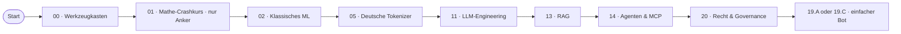

# Lernpfad: Quereinsteiger:in → KI-Engineering

> Du programmierst nicht oder noch wenig. Du willst KI verstehen und nutzen — nicht nur „mit ChatGPT plaudern".

## Profil-Annahmen

- Du hast Computer-Grund­kenntnisse, vielleicht Python-Schnupper-Kurs
- Mathematik nicht dein Lieblingsfach, aber du arbeitest dich ein
- Du willst pragmatisch werden — Use-Cases verstehen + selbst etwas bauen
- Zeit-Budget: 4–6 h/Woche

## Empfohlene Phasen-Reihenfolge

## Externe Crashkurse vor Phase 00

Falls du noch nie programmiert hast:

- [Real Python Beginner Tutorial](https://realpython.com/start-here/) (~10 h)
- [Andrej Karpathy „Zero to Hero"](https://karpathy.ai/zero-to-hero.html) — Lektion 1+2 für Mathe-Intuition

## Was du überspringen kannst

- **03 Deep Learning Grundlagen**: nicht nötig
- **04 Computer Vision**, **06 Audio**: nur falls relevant
- **07 Transformer-Architektur**: optional
- **08 Generative Modelle (Bilder)**: optional
- **09 State-Space**: optional
- **10 LLM von Null**: spannend, aber nicht nötig für Quereinstieg
- **12 Finetuning**: optional
- **15 Autonome Systeme**: optional
- **16 Reasoning**: optional
- **17 Production**: optional in der Lehre, später relevant
- **18 Ethik**: konzeptionell wichtig, aber komplex — überfliegen

## Pflicht-Phasen

- **00, 01 (Anker), 02, 05, 11, 13, 14, 20** + 1 einfaches Capstone (19.A WP-Plugin-Helfer oder 19.C Charity-Adoptions-Bot)

## Zeitplan (~ 60 h über 4-6 Monate)

| Phase | h |
|---|---|
| Pre-Setup (Real Python / Karpathy) | 10 |
| Phase 00 | 4 |
| Phase 01 (nur Anker, Visualisierungen) | 4 |
| Phase 02 | 8 |
| Phase 05 | 6 |
| Phase 11 | 12 |
| Phase 13 | 10 |
| Phase 14 | 8 |
| Phase 20 | 8 |
| Capstone | 20 |

## Konkrete Lieferziele

- Du installierst uv + Marimo + Ollama lokal
- Du verstehst Vektoren und Embeddings am eigenen deutschen Text
- Du baust einen einfachen RAG-Bot über deine eigene Notiz-Sammlung
- Du klassifizierst dein Capstone nach AI-Act und schreibst die DSFA-Light

## Tipps

- **Finde eine:n Lern-Buddy**: PR-Reviews und Discussions sind besser zu zweit
- **Mach jede Übung**: Skip nichts, du brauchst die Hands-on-Praxis
- **Frag in Discussions**: Kein Issue-Spam, aber Discussions sind ausdrücklich willkommen
- **Sei geduldig**: 4–6 Monate sind realistisch, nicht 4–6 Wochen
