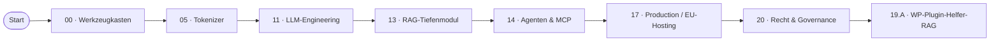

# Lernpfad: WordPress-Entwickler:in → KI-Engineer

> Du kennst PHP, MySQL, vielleicht React. Du willst KI in deine WP-Plugins / Themes / Headless-Setups einbauen — DSGVO-konform.

## Profil-Annahmen

- Stark in PHP/JS, weniger in Python (kein Showstopper)
- WordPress-Architektur (Hooks, REST-API, Gutenberg) sitzt
- DSGVO-Praxis ist dir wichtig — du arbeitest mit Mandanten/KMU
- Zeit-Budget: 2–4 h/Woche

## Empfohlene Phasen-Reihenfolge

## Was du überspringen kannst

- **01 Mathematik**: optional, du brauchst kein Backprop-Verständnis für API-Anbindung
- **03 Deep Learning**: optional, falls du nicht selbst trainierst
- **04 Computer Vision**: nur wenn dein WP-Setup Bildverarbeitung braucht
- **07 Transformer-Architektur**: Vertiefung, nicht Pflicht
- **10 LLM von Null**: spannend, aber nicht praxis-relevant für Plugin-Bau
- **12 Finetuning**: nur falls du Domain-LLMs trainierst

## Was Pflicht ist

- **00, 05, 11, 13, 14, 17, 20** + ein Capstone (idealerweise 19.A WP-Plugin-Helfer-RAG)

## Zeitplan (~ 50 h)

| Woche | Thema | h |
|---|---|---|
| 1 | Phase 00 (Werkzeugkasten) | 4 |
| 2-3 | Phase 05 (Tokenizer-Showdown auf deinen WP-Inhalten) | 6 |
| 4-5 | Phase 11 (LLM-Engineering, Pydantic AI, EUR-Kosten) | 14 |
| 6-7 | Phase 13 (RAG-Tiefenmodul, mit deiner WP-Doku als Korpus) | 14 |
| 8 | Phase 14 (Agents & MCP) | 16 |
| 9 | Phase 17 (Production, EU-Hosting, vLLM) | 12 |
| 10 | Phase 20 (Recht & Governance, AI-Act-Klassifizierung deines Plugins) | 12 |
| 11-14 | Capstone 19.A | 30 |

## Konkrete Lieferziele

- **Phase 05**: WP-Plugin, das Token-Effizienz beim Newsletter-Versand misst
- **Phase 11**: Pydantic-AI-Agent als WP-CLI-Befehl
- **Phase 13**: RAG über alle Plugin-Doku im Site, beantwortet Support-Fragen
- **Phase 14**: Multi-Agent für Issue-Triage / PR-Vorschläge
- **Phase 17**: Self-hosted vLLM neben WP-Server
- **Phase 20**: AI-Act-Klassifizierung + DSFA für ein KI-Plugin in deinem Portfolio

## Saskia-Anschluss

Dieser Pfad zahlt direkt auf [citelayer®](https://citelayer.ai) ein — dort entsteht der „AI Visibility Layer" für WordPress. Wer hier durchläuft, kann sinnvoll an citelayer-PRs arbeiten oder eigene WP-AI-Plugins bauen.
