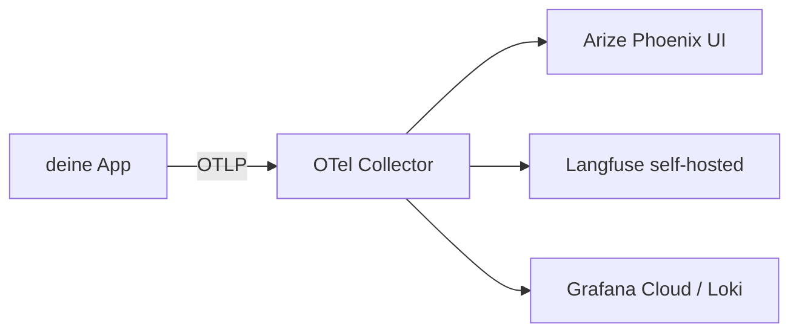

# Observability

> OpenTelemetry GenAI als Standard. Phoenix oder Langfuse als UI.

## Stack-Empfehlung



## Phoenix (lokal)

```bash
docker run -p 6006:6006 arizephoenix/phoenix:latest
# UI: http://localhost:6006
```

```python
import os

os.environ["PHOENIX_PROJECT_NAME"] = "ki-werkstatt"

from phoenix.otel import register

register(project_name="ki-werkstatt", auto_instrument=True)
```

## Langfuse (EU-self-hosted)

```bash
git clone https://github.com/langfuse/langfuse.git
cd langfuse && docker compose up -d
# UI: http://localhost:3000
```

## OpenTelemetry GenAI Semantic Conventions

Standardisierte Felder für LLM-Tracing:

- `gen_ai.system` (z. B. `aleph_alpha`, `openai`, `anthropic`)
- `gen_ai.request.model`
- `gen_ai.request.max_tokens`
- `gen_ai.usage.input_tokens`
- `gen_ai.usage.output_tokens`
- `gen_ai.response.id`

→ siehe Phase 11.10 Lektion und [Spec](https://opentelemetry.io/docs/specs/semconv/gen-ai/).
