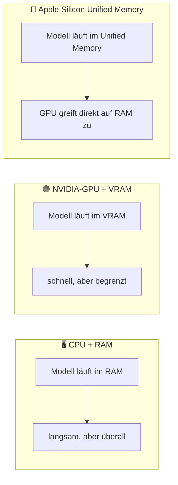

## Worum es geht

> Stop guessing whether your laptop can run a 70B-Modell. — die Antwort ist deterministisch und in 30 Min. ausrechenbar.

Bevor du irgendwas installierst: **was kann deine Maschine?** LLMs sind Speicher-bound, nicht CPU-bound. Wer das ignoriert, lädt 60 GB-Modelle, die nie laufen.

## Voraussetzungen

- Du weißt, wie viel RAM und (falls vorhanden) GPU-VRAM dein Rechner hat.
- macOS: `Über diesen Mac`. Linux: `free -h` und `nvidia-smi`. Windows: `Task-Manager → Leistung`.

## Konzept

### Drei Speicher-Welten



**NVIDIA**: VRAM ist hart limitiert (z. B. 24 GB bei RTX 3090/4090). Was nicht ins VRAM passt, wird in den RAM ausgelagert (`offloading`) — das ist 5–10× langsamer.

**Apple Silicon (M1/M2/M3/M4/M5)**: GPU und CPU teilen denselben Speicher. Ein Mac mit 32 GB Unified Memory verhält sich für LLMs **wie ein Server mit 32 GB VRAM**. Das ist 2026 die preiswerteste Methode, mittelgroße Modelle lokal zu betreiben.

### Quantisierung — warum 7B-Modelle nur 4 GB groß sind

Trainings-Genauigkeit ist `fp16` (16 Bit). Für **Inferenz** kannst du das Modell in niedrigere Genauigkeit umpacken, ohne nennenswerten Qualitätsverlust:

| Format | Bits | Größe (7B-Modell) | Qualität |
|---|---|---|---|
| `fp16` | 16 | ~ 14 GB | Trainings-Baseline |
| `q8_0` | 8 | ~ 7 GB | praktisch verlustfrei |
| `q6_K` | 6 | ~ 5,5 GB | nahezu verlustfrei |
| `q5_K_M` | 5 | ~ 4,8 GB | sehr gut |
| **`q4_K_M`** | ~ 4,5 | **~ 4 GB** | **97-99 % Perplexity-Retention** ⭐ Default |
| `q3_K_M` | 3 | ~ 3,1 GB | merklicher Qualitätsverlust |

**Faustregel für Ollama / llama.cpp** (Default ist `q4_K_M`): **Modell-Parameter × 0,6 GB** für die Gewichte plus **1–2 GB** für Kontext. Beispiel: 7B × 0,6 + 1,5 ≈ **5,7 GB**.

Quelle: [llama.cpp Quantization Discussion](https://github.com/ggml-org/llama.cpp/discussions/2094), [SitePoint Q4_K_M vs FP16](https://www.sitepoint.com/quantization-q4km-vs-awq-fp16-local-llms/).

### Realistische Hardware → Modell-Empfehlungen 2026

| Hardware | Was sinnvoll läuft (q4_K_M) | Beispiele |
|---|---|---|
| 8 GB RAM, ohne GPU | 1–4B-Modelle | Gemma 3 4B, Qwen 3 4B, Llama 3.2 3B |
| 16 GB RAM, ohne dedizierte GPU | 7–8B (langsam) | Llama 4 8B, Qwen 3 8B, Mistral 7B |
| 16 GB RAM + RTX 3060 (12 GB VRAM) | 7–13B mit Offload | Llama 4 8B fp16 oder 13B q4 |
| 32 GB Apple Silicon (M2/M3/M4 Pro/Max) | bis ~ 30B q4 | Qwen 3 30B-A3B (MoE!), Gemma 3 27B |
| 24 GB VRAM (RTX 3090, 4090) | bis ~ 34B q4 | Qwen 3 32B, DeepSeek-R1-32B-distilled |
| RTX 5090 (32 GB GDDR7) | 70B q4 möglich | Llama 4 70B, Qwen 3 70B |
| M3/M4 Max 64–128 GB | bis 70B q4, 235B-MoE-Aktiv | Qwen 3 235B-A22B-MoE läuft auf 128 GB |
| M3 Ultra 512 GB | 405B q4 / 70B q8 | Llama 4 405B fp4 lokal |

> **Wichtig**: Diese Tabelle ist eine Faustregel. Tatsächliche Performance hängt von Kontext-Länge (KV-Cache!), Quantisierung und Backend ab. Eigene Messung nach `ollama run --verbose` empfohlen.

### Apple Silicon vs. NVIDIA — wer ist 2026 schneller?

Auf einem **M4 Max 16-core** mit 128 GB Unified Memory:

- **MLX-Backend** (Apple-nativ) liefert ~ 130 tok / s auf Qwen3-Coder-30B-A3B.
- **Ollama** (llama.cpp-Backend) liefert ~ 43 tok / s auf demselben Modell.

→ **MLX ist auf Apple Silicon ~ 15–30 % schneller als llama.cpp**, bei ~ 10 % weniger RAM-Verbrauch.

Quelle: [WillItRunAI MLX vs. Ollama](https://willitrunai.com/blog/mlx-vs-ollama-apple-silicon-benchmarks) (Stand 04 / 2026, vor Lehr-Behauptung re-verifizieren).

NVIDIA bleibt überlegen für **Training** und **Multi-GPU-Inferenz**. Für **Single-User-Lokal-Inferenz** auf bezahlbarer Hardware ist Apple Silicon 2026 oft preiswerter pro GB Modell-Größe.

### Wann lokale Inferenz endet

Du brauchst **Cloud** (siehe Lektion 00.05), wenn:

- Modell > deine RAM-/VRAM-Kapazität (z. B. Llama 4 405B fp16 → ~ 800 GB)
- Production-Throughput gefragt ist (vLLM auf A100 / H100 / B200 schlägt jeden Mac)
- Du auf spezielle Modelle wie Pharia-1-control angewiesen bist (nicht Open-Weights)
- Mehrere User parallel (Continuous Batching → vLLM)

## Hands-on (5 Min.)

Bestimme jetzt deine Hardware-Klasse:

```bash
# macOS
system_profiler SPHardwareDataType | grep "Memory:"
# → "Memory: 32 GB"

# Linux
free -h | head -2
# → total used free ...

# NVIDIA-GPU prüfen
nvidia-smi --query-gpu=name,memory.total --format=csv
# → "NVIDIA GeForce RTX 4090, 24576 MiB"
```

Trag dein Ergebnis in deine Lern-Notizen ein. Du brauchst es für Lektion 00.04 (Ollama).

## Selbstcheck

- [ ] Du kennst deine RAM-Größe und (falls GPU) deine VRAM-Größe.
- [ ] Du kannst aus dem Stand sagen, welche Modell-Größe maximal lokal läuft.
- [ ] Du verstehst, warum `q4_K_M` der Default ist und nicht `fp16`.
- [ ] Du erklärst, warum ein Mac mit 32 GB Unified Memory mehr LLM kann als ein PC mit 32 GB RAM + 8-GB-GPU.

## Compliance-Anker

- **Energie**: Lokale Inferenz auf einem Mac M4 (~ 30 W) ist energetisch günstiger als ein Cloud-A100 (~ 400 W) — vor allem für persönliche / Test-Workloads.
- **Datenschutz**: Lokale Inferenz braucht **keinen AVV**, weil keine Daten den Host verlassen.
- → Phase 20 vertieft Energie-Doku-Pflichten nach AI-Act Art. 13.

## Quellen

- llama.cpp Quantization Discussion — <https://github.com/ggml-org/llama.cpp/discussions/2094> (Zugriff 2026-04-28)
- SitePoint, „Quantization Q4_K_M vs AWQ FP16" — <https://www.sitepoint.com/quantization-q4km-vs-awq-fp16-local-llms/> (Zugriff 2026-04-28)
- WillItRunAI, „MLX vs Ollama Apple Silicon Benchmarks" — <https://willitrunai.com/blog/mlx-vs-ollama-apple-silicon-benchmarks> (Stand 04 / 2026, Drittquelle)
- LLMCheck Apple Benchmarks — <https://llmcheck.net/benchmarks> (Stand 04 / 2026)
- Ollama Library — <https://ollama.com/library>

## Weiterführend

→ Lektion **00.02** (`uv` installieren) — du hast jetzt die Hardware-Klasse, jetzt kommt das Setup
→ Lektion **00.04** (Ollama lokal) — der erste lokale LLM-Aufruf
→ Lektion **00.05** (EU-Cloud-Stack) — wenn lokal nicht reicht
