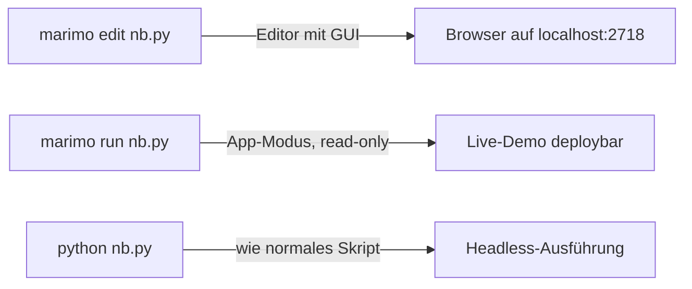

## Worum es geht

> Stop fighting your notebook's hidden state. — Marimo macht Reihenfolgen-Bugs unmöglich.

**Marimo** (aktuelle Version 0.23.4, 28.04.2026) ist ein Notebook-Tool, das **Python-Dateien** statt JSON-Notebooks (`.ipynb`) speichert. Es löst drei seit Jahrzehnten bekannte Probleme von Jupyter:

1. **Hidden State** — Cell-Ergebnisse hängen davon ab, in welcher Reihenfolge du sie ausgeführt hast
2. **Diff-Hölle** — `.ipynb`-Dateien sind 100 KB JSON-Blob, Git-Reviews sind unlesbar
3. **Reproduzierbarkeit** — du musst „Run All" treffen, um sicher zu sein, was passiert

## Voraussetzungen

- Phase 00.02 (uv installiert)
- Marimo via uv installiert: `uv add marimo`

## Konzept

### Was „reaktiv" bedeutet

In Jupyter sind Cells unabhängig. Du kannst sie in beliebiger Reihenfolge ausführen — und Variablen aus früher gelaufenen Cells bleiben im Memory.

```python
# Jupyter (kaputt)
# Cell 1: x = 5
# Cell 2: x = 10
# Cell 3: print(x)
# → wenn du Cell 2 löschst und Cell 3 ausführst → "10" (zombie value!)
```

In Marimo gibt es **keine ungespeicherten Variablen**. Cells werden in einem **Direct Acyclic Graph** ausgeführt: Cell B liest Variable `x` aus Cell A → wenn A sich ändert, läuft B automatisch nach.

```python
# Marimo (reaktiv)
# Cell 1: x = 5  → Cell 2 läuft automatisch nach
# Cell 2: print(x)  → "5"
# (du löschst Cell 1) → Variable x existiert nicht mehr → Cell 2 zeigt Fehler
```

**Konsequenz**: Marimo-Notebooks funktionieren immer von oben nach unten. Es gibt keine versteckten Reihenfolge-Bugs.

### Was „Python-Datei" bedeutet

Eine Marimo-Notebook-Datei sieht so aus:

```python
import marimo

__generated_with = "0.23.4"
app = marimo.App(width="medium")

@app.cell
def _(mo):
    mo.md("# Mein Notebook")
    return

@app.cell
def _():
    import marimo as mo
    return (mo,)

if __name__ == "__main__":
    app.run()
```

Das ist normales Python mit Decorators. Konsequenzen:

- **Git-Diffs sind lesbar** (`git diff` zeigt echte Code-Änderungen, kein Output-JSON-Schwall)
- **Linter funktionieren** (Ruff, Pylint laufen direkt drauf)
- **Tests sind möglich** (die `app.run()`-Funktion lässt sich aus pytest aufrufen)

### Drei Modi, in denen du Marimo benutzt



| Befehl | Wann |
|---|---|
| `marimo edit nb.py` | du **arbeitest am Notebook** — voller Editor mit Reactive Updates |
| `marimo run nb.py` | du **zeigst es jemandem** — App-Modus, read-only |
| `python nb.py` | du **testest, dass es durchläuft** (siehe Phase 13/20 CI-Smoke-Tests) |
| `marimo export ipynb nb.py -o nb.ipynb` | du **exportierst für Colab / Jupyter-Nutzer:innen** |
| `marimo export script nb.py -o nb.py` | du **exportierst als reines Python-Skript** (für CI, Production) |
| `marimo convert nb.ipynb` | du **migrierst von Jupyter** |

### Sandbox-Modus

Marimo unterstützt PEP 723 Inline-Metadaten. Du kannst Dependencies direkt in den Notebook-Header schreiben:

```python
# /// script
# requires-python = ">=3.13"
# dependencies = [
#   "marimo",
#   "pandas>=2.2",
#   "plotly>=5.20",
# ]
# ///

import marimo
app = marimo.App()
# ...
```

Mit `marimo edit --sandbox nb.py` installiert marimo die genannten Dependencies in ein **isoliertes venv** für nur dieses eine Notebook — du musst nichts vorher mit `uv add` machen.

**Verwendung im Werkstatt-Repo**: Alle Showcase-Notebooks in `phasen/05/`, `phasen/13/`, `phasen/20/` haben PEP-723-Header — du kannst sie ohne globalen Setup ausführen, wenn du `--sandbox` setzt.

### Wichtige Tastenkürzel

| Aktion | Mac | Linux/Windows |
|---|---|---|
| Cell ausführen | `Cmd+Enter` | `Ctrl+Enter` |
| Cell hinzufügen (oben) | `Cmd+Shift+Enter` | `Ctrl+Shift+Enter` |
| Cell löschen | `Cmd+Shift+Delete` | `Ctrl+Shift+Delete` |
| Markdown-Cell umschalten | `Cmd+M` | `Ctrl+M` |
| Suchen | `Cmd+F` | `Ctrl+F` |
| Speichern | automatisch | automatisch |

## Hands-on (10 Min.)

```bash
# 1. Marimo starten
cd dein-projekt
uv run marimo edit hallo.py
# → Browser öffnet sich

# 2. Im Browser: Cell hinzufügen, Code reinschreiben:
import marimo as mo
mo.md("# Hallo, Werkstatt 🛠️")

# 3. Datei ansehen
cat hallo.py
# → Du siehst Python-Code, kein JSON

# 4. Headless ausführen
python hallo.py
# → läuft ohne Server, gibt nichts aus (kein UI)

# 5. Zu Jupyter exportieren (für Kolleg:innen, die `.ipynb` erwarten)
uv run marimo export ipynb hallo.py -o hallo.ipynb
```

## Selbstcheck

- [ ] Du verstehst, was „reaktiv" bedeutet — Cell B läuft, wenn Cell A sich ändert.
- [ ] Du kannst eine Marimo-Datei mit `cat` lesen und sie ist verständlicher Python-Code.
- [ ] Du weißt, wann du `marimo edit`, `marimo run`, `python nb.py` und `marimo export` benutzt.
- [ ] Du kennst die Sandbox-Option (`--sandbox` mit PEP-723-Header).
- [ ] Du verstehst, warum Marimo-Notebooks im Werkstatt-Repo als `.py` committet werden, nicht als `.ipynb`.

## Compliance-Anker

- **Tech-Doku (AI-Act Art. 11)**: Reproduzierbare Notebooks sind Pflicht — Marimo plus `uv.lock` plus `pyproject.toml` plus Git geben dir das ohne Zusatzaufwand.
- **Code-Audit**: Reviewer:innen können Marimo-`.py` direkt im Pull Request lesen, ohne Notebook-Server. Das senkt den Aufwand für Compliance-Reviews.

## Quellen

- Marimo Docs — <https://docs.marimo.io/> (Zugriff 2026-04-28)
- Marimo Export Guide — <https://docs.marimo.io/guides/exporting/>
- Marimo Releases — <https://github.com/marimo-team/marimo/releases> (aktuell 0.23.4)
- PEP 723 (Inline script metadata) — <https://peps.python.org/pep-0723/>

## Weiterführend

→ Lektion **00.04** (Ollama lokal) — jetzt baust du dein erstes Marimo-Notebook mit echtem LLM-Call
→ Phasen 05 / 13 / 20 — alle Showcase-Notebooks sind Marimo-`.py`
