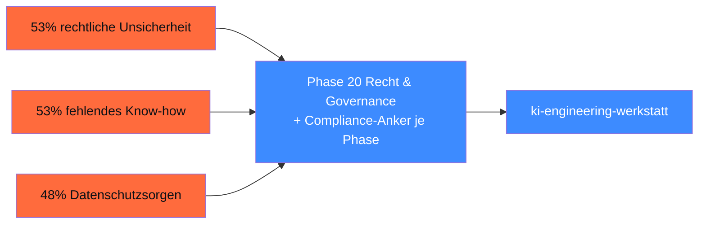

## Worum es geht

> Wer KI-Engineering lernt, sollte wissen, wo der Markt steht. — Hier sind die belegbaren Zahlen, keine Bauchgefühle.

Diese Lektion ist **kurz** und führt nur in die Daten ein. Die vollständige Aufstellung mit allen 18 Kennzahlen, fünf Direkt-Zitaten und Quellen-Liste findest du in [`markt-und-realitaet.md`](../markt-und-realitaet.md).

## Voraussetzungen

Keine. Diese Lektion kann ohne technische Vorkenntnisse gelesen werden — gut für Compliance-Officer, Geschäftsleitung, Co-Maintainer.

## Konzept

### Drei Kernzahlen

| Aussage | Wert | Quelle |
|---|---|---|
| KI aktiv genutzt (DE, ab 20 MA) | **41 %** | [Bitkom Research 15.09.2025](https://www.bitkom.org/Presse/Presseinformation/Durchbruch-Kuenstliche-Intelligenz) |
| KI-Nutzung KMU (KfW-Definition) | **20 %** (~ 780 k Firmen) | [KfW Fokus Nr. 533, 11.02.2026](https://www.kfw.de/PDF/Download-Center/Konzernthemen/Research/PDF-Dokumente-Fokus-Volkswirtschaft/Fokus-2026/Fokus-Nr.-533-Februar-2026-KI-Mittelstand.pdf) |
| Innovationen wegen DSGVO gestoppt | **70 %** | [Bitkom „Innovations-Bremse"](https://www.bitkom.org/Presse/Presseinformation/Datenschutz-Innovations-Bremse) |

> **Bitkom-Präsident Wintergerst** (15.09.2025): „Künstliche Intelligenz erlebt jetzt ihren Durchbruch in der deutschen Wirtschaft."

### Top-3-Hindernisse

| Hindernis | % der Unternehmen |
|---|---|
| Rechtliche Unsicherheit | **53 %** |
| Fehlendes Know-how | **53 %** |
| Datenschutzsorgen | **48 %** |

Diese drei Lücken adressiert die Werkstatt direkt:

### Schatten-KI ist real

[Bitkom 21.10.2025](https://www.bitkom.org/Presse/Presseinformation/Beschaeftigte-nutzen-Schatten-KI):

- **40 %** der Unternehmen vermuten oder wissen von **privater KI-Nutzung im Job**
- **26 %** haben offiziellen GenAI-Zugang (43 % bei ≥ 500 MA)

→ Bedeutet: drei Viertel der Mitarbeitenden, die KI nutzen wollen, machen es **inoffiziell** — mit privaten Accounts, ohne AVV, oft mit Mandanten-/Kunden-Daten in `chatgpt.com`.

→ **AI-Literacy nach AI-Act Art. 4** ist seit 02.02.2025 Pflicht und sanktionsfähig ab 02.08.2026 (siehe Phase 20).

### Sektor-Vorreiter

| Sektor | KI-Nutzung 2025 |
|---|---|
| Maschinenbau (DACH) | **43 %** (48 % planen bis 2028) |
| Wissensbasierte Dienstleistungen | **28 %** |
| F&E-intensive Industrie | **23 %** |
| Bauwirtschaft | **8 %** |

Quellen: [VDMA / Strategy& 2025](https://www.vdma.eu/documents/34570/4888559/Studie_GenAI-Implications_Web_DE.pdf), KfW 11.02.2026.

### Anbieter-Landschaft (Tendenz, nicht Prozentzahl)

**Belegt**:

- **OpenAI / ChatGPT** führt im DE-Web-Traffic mit ~ 81 % (xpert.digital 2025; Methodik = Web-Traffic, **nicht** Enterprise-Lizenzen)
- **Microsoft Copilot** dominiert Enterprise via M365-Integration; aktive Nutzungsquote ~ 30 % nach 12 Monaten bei lizenzierten Mitarbeitenden
- **Anthropic** eröffnete 07.11.2025 das Münchener Office; DE in den globalen Top-20 bei Claude-Nutzung pro Kopf ([Anthropic Newsroom](https://www.anthropic.com/news/new-offices-in-paris-and-munich-expand-european-presence))
- **Aleph Alpha** verließ Foundation-Model-Rennen Ende 2025; Cohere-Merger angekündigt April 2026

**Nicht belegt — bitte mit Vorsicht zitieren**: Konkrete DACH-Enterprise-Marktanteile bei Foundation-Modellen jenseits von M365/Workspace-Integration. Wer dazu eine repräsentative Studie hat, bitte als Issue eintragen.

### Schweiz & Österreich kompakt

- **AT-KMU** (≥ 10 MA): nur **8,9 %** nutzen KI ([KMU Forschung Austria / WKÖ 2025](https://www.wko.at/digitalisierung/ki-oekosysteme))
- **CH-KMU**: **22 % → 34 %** (2024 → 2025, [SECO 05.11.2025](https://www.kmu.admin.ch/kmu/en/home/new/news/2025/ai-gains-ground-swiss-smes.html))
- **CH-Arbeitsmarkt**: in stark KI-exponierten Berufen seit Nov 2022 + 27 % stärkere Arbeitslosenzahl ([KOF ETH Studie 186, 10/2025](https://ethz.ch/content/dam/ethz/special-interest/dual/kof-dam/documents/newsletter/KOF_Studie_KI_Schweizer_Arbeitsmarkt.pdf))

## Selbstcheck

- [ ] Du kannst die drei Kernzahlen (41 % / 20 % / 70 %) zitieren und die Quelle nennen.
- [ ] Du verstehst, warum **fehlende KI-Kompetenz** und **rechtliche Unsicherheit** mit jeweils 53 % an erster Stelle stehen.
- [ ] Du erklärst Schatten-KI in einem Satz und kennst die AI-Literacy-Pflicht (Art. 4 AI Act).
- [ ] Du kennst Cohere-Aleph-Alpha-Merger als wichtige Markt-Entwicklung 2026.

## Compliance-Anker

- **AI-Literacy nach AI-Act Art. 4** seit 02.02.2025 Pflicht für Bereitsteller. Sanktionsfähig ab 02.08.2026. → Phase 20 hat ein 4-Stunden-AI-Literacy-Onboarding-Template als Vorlage.
- **Schatten-KI verhindern** = Mitarbeitenden offizielle, AVV-konforme Tools geben (statt sie in private Accounts zu treiben).

## Quellen

Vollständige Liste in [`markt-und-realitaet.md`](../markt-und-realitaet.md). Wichtigste Primärquellen:

- Bitkom Research, „Durchbruch bei KI", 15.09.2025 — <https://www.bitkom.org/Presse/Presseinformation/Durchbruch-Kuenstliche-Intelligenz>
- KfW Research Fokus Nr. 533 (11.02.2026) — <https://www.kfw.de/PDF/Download-Center/Konzernthemen/Research/PDF-Dokumente-Fokus-Volkswirtschaft/Fokus-2026/Fokus-Nr.-533-Februar-2026-KI-Mittelstand.pdf>
- Bitkom „Schatten-KI", 21.10.2025 — <https://www.bitkom.org/Presse/Presseinformation/Beschaeftigte-nutzen-Schatten-KI>
- VDMA / Strategy& 2025 GenAI-Studie — <https://www.vdma.eu/documents/34570/4888559/Studie_GenAI-Implications_Web_DE.pdf>
- KOF ETH Studie 186 (10/2025) — <https://ethz.ch/content/dam/ethz/special-interest/dual/kof-dam/documents/newsletter/KOF_Studie_KI_Schweizer_Arbeitsmarkt.pdf>

## Weiterführend

→ Phase **20** (Recht & Governance) — AI-Literacy-Onboarding, AVV-Checkliste, DSFA-Workflow
→ Phase **18** (Ethik) — Bias auf Deutsch, Self-Censorship-Audit asiatischer Modelle
