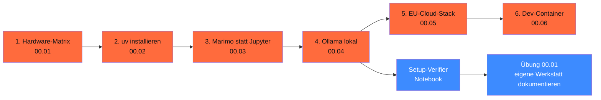

# Phase 00 · Werkstatt einrichten

> **Stop installing 47 tools manually.** — eine reproduzierbare KI-Werkstatt in unter 10 Minuten.

**Status**: ✅ vollständig ausgearbeitet · **Dauer**: ~ 4 h · **Schwierigkeit**: einsteiger

> Diese Phase ist **Pflicht**. Ohne grünes `just smoke` läuft nichts anderes.

## 🎯 Was du in diesem Modul lernst

- `uv` einsetzen statt pip / poetry / pyenv (2026-Default)
- Marimo-Notebooks öffnen, editieren, headless ausführen, zu Jupyter exportieren
- Lokal Modelle starten (Ollama auf Mac / Linux / Win) — passend zu deiner Hardware
- Eine DSGVO-konforme EU-Cloud-Alternative wählen (STACKIT, IONOS, OVHcloud, Scaleway)
- Einschätzen, was deine Hardware kann (RAM / VRAM / Apple Unified Memory)
- Die Markt-Realität DACH-Mittelstand kennen (Bitkom, KfW, VDMA — belegbar)

## 🧭 Wie du diese Phase nutzt



## 📚 Inhalts-Übersicht

| Lektion | Titel | Dauer | Datei |
|---|---|---|---|
| 00.01 | Hardware-Matrix — was läuft auf welcher Maschine | 30 min | [`lektionen/01-hardware-matrix.md`](lektionen/01-hardware-matrix.md) ✅ |
| 00.02 | uv installieren und ein Projekt anlegen | 30 min | [`lektionen/02-uv-installieren.md`](lektionen/02-uv-installieren.md) ✅ |
| 00.03 | Marimo statt Jupyter (warum und wie) | 30 min | [`lektionen/03-marimo-statt-jupyter.md`](lektionen/03-marimo-statt-jupyter.md) ✅ |
| 00.04 | Ollama lokal — dein erster lokaler LLM-Aufruf | 30 min | [`lektionen/04-ollama-lokal.md`](lektionen/04-ollama-lokal.md) ✅ |
| 00.05 | EU-Cloud-Stack im Vergleich (STACKIT, IONOS, OVHcloud, Scaleway) | 60 min | [`lektionen/05-eu-cloud-stack.md`](lektionen/05-eu-cloud-stack.md) ✅ |
| 00.06 | Dev-Container mit Docker (optional) | 30 min | [`lektionen/06-dev-container.md`](lektionen/06-dev-container.md) ✅ |
| 00.07 | Markt & Realität: KI-Adoption im DACH-Mittelstand | 30 min | [`lektionen/07-markt-und-realitaet.md`](lektionen/07-markt-und-realitaet.md) ✅ |

## 💻 Hands-on-Projekt (Pflicht)

**Setup-Verifier**: ein Marimo-Notebook, das systematisch deine Werkstatt prüft (Python-Version, uv, Marimo, optional Ollama-Daemon).

[](https://colab.research.google.com/github/s-a-s-k-i-a/ki-engineering-werkstatt/blob/main/dist-notebooks/phasen/00-werkzeugkasten/code/01_setup_verifier.ipynb)

```bash
uv run marimo edit phasen/00-werkzeugkasten/code/01_setup_verifier.py
```

Plus die [Übung 00.01](uebungen/01-aufgabe.md): deine eigene Werkstatt dokumentieren ([Lösungs-Skelett](loesungen/01_loesung.py)).

## ✅ Voraussetzungen

- Funktionierende Internet-Verbindung
- Mind. **8 GB RAM** (16 GB für lokale 7B-Modelle, 32 GB für 13B+)
- Optional: Apple-Silicon-Mac (MLX-Speedup), CUDA-fähige NVIDIA-Karte (≥ 8 GB VRAM), oder einer der EU-Cloud-Anbieter

## ⚖️ DACH-Compliance-Anker

→ [`compliance.md`](compliance.md): AVV-Pflicht ab Tag 1, AI-Literacy nach Art. 4, Datenresidenz, Energie / CO₂-Bewusstsein.

## 📖 Quellen (Auswahl)

- uv Docs: <https://docs.astral.sh/uv/>
- Marimo Docs: <https://docs.marimo.io/>
- Ollama Docs: <https://docs.ollama.com/>
- Bitkom Research 09 / 2025: <https://www.bitkom.org/Presse/Presseinformation/Durchbruch-Kuenstliche-Intelligenz>
- KfW Fokus 533 (02 / 2026): <https://www.kfw.de/PDF/Download-Center/Konzernthemen/Research/PDF-Dokumente-Fokus-Volkswirtschaft/Fokus-2026/Fokus-Nr.-533-Februar-2026-KI-Mittelstand.pdf>
- Vollständig in [`weiterfuehrend.md`](weiterfuehrend.md).

## ❌ Was diese Phase NICHT macht

- Sie lehrt **kein Python** — Grundkenntnisse werden vorausgesetzt (siehe [`docs/lernpfade/quereinsteigerin.md`](../../docs/lernpfade/quereinsteigerin.md) für Crashkurs-Verweise).
- Sie installiert nichts auf deinem System ohne explizite Befehle. Alles per `uv` in einer isolierten venv.
- Sie ersetzt keinen Sysadmin — bei Hardware-Problemen oder Netzwerk-Setup hilft sie nur am Rande.

## 🔄 Wartung

Stand: 28.04.2026 · Reviewer: Saskia Teichmann ([@s-a-s-k-i-a](https://github.com/s-a-s-k-i-a)) · Nächster Review: 07/2026 (Tool-Versionen + EU-Cloud-Pricing aktualisieren).
