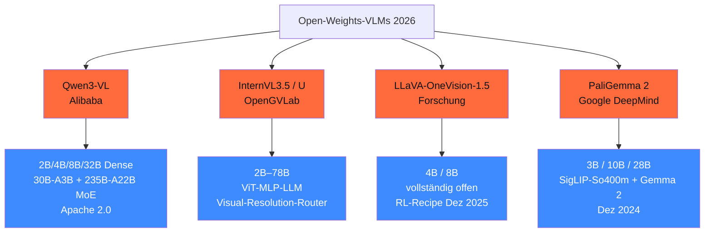

<!-- colab-badge:begin -->

<!-- colab-badge:end -->

## Worum es geht

> Stop assuming "vision LLM" is one model family. — 2026 hat Qwen3-VL als Default-SOTA, InternVL3.5 als Multi-Task-Spitze, LLaVA-OneVision als Forschungs-Standard, PaliGemma 2 als Compact-Choice. Diese Lektion legt die Landschaft fest.

## Voraussetzungen

- Phase 11.05 (Anbieter-Vergleich — du kennst die Token-Pricing-Skala)

## Konzept

### Die vier Familien (Stand 04/2026)

### Qwen3-VL — der Default 2026

URL: <https://github.com/QwenLM/Qwen3-VL> · Tech-Report: <https://arxiv.org/abs/2511.21631>

| Variante | Params | Lizenz | Wann |
|---|---|---|---|
| Qwen3-VL-2B / 4B / 8B Instruct | 2–8B | Apache 2.0 | Edge / Mid-Range-GPU |
| Qwen3-VL-32B Instruct + Thinking | 32B | Apache 2.0 | RTX 4090 Q4_K_M |
| Qwen3-VL-30B-A3B MoE | 30B (A3B aktiv) | Apache 2.0 | H100, Effizienz |
| Qwen3-VL-235B-A22B Instruct + Thinking | 235B | Apache 2.0 | Multi-GPU H100/H200 |

**SOTA 04/2026**: Qwen3-VL-235B-A22B-Thinking auf MMMU + Visual-Math knapp vor InternVL3.5-78B. Apache-2.0 = volle kommerzielle Freiheit.

### InternVL3.5 / InternVL-U — Multi-Task-Spitze

URL: <https://huggingface.co/collections/OpenGVLab/internvl3-67f7f690be79c2fe9d74fe9d>

- **InternVL3.5** (Sept 2025): 2B–78B, ViT-MLP-LLM mit Qwen3- + GPT-OSS-Backbones
- **InternVL-U** (März 2026): Visual-Resolution-Router komprimiert auf 64 Tokens — Effizienz-Champion
- DE-Performance: gut (Qwen-Backbone bringt deutsche Tokenizer mit)

### LLaVA-OneVision-1.5 — Forschungs-Standard

URL: <https://github.com/EvolvingLMMs-Lab/LLaVA-OneVision-1.5>

- Open-Source-Forschungspfad: 4B / 8B
- RL-Recipe (Dez 2025) übertrifft Qwen2.5-VL-7B auf 18/27 Benchmarks
- Vollständig offen — Daten, Code, Recipes
- Wann: für Forschung + Reproducibility

### PaliGemma 2 — Compact-Choice

URL: <https://deepmind.google/models/gemma/paligemma-2/>

- 3B / 10B / 28B mit SigLIP-So400m + Gemma 2
- Dez 2024 / mix-Variante Feb 2025
- Stand 04/2026: keine Nachfolge sichtbar
- Wann: bei Gemma-Stack-Affinität

### Wann welches Modell

| Use-Case | Empfehlung |
|---|---|
| Mobile / Edge (8 GB RAM) | **MiniCPM-o 2.6** (8B) — siehe Lektion 04.04 |
| RTX 4090, lokal | **Qwen3-VL-32B Q4_K_M** |
| RTX 4090, schneller | **InternVL3.5-8B** (mit Visual-Router) |
| Forschung + Reproduzierbarkeit | **LLaVA-OneVision-1.5** |
| Server-Production | **Qwen3-VL-235B MoE** auf H100/H200 |
| Compact + Gemma-Stack | **PaliGemma 2-10B** |
| **OCR-spezialisiert** | **LightOnOCR-2-1B** (Lektion 04.03) |

### Lizenz-Realität

| Modell | Lizenz | Kommerziell ok? |
|---|---|---|
| Qwen3-VL-Familie | **Apache 2.0** | ja, frei |
| InternVL3.5 / U | **MIT** | ja, frei |
| LLaVA-OneVision-1.5 | Apache 2.0 | ja, frei |
| PaliGemma 2 | Gemma-License | ja, mit Auflagen |
| MiniCPM-o | Apache 2.0 | ja, frei |

> Default 2026 für DACH-KMU: **Qwen3-VL** wegen Apache 2.0 + SOTA-Performance + breiter Community.

### AI-Act Art. 5 — was VERBOTEN ist

URL: <https://artificialintelligenceact.eu/article/5/>

Stand 04/2026 (voll wirksam ab 02.08.2026):

- **Untargeted Face-Scraping** für Gesichtsdatenbanken (Art. 5(1)(e))
- **Emotionserkennung am Arbeitsplatz** und in Bildung (Art. 5(1)(f))
- **Biometrische Kategorisierung** nach Rasse / Religion / politischer Meinung (Art. 5(1)(g))
- **Real-Time-Remote-Biometric-Identification** im öffentlichen Raum (Ausnahmen für Strafverfolgung)

> **Face-Detection** (nur Lokalisierung, keine Identifikation) ist **nicht** per se verboten, aber DSGVO Art. 9 (besondere Kategorien) sobald Re-Identifikation möglich. Bußgeld bis 35 Mio. € / 7 % Jahresumsatz.

## Hands-on

1. Qwen3-VL-8B-Instruct lokal via Ollama oder vLLM laden
2. 5 Test-Bilder beschreiben lassen (deutsch + englisch Prompt)
3. Vergleich gegen MiniCPM-o 2.6 (Lektion 04.04) — wo ist Qualität, wo Latenz?
4. Lizenz pro Modell prüfen — passt zum Use-Case?

## Selbstcheck

- [ ] Du nennst die vier Familien + ihre Charakteristika.
- [ ] Du wählst je Use-Case das richtige Modell.
- [ ] Du kennst die Lizenz-Implikationen (Apache 2.0 vs. Gemma-License).
- [ ] Du verstehst AI-Act Art. 5 für Face-Use-Cases.

## Compliance-Anker

- **AI-Act Art. 5**: Verbote für biometrische Kategorisierung
- **DSGVO Art. 9**: biometrische Daten = besondere Kategorie

## Quellen

- Qwen3-VL Tech Report — <https://arxiv.org/abs/2511.21631>
- Qwen3-VL HF Collection — <https://huggingface.co/collections/Qwen/qwen3-vl>
- InternVL3.5 — <https://huggingface.co/collections/OpenGVLab/internvl3-67f7f690be79c2fe9d74fe9d>
- LLaVA-OneVision-1.5 — <https://github.com/EvolvingLMMs-Lab/LLaVA-OneVision-1.5>
- PaliGemma 2 — <https://deepmind.google/models/gemma/paligemma-2/>
- AI-Act Art. 5 — <https://artificialintelligenceact.eu/article/5/>

## Weiterführend

→ Lektion **04.02** (Image-Encoder + Embeddings — SigLIP-2, DINOv3)
→ Lektion **04.03** (OCR + Document-Understanding — LightOnOCR-2-1B)
→ Lektion **04.04** (Edge-VLM — MiniCPM-o, SmolVLM2)
