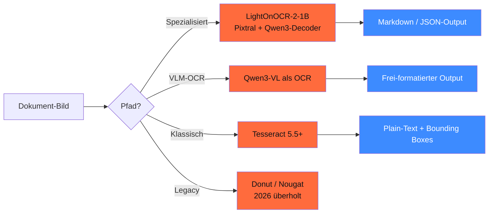

## Worum es geht

> Stop using only Tesseract. — 2026 ist VLM-basierte OCR der neue Standard. **LightOnOCR-2-1B** (Jan 2026) ist 9× kleiner als vorherige SOTA bei besserer Qualität. Tesseract bleibt für saubere Druck-Vorlagen relevant.

## Voraussetzungen

- Lektion 04.01 (VLM-Landschaft)
- Lektion 04.02 (Image-Encoder)

## Konzept

### Drei OCR-Pfade 2026



### LightOnOCR-2-1B (Jan 2026, Empfehlung 2026)

URL: <https://huggingface.co/lightonai/LightOnOCR-1B-1025>

- **1B Params** — 9× kleiner als vorherige SOTA-OCR
- Pixtral-Encoder + Qwen3-Decoder
- **5,71 Seiten/s auf H100**
- Multilingual (inkl. DE)
- **Bei IONOS AI Model Hub direkt verfügbar** ([IONOS-Doku](https://docs.ionos.com/cloud/ai/ai-model-hub/models/ocr-models/lightonocr-2-1b))

**Wann**: produktiver Default für DACH-OCR. Kombiniert die Geschwindigkeit von Tesseract mit der Qualität von VLMs.

```python
from transformers import AutoProcessor, AutoModelForVision2Seq
from PIL import Image

processor = AutoProcessor.from_pretrained("lightonai/LightOnOCR-1B-1025")
modell = AutoModelForVision2Seq.from_pretrained(
    "lightonai/LightOnOCR-1B-1025",
    torch_dtype="bfloat16",
    device_map="auto",
)

bild = Image.open("rechnung.png")
inputs = processor(images=bild, return_tensors="pt")
out = modell.generate(**inputs, max_new_tokens=1024)
text = processor.decode(out[0], skip_special_tokens=True)
print(text)  # Markdown-strukturiert
```

### Qwen3-VL als OCR (Multi-Task)

URL: <https://huggingface.co/collections/Qwen/qwen3-vl>

- Qwen3-VL-32B / 235B haben **integrierte OCR-Fähigkeit**
- Vorteil: gleiches Modell für OCR + Verständnis-Frage
- Nachteil: langsamer und teurer als spezialisierter OCR-Stack

```python
# Qwen3-VL für komplexe Dokumente mit Tabellen + Verständnis-Fragen
from transformers import Qwen3VLForConditionalGeneration

modell = Qwen3VLForConditionalGeneration.from_pretrained(
    "Qwen/Qwen3-VL-32B-Instruct",
    torch_dtype="bfloat16",
)

prompt = (
    "Lies die Rechnung und extrahiere: Rechnungsnummer, Datum, Brutto-Betrag, "
    "USt-Satz. Antwort als JSON."
)
# ... siehe Qwen3-VL-Doku für Multi-Modal-Prompt
```

### Tesseract 5.5.1 (Mai 2025)

URL: <https://tesseract-ocr.github.io/tessdoc/ReleaseNotes.html>

- Solide DE-Performance auf **sauberem** Druck (> 95 % Accuracy)
- Schwach bei: Layout, Handschrift, fotografierten Dokumenten, Tabellen
- Open-Source, läuft überall (auch ohne GPU)

**Wann**: ergänzend für Standard-Druckwerke (z. B. amtliche Bekanntmachungen). Nicht für Rechnungen / Verträge / komplexe Layouts.

### Legacy: Donut / Nougat

URL: <https://github.com/clovaai/donut>

Stand 04/2026: **überholt durch VLM-OCR**. Keine signifikanten Updates seit 2023/24. Nicht für neue Pipelines.

### DACH-spezifische Use-Cases

#### 1. Rechnungs-Verarbeitung (Standard-KMU)

```python
# Pipeline-Pattern
def process_rechnung(pdf_path: str) -> dict:
    # 1. PDF → Bilder (pdf2image)
    seiten = pdf_to_images(pdf_path)

    # 2. LightOnOCR pro Seite
    seiten_text = [light_on_ocr(s) for s in seiten]

    # 3. Pydantic-AI extrahiert Felder
    return rechnungs_extractor.run_sync(
        "\n\n".join(seiten_text)
    ).output  # RechnungsDaten-Schema
```

#### 2. Behörden-Formulare (DSGVO-kritisch)

- Eigenes Modell finetunen mit anonymisierten DACH-Formularen (Phase 12)
- Alternative: **German-OCR-3** ([huggingface.co/Keyven/german-ocr-3](https://huggingface.co/Keyven/german-ocr-3)) — DSGVO-konform lokal lauffähig, trainiert auf 200+ anonymisierten DE-Rechnungen

#### 3. Historische Drucke

- **OCR-D** (DFG-Projekt, [ocr-d.de](https://ocr-d.de/daten/)) — historische DE-Drucke
- Kalamari + Tesseract als klassisch-präzise Pipeline

### DSGVO-Pattern für OCR

| Anforderung | Implementation |
|---|---|
| **Datenminimierung (Art. 5 lit. c)** | nur die benötigten Felder ans LLM weitergeben |
| **Privacy by Design (Art. 25)** | OCR lokal, nur strukturierte Daten persistieren |
| **PII-Filter** | nach OCR + vor LLM-Verarbeitung Presidio (Lektion 14.08 + 17.08) |
| **Aufbewahrung Original** | Original-Bild max. 30 Tage, dann löschen oder pseudonymisieren |
| **AI-Act Art. 15** | Robustness-Test mit DACH-Test-Set |

### Pipeline-Pattern (Production)

```python
# Vollständige DSGVO-konforme OCR-Pipeline
async def ocr_pipeline(pdf: bytes, mandant_id: str) -> dict:
    # 1. PDF → Bilder
    bilder = await pdf_to_images(pdf)

    # 2. OCR (lokal, kein Cloud-Call)
    raw_text = await asyncio.gather(*[lightonocr(b) for b in bilder])
    text = "\n\n".join(raw_text)

    # 3. PII-Redaction
    text_clean, pii_typen = presidio_redact(text, sprache="de")

    # 4. Strukturierter Extract via LiteLLM
    extract = await rechnungs_agent.run(text_clean)

    # 5. Audit-Log
    log_audit({
        "mandant": hash(mandant_id),
        "pii_redacted": pii_typen,
        "extract_keys": list(extract.output.model_dump().keys()),
    })

    # 6. Original-Bild löschen nach 30 Tagen (separater Job)
    schedule_delete(pdf, days=30)

    return extract.output.model_dump()
```

## Hands-on

1. LightOnOCR-2-1B lokal aufsetzen (1B passt auf RTX 3090 / 4090)
2. 5 deutsche Test-Dokumente (Rechnung, Brief, Formular) durchziehen
3. Qualitäts-Vergleich gegen Tesseract 5.5
4. Pipeline mit Presidio-PII-Filter bauen
5. Latenz-Messung: Seiten/s auf deiner Hardware

## Selbstcheck

- [ ] Du nennst die drei OCR-Pfade + ihre Use-Cases.
- [ ] Du nutzt LightOnOCR-2-1B als Default für 2026.
- [ ] Du baust eine DSGVO-konforme Pipeline mit PII-Filter.
- [ ] Du kennst German-OCR-3 + OCR-D als DACH-Datasets.

## Compliance-Anker

- **DSGVO Art. 25**: OCR lokal, nur strukturierte Daten persistieren
- **DSGVO Art. 5 lit. e**: Original-Bild max. 30 Tage
- **AI-Act Art. 15**: Robustness-Test mit DACH-Test-Set

## Quellen

- LightOnOCR-2-1B HF — <https://huggingface.co/lightonai/LightOnOCR-1B-1025>
- LightOnOCR Blog — <https://huggingface.co/blog/lightonai/lightonocr>
- IONOS LightOnOCR-Hosting — <https://docs.ionos.com/cloud/ai/ai-model-hub/models/ocr-models/lightonocr-2-1b>
- Tesseract Releases — <https://tesseract-ocr.github.io/tessdoc/ReleaseNotes.html>
- German-OCR-3 — <https://huggingface.co/Keyven/german-ocr-3>
- OCR-D — <https://ocr-d.de/daten/>

## Weiterführend

→ Lektion **04.04** (Edge-VLM für Mobile-OCR)
→ Phase **17.07** (LiteLLM-Proxy für OCR-Multi-Provider)
→ Phase **20.05** (Audit-Logging für OCR-Pipelines)
