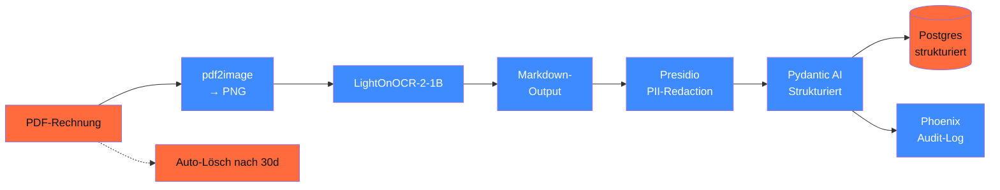

## Worum es geht

> Stop losing 10 minutes per invoice to manual extraction. — diese Lektion baut **end-to-end** eine Rechnungs-OCR-Pipeline für DACH-KMU. LightOnOCR + Pydantic AI + Presidio. Lokal lauffähig, DSGVO-konform.

## Voraussetzungen

- Lektion 04.03 (OCR-Pfade)
- Lektion 04.05 (Inference-Stacks)
- Phase 12.04 (DACH-PII-Filter)

## Konzept

### Pipeline-Übersicht



### Schritt 1 — PDF → Bilder

```python
from pdf2image import convert_from_bytes


def pdf_to_images(pdf_bytes: bytes, dpi: int = 200) -> list:
    """Konvertiert PDF in PIL-Images (200 DPI = guter OCR-Trade-off)."""
    return convert_from_bytes(pdf_bytes, dpi=dpi)
```

### Schritt 2 — LightOnOCR auf jeder Seite

```python
from transformers import AutoProcessor, AutoModelForVision2Seq

processor = AutoProcessor.from_pretrained("lightonai/LightOnOCR-1B-1025")
ocr_modell = AutoModelForVision2Seq.from_pretrained(
    "lightonai/LightOnOCR-1B-1025",
    torch_dtype="bfloat16",
    device_map="auto",
)


def ocr_seite(bild) -> str:
    inputs = processor(images=bild, return_tensors="pt").to(ocr_modell.device)
    out = ocr_modell.generate(**inputs, max_new_tokens=1024)
    return processor.decode(out[0], skip_special_tokens=True)
```

### Schritt 3 — PII-Redaktion mit Presidio

```python
from presidio_analyzer import AnalyzerEngine
from presidio_anonymizer import AnonymizerEngine

analyzer = AnalyzerEngine(supported_languages=["de", "en"])
anonymizer = AnonymizerEngine()


def redact_pii(text: str) -> tuple[str, list[str]]:
    results = analyzer.analyze(text=text, language="de")
    typen = list({r.entity_type for r in results})
    redacted = anonymizer.anonymize(text=text, analyzer_results=results).text
    return redacted, typen
```

> Stand 04/2026: Presidio unterstützt DE-Pattern für IBAN, Telefon, Email, Steuer-ID. Custom-Recognizer für USt-ID etc. siehe Doku.

### Schritt 4 — Strukturierter Extract via Pydantic AI

```python
from pydantic import BaseModel, Field
from pydantic_ai import Agent
from typing import Literal


class RechnungsDaten(BaseModel):
    rechnungsnummer: str = Field(min_length=1, max_length=50)
    rechnungsdatum: str  # ISO-Format YYYY-MM-DD
    leistungsdatum: str | None = None
    rechnungssteller: str
    rechnungsempfaenger: str | None = None
    netto_eur: float = Field(ge=0)
    ust_satz: Literal["0", "7", "19"] = "19"
    ust_betrag_eur: float = Field(ge=0)
    brutto_eur: float = Field(ge=0)
    iban: str | None = Field(default=None, description="IBAN, falls genannt")
    skonto: dict | None = None
    positionen: list[dict] = []


extract_agent = Agent(
    "anthropic:claude-haiku-4-5",  # günstig, schnell
    output_type=RechnungsDaten,
    system_prompt=(
        "Extrahiere Rechnungs-Daten aus dem Text. Validiere Brutto = Netto + USt. "
        "Bei unklaren Werten: konservativ schätzen, in Logs vermerken."
    ),
)


async def extract_rechnung(ocr_text: str) -> RechnungsDaten:
    result = await extract_agent.run(ocr_text)
    return result.output
```

### Schritt 5 — Audit-Logging

```python
import hashlib
from datetime import datetime, UTC


def log_ocr_event(mandant_id: str, datei_hash: str, extract: RechnungsDaten, pii_typen: list[str]):
    audit = {
        "ts": datetime.now(UTC).isoformat(),
        "mandant_hash": hashlib.sha256(mandant_id.encode()).hexdigest()[:16],
        "datei_hash": datei_hash,
        "rechnungsnummer_hash": hashlib.sha256(extract.rechnungsnummer.encode()).hexdigest()[:16],
        "brutto_eur": float(extract.brutto_eur),
        "pii_typen_redacted": pii_typen,
        "modell": "lightonocr-1b-1025 + claude-haiku-4-5",
    }
    logger.info("ocr_event", extra=audit)
```

### Schritt 6 — Komplette Pipeline

```python
async def rechnungs_pipeline(pdf_bytes: bytes, mandant_id: str) -> RechnungsDaten:
    # 1. PDF → Bilder
    bilder = pdf_to_images(pdf_bytes)

    # 2. OCR pro Seite
    seiten_text = [ocr_seite(b) for b in bilder]
    text = "\n\n".join(seiten_text)

    # 3. PII-Redaktion
    text_clean, pii_typen = redact_pii(text)

    # 4. Strukturierter Extract
    extract = await extract_rechnung(text_clean)

    # 5. Datei-Hash für Audit
    datei_hash = hashlib.sha256(pdf_bytes).hexdigest()[:16]

    # 6. Audit-Log
    log_ocr_event(mandant_id, datei_hash, extract, pii_typen)

    # 7. Auto-Lösch-Job für Original-PDF in 30d
    schedule_delete(pdf_bytes, days=30)

    return extract
```

### Compliance-Pflicht-Pattern

| Punkt | Implementation |
|---|---|
| **AI-Act Art. 12** (Logging) | strukturiertes Audit pro Call |
| **AI-Act Art. 15** (Robustness) | Eval-Set mit 100 dt. Rechnungen, Accuracy ≥ 95 % |
| **DSGVO Art. 5 lit. e** | Auto-Lösch-Job 30d für Original |
| **DSGVO Art. 25** | OCR lokal, nur strukturierte Daten persistieren |
| **DSGVO Art. 28** | AVV mit Anthropic (für Pydantic AI Extract) |
| **DSGVO Art. 32** | Postgres encryptet, TLS für API-Calls |

### Performance-Realität

Bei 100 deutschen Standard-Rechnungen (1–3 Seiten):

| Komponente | Latenz pro Rechnung |
|---|---|
| pdf2image (200 DPI) | ~ 200 ms |
| LightOnOCR (RTX 4090) | ~ 1.500 ms |
| Presidio | ~ 100 ms |
| Pydantic AI Extract (Haiku 4.5) | ~ 800 ms |
| Audit-Log + DB-Insert | ~ 50 ms |
| **Total** | **~ 2.700 ms** |

Cost: ~ € 0,005 pro Rechnung (Haiku 4.5-Tokens, lokales OCR umsonst).

### Eval-Set für Production

Pflicht: 100 deutsche Rechnungen mit Ground-Truth-Werten:

```python
import json
from pathlib import Path


def eval_pipeline():
    eval_set = json.loads(Path("eval/rechnungen.jsonl").read_text())
    erfolg = 0
    for sample in eval_set:
        result = await rechnungs_pipeline(sample["pdf_bytes"], "test-mandant")
        if compare_extract(result, sample["ground_truth"]):
            erfolg += 1
    accuracy = erfolg / len(eval_set)
    print(f"Pipeline-Accuracy: {accuracy:.1%}")
```

Threshold für Production: **≥ 95 % Field-Level-Accuracy** auf Standard-Rechnungen.

## Hands-on

1. LightOnOCR + Presidio + Pydantic AI lokal aufsetzen
2. 5 Test-Rechnungen (eigene oder synthetische) durchziehen
3. Field-by-Field-Vergleich: extrahiert vs. Ground-Truth
4. Latenz pro Rechnung dokumentieren
5. PII-Filter-Test: künstliche Email + Telefon einbauen — wird redaktiert?

## Selbstcheck

- [ ] Du baust End-to-End-Rechnungs-OCR-Pipeline.
- [ ] Du integrierst PII-Redaktion mit Presidio.
- [ ] Du loggst pro Call audit-fähig.
- [ ] Du dokumentierst Pipeline-Accuracy auf 100 Test-Rechnungen.
- [ ] Du planst Auto-Lösch für Original-PDFs.

## Compliance-Anker

- **AI-Act Art. 12 + 15**: Audit + Robustness-Eval
- **DSGVO Art. 5 / 25 / 28 / 32**: Privacy by Design + AVV + TOM

## Quellen

- LightOnOCR — <https://huggingface.co/lightonai/LightOnOCR-1B-1025>
- Presidio — <https://microsoft.github.io/presidio/>
- pdf2image — <https://github.com/Belval/pdf2image>
- Pydantic AI — <https://ai.pydantic.dev/>

## Weiterführend

→ Phase **17.07** (LiteLLM-Proxy für Multi-Provider-OCR-Setup)
→ Phase **20.05** (Audit-Logging-Pipeline-Pattern)
→ Capstone **19.B** (DSGVO-Compliance-Checker mit ähnlichem Stack)
