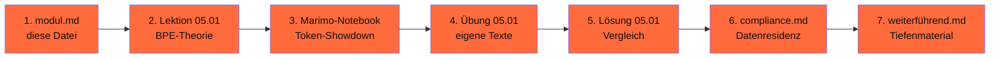

# Phase 05 · Deutsche Tokenizer

> **Stop wasting tokens on German compound words.** — bei deutschem Text kannst du 30 % API-Kosten sparen, wenn du den richtigen Tokenizer wählst.

**Status**: ✅ Showcase-Modul, vollständig ausgearbeitet · **Dauer**: ~ 6 h · **Schwierigkeit**: mittel

## 🎯 Was du in diesem Modul lernst

- Die drei Tokenizer-Familien (BPE, WordPiece, SentencePiece) und ihre Annahmen
- Warum englisch-trainierte Tokenizer auf Deutsch ineffizient sind (Komposita, Umlaute)
- Wie du denselben deutschen Text mit 6+ Tokenizern vergleichst
- Wie du Token-Kosten in **EUR** umrechnest — nicht in „API-Calls"
- Welcher Tokenizer für welchen DACH-Use-Case (FAQ-Bot, Newsletter, Code-Doku)

## 🧭 Wie du diese Phase nutzt

## 📚 Inhalts-Übersicht

| Lektion | Titel | Dauer | Datei |
|---|---|---|---|
| 05.01 | BPE / WordPiece / SentencePiece — wie funktioniert ein Tokenizer? | 60 min | [`lektionen/01-bpe-und-deutsch.md`](lektionen/01-bpe-und-deutsch.md) ✅ |
| 05.02 | Komposita & Umlaute — warum Deutsch teurer ist | 45 min | *geplant* |
| 05.03 | Token-Effizienz-Showdown (Hands-on Marimo-Notebook) | 90 min | [`code/01_tokenizer_showdown.py`](code/01_tokenizer_showdown.py) ✅ |
| 05.04 | Embeddings für deutsche Texte (e5, bge-m3, Pharia-Luminous) | 60 min | *geplant* |
| 05.05 | Tokenizer-Auswahl-Matrix für DACH-Use-Cases | 30 min | *geplant* |

## 💻 Hands-on-Projekt (Pflicht)

Du tokenisierst denselben 10kGNAD-Artikel mit sechs Tokenizern (GPT-5.4 / Claude Sonnet 4.6 / Llama 4 / Mistral Large / Pharia-1 / Teuken-7B), plottest Tokenanzahl + EUR-Kosten + semantische Granularität.

**Quintessenz**: zwischen 0,05 € und 0,15 € für denselben Inhalt — bei Massen-Workloads schnell vierstellige Differenz pro Monat.

## ✅ Voraussetzungen

- Phase 00 (Werkstatt einrichten)
- Optional: Phase 01 (Mathematik) für tiefe Embedding-Intuition
- Python-Grundkenntnisse

## ⚖️ DACH-Compliance-Anker

→ [`compliance.md`](compliance.md) — Datenresidenz Embedding-Provider, BAFA-Zertifizierung Aleph Alpha, Lizenz-Hinweise zu 10kGNAD.

## 📖 Quellen (Auswahl)

- Sennrich et al. (2016): „BPE" — <https://arxiv.org/abs/1508.07909>
- Aleph Alpha (2024): „Pharia-1 Tech Report" — <https://aleph-alpha.com/introducing-pharia-1-llm-transparent-and-compliant/>
- Schmidt et al. (2024): „LLäMmlein" — <https://arxiv.org/abs/2411.11171>
- Vollständig in [`weiterfuehrend.md`](weiterfuehrend.md).

## 🔄 Wartung

Stand: 28.04.2026 · Reviewer: Saskia Teichmann ([@s-a-s-k-i-a](https://github.com/s-a-s-k-i-a)) · Nächster Review: 07/2026 (Quellen + Token-Preise).
