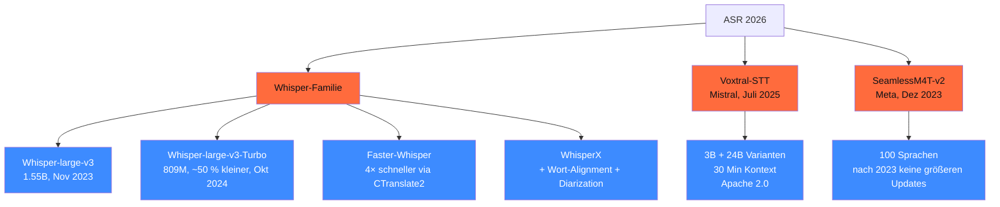

<!-- colab-badge:begin -->
[](https://colab.research.google.com/github/s-a-s-k-i-a/ki-engineering-werkstatt/blob/main/dist-notebooks/phasen/06-sprache-und-audio/code/01_audio_stack_selektor.ipynb)
<!-- colab-badge:end -->

## Worum es geht

> Stop assuming Whisper-v4 exists. — Stand 04/2026 ist **Whisper-large-v3** (Nov 2023) + **Whisper-large-v3-Turbo** (Okt 2024) die offizielle Stable. „Whisper-v4" als Begriff existiert nur in Marketing-Blogs, **nicht** als OpenAI-Release. Voxtral-STT von Mistral ist die DE-starke Alternative.

## Voraussetzungen

- Phase 11.05 (Anbieter-Vergleich)

## Konzept

### Drei produktive ASR-Familien (Stand 04/2026)



### Whisper-large-v3 + Turbo

URLs:

- <https://huggingface.co/openai/whisper-large-v3>
- <https://huggingface.co/openai/whisper-large-v3-turbo>

| Variante | Params | Speed | Qualität DE |
|---|---|---|---|
| **Whisper-large-v3** | 1,55B | Baseline | sehr gut (WER ~ 5 %) |
| **Whisper-large-v3-Turbo** | 809M | ~ 2× schneller | sehr gut (WER ~ 5 %, minimal schlechter) |

**Hinweis**: „Whisper-v4" existiert **nicht** als offizielles OpenAI-Release Stand 04/2026.

### Faster-Whisper (CTranslate2)

URL: <https://github.com/SYSTRAN/faster-whisper>

- Bis **4× schneller** als openai/whisper bei gleicher Genauigkeit
- DE-Turbo-Forks auf HF erreichen WER ~ **2,6 %** auf gemischten DE-Testsets
- Standard für Production-ASR auf eigener Hardware

```python
from faster_whisper import WhisperModel

modell = WhisperModel("large-v3", device="cuda", compute_type="float16")

segments, info = modell.transcribe(
    "audio.wav",
    language="de",
    beam_size=5,
)
print(f"Sprache: {info.language}, Konfidenz: {info.language_probability:.2f}")
for s in segments:
    print(f"[{s.start:.2f}s → {s.end:.2f}s] {s.text}")
```

### WhisperX (m-bain)

URL: <https://github.com/m-bain/whisperX>

- Faster-Whisper + **Wort-Alignment** + **Speaker-Diarization**
- Sinnvoll für DE-Untertitel, Meeting-Mitschnitte, Podcast-Transkripte
- Langsamer als Faster-Whisper

### Voxtral-STT (Mistral, Juli 2025) — die DE-Alternative

URL: <https://mistral.ai/news/voxtral>

- **3B + 24B** Varianten
- Bis **30 Min Audio-Kontext** in einem Pass
- **DE explizit nativ** unterstützt
- Apache 2.0
- Q&A + Summarization eingebaut (nicht nur Transkription)

> Wann Voxtral statt Whisper? Wenn Q&A/Summary direkt aus Audio gewünscht (1 Modell statt ASR + LLM-Pipeline). Bei reiner Transkription bleibt Faster-Whisper schneller.

### SeamlessM4T-v2 (Meta, Dez 2023)

URL: <https://huggingface.co/facebook/seamless-m4t-v2-large>

- 100 Sprachen, DE über `SeamlessExpressive`
- **Stand 04/2026**: keine größeren Updates seit Ende 2023 — eher Forschungs-Plattform als Production-ASR

### DE-Word-Error-Rate (Stand 04/2026)

| Modell | WER DE (Mix) | Latenz auf RTX 4090 |
|---|---|---|
| Faster-Whisper-large-v3 | ~ 5 % | RTF ~ 0,1 (10× Realtime) |
| Faster-Whisper-large-v3-Turbo | ~ 5,5 % | RTF ~ 0,05 |
| **DE-Turbo-Forks** (HF) | **~ 2,6 %** | RTF ~ 0,05 |
| Voxtral-3B | ~ 4 % | langsamer (höhere Compute) |

> Empfehlung 2026: **Faster-Whisper-large-v3 + DE-Finetune** als Production-Default. Voxtral-3B wenn Q&A / Summarization aus Audio gewünscht.

### DSGVO Art. 9 — Voice ist biometrisches Datum

**Wichtig**: Stimme ist nach DSGVO Art. 9 ein **biometrisches Datum** (besondere Kategorie). Damit:

- **Explizite Einwilligung pflicht** (Art. 9 Abs. 2 lit. a)
- Keine Verarbeitung ohne klaren Zweck
- Bei Speaker-Diarization: Voiceprint = besonders sensibel
- **AI-Act Art. 5(1)(f)** ab 02.08.2026 voll wirksam: Emotionserkennung am Arbeitsplatz auf Basis biometrischer Daten **verboten**

### EU-Hosting-Optionen für Whisper

| Option | DSGVO | Pricing |
|---|---|---|
| **Self-Hosted** auf Scaleway H100 | ✅ | € 2,73/h |
| **Self-Hosted** auf OVH H100 | ✅ | (Listenpreis prüfen) |
| **Self-Hosted** auf eigener Hardware | ✅ | nur Strom |
| **AWS Bedrock Whisper** in eu-central-1 Frankfurt | ✅ mit AVV | ~ $ 0,006/Min |
| **OpenAI Whisper API** | ⚠️ Drittland | ~ $ 0,006/Min |

> Empfehlung 2026 für DACH-Mittelstand: **Faster-Whisper auf eigener RTX 4090 oder Scaleway H100**. Cloud-API nur bei expliziter AVV + EU-Region.

### Audio-Aufbewahrungs-Disziplin

DSGVO Art. 5 lit. e (Speicherbegrenzung):

```python
import asyncio
from datetime import datetime, UTC


async def auto_loesch_audio(session_id: str, max_minuten: int = 60):
    """Original-Audio max. 60 Min, dann löschen."""
    await asyncio.sleep(max_minuten * 60)
    await delete_audio_files(session_id)
    log_audit("audio_deleted", session_id)
```

Pattern (Capstone 19.E): Audio max. 60 Min behalten (für In-Session-Korrektur). Transkripte mit PII-Redaktion 7 Tage, dann Auto-Lösch.

## Hands-on

1. Faster-Whisper auf RTX 4090 oder CPU einrichten
2. 5 deutsche Audio-Dateien transkribieren (eigene oder Public-Domain-Podcasts)
3. WER-Schätzung gegen Ground-Truth-Transkripte
4. Faster-Whisper-Turbo vs. large-v3 — Speed vs. Qualität
5. Voxtral-3B testen (falls Hardware reicht) — Q&A direkt aus Audio

## Selbstcheck

- [ ] Du nennst die drei ASR-Familien.
- [ ] Du verstehst, dass Whisper-v4 NICHT existiert (Stand 04/2026).
- [ ] Du nutzt Faster-Whisper als Production-Default.
- [ ] Du kennst DSGVO Art. 9 (Voice = biometrisch).
- [ ] Du implementierst Auto-Lösch-Pipeline für Original-Audio.

## Compliance-Anker

- **DSGVO Art. 9**: Voice = biometrisch, explizite Einwilligung pflicht
- **DSGVO Art. 5 lit. e**: Speicherbegrenzung, Auto-Lösch
- **AI-Act Art. 5(1)(f)**: Emotionserkennung am Arbeitsplatz verboten

## Quellen

- Whisper-large-v3 — <https://huggingface.co/openai/whisper-large-v3>
- Voxtral-STT — <https://mistral.ai/news/voxtral>
- Faster-Whisper — <https://github.com/SYSTRAN/faster-whisper>
- WhisperX — <https://github.com/m-bain/whisperX>
- SeamlessM4T-v2 — <https://huggingface.co/facebook/seamless-m4t-v2-large>
- AI-Act Art. 5 — <https://artificialintelligenceact.eu/article/5/>

## Weiterführend

→ Lektion **06.02** (TTS-Landschaft — Voxtral-TTS, F5-TTS, Cartesia)
→ Lektion **06.04** (Real-Time-Voice + LiveKit Agents)
→ Capstone **19.E** (Mehrsprachiger Voice-Agent)
