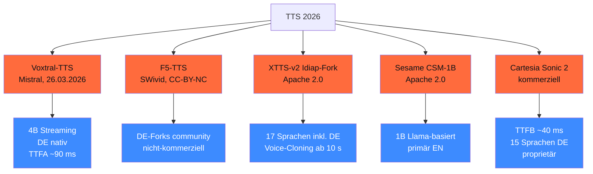

## Worum es geht

> Stop using F5-TTS for commercial work — license blocks it. — 2026 ist **Voxtral-TTS** (Mistral, Apache 2.0) der DE-SOTA für **kommerziell + Open-Weights**. F5-TTS ist CC-BY-NC (nur Forschung). Sesame ist NICHT Anthropic — eigene Firma.

## Voraussetzungen

- Lektion 06.01 (ASR-Landschaft)

## Konzept

### Vier TTS-Familien



### Voxtral-TTS (Mistral, 26.03.2026) — Empfehlung 2026

URL: <https://mistral.ai/news/voxtral-tts>

- **4B Streaming**, läuft auf 16 GB VRAM
- **DE nativ** (insgesamt 9 Sprachen)
- **TTFA ~ 90 ms** (Time-to-First-Audio)
- **Voice-Cloning aus < 5 s Audio**
- **Apache 2.0** — voll kommerziell frei
- Schlägt laut Mistral ElevenLabs Flash v2.5 in Human-Preference-Tests

```python
# Stand 04/2026 — falls bereits HF-released
from transformers import AutoProcessor, AutoModelForSpeechSeq2Seq

processor = AutoProcessor.from_pretrained("mistralai/Voxtral-4B-TTS-2603")
modell = AutoModelForSpeechSeq2Seq.from_pretrained(
    "mistralai/Voxtral-4B-TTS-2603",
    torch_dtype="bfloat16",
)

inputs = processor(
    text="Guten Tag, ich helfe Ihnen mit Ihrer Anfrage.",
    return_tensors="pt",
)
audio_out = modell.generate(**inputs)
```

### F5-TTS — Forschung-only ⚠️

URL: <https://github.com/SWivid/F5-TTS>

- **Lizenz: CC-BY-NC-4.0** = **NICHT kommerziell ohne Verhandlung**
- DE-Forks: [`aihpi/F5-TTS-German`](https://huggingface.co/aihpi/F5-TTS-German), [`hvoss-techfak/F5-TTS-German`](https://huggingface.co/hvoss-techfak/F5-TTS-German)
- Wann: nur für Forschung / Demos / nicht-kommerzielle Projekte

> Wichtig: in vielen Tutorials wird F5-TTS als „Standard" genannt — die **CC-BY-NC-Lizenz** wird oft übersehen. Für DACH-KMU Production: Voxtral-TTS oder XTTS-v2-Idiap-Fork.

### XTTS-v2 Idiap-Fork (community-maintained Coqui-Fork)

URL: <https://github.com/idiap/coqui-ai-TTS>

- Stand: Coqui AI hat im Dez 2025 zugemacht
- **Idiap Research Institute** maintained den Fork als `coqui-tts` (PyPI v0.27.3 / Jan 2026)
- 17 Sprachen inkl. DE
- Voice-Cloning ab 10 s Reference-Audio
- Apache 2.0

```python
from TTS.api import TTS

tts = TTS("tts_models/multilingual/multi-dataset/xtts_v2")
tts.tts_to_file(
    text="Hallo, ich bin ein Voice-Clone.",
    file_path="output.wav",
    speaker_wav="reference_speaker.wav",  # 10s+ Reference
    language="de",
)
```

### Sesame CSM-1B

URL: <https://github.com/SesameAILabs/csm>

- **Sesame ist eine eigene Firma** (NICHT Anthropic) — falls in älteren Tutorials erwähnt: korrigieren
- 1B Llama-basiert, ~ 1,2 s Latenz
- **Primär EN** Stand 04/2026 — Multi-Lingual-Roadmap angekündigt
- Apache 2.0

### Cartesia Sonic 2 (proprietär)

URL: <https://www.cartesia.ai/>

- TTFB **~ 40 ms** (schnellste Latenz)
- 15 Sprachen inkl. DE
- Kommerziell, kein Open-Weights
- Wann: Latenz-kritische Realtime-Use-Cases (Voice-Agents)

### DE-SOTA-Empfehlung 2026

| Use-Case | Modell |
|---|---|
| **Kommerziell + Open-Weights** | **Voxtral-TTS 4B** |
| **Self-Hosted Voice-Cloning** | **XTTS-v2 Idiap-Fork** |
| **Latenz-kritisch Realtime** (proprietär ok) | **Cartesia Sonic 2** |
| Forschung / Demos | F5-TTS-DE (CC-BY-NC) |
| EN-only Voice-Conversation | Sesame CSM-1B |

### Voice-Cloning + DSGVO

Voice-Cloning braucht Reference-Audio. Pflicht-Pattern für DACH:

1. **Explizite Einwilligung** des Reference-Speakers (Art. 9 DSGVO + Art. 7 KUG für Persönlichkeitsrechte)
2. **Schriftliche Vereinbarung** über Zweck + Dauer
3. **Auto-Lösch-Pipeline** für Reference-Audio nach Use-Case-Ende
4. **Audit-Log** wer Reference-Audio aufgezeichnet hat
5. **Bei generierten Voice-Outputs**: AI-Act Art. 50.4 — „KI-erstellt"-Disclaimer

### TTS-Pipeline-Pattern (Production)

```python
async def tts_pipeline(text: str, sprache: str, voice_id: str, einwilligung_id: str) -> bytes:
    # 1. Einwilligung verifizieren (Pflicht!)
    if not await ist_einwilligung_gueltig(einwilligung_id, voice_id):
        raise PermissionError("Keine gültige Einwilligung für Voice-Cloning.")

    # 2. TTS-Inferenz (Voxtral-TTS oder XTTS)
    audio = await tts_modell.synthesize(text, voice_id=voice_id, sprache=sprache)

    # 3. Watermark einbauen (AI-Act Art. 50.2 — C2PA / unsichtbar)
    audio_marked = add_audio_watermark(audio)

    # 4. Audit-Log
    log_tts({
        "voice_id": voice_id,
        "einwilligung_id": einwilligung_id,
        "text_hash": hash(text),
        "sprache": sprache,
        "ts": datetime.now(UTC).isoformat(),
    })

    return audio_marked
```

## Hands-on

1. Voxtral-TTS oder XTTS-v2-Idiap-Fork lokal aufsetzen
2. 5 DE-Sätze synthetisieren — Mean-Opinion-Score (subjektiv)
3. Voice-Cloning mit eigener 10s-Reference (Einwilligung dokumentieren!)
4. Latenz-Vergleich: Voxtral-TTS vs. XTTS vs. Cartesia (falls Account)
5. Audit-Log-Pattern für TTS-Pipeline implementieren

## Selbstcheck

- [ ] Du nennst die vier TTS-Familien + ihre Lizenzen.
- [ ] Du **vermeidest F5-TTS für kommerzielle Projekte** (CC-BY-NC).
- [ ] Du nutzt Voxtral-TTS als 2026-Default für DE.
- [ ] Du implementierst Voice-Cloning-Einwilligung als Pflicht-Pattern.
- [ ] Du kennst Sesame ≠ Anthropic.

## Compliance-Anker

- **DSGVO Art. 9**: Voice = biometrisch, Einwilligung pflicht
- **KUG Art. 22**: Persönlichkeitsrechte bei Voice-Cloning
- **AI-Act Art. 50.2**: KI-erstellte Audio-Outputs müssen markiert sein

## Quellen

- Voxtral-TTS — <https://mistral.ai/news/voxtral-tts>
- Voxtral-TTS HF — <https://huggingface.co/mistralai/Voxtral-4B-TTS-2603>
- F5-TTS GitHub — <https://github.com/SWivid/F5-TTS>
- F5-TTS-German — <https://huggingface.co/aihpi/F5-TTS-German>
- XTTS Idiap-Fork — <https://github.com/idiap/coqui-ai-TTS>
- Sesame Research — <https://www.sesame.com/research/crossing_the_uncanny_valley_of_voice>
- Cartesia — <https://www.cartesia.ai/>
- BentoML Open-Source-TTS-2026 — <https://www.bentoml.com/blog/exploring-the-world-of-open-source-text-to-speech-models>

## Weiterführend

→ Lektion **06.03** (Voice-Cloning + DACH-Datasets)
→ Lektion **06.04** (LiveKit Agents + Realtime-Voice)
→ Capstone **19.C** (Charity-Bot mit TTS-Integration)
