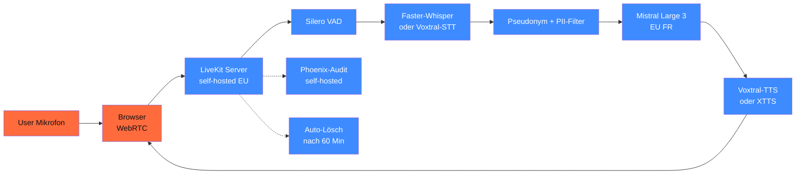

## Worum es geht

> Stop building Realtime-Voice from scratch. — **LiveKit Agents v1.4** ist 2026 der Production-Standard für Voice-Agents: Python/Node, STT-LLM-TTS-Pipeline + MultimodalAgent-Modus, 50+ Inference-Modelle out-of-box.

## Voraussetzungen

- Lektion 06.01 + 06.02 (ASR + TTS)
- Phase 14.05 (LangGraph für Conversation-Memory)

## Konzept

### LiveKit Agents v1.4

URL: <https://github.com/livekit/agents>

- **Aktiv** Stand 04/2026
- Python + Node.js
- STT-LLM-TTS-Pipeline + **MultimodalAgent-Modus**
- 50+ Inference-Modelle out-of-box (Whisper, Voxtral, Mistral, Deepgram, Cartesia, OpenAI)
- 200+ via Plugins

```python
from livekit import agents
from livekit.plugins import openai, deepgram, mistral

async def voice_agent(ctx: agents.JobContext):
    # STT-LLM-TTS-Pipeline
    agent = agents.VoicePipelineAgent(
        vad=agents.SileroVAD.load(),
        stt=deepgram.STT(model="nova-3", language="de"),
        llm=mistral.LLM(model="mistral-large-3"),
        tts=mistral.TTS(model="voxtral-tts-4b", language="de"),
    )
    agent.start(ctx.room)
```

### OpenAI gpt-realtime (GA seit 08/2025)

URL: <https://openai.com/index/introducing-gpt-realtime/>

- Audio-In: **$ 32 / 1M Tokens** (cached $ 0,40)
- Audio-Out: **$ 64 / 1M Tokens**
- ~ 20 % günstiger als gpt-4o-realtime-preview
- Speech-to-Speech in einem Call (kein STT + LLM + TTS getrennt)

> **Wann gpt-realtime statt LiveKit-Pipeline**: bei reinen 1-zu-1-Voice-Conversations, wenn US-Cloud + AVV ok ist. Bei DSGVO-strict: lokaler LiveKit-Stack mit Voxtral.

### Deepgram Nova-3 + AssemblyAI Universal-3

URLs: <https://deepgram.com/learn/best-speech-to-text-apis-2026>

- **Deepgram Nova-3**: Realtime Code-Switching über 10 Sprachen inkl. DE
- **AssemblyAI Universal-3 Pro**: 6 Realtime-Sprachen inkl. DE
- Konkurrierende WER-Claims (5,65 % vs. 14,9 %) — **eigener DE-Test ist Pflicht**, Marketing-Werte streuen

### DSGVO-konforme Realtime-Pipeline (DACH-Mittelstand)



### Latenz-Budget

Voice-Agents brauchen Sub-Sekunden-Latenz (sonst „talkt" der User über den Bot). Realistisches Budget:

| Komponente | Latenz |
|---|---|
| WebRTC-RTT | 30–100 ms |
| VAD (Silero) | 10–30 ms |
| **STT** (Faster-Whisper-Turbo) | 200–500 ms |
| LLM (Mistral Large 3 streaming) | 300–800 ms TTFT |
| **TTS** (Voxtral-TTS) | 90 ms TTFA |
| **Total p50** | **~ 1.000–1.500 ms** |

> Für `< 500 ms` Total: gpt-realtime (US) oder Cartesia Sonic 2 als TTS. Für `< 1.500 ms` mit DSGVO-strict: lokaler LiveKit-Stack.

### Anti-Pattern: Cloud-Roundtrip pro Wort

Vermeiden:

- ❌ Audio → US-API → Audio (Latenz + Drittland-Transfer)
- ❌ STT in Cloud → LLM in Cloud → TTS in Cloud (3× Roundtrip)

Stattdessen:

- ✅ Audio → EU-LiveKit-Server → lokales Whisper + Mistral + Voxtral → Audio
- ✅ Multi-modal-API (gpt-realtime) wenn US ok mit AVV

### Audit-Pattern für Voice-Agents

```python
def voice_audit(session_id: str, transkript_hash: str, antwort_hash: str):
    """Pflicht-Audit pro Voice-Turn."""
    logger.info("voice_turn", extra={
        "session_id": session_id,
        "user_pseudonym": session_pseudonym(session_id),
        "transkript_hash": transkript_hash,  # niemals Klartext-Audio im Log!
        "antwort_hash": antwort_hash,
        "tts_modell": "voxtral-tts-4b",
        "ts": datetime.now(UTC).isoformat(),
    })
```

### Auto-Lösch-Pattern (DSGVO Art. 5 lit. e)

```python
import asyncio
from datetime import timedelta

VOICE_RETENTION = timedelta(minutes=60)  # Audio max. 60 Min
TRANSCRIPT_RETENTION = timedelta(days=7)  # Transkripte max. 7 Tage
AUDIT_RETENTION = timedelta(days=180)     # Audit-Log min. 6 Monate (AI-Act Art. 12)


async def auto_loesch_pipeline(session_id: str):
    """Multi-Stage-Lösch."""
    await asyncio.sleep(VOICE_RETENTION.total_seconds())
    await delete_audio_files(session_id)

    await asyncio.sleep(TRANSCRIPT_RETENTION.total_seconds() - VOICE_RETENTION.total_seconds())
    await delete_transcripts(session_id)

    # Audit-Log bleibt 180 Tage (Pflicht für Hochrisiko)
    log_audit("voice_session_deleted_partial", session_id)
```

## Hands-on

1. LiveKit Server self-hosted aufsetzen (Docker-Compose)
2. Voice-Pipeline-Agent mit Faster-Whisper + Mistral + Voxtral-TTS
3. Browser-Client testen (WebRTC + LiveKit Web SDK)
4. Latenz-Budget messen (Mikrofon → Lautsprecher)
5. Auto-Lösch-Pipeline implementieren

## Selbstcheck

- [ ] Du nutzt LiveKit Agents v1.4 für Voice-Pipeline.
- [ ] Du verstehst Latenz-Budget (Voice-Agents brauchen < 1.500 ms).
- [ ] Du implementierst DSGVO-konforme Pipeline mit lokalem Whisper + Mistral.
- [ ] Du loggst Audit-Events ohne Klartext-Audio.
- [ ] Du planst 3-Stufen-Auto-Lösch (Audio / Transkript / Audit).

## Compliance-Anker

- **DSGVO Art. 9**: Voice = biometrisch
- **DSGVO Art. 25**: Pipeline by Design
- **DSGVO Art. 5 lit. e**: Auto-Lösch-Stufen
- **AI-Act Art. 50**: Bot-Hinweis im UI Pflicht
- **AI-Act Art. 50.2** (ab 02.08.2026): Audio-Watermark pflicht

## Quellen

- LiveKit Agents — <https://github.com/livekit/agents>
- OpenAI gpt-realtime — <https://openai.com/index/introducing-gpt-realtime/>
- OpenAI Pricing — <https://developers.openai.com/api/docs/pricing>
- Deepgram Nova-3 — <https://deepgram.com/learn/best-speech-to-text-apis-2026>
- LiveKit Self-Hosting — <https://docs.livekit.io/realtime/self-hosting/>

## Weiterführend

→ Lektion **06.05** (DSGVO + EU-Hosting für Voice — Detail)
→ Capstone **19.E** (Mehrsprachiger Voice-Agent als Vollausbau)
→ Phase **17.05** (Docker-Compose-Stack für LiveKit)
