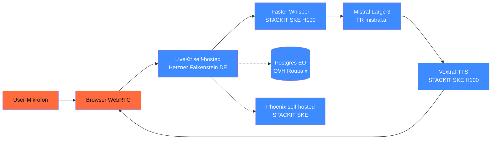

## Worum es geht

> Stop sending Mandanten-Audio to US-Cloud. — Voice-Daten sind DSGVO Art. 9 (biometrisch) → höhere Hürde für Drittland-Transfer. EU-Hosting für ASR + TTS ist 2026 Pflicht-Pattern.

## Voraussetzungen

- Lektion 06.04 (LiveKit + Realtime)
- Phase 17.04 (EU-Cloud-Stack-Übersicht)

## Konzept

### EU-Hosting-Optionen für Audio

| Option | Voice-konform | Pricing | Bemerkung |
|---|---|---|---|
| **Self-Hosted Whisper auf eigener Hardware** | ✅ ideal | nur Strom | RTX 4090 reicht für Faster-Whisper |
| **Self-Hosted auf Scaleway H100** | ✅ ideal | € 2,73/h | Phase 17.04 |
| **Self-Hosted auf OVH H100** | ✅ ideal | (Listenpreis prüfen) | gute SecNumCloud-Trajektorie |
| **Self-Hosted auf STACKIT SKE** | ✅ ideal | über GPU-Operator | BSI C5 Type 2 |
| **AWS Bedrock Whisper** in eu-central-1 (Frankfurt) | ⚠️ mit AVV | ~ $ 0,006/Min | DPA + EU-Region |
| **OpenAI Whisper API** | ⚠️ Drittland | ~ $ 0,006/Min | nur mit AVV + SCC |
| **OpenAI gpt-realtime** | ⚠️ Drittland | $ 32/64 / 1M Tokens | für DSGVO-strict ungeeignet |
| **DeepL Pro** (Übersetzung) | ✅ EU-DE-Server | € 5/$ 5 / 1M chars | Standard für DACH |

### Pattern: 100 % EU-Stack für Voice



Alle Komponenten in EU/DE — **kein Drittland-Transfer**. AVV mit Mistral + Hostern.

### AI-Act Art. 50.2 — Watermark-Pflicht ab 02.08.2026

URL: <https://artificialintelligenceact.eu/article/50/>

Stand 04/2026: Art. 50.2 schreibt vor, dass **KI-erstellte Audio-Outputs** maschinenlesbar als KI-Output markiert sein müssen.

**Implementations-Optionen** (Stand 04/2026):

1. **C2PA-Manifest** (Coalition for Content Provenance and Authenticity) — Standard
2. **Unsichtbares Audio-Watermark** (z. B. Resemble Detect, AudioSeal von Meta)
3. **Mehrschicht** (C2PA + Watermark + Fingerprinting) — empfohlen für Hochrisiko

```python
from audioseal import AudioSeal


def add_watermark(audio_array, sample_rate=24000):
    """Meta AudioSeal als unsichtbares Watermark."""
    detector = AudioSeal.load_detector("audioseal_detector")
    generator = AudioSeal.load_generator("audioseal_wm_16bits")

    msg = "ai-generated"  # 16-Bit-Message
    audio_marked = generator.encode(audio_array, msg, sample_rate)
    return audio_marked


# Im Detect-Pfad: Watermark verifizieren
def is_ai_generated(audio_array, sample_rate=24000) -> bool:
    detector = AudioSeal.load_detector("audioseal_detector")
    result = detector.detect_watermark(audio_array, sample_rate)
    return result.detected
```

> Stand 04/2026: AudioSeal (Meta) ist Open-Source + frei nutzbar. C2PA-Code-of-Practice ist im 2. Entwurf (März 2026), Finalisierung Juni 2026.

### DSGVO-Pflicht-Checkliste für Voice

- [ ] **Einwilligung** explizit nach Art. 9 (besondere Kategorie)
- [ ] **Server-Standort EU** mit AVV pro Komponente
- [ ] **Audio-Auto-Lösch** nach max. 60 Min
- [ ] **Transkript-Auto-Lösch** nach max. 7 Tagen
- [ ] **Audit-Log** mit Hashes statt Klartext (mind. 6 Monate)
- [ ] **AI-Act-Watermark** auf KI-erstellten TTS-Outputs
- [ ] **Disclaimer im UI**: „Du sprichst mit einer KI"
- [ ] **Voice-Cloning-Einwilligung** für Reference-Speaker

### Cost-Realität für DACH-Mittelstand-Voice-Agent

Bei 100 Bürger-Anfragen/Tag, je 5 Min Konversation:

| Komponente | Aufwand pro Tag | Cost |
|---|---|---|
| LiveKit-Server (Hetzner CX-32) | dauerlaufend | ~ € 0,40 |
| Faster-Whisper (STACKIT SKE H100, on-demand) | ~ 4 GPU-h | ~ € 11 |
| Mistral Large 3 (~ 5 M Tokens) | ~ € 25–35 | |
| Voxtral-TTS (STACKIT, on-demand) | ~ 2 GPU-h | ~ € 5,50 |
| Postgres + Phoenix | ~ € 1 | |
| **Total** | **~ € 43–53/Tag** | **~ € 1.300–1.600/Monat** |

> Vergleich gpt-realtime: bei 500 Min Audio/Tag ~ $ 100–200/Tag (statt ~ € 50). EU-Stack ist günstiger UND DSGVO-konform — bei höherem Setup-Aufwand.

### Setup-Aufwand-Realität

EU-Self-Hosting hat hohe Initial-Kosten:

| Komponente | Setup-Aufwand |
|---|---|
| LiveKit-Self-Hosting | 4–8 h (Docker-Compose) |
| Faster-Whisper auf STACKIT | 4–8 h (Helm-Chart) |
| Voxtral-TTS auf STACKIT | 4–8 h (eigenes Helm-Chart, da nicht offiziell) |
| Phoenix-Tracing | 2–4 h |
| Auto-Lösch-Pipeline | 4–8 h |
| **Total Setup** | **~ 20–40 h Engineering** |

Lohnt sich ab ~ 50 Anfragen/Tag oder bei expliziter DSGVO-strict-Anforderung.

## Hands-on

1. EU-Hosting-Stack-Selector (Phase 17.04 Notebook) für Voice-Profil anwenden
2. AudioSeal-Watermark in lokalem TTS-Output einbauen + verifizieren
3. AI-Act-Disclaimer-Text fürs UI formulieren
4. Auto-Lösch-Pipeline-Test: 1 Min Audio + auto-delete nach Test-Trigger
5. Cost-Schätzung für deinen Use-Case

## Selbstcheck

- [ ] Du nennst die EU-Hosting-Optionen für Voice + ihre Trade-offs.
- [ ] Du planst AI-Act-Watermark-Pipeline (AudioSeal o. Ä.).
- [ ] Du erfüllst die DSGVO-Pflicht-Checkliste.
- [ ] Du schätzt Setup-Aufwand vs. Cost-Ersparnis realistisch.

## Compliance-Anker

- **AI-Act Art. 50.2**: KI-Audio-Watermark Pflicht ab 02.08.2026
- **DSGVO Art. 44**: kein Drittland-Transfer für Voice-Daten
- **DSGVO Art. 9**: biometrische Daten = besondere Kategorie

## Quellen

- AudioSeal (Meta) — <https://github.com/facebookresearch/audioseal>
- C2PA — <https://c2pa.org/>
- AI-Act Art. 50 — <https://artificialintelligenceact.eu/article/50/>
- LiveKit Self-Hosting — <https://docs.livekit.io/realtime/self-hosting/>
- STACKIT SKE GPU — <https://docs.stackit.cloud/products/runtime/kubernetes-engine/how-tos/use-nvidia-gpus/>
- Scaleway H100 — <https://www.scaleway.com/en/h100/>

## Weiterführend

→ Lektion **06.06** (Hands-on: Voice-Agent Stack mit allen 4 Komponenten)
→ Capstone **19.C** (Charity-Bot mit Voice)
→ Capstone **19.E** (Mehrsprachiger Voice-Agent)
