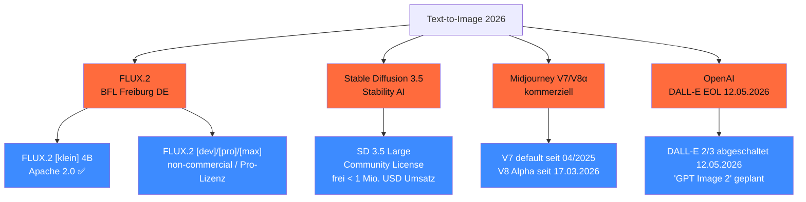

<!-- colab-badge:begin -->
[](https://colab.research.google.com/github/s-a-s-k-i-a/ki-engineering-werkstatt/blob/main/dist-notebooks/phasen/08-generative-modelle/code/01_generative_selektor.ipynb)
<!-- colab-badge:end -->

## Worum es geht

> Stop using SD 1.5 in 2026. — Black Forest Labs (Freiburg, DE) hat mit **FLUX.2 [klein] 4B unter Apache 2.0** den DACH-Champion. SD 3.5 Large bleibt für < 1 Mio. USD Umsatz frei. DALL-E wird **am 12.05.2026 abgeschaltet**.

## Voraussetzungen

- Phase 11.05 (Anbieter-Vergleich)

## Konzept

### Vier T2I-Familien (Stand 04/2026)



### FLUX.2 (Black Forest Labs, DACH-Champion!)

URLs:

- Blog: <https://bfl.ai/blog/flux-2>
- Pricing: <https://bfl.ai/pricing>
- Licensing: <https://bfl.ai/licensing>

**BFL ist in Freiburg ansässig** — der einzige produktive DE-T2I-Anbieter Stand 2026.

| Variante | Lizenz | Pricing API | Wann |
|---|---|---|---|
| **FLUX.2 [klein] 4B** | **Apache 2.0** ✅ | — (Open Weights) | DACH-Default für volle kommerzielle Freiheit |
| FLUX.2 [dev] | non-commercial | nur via API | Forschung |
| FLUX.2 [pro] | proprietär | $ 0,03 / Bild | Production |
| FLUX.2 [max] | proprietär | $ 0,07 / MP-Output | Premium |

> **2026 SOTA Open-Weights**: FLUX.2 [klein] 4B unter Apache 2.0. **Volle kommerzielle Freiheit**, läuft auf RTX 4090.

### Stable Diffusion 3.5

URL: <https://huggingface.co/stabilityai/stable-diffusion-3.5-large>

- **Stability Community License**: kommerziell frei **bis 1 Mio. USD Jahresumsatz**
- Output gehört dem Nutzer
- SD 4 nicht öffentlich angekündigt
- Wann: KMU mit < 1 Mio. USD oder Forschung

### Midjourney V7 / V8 Alpha

URL: <https://updates.midjourney.com/v7-alpha/>

- V7 default seit April 2025
- **V8 Alpha seit 17.03.2026** in Preview (nur Fast-Mode)
- Kommerziell, nicht Open-Weights

### DALL-E EOL 12.05.2026

URL: <https://community.openai.com/t/deprecation-reminder-dall-e-will-be-shut-down-on-may-12-2026/1378754>

- DALL-E 2 + 3 werden **am 12.05.2026 abgeschaltet**
- „GPT Image 2" geplant (Q2/2026)
- DALL-E 4 existiert **nicht**

### Speed-Modelle 2026

| Modell | Steps | Wann |
|---|---|---|
| **Z-Image Turbo** (Alibaba) | 4–8 | aktuelle Speed-Spitze |
| **SDXL Lightning** | 4–8 | bewährt |
| SDXL Turbo | 1–2 | überholt, Forschung |

### FLUX.2 [klein] lokal nutzen

```python
# Via Diffusers HF
from diffusers import FluxPipeline
import torch

pipe = FluxPipeline.from_pretrained(
    "black-forest-labs/FLUX.2-klein",
    torch_dtype=torch.bfloat16,
).to("cuda")

bild = pipe(
    "Eine Brezel mit Senf auf einem Holzteller, fotorealistisch",
    height=1024,
    width=1024,
    num_inference_steps=28,
    guidance_scale=4.5,
).images[0]
bild.save("brezel.png")
```

> Stand 04/2026: FLUX.2 [klein] passt mit FP8-Quantisierung auf RTX 4090 (24 GB) für 1024² Auflösung.

### Lizenz-Realität (kommerzielle Use-Cases)

| Modell | Output gehört Nutzer? | Volle kommerzielle Freiheit? |
|---|---|---|
| FLUX.2 [klein] | **ja** | **ja** (Apache 2.0) |
| FLUX.2 [dev] | ja | nein (non-commercial) |
| FLUX.2 [pro] / [max] | ja, mit BFL-Lizenz | ja (mit Pro-Subscription) |
| SD 3.5 Large | **ja** | nur < 1 Mio. USD Umsatz |
| Midjourney V7+ | ja, mit Subscription | ja |
| FLUX.1-schnell (Vorgänger) | ja | ja (Apache 2.0) |

> **Pflicht für DACH-Production**: Lizenz pro Modell prüfen. FLUX.2 [klein] ist 2026 die sauberste Wahl für Open-Weights + Apache 2.0.

### AI-Act Art. 50.2 — Image-Watermark-Pflicht

URL: <https://artificialintelligenceact.eu/article/50/>

Stand 04/2026 (voll wirksam ab 02.08.2026):

- **KI-erstellte Bilder müssen maschinenlesbar markiert sein**
- Implementations: **C2PA-Manifest** + **unsichtbares Watermark** (Stable Signature, AudioSeal-Image-Variante)
- Code of Practice (2. Entwurf März 2026, Finalisierung Juni 2026): **Mehrschicht-Pflicht**

### § 201b StGB-Entwurf (Deepfakes)

Stand 04/2026: **Bundestags-Entwurf** gegen täuschende Deepfakes:

- Bis 2 Jahre Haft bei Standard-Verstoß
- Bis 5 Jahre bei schweren Fällen
- Hängt im Bundestag — Verabschiedung Q2/Q3 2026 erwartet

> Bei Face-Generation-Use-Cases: Deepfake-Disclaimer + Watermark **proaktiv** einbauen, nicht erst nach Inkrafttreten.

## Hands-on

1. FLUX.2 [klein] auf RTX 4090 lokal mit Diffusers
2. 5 dt. Test-Prompts (Brezel, Eichhörnchen-Beratung, Bürger-Service-Pikto)
3. Lizenz-Vergleich: FLUX.2 [klein] vs. SD 3.5 vs. Midjourney
4. C2PA-Manifest-Test mit `c2patool` (Adobe)
5. Stable Signature für unsichtbares Watermark einbauen

## Selbstcheck

- [ ] Du nennst FLUX.2-Varianten + Lizenzen.
- [ ] Du nutzt FLUX.2 [klein] für DACH-Production-Default.
- [ ] Du verstehst SD 3.5 Community License (< 1 Mio. USD).
- [ ] Du kennst die DALL-E-EOL am 12.05.2026.
- [ ] Du planst AI-Act-Watermark-Pflicht ab 02.08.2026.

## Compliance-Anker

- **AI-Act Art. 50.2**: KI-Bild-Watermark-Pflicht
- **§ 201b StGB-Entwurf**: Deepfake-Strafbarkeit
- **UrhG § 44b** (TDM-Schranke): Trainings-Daten-Lizenz

## Quellen

- BFL Blog FLUX.2 — <https://bfl.ai/blog/flux-2>
- BFL Pricing — <https://bfl.ai/pricing>
- BFL Licensing — <https://bfl.ai/licensing>
- SD 3.5 Large — <https://huggingface.co/stabilityai/stable-diffusion-3.5-large>
- Midjourney V7 — <https://updates.midjourney.com/v7-alpha/>
- DALL-E EOL — <https://community.openai.com/t/deprecation-reminder-dall-e-will-be-shut-down-on-may-12-2026/1378754>
- AI-Act Art. 50 — <https://artificialintelligenceact.eu/article/50/>
- C2PA — <https://c2pa.org/>

## Weiterführend

→ Lektion **08.02** (Text-to-Video — Sora 2, Veo 3.1, LTX-2.3)
→ Lektion **08.05** (3D-Generation + EU-Lizenz-Fallen)
→ Lektion **08.07** (UrhG + AI-Act-Watermark im Detail)
