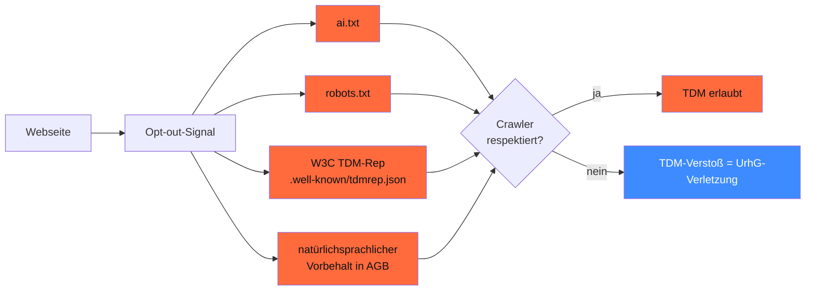
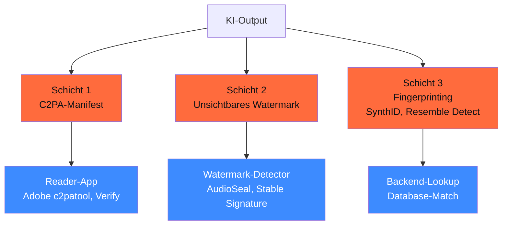

## Worum es geht

> Stop training on web-scraped data without checking opt-outs. — UrhG § 44b erlaubt TDM (Text and Data Mining) **nur ohne maschinenlesbares Opt-out**. AI-Act Art. 50.2 ab 02.08.2026 macht Watermark + C2PA **Pflicht** für KI-erstellte Inhalte.

## Voraussetzungen

- Lektionen 08.01–08.03 (T2I, T2V, Audio + 3D)

## Konzept

### UrhG § 44b — TDM-Schranke

URL: <https://www.juraforum.de/gesetze/urhg/44b-text-und-data-mining>

§ 44b UrhG erlaubt **kommerzielles Text-and-Data-Mining (TDM)** — wenn:

- Vervielfältigung **nur zum Zweck des TDM** + Löschung danach
- **Kein maschinenlesbares Opt-out** des Rechte-Inhabers

### Opt-out-Standards (Stand 04/2026)



#### `ai.txt` (DACH-Standard)

```text
# /ai.txt
User-agent: *
Disallow: /

# Erlaubt für nicht-kommerzielle Forschung
User-agent: archive.org
Allow: /
```

#### `robots.txt`-Erweiterung

```text
# /robots.txt
User-agent: GPTBot
Disallow: /

User-agent: Google-Extended
Disallow: /

User-agent: ClaudeBot
Disallow: /

User-agent: anthropic-ai
Disallow: /

User-agent: CCBot
Disallow: /
```

#### W3C TDM-Reservation Protocol

```json
// /.well-known/tdmrep.json
{
  "tdm-reservation": 1,
  "tdm-policy": "https://example.de/tdm-policy"
}
```

> **Stand 04/2026**: LG-Urteile aus 2024/25 zeigen — auch **natürlichsprachlicher Vorbehalt in AGB** kann genügen, um TDM zu untersagen. Konservativ: alle drei Standards parallel setzen.

### `werkzeuge/ai_txt_generator.py` (Phase 20)

Phase 20.06 hat ein CLI-Tool: `ki-ai-txt --domain example.de` generiert ai.txt + robots.txt + tdmrep.json gemäß DACH-Best-Practice.

### AI-Act Art. 50.2 — Watermark-Pflicht (ab 02.08.2026)

URL: <https://artificialintelligenceact.eu/article/50/>

**Pflicht** für alle generativen KI-Outputs (Bild, Video, Audio, Text):

> „Anbieter von KI-Systemen, einschließlich GPAI-Systemen, die synthetische Audio-, Bild-, Video- oder Textinhalte erzeugen, stellen sicher, dass die Ausgaben des KI-Systems in einem maschinenlesbaren Format gekennzeichnet und als künstlich erzeugt oder manipuliert erkennbar sind."

#### Drei Schichten (empfohlene Mehrschicht-Implementierung)



#### Code of Practice (EU AI Office)

URL: <https://digital-strategy.ec.europa.eu/en/policies/code-practice-ai-generated-content>

- **2. Entwurf März 2026**, **Finalisierung Juni 2026**
- Empfiehlt **Mehrschicht-Pflicht**: C2PA + Watermark + Fingerprinting
- Bei reinem Text alternativ Provenance Certificates

### § 201b StGB-Entwurf — Deepfake-Strafbarkeit

URL: <https://www.dorothe-lanc.de/kennzeichnungspflicht-fuer-deepfakes-ab-august-2026/>

Stand 04/2026: **Bundestags-Entwurf hängt** — Verabschiedung Q2/Q3/2026 erwartet.

- Bis **2 Jahre Haft** bei Standard-Verstoß
- Bis **5 Jahre Haft** in schweren Fällen (Diskriminierung, Verleumdung)
- Pflicht-Kennzeichnung für Deepfakes mit erkennbaren Personen

### Output-Lizenzen — der Marketing-Mythos

**Mythos**: „Bilder von SD 3.5 / FLUX.2 gehören mir."

**Realität**:

| Modell | Output-Lizenz | Fallstricke |
|---|---|---|
| **SD 3.5 Large** | Output gehört Nutzer | Community License: < 1 Mio. USD Umsatz |
| **FLUX.2 [klein]** | Output gehört Nutzer | Apache 2.0 = volle Freiheit |
| **FLUX.2 [pro] / [max]** | Output gehört Nutzer (mit BFL-Subscription) | Subscription erforderlich |
| **Midjourney V7+** | Output gehört Nutzer | Subscription + ToS-Compliance |
| **DALL-E** | EOL 12.05.2026 | — |

### Markenrecht + KI-Generation

KI-Generation = **kein Freibrief** für Markenrecht-Verstöße:

```text
Prompt: „Apple-Store-Schaufenster im Stil von Steve Jobs"
→ Output kann gegen Apple-Markenrecht (Art. 14 MarkenG) + Persönlichkeitsrecht verstoßen.
```

Pflicht-Pattern: bei kommerziellem Einsatz von KI-Generationen Markenrecht-Audit (separat von KI-Lizenz).

### DSGVO Art. 22 + Generative KI

Nicht direkt einschlägig (Generation ist keine „Entscheidung über Personen"), aber:

- Bei **Persönlichkeits-Bildern**: Einwilligung (Art. 9 + KUG)
- Bei **automatisierten Inhalts-Empfehlungen**: Art. 22 prüfen
- Bei **biometrischer Erkennung in Outputs**: Art. 9 + AI-Act Art. 5

## Hands-on

1. `ki-ai-txt --domain example.de` ausführen (Phase 20.06)
2. C2PA-Manifest in FLUX.2-Output einbetten mit `c2patool`
3. AudioSeal-Watermark in MusicGen-Output testen
4. Stable Signature für unsichtbares Bild-Watermark
5. § 201b-StGB-Entwurf-Status checken (Bundestags-Webseite)

## Selbstcheck

- [ ] Du implementierst ai.txt + robots.txt + tdmrep.json parallel.
- [ ] Du planst Mehrschicht-Watermark (C2PA + unsichtbar + Fingerprint).
- [ ] Du kennst Output-Lizenzen + Marken-Fallstricke.
- [ ] Du wartest auf § 201b StGB-Verabschiedung.
- [ ] Du nutzt Phase 20.06 `ki-ai-txt`-Tool.

## Compliance-Anker

- **UrhG § 44b**: TDM-Opt-out-Standards
- **AI-Act Art. 50.2**: Watermark-Pflicht ab 02.08.2026
- **§ 201b StGB-Entwurf**: Deepfake-Strafbarkeit
- **KUG Art. 22**: Persönlichkeitsrecht

## Quellen

- UrhG § 44b — <https://www.juraforum.de/gesetze/urhg/44b-text-und-data-mining>
- AI-Act Art. 50 — <https://artificialintelligenceact.eu/article/50/>
- C2PA — <https://c2pa.org/>
- EU AI Office Code of Practice — <https://digital-strategy.ec.europa.eu/en/policies/code-practice-ai-generated-content>
- W3C TDM-Rep — <https://www.w3.org/community/tdmrep/>
- § 201b-StGB-Status — <https://www.dorothe-lanc.de/kennzeichnungspflicht-fuer-deepfakes-ab-august-2026/>

## Weiterführend

→ Phase **20.06** (`ai.txt`-Generator-Werkzeug)
→ Lektion **08.05** (Hands-on: Multi-Layer-Watermark-Pipeline)
