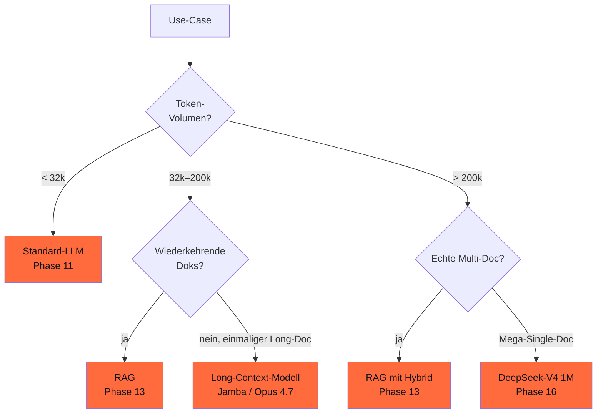

## Worum es geht

> Stop trusting context-length-claims without eval. — viele Modelle behaupten 1M-Context, halluzinieren aber ab 50k. Stand 04/2026 sind **Needle-in-a-Haystack** + **RULER** die Pflicht-Evals für jedes Long-Context-Modell.

## Voraussetzungen

- Lektion 09.02 (Hybride)

## Konzept

### Drei Long-Context-Eval-Methoden

| Methode | Was misst sie | Stand 04/2026 |
|---|---|---|
| **Needle-in-a-Haystack (NIAH)** | findet Modell ein einzelnes Fakt im langen Kontext? | Standard, leicht zu cracken |
| **RULER** | erweitert NIAH: Multi-Needle, Multi-Hop, Aggregation | aussagekräftiger |
| **ZeroSCROLLS** | Long-Document-QA, Summarization | Real-World-näher |
| **LongBench v2** | breite Long-Context-Tasks | aktuell |

### Needle-in-a-Haystack

URL: <https://github.com/gkamradt/LLMTest_NeedleInAHaystack>

```python
# Pattern: einzelnes Fakt im Long-Doc verstecken, danach abfragen
context_länge = 200_000  # 200k Tokens
needle = "Die geheime Zahl ist 4711."
position = context_länge // 2  # in der Mitte verstecken

context = generate_filler(context_länge - len(needle))
context_mit_needle = context[:position] + needle + context[position:]

prompt = f"{context_mit_needle}\n\nWas ist die geheime Zahl?"
# Modell soll '4711' antworten
```

### RULER (Hsieh et al. 2024)

URL: <https://github.com/hsiehjackson/RULER>

13 Tasks die NIAH erweitern:

- Multi-Needle (3 Fakten verstecken, alle abfragen)
- Variable Tracking (Variable-Wert über mehrere Stellen ändern)
- Common Words Extraction
- Aggregation (zähle alle Vorkommen von X)
- Question-Answering basierend auf Long-Doc

> RULER zeigt: **viele Modelle haben "effektive" Context-Länge < behauptete**. Z. B. behauptet Llama 3.3 128k, RULER zeigt ~ 32k effektiv.

### Effektive Context-Länge nach RULER (Stand 04/2026)

| Modell | Behauptet | Effektiv (RULER) |
|---|---|---|
| Llama 3.3 70B | 128k | ~ 32k |
| Mistral Large 3 | 128k | ~ 64k |
| Claude Opus 4.7 | 200k+ | ~ 200k (real) |
| GPT-5.5 | 256k | ~ 200k |
| **DeepSeek-V4** | **1M** | ~ 500k–800k (Stand prüfen) |
| **Jamba 1.5 Large** | **256k** | ~ 200k |
| Qwen3-VL-235B | 256k | nicht eindeutig belegbar |

> **Realität**: behauptete Context-Länge ist Marketing. RULER-Eval pflichten vor Production-Einsatz.

### Wann Long-Context, wann RAG?



> Faustregel 2026: **RAG schlägt Long-Context** in den meisten Fällen — günstiger, präziser, skaliert besser. Long-Context nur für **einmalige** Long-Doc-Analysen.

### Cost-Realität

Bei 200k-Token-Eingabe:

| Anbieter | Cost pro Call |
|---|---|
| Claude Opus 4.7 | ~ $ 1,00 ($ 5/1M Input) |
| GPT-5.5 | ~ $ 1,00 |
| Jamba 1.5 Large (Self-Hosted H100) | ~ € 0,30 (Compute-Anteil) |
| **RAG mit Standard-Modell** | ~ € 0,01 (Top-5-Retrieval) |

> Long-Context ist ~ **30–100× teurer** als RAG. Use-Case-Wahl pflicht.

### DACH-Use-Cases für Long-Context

| Use-Case | Approach |
|---|---|
| **Vertrag** (200 Seiten, einmalig analysieren) | Long-Context-Modell |
| **Vertrag-Datenbank** (1.000 Verträge, oft abgefragt) | RAG (Phase 13) |
| **Bundestag-Protokolle** (Mega-Multi-Doc) | RAG mit Hybrid-Suche |
| **Lange Audio-Transkripte** (3-h-Meeting) | Mamba-basiert (Phase 06) |
| **Code-Repository** (Whole-Repo-Frage) | Long-Context oder Code-RAG (Phase 19.A) |

### NIAH-Mini-Eval-Skript

```python
import asyncio
from pydantic import BaseModel


class NIAHResult(BaseModel):
    context_länge: int
    needle: str
    needle_position: float  # 0.0–1.0
    found: bool


async def niah_eval(modell, context_länge: int = 100_000) -> list[NIAHResult]:
    """Prüft Recall an 5 Positionen im Context."""
    results = []
    for pos in [0.1, 0.3, 0.5, 0.7, 0.9]:  # 10 % bis 90 %
        needle = f"Die geheime Zahl an Position {int(pos*100)} ist {hash(pos) % 10000}"
        context_mit_needle = inject_needle(generate_filler(context_länge), needle, pos)
        prompt = f"{context_mit_needle}\n\nWelche geheime Zahl wurde genannt?"

        antwort = await modell.run(prompt)
        found = str(hash(pos) % 10000) in antwort.output

        results.append(NIAHResult(
            context_länge=context_länge,
            needle=needle,
            needle_position=pos,
            found=found,
        ))
    return results
```

> Pflicht-Pattern: NIAH bei mind. 3 Context-Längen (32k, 100k, 200k) und 5 Positionen vor Production-Einsatz eines Long-Context-Modells.

## Hands-on

1. NIAH-Skript implementieren + auf Jamba 1.5 Mini laufen lassen
2. Effektive Context-Länge vs. behauptete dokumentieren
3. Cost-Vergleich: 100k-Context-Call vs. RAG-Top-5 (Phase 13)
4. RULER-Subset auf eigener Hardware (falls H100 verfügbar)

## Selbstcheck

- [ ] Du nennst die drei Eval-Methoden (NIAH, RULER, ZeroSCROLLS).
- [ ] Du verstehst „behauptete vs. effektive" Context-Länge.
- [ ] Du wählst Long-Context vs. RAG je nach Use-Case-Profil.
- [ ] Du implementierst NIAH-Mini-Eval.

## Compliance-Anker

- **AI-Act Art. 13**: Cost-Transparenz — Long-Context-Calls oft 30–100× teurer als RAG
- **Eval-Pflicht**: vor Production NIAH/RULER auf Ziel-Modell

## Quellen

- NIAH GitHub — <https://github.com/gkamradt/LLMTest_NeedleInAHaystack>
- RULER (Hsieh et al. 2024) — <https://arxiv.org/abs/2404.06654>
- RULER GitHub — <https://github.com/hsiehjackson/RULER>
- LongBench v2 — <https://github.com/THUDM/LongBench>
- ZeroSCROLLS — <https://github.com/tau-nlp/zero_scrolls>

## Weiterführend

→ Phase **13** (RAG als Alternative zu Long-Context)
→ Phase **16** (DeepSeek-V4 mit 1M-Kontext)
→ Lektion **09.04** (Hands-on Vertrags-Analyse)
