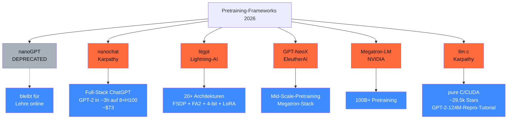

<!-- colab-badge:begin -->
[](https://colab.research.google.com/github/s-a-s-k-i-a/ki-engineering-werkstatt/blob/main/dist-notebooks/phasen/10-llm-von-null/code/01_pretrain_kalkulator.ipynb)
<!-- colab-badge:end -->

## Worum es geht

> Stop using nanoGPT — it's deprecated. — Karpathy hat im Nov 2025 nanoGPT als deprecated markiert. Nachfolger: **nanochat** (Full-Stack ChatGPT-Klon, GPT-2-Grade in ~ 3 h auf 8×H100 für ~ $ 73). Plus: **litgpt** (Lightning-AI), **llm.c** (Karpathy-C-Implementation).

> ⚠️ **Realitäts-Check**: 99 % der DACH-Mittelstand-Use-Cases brauchen kein Pretraining-from-Scratch. Diese Phase ist für **konzeptuelles Verständnis** + Forschung. Für Production: LoRA-Finetune (Phase 12) auf bestehendes Basis-Modell.

## Voraussetzungen

- Phase 12.05 (Trainings-Stack — du kennst Unsloth/axolotl/TRL)
- NVIDIA-GPU mit ≥ 24 GB VRAM (für GPT-2-124M-Repro reicht RTX 4090)

## Konzept

### Vier Frameworks (Stand 04/2026)



### nanoGPT (Karpathy) — DEPRECATED Nov 2025

URL: <https://github.com/karpathy/nanoGPT>

- Status: laut Karpathy-Tweet (Nov 2025) **deprecated**
- Bleibt für Lehre online
- Nachfolger: **nanochat**

### nanochat — der Karpathy-Nachfolger

URL: <https://github.com/karpathy/nanochat>

- **Full-Stack ChatGPT-Klon** in einem Repo (Pretrain + SFT + Inference)
- GPT-2-Grade in **~ 3 h auf 8×H100** für **~ $ 73**
- Ist heute der idiomatische „from-scratch"-Walkthrough
- Direkter Nachfolger zu nanoGPT-Tutorials

```bash
git clone https://github.com/karpathy/nanochat
cd nanochat
# Folgt der README — Pretrain + SFT + Inference in einem Stück
```

### litgpt (Lightning-AI)

URL: <https://github.com/Lightning-AI/litgpt>

- **20+ Architekturen** out-of-the-box
- FSDP, FlashAttention 2, 4-bit, LoRA
- HF-Checkpoint-Konvertierung bidirektional
- Production-reif

```python
# litgpt für Custom-Pretraining
from litgpt import LitGPT, Config

config = Config.from_name("Llama-2-7b-hf")
config.block_size = 2048
modell = LitGPT(config)

# Standard PyTorch Lightning Trainer
trainer = pl.Trainer(devices=8, strategy="fsdp", precision="bf16-mixed")
trainer.fit(modell, train_dataloader)
```

### GPT-NeoX (EleutherAI)

URL: <https://github.com/EleutherAI/gpt-neox>

- Bewährter Megatron-Stack für Mid-Scale-Pretraining
- Wann: produktive Pretraining-Pipelines im Mid-Scale-Bereich (1B–70B)

### Megatron-LM (NVIDIA)

URL: <https://github.com/NVIDIA/Megatron-LM>

- Für 100B+ Modelle
- Wann: nur bei großem Compute-Budget + Forschungs-Anspruch
- Nicht für DACH-Mittelstand-Skalen

### llm.c (Karpathy)

URL: <https://github.com/karpathy/llm.c>

- **Pure C / CUDA**
- ~ 29.500 Stars (Stand 04/2026)
- GPT-2-124M-Repro als Tutorial-Pfad ([Discussion #481](https://github.com/karpathy/llm.c/discussions/481))
- Lehrwert: tiefes Verständnis von Backprop + CUDA

### Compute-Realität für 1.5B mit 50B Tokens

Chinchilla-Faustregel: `FLOPs ≈ 6 × N_params × D_tokens`

```text
FLOPs = 6 × 1.5e9 × 50e9 = 4.5e20 FLOPs
```

H100 SXM: ~ 989 TFLOPs BF16 (nominal), ~ 50 % MFU realistisch:

```text
GPU-Stunden = 4.5e20 / (989e12 × 0.5 × 3600) = ~ 250–280 GPU-Stunden
```

**Auf 1× H100 sequentiell**: ~ 280 h Wall-Clock = ~ 12 Tage.

**Auf 8× H100 parallel**: ~ 32–35 h Wall-Clock.

### Cost-Schätzung (EU-Cloud)

| Anbieter | H100/h | 280 h | 8×H100 (35 h) |
|---|---|---|---|
| **Scaleway** | € 2,73/h | **~ € 760** | ~ € 760 |
| **OVHcloud H100** | (Listenpreis prüfen) | ~ € 700–900 | vergleichbar |
| **IONOS H100** | nicht öffentlich | — | — |
| Lambda Labs (US, kein EU) | $ 2/h | ~ $ 560 | — |

> **Realität**: 1.5B-Pretraining + Tokenizer + Eval-Iterationen kostet realistisch **€ 800–1.500** Compute. Plus Setup-Aufwand: 4–8 Wochen Engineering.

### Kosten-Bandbreite für größere Modelle

Aus Drittanbieter-Schätzungen ([introl.com](https://introl.com/blog/fine-tuning-infrastructure-lora-qlora-peft-scale-guide-2025)):

| Modell-Größe | GPU-Stunden | Cost-Range |
|---|---|---|
| 124M (GPT-2) | ~ 8 h auf 8×H100 | **~ € 30–80** |
| 1.5B / 50B Tokens | ~ 280 h | **~ € 800–1.500** |
| 7B / 200B Tokens | ~ 5.000 h | **~ € 15.000–25.000** |
| 70B / 1T Tokens | ~ 50.000 h | **~ € 150.000–300.000** |

> **Pflicht-Schätzung**: Plant Faktor 2–3 Aufschlag für Eval-Cycles, Restarts, Tokenizer-Iterationen.

### Wann self-pretrain wirklich?

| Use-Case | Self-Pretrain? |
|---|---|
| Standard-DACH-LLM-App | ❌ — Phase 11 + 13 + LoRA-Finetune (Phase 12) reicht |
| Spezielle Domäne (Recht, Medizin) | ❌ — RAG (Phase 13) oder LoRA-Finetune (Phase 12) |
| Sprachunterstützung erweitern | ❌ — Multilingual-Modelle nutzen |
| **Forschungs-Projekt** | ✓ — nanochat oder litgpt |
| **Custom-Tokenizer-Anforderung** | ✓ — wenn Standard-Tokenizer ungeeignet |
| **Proprietäres Architektur-Experiment** | ✓ — research-getrieben |
| **DACH-Sovereignty-Anforderung** | ggf. — ähnlich wie Aleph-Alpha-GermanWeb-Repro |

### DACH-spezifische Tutorials Stand 04/2026

> ⚠️ **Nicht eindeutig belegbar**: keine prominent gepflegten DE-Tutorials für 1.5B-from-Scratch gefunden Stand 04/2026.

Verfügbare Pfade:

- **nanochat-Pipeline** + GermanWeb-Subsample (z. B. 2–5B Tokens) + SentencePiece-DE-BPE → realistisch reproduzierbar in **< € 200** auf Scaleway
- **Aleph-Alpha-GermanWeb-Paper-Repro** (EACL 2026) als seriöse DACH-Referenz
- ML-Kurse an SBB Stuttgart und LMU München (kein öffentlich indexiertes nanoGPT-DE-Walkthrough)

## Hands-on

1. nanochat-Repo klonen + README durchgehen
2. GPT-2-124M-Mini-Pretraining auf TinyShakespeare lokal (RTX 4090) — sollte in < 30 Min fertig sein
3. Compute-Schätzung für deinen Wunsch-Use-Case (1.5B / 7B / etc.)
4. Lizenz + Trainings-Daten-Quellen-Audit (Phase 12.03)

## Selbstcheck

- [ ] Du nennst die vier produktiven Frameworks 2026.
- [ ] Du verstehst, dass nanoGPT deprecated ist.
- [ ] Du schätzt Compute-Cost mit Chinchilla-Formel.
- [ ] Du erkennst, dass 99 % der Use-Cases **kein** Pretrain brauchen.
- [ ] Du wählst Framework je nach Skala (nanochat / litgpt / Megatron).

## Compliance-Anker

- **AI-Act Art. 10**: Trainings-Daten dokumentiert + lizenziert
- **UrhG § 44b**: nur TDM-Opt-out-respektierte Daten verwenden

## Quellen

- nanoGPT (deprecated) — <https://github.com/karpathy/nanoGPT>
- nanochat (Karpathy) — <https://github.com/karpathy/nanochat>
- litgpt (Lightning-AI) — <https://github.com/Lightning-AI/litgpt>
- GPT-NeoX (EleutherAI) — <https://github.com/EleutherAI/gpt-neox>
- Megatron-LM (NVIDIA) — <https://github.com/NVIDIA/Megatron-LM>
- llm.c (Karpathy) — <https://github.com/karpathy/llm.c>
- Compute-Cost-Guide — <https://introl.com/blog/fine-tuning-infrastructure-lora-qlora-peft-scale-guide-2025>

## Weiterführend

→ Lektion **10.02** (Tokenizer-Training: SentencePiece + HF tokenizers)
→ Lektion **10.03** (DE-Pretraining-Daten — Aleph-Alpha-GermanWeb)
→ Phase **12.05** (LoRA-Finetune statt Self-Pretrain)
