## Worum es geht

> Stop using random Web-Crawls. — drei produktive DE-Pretraining-Korpora 2026: **Aleph-Alpha-GermanWeb (628 Mrd. Wörter)**, **FineWeb-2** (HF, multilingual), **OSCAR-2301** (151 Sprachen). Lizenz-Detail entscheidet über kommerzielle Nutzbarkeit.

## Voraussetzungen

- Lektion 10.02 (Tokenizer-Training)

## Konzept

### Drei DE-Korpora

| Korpus | Größe | Lizenz | Quelle |
|---|---|---|---|
| **Aleph-Alpha-GermanWeb** | 628 Mrd. Wörter | open-aleph-license | 78B CC + 235B FineWeb2 + 329B synthetisch |
| **FineWeb-2** (HF) | 1000+ Sprachen | ODC-By 1.0 | Common Crawl 2024–2025 |
| **OSCAR-2301** | 151 Sprachen | community | CC Nov/Dez 2022 |
| FineWeb-Edu | 1.3T Tokens | ODC-By 1.0 | EN-only ⚠️ |
| mC4 (Google) | multilingual C4 | community | Common Crawl |
| Common Crawl DE-Subset | sehr groß | CC0 / community | direkt CC |

### Aleph-Alpha-GermanWeb — der DACH-Standard 2026

URLs:

- Paper: <https://arxiv.org/abs/2505.00022>
- HF: <https://huggingface.co/datasets/Aleph-Alpha/Aleph-Alpha-GermanWeb>

- **628 Mrd. Wörter** = 78B CommonCrawl + 235B FineWeb2-DE + 329B synthetisch
- **EACL 2026**-publiziert
- Lizenz: **open-aleph-license** — OSI-konform laut Paper
- Auf HF öffentlich verfügbar

> **Wichtig**: open-aleph-license ist **keine Standard-Apache 2.0** — Detail prüfen vor kommerzieller Nutzung. Stand 04/2026 für **Forschung + DACH-Pretraining-Repro** klar erlaubt; für reine kommerzielle Pretrainings das Aleph-Alpha-Tech-Team konsultieren.

### FineWeb-2 (HF)

URL: <https://huggingface.co/datasets/HuggingFaceFW/fineweb-2>

- 1.000+ Sprachen
- DE-Subset gut validiert
- **ODC-By 1.0** = volle kommerzielle Freiheit (Attribution-Pflicht)
- Stand 04/2026: state-of-the-art Multilingual-Filter

> **Empfehlung 2026** für rein kommerzielles DE-Pretrain: **FineWeb-2 DE-Subset**.

### OSCAR-2301 (Jan 2023)

URL: <https://huggingface.co/datasets/oscar-corpus/OSCAR-2301>

- Common Crawl Nov/Dez 2022
- 151 Sprachen
- Community-Lizenz (variiert pro Sprache)
- DE-Subkorpus: solid, aber Qualität < FineWeb-2 / GermanWeb

### TDM-Opt-out-Disziplin (UrhG § 44b)

**Wichtig**: bei eigenem Web-Crawl + Pretraining musst du Opt-out-Signale respektieren:

```python
import requests
from urllib.parse import urlparse


def respektiert_opt_out(url: str) -> bool:
    """Pflicht-Check vor Crawl."""
    domain = urlparse(url).netloc

    # Schicht 1: ai.txt
    try:
        ai_txt = requests.get(f"https://{domain}/ai.txt", timeout=5)
        if "User-agent: *" in ai_txt.text and "Disallow: /" in ai_txt.text:
            return False
    except Exception:
        pass

    # Schicht 2: robots.txt
    try:
        robots = requests.get(f"https://{domain}/robots.txt", timeout=5)
        for blocker in ["GPTBot", "ClaudeBot", "Google-Extended", "CCBot", "anthropic-ai"]:
            if f"User-agent: {blocker}" in robots.text and "Disallow: /" in robots.text:
                return False
    except Exception:
        pass

    # Schicht 3: W3C TDM-Reservation
    try:
        tdmrep = requests.get(f"https://{domain}/.well-known/tdmrep.json", timeout=5).json()
        if tdmrep.get("tdm-reservation") == 1:
            return False
    except Exception:
        pass

    return True
```

> Wer Opt-out ignoriert, riskiert UrhG-Verletzungen (LG-Urteile 2024/25 zeigen Tendenz). FineWeb-2 + GermanWeb haben das **bereits gefiltert** — bei eigenem Crawl Pflicht.

### DACH-Daten-Pipeline (Phase 12.04 + 12.04 angepasst)

```mermaid
flowchart LR
    Quellen[FineWeb-2 + GermanWeb<br/>+ OSCAR-2301] --> M[Merge + Dedupe]
    M --> S[Sprach-Filter<br/>fasttext DE >= 0.85]
    S --> Q[Qualitäts-Filter<br/>perplexity-based]
    Q --> P[PII-Redaktion<br/>Presidio DE]
    P --> N[Normalisierung<br/>NFKC + Quotes]
    N --> T[Tokenizer-Training<br/>SentencePiece]
    T --> Tokens[tokens-de-v1.bin]
    Tokens --> Pretrain[nanochat / litgpt]

    classDef stage fill:#FF6B3D,color:#0E1116
    class Quellen,M,S,Q,P,N,T,Tokens,Pretrain stage
```



### Daten-Versionierung mit DVC

Pflicht-Pattern für AI-Act Art. 10:

```bash
# Korpus zur Daten-Versionierung
dvc init
dvc add datasets/de_corpus_2026-04.bin
git add datasets/de_corpus_2026-04.bin.dvc
git commit -m "data: DE-Pretrain-Korpus v1 (50B Tokens, sha256:abc...)"
dvc push  # zu S3 / IONOS / OVH
```

### Synthetische Daten (Aleph-Alpha-GermanWeb-Komponente)

GermanWeb hat 329 Mrd. Wörter **synthetische** Daten. Pattern:

- **Stärkeres Modell** (Claude Opus / GPT-5.5) generiert hochwertige DE-Texte zu kuratierten Prompts
- **Themen-Diversität** über 200+ Themen-Anker (Recht, Medizin, Wirtschaft, Kultur)
- **Qualitäts-Filter** (Perplexity-Score, Repeats, Faktencheck) post-Generation

> **DACH-Pattern**: bei eigenem Pretraining nicht mehr als 30–50 % synthetische Daten — sonst Risiko von „Mode-Collapse" + reduzierte Diversität.

### Cost-Realität für Daten-Sammlung

| Option | Aufwand | Cost |
|---|---|---|
| **FineWeb-2 DE-Subset herunterladen** | ~ 1 Tag | Storage ~ € 50/TB |
| **Aleph-Alpha-GermanWeb (628B Wörter)** | ~ 2 Tage Download | Storage ~ € 200 |
| **Eigener Web-Crawl** (1B Wörter) | 4–8 Wochen | € 500–2.000 (Compute + Storage) |
| **Synthetische Daten** (50B Wörter via GPT-5.5) | 1–2 Wochen | € 5.000–15.000 (API-Cost) |

> **Pflicht-Schritt**: bei eigenem Crawl Opt-out-Pipeline + Lizenz-Audit pflichten — ergibt einen Audit-Pfad nach UrhG + AI-Act.

## Hands-on

1. FineWeb-2 DE-Subset herunterladen (HF Datasets)
2. fasttext-Sprach-Filter auf 100 MB-Sample
3. PII-Redaction-Pipeline aus Phase 12.04 anpassen für Pretraining-Daten
4. Tokenizer-Training auf gefilterten Daten (Lektion 10.02)
5. DVC-Setup für Daten-Versionierung

## Selbstcheck

- [ ] Du nennst die drei DE-Korpora + ihre Lizenzen.
- [ ] Du verstehst open-aleph-license vs. Apache 2.0 (Lizenz-Audit pflicht).
- [ ] Du implementierst TDM-Opt-out-Pipeline.
- [ ] Du versionsiert Trainings-Daten mit DVC.
- [ ] Du planst synthetische Daten-Komponente (max. 30–50 %).

## Compliance-Anker

- **UrhG § 44b**: TDM-Opt-out respektieren
- **AI-Act Art. 10**: Daten-Governance dokumentiert
- **Lizenz-Disziplin**: open-aleph-license, ODC-By, community im Detail prüfen

## Quellen

- Aleph-Alpha-GermanWeb HF — <https://huggingface.co/datasets/Aleph-Alpha/Aleph-Alpha-GermanWeb>
- Aleph-Alpha-GermanWeb Paper — <https://arxiv.org/abs/2505.00022>
- FineWeb-2 — <https://huggingface.co/datasets/HuggingFaceFW/fineweb-2>
- OSCAR-2301 — <https://huggingface.co/datasets/oscar-corpus/OSCAR-2301>
- DVC Docs — <https://dvc.org/doc>
- UrhG § 44b — <https://www.juraforum.de/gesetze/urhg/44b-text-und-data-mining>

## Weiterführend

→ Lektion **10.04** (Hands-on: Mini-Pretraining auf RTX 4090)
→ Phase **12.03** (Daten-Pipeline-Theorie)
→ Phase **20.04** (UrhG-§-44b-Werkzeuge)
