## Worum es geht

> Stop reading about pretraining — train one. — diese Lektion baut **end-to-end** ein GPT-2-124M-Mini-Pretrain auf 1 GB DE-Korpus. Auf RTX 4090 in **~ 4–8 h** für **~ € 0,80 Stromkosten**. Lehrwert > Production-Wert.

## Voraussetzungen

- Lektionen 10.01–10.03 durchgearbeitet
- NVIDIA-GPU mit ≥ 24 GB VRAM (RTX 4090 ideal)
- ~ 50 GB Disk-Space für Korpus + Tokens + Checkpoints

## Konzept

### Pipeline

```mermaid
flowchart LR
    Daten[FineWeb-2 DE<br/>1 GB] --> Filter[Filter + Normalisierung]
    Filter --> Token[Tokenizer-Training<br/>SentencePiece 32k]
    Token --> Tokenize[Korpus tokenisieren]
    Tokenize --> Bin[tokens.bin]
    Bin --> Pre[Pretrain<br/>nanochat-124M<br/>~ 4-8 h auf RTX 4090]
    Pre --> Modell[Modell-Checkpoints]
    Modell --> Eval[Perplexity-Eval<br/>vs. GPT-2-DE]
    Eval --> Manifest[Manifest committen]

    classDef stage fill:#FF6B3D,color:#0E1116
    class Daten,Filter,Token,Tokenize,Bin,Pre,Modell,Eval,Manifest stage
```



### Schritt 1 — Daten-Vorbereitung (~ 1 h)

```bash
# FineWeb-2 DE-Subset (1 GB Sample)
git clone https://huggingface.co/datasets/HuggingFaceFW/fineweb-2
cd fineweb-2/de
# 1 GB-Sample extrahieren (~ 200M Wörter)
head -c 1G de-sample.txt > de_corpus_1gb.txt
```

```python
# Filter-Pipeline (Phase 12.04)
from pathlib import Path
import fasttext
import unicodedata

modell_de = fasttext.load_model("lid.176.bin")


def filter_pipeline(input_pfad, output_pfad):
    with open(output_pfad, "w") as out:
        for zeile in open(input_pfad):
            text = zeile.strip()
            if len(text) < 50:
                continue

            # Sprach-Detektion
            pred = modell_de.predict(text.replace("\n", " "), k=1)
            if pred[0][0] != "__label__de" or pred[1][0] < 0.85:
                continue

            # NFKC-Normalisierung
            text = unicodedata.normalize("NFKC", text)

            out.write(text + "\n")


filter_pipeline("de_corpus_1gb.txt", "de_corpus_clean.txt")
```

### Schritt 2 — Tokenizer-Training (~ 15 Min)

```python
import sentencepiece as spm

spm.SentencePieceTrainer.train(
    input="de_corpus_clean.txt",
    model_prefix="tokenizer-de-v1",
    vocab_size=32000,
    model_type="bpe",
    character_coverage=1.0,
    normalization_rule_name="nmt_nfkc",
    num_threads=8,
)
```

### Schritt 3 — Korpus tokenisieren (~ 30 Min)

```python
import sentencepiece as spm
import numpy as np

sp = spm.SentencePieceProcessor()
sp.load("tokenizer-de-v1.model")


def tokenize_corpus(input_pfad: str, output_pfad: str):
    """Konvertiert Text-Korpus in 16-bit-Token-Array."""
    tokens = []
    for zeile in open(input_pfad):
        ids = sp.encode(zeile.strip(), out_type=int)
        tokens.extend(ids)
        tokens.append(sp.eos_id())

    arr = np.array(tokens, dtype=np.uint16)
    arr.tofile(output_pfad)
    print(f"Tokens: {len(tokens):,} ({len(tokens)/1e9:.1f}B)")


tokenize_corpus("de_corpus_clean.txt", "tokens.bin")
# Erwartung: ~ 200M Tokens für 1 GB Text
```

### Schritt 4 — Pretrain-Konfiguration

```python
# nanochat-config.yaml (vereinfacht)
config = {
    "modell": {
        "n_layer": 12,
        "n_head": 12,
        "n_embd": 768,
        "vocab_size": 32000,
        "block_size": 1024,
    },
    "training": {
        "batch_size": 12,
        "block_size": 1024,
        "max_iters": 600_000,  # ~ 6B Tokens-Durchläufe
        "lr_warmup_iters": 2000,
        "learning_rate": 6e-4,
        "weight_decay": 0.1,
        "beta1": 0.9,
        "beta2": 0.95,
        "grad_clip": 1.0,
    },
    "device": "cuda",
    "dtype": "bfloat16",
    "compile": True,
    "seed": 42,
}
```

### Schritt 5 — Training (~ 4–8 h auf RTX 4090)

```bash
# Mit nanochat
python train.py \
    --config config.yaml \
    --tokens tokens.bin \
    --out-dir outputs/gpt2-124m-de
```

Erwartung:

- Iteration 0: Validation-Loss ~ 11
- Iteration 50.000: Loss ~ 4
- Iteration 600.000: Loss ~ 3 (typisch für 124M)
- **Final Perplexity**: ~ 20–30 auf Held-out-DE-Set

### Schritt 6 — Eval gegen Vorgänger

```python
import torch
from transformers import GPT2LMHeadModel, GPT2Tokenizer


def perplexity_test(modell, tokenizer, test_text):
    inputs = tokenizer(test_text, return_tensors="pt").to(modell.device)
    with torch.no_grad():
        outputs = modell(**inputs, labels=inputs["input_ids"])
    return torch.exp(outputs.loss).item()


# Eigenes Modell
mein_modell = MeinGPT2.load("outputs/gpt2-124m-de")
mein_tokenizer = ...

# Vergleich-Modell: dbmdz/german-gpt2 (community DE-trained GPT-2)
gpt2_de = GPT2LMHeadModel.from_pretrained("dbmdz/german-gpt2")
gpt2_de_tok = GPT2Tokenizer.from_pretrained("dbmdz/german-gpt2")

text = "Die Bundesrepublik Deutschland ist ein demokratischer Staat..."
print(f"Mein 124M: {perplexity_test(mein_modell, mein_tokenizer, text):.2f}")
print(f"GPT-2 DE:  {perplexity_test(gpt2_de, gpt2_de_tok, text):.2f}")
```

> Erwartung: bei sauberer Pipeline + 1 GB-Korpus + 600k-Iterationen ist dein Modell vergleichbar oder leicht schlechter als `dbmdz/german-gpt2`. Lehrwert: du verstehst, was im Inneren passiert.

### Schritt 7 — Manifest

```yaml
# pretrain-manifest.yaml
modell_name: "ki-werkstatt-gpt2-124m-de-v1"
basis: "from scratch (nanochat)"

trainings_korpus:
  pfad: "datasets/de_corpus_clean.txt"
  sha256: "..."
  groesse_gb: 1.0
  quelle: "FineWeb-2 DE-Subset"
  lizenz: "ODC-By 1.0"
  filter_pipeline: ["fasttext DE >= 0.85", "NFKC", "min-length 50"]

tokenizer:
  pfad: "tokenizer-de-v1.model"
  sha256: "..."
  vocab_size: 32000

modell_architektur:
  n_layer: 12
  n_head: 12
  n_embd: 768
  block_size: 1024
  total_params: 124_000_000

training:
  iterations: 600_000
  batch_size: 12
  learning_rate: 6e-4
  total_tokens_seen: ~ 7.4B
  trainings_dauer_h: 6.5
  gpu: "RTX 4090"
  eur_kosten: 0.80  # nur Strom

eval:
  perplexity_eigenes_modell: 24.5
  perplexity_dbmdz_german_gpt2: 22.1
  delta: "+2.4 PPL — leicht schlechter, aber nachvollziehbar"

zeitstempel: "2026-04-29T14:00:00Z"
```

### Was lernst du daraus?

- **Konzeptuell**: wie LLM-Pretraining wirklich abläuft
- **Praktisch**: Bottlenecks (Daten-Loader, Memory, Eval)
- **Compliance**: AI-Act Art. 10 Daten-Governance + Art. 12 Reproduzierbarkeit am eigenen Beispiel
- **Realität**: dass Pretraining von Grund auf für Production-Use-Cases **selten** sinnvoll ist (LoRA-Finetune → Phase 12 schlägt es bei 99 % der Use-Cases)

## Hands-on (4–8 h)

1. Daten-Filter-Pipeline laufen lassen
2. Tokenizer trainieren
3. Korpus tokenisieren
4. nanochat-Pretrain starten (4–8 h)
5. Eval gegen `dbmdz/german-gpt2`
6. Manifest committen

## Selbstcheck

- [ ] Du baust End-to-End-Pretrain-Pipeline.
- [ ] Du trainierst eigenen Tokenizer + Modell.
- [ ] Du eval-quantifizierst Perplexity.
- [ ] Du dokumentierst Manifest für Reproduzierbarkeit.
- [ ] Du erkennst, wann Pretrain **nicht** sinnvoll ist (99 % der Production-Use-Cases).

## Compliance-Anker

- **AI-Act Art. 10**: Daten-Governance + Filter-Pipeline dokumentiert
- **AI-Act Art. 12**: Reproduzierbarkeits-Manifest committed
- **UrhG § 44b**: TDM-Opt-out (FineWeb-2 hat das bereits gefiltert)

## Quellen

- nanochat — <https://github.com/karpathy/nanochat>
- llm.c GPT-2-Tutorial — <https://github.com/karpathy/llm.c/discussions/481>
- dbmdz/german-gpt2 — <https://huggingface.co/dbmdz/german-gpt2>
- FineWeb-2 — <https://huggingface.co/datasets/HuggingFaceFW/fineweb-2>
- SentencePiece — <https://github.com/google/sentencepiece>

## Weiterführend

→ Phase **12** (LoRA-Finetune statt Pretrain für Production)
→ Phase **20** (Recht — UrhG-Audit + AI-Act-Konformitätserklärung)
