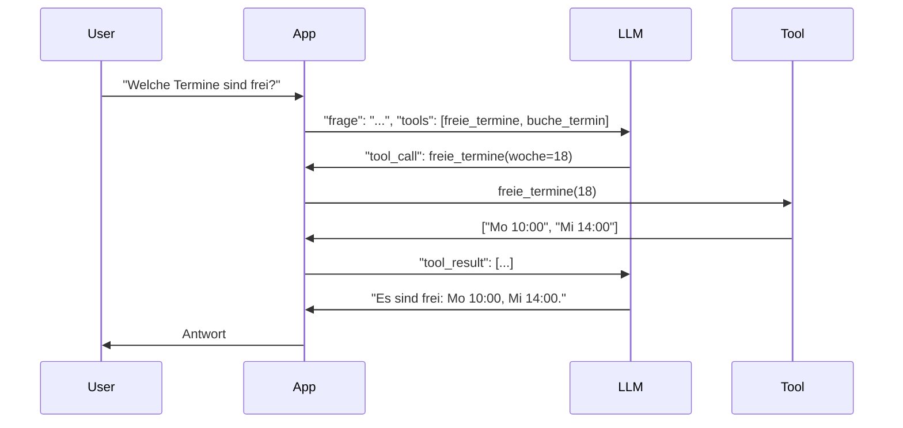

## Worum es geht

> Stop hardcoding LLM-Antworten gegen externe Quellen. — Tool-Calling lässt das Modell deine Funktionen aufrufen, wenn es sie braucht.

Tool-Calling (auch „Function Calling") ist der Mechanismus, mit dem moderne LLMs **deine eigenen Funktionen** als Werkzeuge nutzen. Das LLM entscheidet anhand der Frage, **ob und welches Tool** es aufruft, mit welchen Argumenten — du führst die Funktion aus und gibst das Ergebnis zurück.

## Voraussetzungen

- Lektion 11.02 (Pydantic AI)
- Ein laufendes LLM (Ollama lokal oder API)

## Konzept

### Der Loop



Wichtige Eigenschaften:

- Das LLM sieht **deine Tool-Schemas** — Name, Beschreibung, Argumente mit Typ
- Das LLM **entscheidet**, ob es ein Tool nutzt
- **Du** führst das Tool aus (LLM kann nichts selbst auslösen)
- Mehrere Tool-Calls in Sequenz möglich

### Mit Pydantic AI (empfohlen)

```python
from pydantic_ai import Agent
from datetime import date

agent = Agent(
    "anthropic:claude-sonnet-4-6",
    system_prompt="Du buchst Termine in einer deutschen Tierschutz-Organisation.",
)

@agent.tool_plain
def freie_termine(woche: int) -> list[str]:
    """Liste freier Termine in der gegebenen Kalenderwoche."""
    # echte DB-Abfrage hier
    return ["Mo 10:00", "Mi 14:00", "Do 15:30"]

@agent.tool_plain
def buche_termin(datum: str, uhrzeit: str, name: str) -> str:
    """Bucht einen Termin und gibt eine Bestätigungs-ID zurück."""
    # echte Logik
    return f"Termin {datum} {uhrzeit} für {name} gebucht (ID: 4711)"

result = agent.run_sync("Welche Termine sind in KW 18 frei?")
print(result.output)
# → "In KW 18 sind drei Termine frei: Montag 10:00, Mittwoch 14:00, Donnerstag 15:30."
```

Pydantic AI macht hier mehrere Schritte automatisch:

- Tool-Schema aus Type-Hints + Docstring generieren
- Tool-Calls korrekt ans LLM übergeben
- Antworten validieren
- Mehrere Tool-Calls in Sequenz orchestrieren

### Direkt mit dem OpenAI-SDK

Wenn du verstehst, was darunter passiert:

```python
from openai import OpenAI
client = OpenAI(...)

tools = [
    {
        "type": "function",
        "function": {
            "name": "freie_termine",
            "description": "Liste freier Termine in der gegebenen Kalenderwoche.",
            "parameters": {
                "type": "object",
                "properties": {
                    "woche": {"type": "integer", "description": "KW-Nummer"}
                },
                "required": ["woche"],
            },
        },
    }
]

messages = [{"role": "user", "content": "Welche Termine sind in KW 18 frei?"}]
r = client.chat.completions.create(
    model="gpt-5-4", messages=messages, tools=tools
)

# r.choices[0].message.tool_calls → liste von Tool-Aufrufen
# du musst sie ausführen und Resultate zurück senden
```

→ **Verglichen**: Pydantic AI spart dir zwischen 30 und 50 Zeilen Boilerplate pro Tool-Call.

### Wann Tool-Use, wann RAG, wann Agent?

| Use-Case | Pattern |
|---|---|
| Frage hat **eine** Antwort, die in deinen Daten steckt | RAG (Phase 13) |
| Modell braucht **strukturierte API-Antworten** (z. B. Wetter, Datenbank-Suchen) | Tool-Use (diese Lektion) |
| Modell braucht **mehrere Schritte** mit Konditionalität | Agent (Phase 14) |
| Wirklich offene Konversation ohne externe Datenquelle | klassischer Chat (Lektion 11.01) |

In der Praxis kombinierst du oft alle drei.

## Sicherheits-Pattern

### Tool-Whitelisting

Niemals dem Agent „alle Funktionen" geben. Explizite Whitelist im Code:

```python
# ❌ Falsch
import my_business_logic
for fn in dir(my_business_logic):
    agent.tool_plain(getattr(my_business_logic, fn))

# ✅ Richtig
ERLAUBTE_TOOLS = [freie_termine, buche_termin]
for tool in ERLAUBTE_TOOLS:
    agent.tool_plain(tool)
```

Sonst kann ein **Prompt-Injection-Angriff** das Modell überreden, gefährliche Funktionen aufzurufen.

### Argument-Validierung

Pydantic AI validiert Argumente automatisch via Type-Hints. Bei direkter SDK-Nutzung: **immer selbst validieren**:

```python
def buche_termin(datum: str, uhrzeit: str, name: str) -> str:
    from datetime import datetime
    # Datum-Validierung
    datetime.strptime(datum, "%Y-%m-%d")  # wirft ValueError bei Fehler
    # Pseudo-PII-Filter (siehe Phase 14)
    if not name or len(name) > 100:
        raise ValueError("Ungültiger Name")
    # ...
```

### Audit-Logging

Jeder Tool-Call ist ein **Audit-Event**:

```python
import structlog
logger = structlog.get_logger()

@agent.tool_plain
def buche_termin(datum: str, uhrzeit: str, name: str) -> str:
    logger.info("tool_call", tool="buche_termin", args={...}, user=current_user())
    # ...
```

→ Phase 20.05 zeigt das vollständige OpenTelemetry-GenAI-Pattern.

## Hands-on

Erweitere das Beispiel aus Lektion 11.02 um zwei Tools:

1. `pruefe_lieferzeit(plz: str) -> int` — gibt Tage zurück
2. `gib_versandkosten(plz: str, gewicht_kg: float) -> float` — gibt EUR zurück

Stelle dem Agent eine Frage wie „Wie lange dauert der Versand nach 30159 mit 5 kg, und was kostet das?". Das Modell sollte beide Tools aufrufen.

## Selbstcheck

- [ ] Du erklärst die Loop in 30 Sekunden ohne Diagramm.
- [ ] Du verstehst, dass das LLM selbst nichts ausführt — nur Aufrufe vorschlägt.
- [ ] Du wendest Tool-Whitelisting im eigenen Code an.
- [ ] Du erkennst, wann Tool-Use besser als RAG ist (strukturierte API-Antworten) und wann RAG besser als Tool-Use (Wissensbasis-Antworten).

## Compliance-Anker

- **Audit-Logging (AI-Act Art. 12)**: jeder Tool-Call mit Argumenten + Ergebnis loggen (Hash-Pattern siehe Phase 20.05).
- **Human Oversight (AI-Act Art. 14)**: bei Tool-Calls mit Außenwirkung (z. B. E-Mail senden, Zahlung) Approval-Pattern → Phase 14.
- **Datenminimierung**: PII niemals als Tool-Argumente direkt — Pseudonyme nutzen.

## Quellen

- OpenAI Function Calling Guide — <https://platform.openai.com/docs/guides/function-calling> (Zugriff 2026-04-28)
- Anthropic Tool Use — <https://docs.claude.com/en/docs/build-with-claude/tool-use> (Zugriff 2026-04-28)
- Pydantic AI Tools — <https://pydantic.dev/docs/ai/tools/>
- OWASP LLM Top 10 (Prompt Injection / Tool Misuse) — <https://genai.owasp.org/llmrisk/>

## Weiterführend

→ Lektion **11.04** (MCP — Tool-Calling über Prozess-Grenzen)
→ Phase **14** (Agenten — Multi-Step-Tool-Use)
→ Phase **20.05** (Audit-Logging-Pattern)
