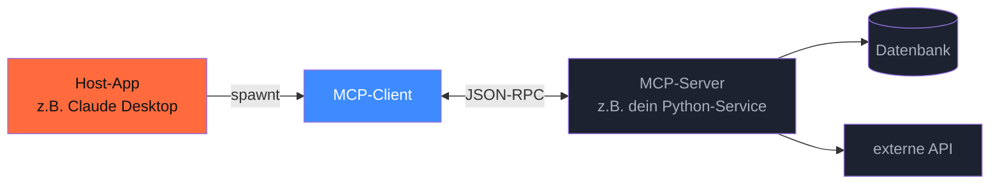

## Worum es geht

> Stop reinventing tool integrations for every LLM-Client. — MCP ist das **„USB-C der Agents"**.

**Model Context Protocol (MCP)** ist ein offenes JSON-RPC-2.0-basiertes Protokoll für Verbindungen zwischen LLM-Apps und Datenquellen / Tools. Spec-Stand: **2025-11-25**.

Entwickelt von Anthropic, dann unter offene Governance gestellt. 2026 ist es **De-facto-Standard** — Claude Desktop, ChatGPT, VS Code, Cursor, Continue.dev und viele andere unterstützen MCP-Server.

## Voraussetzungen

- Lektion 11.03 (Function Calling — du verstehst das Tool-Loop-Pattern)
- Optional: Claude Desktop oder VS Code mit MCP-Support installiert

## Konzept

### Architektur



Drei Akteure:

| Rolle | Aufgabe |
|---|---|
| **Host** | die LLM-App, in der das Modell läuft (z. B. Claude Desktop) |
| **Client** | Konnektor in der Host-App, der den Server-Prozess verwaltet |
| **Server** | dein Service, der Tools / Resources / Prompts bereitstellt |

### Was ein MCP-Server bietet

Drei Feature-Typen:

- **Tools**: Funktionen, die das LLM aufrufen kann (wie in Lektion 11.03)
- **Resources**: Daten, die das LLM lesen kann (Dateien, DB-Inhalte, API-Antworten)
- **Prompts**: vorgefertigte Prompt-Templates, die der User anwenden kann

Plus auf Client-Seite (Server kann das vom Client anfragen):

- **Sampling**: der Server fragt das LLM via Client für eigene Inferenz
- **Roots**: Verzeichnisse / Dateien, die der Server lesen darf
- **Elicitation**: der Server fragt den User über den Client um eine Eingabe

### Mein erster MCP-Server (FastMCP)

```bash
uv add mcp
```

```python
# adoption_server.py
from mcp.server.fastmcp import FastMCP

mcp = FastMCP("Adoption-Bot")

@mcp.tool()
def freie_termine(woche: int) -> list[str]:
    """Liste freier Termine in der gegebenen Kalenderwoche."""
    return ["Mo 10:00", "Mi 14:00", "Do 15:30"]

@mcp.tool()
def tier_profil(tier_id: str) -> dict:
    """Gibt das Profil eines Tieres zurück."""
    # echte DB-Abfrage hier
    return {"id": tier_id, "name": "Bella", "rasse": "Mischling", "alter": 4}

@mcp.resource("adoption://richtlinien")
def adoptions_richtlinien() -> str:
    """Aktuelle Adoptions-Richtlinien als Markdown."""
    return """# Adoptions-Richtlinien
    ... (Markdown-Inhalt) ...
    """

@mcp.prompt()
def beratungsgespraech(thema: str) -> str:
    """Vorlage für ein Adoptions-Beratungsgespräch."""
    return f"Du bist eine Beraterin im Tierheim. Thema: {thema}. Antworte freundlich auf Deutsch."

if __name__ == "__main__":
    mcp.run(transport="stdio")  # für Claude Desktop / VS Code
    # oder: mcp.run(transport="streamable-http") für HTTP-Clients
```

### MCP-Server in Claude Desktop registrieren

Bearbeite (oder erstelle) `~/Library/Application Support/Claude/claude_desktop_config.json`:

```json
{
  "mcpServers": {
    "adoption-bot": {
      "command": "uv",
      "args": ["--directory", "/pfad/zu/projekt", "run", "python", "adoption_server.py"]
    }
  }
}
```

Claude Desktop neu starten → der Server erscheint im UI als „🔌 adoption-bot" mit deinen Tools.

### Wann MCP — und wann nicht?

| Frage | Antwort |
|---|---|
| Hast du eine Host-App, der du Tools geben willst (Claude Desktop, VS Code, ...)? | **MCP**. Mehrere Apps können denselben Server nutzen. |
| Baust du eine eigene LLM-App mit Pydantic AI / OpenAI-SDK? | **direktes Tool-Calling** (Lektion 11.03). Einfacher, weniger Overhead. |
| Willst du Tools in mehreren LLM-Apps nutzen? | **MCP**. Server einmal schreiben, in jedem Host benutzbar. |
| Datenquelle, kein Tool — nur lesen? | **MCP-Resources**. |
| Vorgefertigtes Prompt-Template für deinen User? | **MCP-Prompts**. |

In **diesem Repo** ist Phase 14 (Agenten) der Ort, wo wir MCP tiefer einsetzen.

## Hands-on

```bash
# Server schreiben (siehe oben)
mkdir /tmp/mcp-test && cd /tmp/mcp-test
uv init && uv add mcp

# adoption_server.py erstellen mit dem Code oben

# Lokal testen mit MCP-Inspector
uv run mcp dev adoption_server.py
# → öffnet UI auf http://localhost:6274
# → du kannst Tools einzeln aufrufen, Resources lesen, Prompts ansehen
```

## Selbstcheck

- [ ] Du erklärst MCP-Architektur (Host / Client / Server) ohne nachzuschauen.
- [ ] Du kennst die drei Feature-Typen Tools / Resources / Prompts.
- [ ] Du hast einen `FastMCP`-Server geschrieben und in MCP-Inspector getestet.
- [ ] Du wählst zwischen MCP und direktem Tool-Calling, je nach Architektur.

## Compliance-Anker

- **Tool-Whitelisting (AI-Act Art. 14)**: bei MCP genauso wichtig wie bei direktem Tool-Use. Dein MCP-Server bietet **nur** das an, was du explizit dekorierst.
- **Audit-Logging (Art. 12)**: MCP-Server-Logs (welcher Tool-Call, welche Argumente, welcher Resource-Read) gehören in dein Logging-Setup.
- **Datenresidenz**: MCP läuft typischerweise lokal (stdio) oder im eigenen Netzwerk (streamable-http). Keine Daten verlassen deinen Host, außer du baust einen Remote-MCP-Server.

## Quellen

- MCP Spec 2025-11-25 — <https://modelcontextprotocol.io/specification/latest> (Zugriff 2026-04-28)
- MCP Home — <https://modelcontextprotocol.io/>
- Python SDK (FastMCP) — <https://github.com/modelcontextprotocol/python-sdk>
- Anthropic „MCP Quickstart" — <https://docs.claude.com/en/docs/agents-and-tools/mcp>

## Weiterführend

→ Lektion **11.05** (Anbieter-Vergleich mit echten Token-Kosten)
→ Phase **14** (Agenten & MCP — vertieft, mit Multi-Server-Setups)
