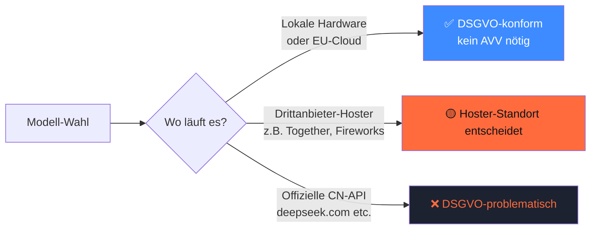

## Worum es geht

> Stop ignoring Asian innovation — but don't naively call CN-APIs. — die wichtigste Open-Weight-Innovation 2026 kommt aus Asien. Lokal nutzen ist DSGVO-konform. Naiv genutzt nicht.

## Voraussetzungen

- Lektion 11.05 (Anbieter-Vergleich)
- Phase 00.04 (Ollama lokal)

## Konzept

### Top-7 Modelle 2026

| Modell | Anbieter | Land | Lizenz | Stärken |
|---|---|---|---|---|
| **Qwen3-Familie** (4B, 8B, 30B-A3B-MoE, 235B-MoE) | Alibaba | CN | **Apache 2.0** | 119 Sprachen, sehr gut auf Deutsch |
| **DeepSeek-R1 Distill** (8B, 32B, 70B) | DeepSeek | CN | **MIT** | GRPO-Reasoning-Referenz |
| **DeepSeek V4 Pro/Flash** (1,6T-MoE) | DeepSeek | CN | custom | „GPT-5.4-Niveau" Coding |
| **GLM-5** | Zhipu AI | CN | **MIT** (seit 07/2025) | SOTA Coding 02/2026 |
| **Kimi K2.6** | Moonshot AI | CN | Modified MIT | 1T-MoE, 256K Context, Agent-Swarm |
| **MiniCPM-o / V** | OpenBMB | CN | Apache 2.0 | Edge-Multimodal, läuft auf Smartphone |
| **EXAONE 4.5** | LG | KR | EXAONE-NC ⚠️ | STEM-stark, aber NICHT kommerziell |

> Vollständige Anbieter-Übersicht inkl. Hunyuan-TurboS (Mamba-Hybrid), AI21 Jamba, SEA-LION → [`docs/rechtliche-perspektive/asiatische-llms.md`](../../../docs/rechtliche-perspektive/asiatische-llms.md).

### Drei Compliance-Schichten



| Variante | DSGVO | Hinweis |
|---|---|---|
| **Lokale Inferenz** (Ollama, vLLM on-prem, MLX) | ✅ | Modell-Weights = Mathematik. Keine Daten verlassen den Host. Kein AVV nötig. |
| **EU-Hoster** (Scaleway, OVH, IONOS, Together-EU, Nebius) | ✅ mit AVV | Standard-Pattern für hohe Performance + DSGVO. |
| **US-Hoster** (Together-US, Fireworks, DeepInfra, Replicate) | 🟡 | DPA + SCC + TIA + EU-Datazone-Optionen prüfen. |
| **Offizielle CN-API** (deepseek.com, dashscope, moonshot.cn) | ❌ | Kein EU-Vertreter, kein durchsetzbares Auskunftsrecht. **Nicht für berufliche Nutzung mit Personenbezug.** |

### Self-Censorship-Realität

Chinesische Modelle sind **trainiert mit CN-Compliance** im Hinterkopf. Konkret:

- **DeepSeek-Chat zensiert ~ 88 %** geopolitischer CN-Fragen (Tiananmen, Taiwan, Xinjiang, Xi Jinping, Hongkong-Proteste)
- **Qwen** ist subtiler, aber bias bleibt
- **GLM, Kimi** ähnliche Profile

Konsequenz für deinen Use-Case:

| Use-Case | Self-Censorship-Risiko |
|---|---|
| B2B-Coding | sehr gering — Programmieren ist „neutral" |
| Mathematik / Logik | gering |
| Allgemeine Fakten | mittel — Eval pflicht |
| News / Politik / Geschichte | **inakzeptabel** ohne Eval-Audit |
| Journalismus | **nicht einsetzen** ohne Verifikation |

→ **Phase 18** hat einen Hands-on Self-Censorship-Audit auf 50 deutschen Prompts in 5 Kategorien (Tiananmen, Taiwan, Xinjiang, Xi, Hongkong).

### Lizenz-Fallstricke

| Modell | Lizenz | Falle |
|---|---|---|
| Qwen3 (alle) | Apache 2.0 | keine — sicher |
| DeepSeek-R1 Distill | MIT | keine |
| **DeepSeek V3/V4** | custom | **vor produktiv prüfen** — eigene Bedingungen |
| GLM-5 | MIT (seit 07/2025) | keine |
| Kimi K2.6 | Modified MIT | Modifikationen lesen |
| MiniCPM | Apache 2.0 | keine |
| **EXAONE 1.2-NC** | **NC = nicht kommerziell ohne LG-Vertrag** | **Falle für KMU** |

### Chinesisches Recht extraterritorial?

Kurz: **nein, in Standard-Setup**.

- **PIPL** (Personal Information Protection Law): gilt extraterritorial **nur** für in CN lebende Personen. Bei DACH-Inferenz auf DACH-Daten → **nicht anwendbar**.
- **DSL/CSL** (Data Security/Cybersecurity Law) Novelle 01.01.2026: erweiterte Reichweite **nur** bei Schädigung von CN-CII. Bei normaler EU-Inferenz → **nicht anwendbar**.

→ **Konsequenz**: Open-Weights-Inference auf EU-Servern triggert **keine** chinesische Compliance.

### Use-Case-Empfehlungen

| Wenn du... | Empfehlung |
|---|---|
| günstig deutsch generieren willst | **Qwen3-30B-A3B-MoE** lokal (oder via EU-Hoster) |
| Reasoning brauchst | **DeepSeek-R1-Distill** (32B oder 70B) lokal |
| Code generierst | **GLM-5** oder **Qwen3-Coder** |
| Long-Context (256K+) brauchst | **Kimi K2.6** |
| Edge-Multimodal | **MiniCPM-o V 4.0** auf Smartphone |
| Korea-Spezialist | EXAONE 4.5 — aber **NC-Lizenz prüfen** |
| Behörden / Sovereign-Use | **lass die Finger** — nutze Pharia / Mistral / Llama-via-IONOS |

## Praxis: Qwen3 lokal aufrufen

```bash
ollama pull qwen3:8b
ollama serve &
```

```python
from pydantic_ai import Agent

agent = Agent(
    "ollama:qwen3:8b",
    system_prompt="Antworte auf Deutsch.",
)

r = agent.run_sync("Erkläre BPE-Tokenisierung in zwei Sätzen.")
print(r.output)
```

→ Identisch zu Lektion 11.02. Provider-Wechsel ist eine Zeile.

## Selbstcheck

- [ ] Du kennst die Top-7 asiatischen Modelle und ihre Lizenzen.
- [ ] Du erklärst, warum lokale Inferenz DSGVO-konform ist und CN-API nicht.
- [ ] Du erkennst EXAONE als Lizenz-Falle für kommerzielle Use-Cases.
- [ ] Du weißt, dass PIPL/DSL bei EU-Inferenz **nicht** triggern.
- [ ] Du planst Self-Censorship-Audit in Phase 18 ein, falls dein Use-Case politisch / historisch ist.

## Compliance-Anker

- **Pflicht-Disclaimer-Block**: jede Lektion / Übung / Capstone, die ein chinesisches Modell nutzt, bekommt den Disclaimer aus [`docs/rechtliche-perspektive/asiatische-llms.md`](../../../docs/rechtliche-perspektive/asiatische-llms.md).
- **AVV nur bei EU-Hosting** sinnvoll. Bei lokaler Inferenz nicht nötig — aber dokumentieren, dass das Modell von wo geladen wurde (HF-Hub-URL).

## Quellen

- DeepSeek-R1 Nature-Publikation (08/2025) — <https://www.nature.com/articles/s41586-025-08000-x>
- Qwen3 Technical Report — <https://arxiv.org/abs/2505.09388>
- GLM-5 Tech Report (Z.ai) — <https://z.ai/>
- Kimi K2.6 Release Blog — <https://moonshot.cn/>
- MiniCPM Tech Report — <https://github.com/OpenBMB/MiniCPM>
- Enkrypt AI DeepSeek Bias Audit — <https://www.enkryptai.com/blog/deepseek-r1-redteaming>
- EDPB AI Privacy Risks — <https://www.edpb.europa.eu/system/files/2024-12/edpb_opinion_202428_ai-models_en.pdf>

## Weiterführend

→ Lektion **11.07** (Caching)
→ Phase **18** (Self-Censorship-Audit als Hands-on)
→ [`docs/rechtliche-perspektive/asiatische-llms.md`](../../../docs/rechtliche-perspektive/asiatische-llms.md) — vollständige Compliance-Doku
