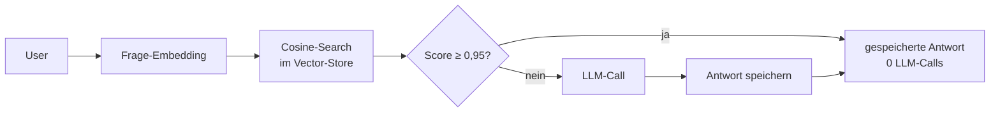

## Worum es geht

> Stop paying for the same system prompt 10.000 times a day. — Caching kostet ~ 1 Stunde Setup-Zeit und spart 30–80 % Token-Budget bei stabilen Prompts.

## Voraussetzungen

- Lektion 11.05 (Anbieter-Vergleich) — du verstehst Pricing
- Optional: Redis lokal (`docker run -p 6379:6379 redis/redis-stack:latest`)

## Drei Caching-Schichten

| Schicht | Was | Wo |
|---|---|---|
| **1. Prefix-Cache** (Anbieter-managed) | gleiche System-Prompts / Few-Shots werden anbieterseitig gecacht | OpenAI, Anthropic, Mistral, Gemini |
| **2. Semantischer Cache** (App-Layer) | ähnliche Anfragen treffen denselben gespeicherten Output | Redis + Embeddings (selber bauen) |
| **3. App-Layer-Cache** (klassisch) | identische Anfragen → gespeicherter Output | klassischer Memcached / Redis |

### 1. Anbieter-Prefix-Cache

**Anthropic Prompt Cache** (Stand 2026):

- Markiere stabile Prefixes (System-Prompt, Tool-Definitionen, Few-Shots) mit `cache_control`
- Bei Wiederverwendung: **Read-Kosten = 0,1 × Input-Preis** (90 % Ersparnis)
- Write-Kosten: **5min-Cache = 1,25 ×, 1h-Cache = 2 ×** Input-Preis
- Break-even: 5min-Cache zahlt sich nach **einem** Read aus, 1h-Cache nach **zwei** Reads

```python
import anthropic
client = anthropic.Anthropic()

response = client.messages.create(
    model="claude-sonnet-4-6",
    max_tokens=1024,
    system=[
        {
            "type": "text",
            "text": "Du bist Assistenz im Tierheim Hannover. ...",  # ~1500 Tokens
            "cache_control": {"type": "ephemeral", "ttl": "5m"},
        }
    ],
    messages=[
        {"role": "user", "content": "Wie kann ich adoptieren?"}
    ],
)
```

Was passiert:

- Erster Call mit diesem System-Prompt: voller Input-Preis × 1,25 (Cache-Write).
- Zweiter Call innerhalb 5 Min: System-Prompt wird nicht erneut bezahlt — nur 0,1 × Input-Preis (Cache-Read). Spar­potenzial bei stabilen Prompts: 30–60 %.

**OpenAI Cached Input** (Stand 2026):

- Automatisch ab Prefix-Reuse von ≥ 1.024 Tokens
- ~ 10 % des Standard-Input-Preises
- Keine Konfiguration nötig — System-managed
- Du musst nur sicherstellen, dass System-Prompt + Few-Shots **am Anfang** der Messages sind

→ **Beide Mechanismen sparen nur Input-Tokens**, niemals Output-Tokens.

### 2. Semantischer Cache (eigene Schicht)

Wenn 80 % deiner User-Fragen Variationen derselben 50 Standardfragen sind („Wie adoptiere ich?", „Welche Öffnungszeiten?", „Was kostet eine Adoption?"), kannst du **die Antwort komplett cachen**:



**Mit `redis-vl`** (Redis Stack):

```bash
docker run -p 6379:6379 redis/redis-stack:latest
uv add redis redisvl
```

```python
from redisvl.extensions.llmcache import SemanticCache
from sentence_transformers import SentenceTransformer

cache = SemanticCache(
    name="tierheim-faq",
    redis_url="redis://localhost:6379",
    distance_threshold=0.10,  # entspricht ~ 0,90 Cosine-Similarity
    vectorizer=SentenceTransformer("intfloat/multilingual-e5-large"),
)

def beantworte_mit_cache(frage: str) -> str:
    if hit := cache.check(prompt=frage):
        return hit[0]["response"]  # Cache-Hit
    antwort = call_llm(frage)
    cache.store(prompt=frage, response=antwort)
    return antwort
```

**Schwellwert-Tuning**: zu lax (z. B. 0,80) → falsche Hits („Wie adoptiere ich?" matched „Wie storniere ich?"). Zu strikt (z. B. 0,99) → niedrige Hit-Rate. **Sweet Spot 0,93–0,95** Cosine-Similarity. Eval mit echten Logs.

### 3. App-Layer-Cache (klassisch)

Für deterministische Aufrufe (z. B. Klassifikations-Calls mit `temperature=0`) reicht oft **identitätsbasiertes Caching**:

```python
import hashlib
from functools import lru_cache

def cache_key(prompt: str, model: str) -> str:
    return hashlib.sha256(f"{model}::{prompt}".encode()).hexdigest()

@lru_cache(maxsize=1000)
def beantworte_cached(cache_key: str, prompt: str, model: str) -> str:
    return call_llm(prompt, model)
```

**Wann sinnvoll**: viel Wiederholung, deterministisch (`temperature=0`). Nicht sinnvoll: kreative Generierung mit `temperature > 0`.

## Wann macht Caching Sinn?

| Situation | Caching-Empfehlung |
|---|---|
| stabiler System-Prompt + Few-Shots ≥ 1024 Tokens | **Prefix-Cache** (Anthropic / OpenAI) |
| viele Wiederholungen der gleichen User-Frage (FAQ-Bot) | **Semantischer Cache** |
| Klassifikation, deterministisch | **App-Layer-Cache** |
| jede Frage einzigartig (kreative Generierung) | **kein Cache** sinnvoll |

Faustregel: **ab ~ 5–10 Wiederholungen** desselben Prefixes / derselben semantischen Frage kippt die Rechnung deutlich positiv.

## Compliance: Cache und PII

⚠️ **Wichtig**: Cache speichert Anfragen / Antworten. Wenn dein System-Prompt PII enthält (z. B. Mandantenname, Kunden-ID), wird der Cache **PII speichern**.

| Cache-Typ | PII-Risiko |
|---|---|
| Anbieter-Prefix-Cache | gering (anbieterseitig isoliert per Account) |
| Semantischer Cache (eigener) | **hoch** — du bist Verantwortlicher nach DSGVO |
| App-Layer-Cache | **hoch** — siehe oben |

**Best Practice**:

- Im **System-Prompt** keine User-spezifische PII (Pseudonyme, Tokens nutzen)
- Im **semantischen Cache**: nur Antworten cachen, die **personen-unabhängig** sind (FAQ, allgemeine Infos)
- Cache-Lebensdauer mit Lösch-Workflow (siehe Phase 20)

## Hands-on (15 Min.)

Berechne die Caching-Ersparnis für dein Newsletter-Beispiel aus Lektion 11.05:

- 8.000 Empfänger × 52 Wochen = **416.000 Calls/Jahr**
- Stabiler System-Prompt: **1.500 Tokens** pro Call (gleich für alle)
- Variabler Teil: 200 Tokens Input + 800 Tokens Output

Ohne Cache (Anthropic Sonnet 4.6):

```text
Input  = 416.000 × 1.700 × $3 / 1M    = $2.122
Output = 416.000 × 800   × $15 / 1M  = $4.992
                                  Σ  = $7.114
```

Mit 1h-Cache (System-Prompt einmal pro Stunde geladen, ~ 8.760 Refreshs/Jahr):

```text
Cache-Writes = 8.760 × 1.500 × $3 × 2 / 1M  = $79
Cache-Reads  = 416.000 × 1.500 × $3 × 0,1 / 1M = $187
Variabler Input = 416.000 × 200 × $3 / 1M  = $250
Output       = 416.000 × 800 × $15 / 1M    = $4.992
                                       Σ   = $5.508

Ersparnis: $1.606 / Jahr ≈ 23 % auf der Gesamtrechnung,
            ~ 75 % auf der Input-Seite.
```

→ Caching lohnt sich bereits bei diesem mittleren Volumen erheblich.

## Selbstcheck

- [ ] Du erklärst die drei Caching-Schichten und wann jede passt.
- [ ] Du nutzt Anthropic Prompt Cache mit `cache_control` und kannst die Multiplikatoren rechnen.
- [ ] Du verstehst, warum OpenAI Cached Input automatisch funktioniert (kein Eingriff nötig).
- [ ] Du erkennst PII-Risiken im semantischen Cache und vermeidest sie.

## Compliance-Anker

- **Datenminimierung (Art. 5 Abs. 1 lit. c DSGVO)**: Cache speichert Daten — nur cachen, was du speichern darfst.
- **Zweckbindung**: Cache-Inhalte dürfen nicht für andere Zwecke als die ursprüngliche Anfrage genutzt werden.
- **Logging vs. Cache**: Cache-Antworten gehen ins Audit-Log mit (siehe Phase 20.05).

## Quellen

- Anthropic Prompt Caching — <https://docs.claude.com/en/docs/build-with-claude/prompt-caching> (Zugriff 2026-04-28)
- OpenAI Prompt Caching — <https://platform.openai.com/docs/guides/prompt-caching>
- Redis VL Semantic Cache — <https://docs.redisvl.com/en/latest/user_guide/04_llmcache.html>
- GPTCache (alternativer semantischer Cache) — <https://github.com/zilliztech/GPTCache>

## Weiterführend

→ Lektion **11.08** (Eval mit Promptfoo)
→ Phase **17** (LiteLLM-Proxy mit Cost-Tracking + Cache)
