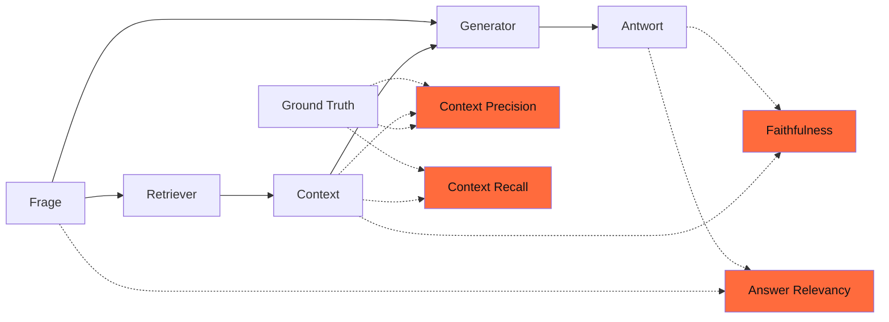

## Worum es geht

> Stop deploying RAG without measuring quality. — Ragas misst die vier Achsen, an denen RAG-Pipelines kaputtgehen.

**Ragas** (aktuelle Version 0.4.3, 13.01.2026) ist der De-facto-Standard für Open-Source-RAG-Evaluation. Genutzt mit LangChain, LlamaIndex, Haystack.

⚠️ **Wichtig**: Die Legacy-Metrics-API wird in Ragas 0.4 deprecated und in 1.0 entfernt. Lehrmaterial sollte direkt auf der **neuen Collections-basierten API** aufbauen.

## Voraussetzungen

- Phase 13 (RAG-Tiefenmodul) Lektion 13.01 (Vanilla RAG) — du verstehst den Pipeline-Aufbau
- Lektion 11.08 (Promptfoo) — du hast das Eval-Mindset

## Konzept

### Die vier Kernmetriken



| Metrik | Frage | Range |
|---|---|---|
| **Faithfulness** | Sind alle Claims der Antwort durch den Context belegt? | 0–1, höher = besser |
| **Answer Relevancy** | Adressiert die Antwort die Frage? | 0–1, höher = besser |
| **Context Precision** | Wie viel des Retrieved Context ist relevant? | 0–1, höher = besser |
| **Context Recall** | Wie viel des Ground-Truth ist im Context? (braucht Ground-Truth!) | 0–1, höher = besser |

### Faithfulness — was wird gemessen?

Antwort wird in **atomare Claims** zerlegt. Jeder Claim wird gegen den Context geprüft. Faithfulness = Anteil belegter Claims.

```text
Antwort: "Die Adoption kostet 250 € und dauert ungefähr zwei Wochen."

Claims:
- "Adoption kostet 250 €"        → ist im Context? ja → 1
- "Dauert ungefähr zwei Wochen"  → ist im Context? nein → 0

Faithfulness = 1/2 = 0,5  → Halluzination erkannt
```

→ Niedrige Faithfulness = LLM halluziniert. Direkt actionable: besseres Modell, bessere Prompts, mehr Context.

### Answer Relevancy — Wie wird gemessen?

LLM generiert aus der Antwort **mögliche Fragen**, die diese Antwort beantworten würde. Diese werden mit der Original-Frage Cosine-verglichen.

→ Niedrige Relevancy = Antwort ist off-topic, „blabla", abschweifend.

### Context Precision

Anteil der **relevanten Chunks** im Top-K. Brauchst Ground-Truth (welche Chunks sind ideal).

→ Niedrige Precision = Retrieval zieht zu viel Müll.

### Context Recall

Wieviel der Ground-Truth-Information ist im Top-K vorhanden?

→ Niedriger Recall = Retrieval übersieht relevante Chunks.

### Code-Beispiel (Ragas 0.4 neue API)

```bash
uv add ragas datasets
```

```python
from ragas import EvaluationDataset, evaluate
from ragas.metrics import (
    Faithfulness,
    AnswerRelevancy,
    ContextPrecision,
    ContextRecall,
)

# Eval-Daten als Liste von Dicts
samples = [
    {
        "user_input": "Wie viel kostet eine Adoption?",
        "retrieved_contexts": ["Die Schutzgebühr beträgt 250 € pro Tier."],
        "response": "Eine Adoption kostet 250 €.",
        "reference": "Die Schutzgebühr beträgt 250 €.",
    },
    {
        "user_input": "Wie lange dauert eine Adoption?",
        "retrieved_contexts": ["Der Prozess umfasst Beratung und Hausbesuch."],
        "response": "Eine Adoption dauert zwei Wochen.",  # halluziniert!
        "reference": "Die Dauer ist nicht standardisiert; Beratung + Hausbesuch.",
    },
]

dataset = EvaluationDataset.from_list(samples)
results = evaluate(
    dataset=dataset,
    metrics=[Faithfulness(), AnswerRelevancy(), ContextPrecision(), ContextRecall()],
)
print(results)
# → liefert Pandas-DataFrame mit Score pro Sample und Mittelwerten
```

### LLM-Judge: Welches Modell für die Bewertung?

Ragas nutzt im Hintergrund ein LLM, um Claims zu extrahieren und gegen Context zu prüfen. **Das Judge-Modell beeinflusst die Scores**.

| Judge-Modell | Vor-/Nachteile |
|---|---|
| GPT-5.4 / Claude Sonnet 4.6 | starke Default-Wahl, aber teuer |
| GPT-5.4-mini / Claude Haiku 4.5 | günstiger, kleinere Bias-Anfälligkeit für Standard-Fälle |
| Lokales Modell (Qwen3-30B) | DSGVO-Bonus, langsamer |
| **Mistral Large 3** | guter Kompromiss, EU-Hosting |

**Pflicht**: Judge-Modell **dokumentieren**. Verschiedene Judges → verschiedene Scores. Ohne Doku ist deine Eval nicht reproduzierbar.

### Use-Case-Tipps

- **Faithfulness < 0,7** = Modell halluziniert oft. Lösung: stärkeres Modell, strikterer Prompt („Antworte NUR auf Basis der Quellen"), Quellen-Attribution-Pflicht.
- **Context Precision < 0,5** = Retrieval ist „rauschig". Lösung: Re-Ranking (siehe Phase 13.04).
- **Context Recall < 0,7** = Retrieval übersieht zu viel. Lösung: höheres Top-K, Hybrid Retrieval (BM25 + Dense), Chunking-Größe ändern.

## Hands-on (30 Min.)

```python
# Eval auf deinem Phase-13-Vanilla-RAG
from ragas import EvaluationDataset, evaluate
from ragas.metrics import Faithfulness, AnswerRelevancy

# 5 Test-Fragen mit Ground-Truth
samples = [
    {"user_input": "Wann ist DSGVO in Kraft getreten?",
     "retrieved_contexts": [...],
     "response": "...",
     "reference": "25. Mai 2018"},
    # ... 4 weitere
]

ds = EvaluationDataset.from_list(samples)
results = evaluate(ds, metrics=[Faithfulness(), AnswerRelevancy()])
print(results.to_pandas().describe())
```

## Selbstcheck

- [ ] Du erklärst die vier Kernmetriken in zwei Sätzen pro Stück.
- [ ] Du nutzt die Ragas-0.4-Collections-API (nicht die Legacy-Metrics-API).
- [ ] Du kennst typische Schwellwerte (Faithfulness > 0,8 für Produktion ist gut).
- [ ] Du dokumentierst dein Judge-Modell.

## Compliance-Anker

- **Quality-Gate (AI-Act Art. 15)**: Faithfulness ist Teil der Genauigkeits-Anforderung für Hochrisiko-Systeme. Schwellwerte vor Deployment definieren.
- **Quellen-Attribution (AI-Act Art. 50.4)**: Faithfulness ohne Quellen-Link in der Antwort ist unvollständig. Phase 13 Lektion 13.09 vertieft.

## Quellen

- Ragas Docs — <https://docs.ragas.io/> (Zugriff 2026-04-28)
- Ragas auf PyPI (0.4.3) — <https://pypi.org/project/ragas/>
- Ragas Metrics Übersicht — <https://docs.ragas.io/en/stable/concepts/metrics/available_metrics/>
- Ragas Migration Guide v0.3 → v0.4 — <https://docs.ragas.io/en/stable/howtos/migrations/>

## Weiterführend

→ Lektion **11.10** (Observability — Tracing + Eval kombinieren)
→ Phase **13** (RAG-Tiefenmodul) — alle 7 RAG-Varianten mit Ragas-Score-Vergleich
