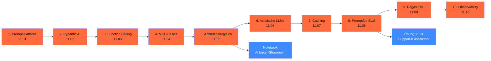

# Phase 11 · LLM-Engineering

> **Stop building production apps without types.** — Pydantic AI macht LLM-Outputs zu validierten Schemata, Promptfoo macht Eval zu CI-Gate.

**Status**: ✅ vollständig ausgearbeitet · **Dauer**: ~ 14 h · **Schwierigkeit**: mittel

## 🎯 Was du in diesem Modul lernst

- **Prompt-Patterns 2026** (Zero/Few-Shot, CoT, Self-Consistency)
- **Pydantic AI** als Multi-Provider-Framework mit Type-Safety
- **Function Calling / Tool Use** mit Sicherheits-Pattern (Whitelisting, Audit)
- **MCP** als „USB-C der Agents" (Spec 2025-11-25)
- **Anbieter-Vergleich** mit aktuellem USD-Pricing (Stand 28.04.2026)
- **Asiatische Open-Weights** (Qwen3, DeepSeek-R1, GLM-5, Kimi) mit DACH-Disclaimer
- **Caching** auf drei Schichten (Prefix, semantisch, App-Layer)
- **Eval** mit Promptfoo (CI-tauglich) und Ragas (RAG-Tasks)
- **Observability** mit OpenTelemetry GenAI + Phoenix / Langfuse (EU-self-hosted)

## 🧭 Wie du diese Phase nutzt



## 📚 Inhalts-Übersicht

| Lektion | Titel | Dauer | Datei |
|---|---|---|---|
| 11.01 | Prompt-Patterns: Zero/Few-Shot, CoT, Self-Consistency | 60 min | [`lektionen/01-prompt-patterns.md`](lektionen/01-prompt-patterns.md) ✅ |
| 11.02 | Structured Outputs mit Pydantic AI | 60 min | [`lektionen/02-pydantic-ai-structured-outputs.md`](lektionen/02-pydantic-ai-structured-outputs.md) ✅ |
| 11.03 | Function Calling / Tool Use | 45 min | [`lektionen/03-function-calling.md`](lektionen/03-function-calling.md) ✅ |
| 11.04 | MCP-Basics — USB-C der Agents | 60 min | [`lektionen/04-mcp-basics.md`](lektionen/04-mcp-basics.md) ✅ |
| 11.05 | **Anbieter-Vergleich mit echten Token-Kosten** | 90 min | [`lektionen/05-anbieter-vergleich.md`](lektionen/05-anbieter-vergleich.md) ✅ |
| 11.06 | Asiatische Open-Weights (Qwen3, DeepSeek-R1) — DACH-Disclaimer | 60 min | [`lektionen/06-asiatische-open-weights.md`](lektionen/06-asiatische-open-weights.md) ✅ |
| 11.07 | Caching: Anthropic Prompt-Cache, OpenAI Cached-Input, semantischer Cache | 60 min | [`lektionen/07-caching.md`](lektionen/07-caching.md) ✅ |
| 11.08 | Eval mit Promptfoo (CI-tauglich) | 60 min | [`lektionen/08-promptfoo-eval.md`](lektionen/08-promptfoo-eval.md) ✅ |
| 11.09 | Eval mit Ragas (Retrieval-Tasks) | 60 min | [`lektionen/09-ragas-eval.md`](lektionen/09-ragas-eval.md) ✅ |
| 11.10 | Observability: OpenTelemetry GenAI + Phoenix / Langfuse | 60 min | [`lektionen/10-observability.md`](lektionen/10-observability.md) ✅ |

## 💻 Hands-on-Projekt

**Anbieter-Showdown**: ein Marimo-Notebook mit echten Pricing-Daten (Stand 28.04.2026), TCO-Rechner für Newsletter-Use-Case, Cache-Effekt-Berechnung, EU-Cloud-Vergleich.

[](https://colab.research.google.com/github/s-a-s-k-i-a/ki-engineering-werkstatt/blob/main/dist-notebooks/phasen/11-llm-engineering/code/01_anbieter_showdown.ipynb)

```bash
uv run marimo edit phasen/11-llm-engineering/code/01_anbieter_showdown.py
```

Plus die [Übung 11.01](uebungen/01-aufgabe.md): Support-Klassifikator mit Pydantic AI + Promptfoo-Eval ([Lösungs-Skelett](loesungen/01_loesung.py)).

## ⚖️ Aktuelle Anbieter-Tabelle (Stand 28.04.2026, USD/1M Tokens)

| Anbieter | Modell | Input | Output | Land | DSGVO/AVV |
|---|---|---|---|---|---|
| **Anthropic** | Claude Opus 4.7 | $5,00 | $25,00 | 🇺🇸 US | DPA + EU-Datazone |
| Anthropic | Claude Sonnet 4.6 | $3,00 | $15,00 | 🇺🇸 US | DPA + EU-Datazone |
| Anthropic | Claude Haiku 4.5 | $1,00 | $5,00 | 🇺🇸 US | DPA + EU-Datazone |
| **OpenAI** | GPT-5.5 | $5,00 | $30,00 | 🇺🇸 US | DPA + EU-Region |
| OpenAI | GPT-5.4 | $2,50 | $15,00 | 🇺🇸 US | DPA + EU-Region |
| OpenAI | GPT-5.4-mini | $0,75 | $4,50 | 🇺🇸 US | DPA + EU-Region |
| **Google** | Gemini 3.1 Pro Preview | $2,00 | $12,00 | 🇺🇸 US | DPA + EU-Region |
| Google | Gemini 3 Flash Preview | $0,50 | $3,00 | 🇺🇸 US | DPA + EU-Region |
| **Mistral** | Mistral Large 3 | $2,00 | $6,00 | 🇫🇷 FR | AVV im Standard |
| Mistral | Mistral Small 4 | $0,20 | $0,60 | 🇫🇷 FR | AVV im Standard |
| **EU-Cloud** | Llama / Mistral / Qwen | EUR 0,01–1,93 / 1M | varies | 🇩🇪 / 🇫🇷 | Self-Service-AVV |

> Vollständig in Lektion 11.05 mit Cache-Pricing und EU-Cloud-Detail-Tabelle.

## ✅ Voraussetzungen

- Phase 00 (Werkzeugkasten — uv, Marimo, Ollama, EU-Cloud-Account)
- Optional: API-Keys für Anthropic / OpenAI / Mistral (für volle Vergleichs-Tests)

## ⚖️ DACH-Compliance-Anker

→ [`compliance.md`](compliance.md): AVV-Pflicht, Prompt-Injection, Audit-Logging, Drittland-Transfer, Self-Censorship-Audit asiatischer Modelle.

## 📖 Quellen (Auswahl)

- Pydantic AI Docs — <https://pydantic.dev/docs/ai/overview/> (v1.87.0)
- MCP Spec 2025-11-25 — <https://modelcontextprotocol.io/specification/latest>
- Anthropic Pricing — <https://platform.claude.com/docs/en/about-claude/pricing>
- OpenAI Pricing — <https://platform.openai.com/docs/pricing>
- Promptfoo — <https://www.promptfoo.dev/docs/intro/> (v0.121.9)
- Ragas — <https://docs.ragas.io/> (v0.4.3)
- OpenTelemetry GenAI Spec — <https://opentelemetry.io/docs/specs/semconv/gen-ai/>
- Vollständig in [`weiterfuehrend.md`](weiterfuehrend.md).

## 🔄 Wartung

Stand: 28.04.2026 · Reviewer: Saskia Teichmann ([@s-a-s-k-i-a](https://github.com/s-a-s-k-i-a)) · Nächster Review: 06/2026 (Anbieter-Pricing-Refresh, Modell-Versionen). **Pricing ist volatil** — bei produktivem Einsatz immer auf Anbieter-Seite re-verifizieren.
