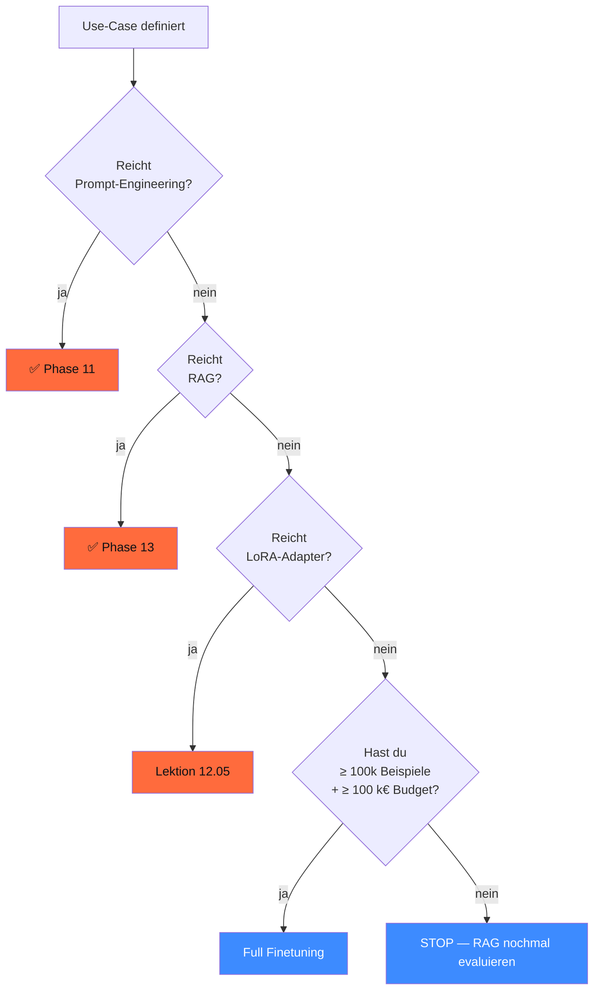

<!-- colab-badge:begin -->
[](https://colab.research.google.com/github/s-a-s-k-i-a/ki-engineering-werkstatt/blob/main/dist-notebooks/phasen/12-finetuning-und-adapter/code/01_qlora_calculator.ipynb)
<!-- colab-badge:end -->

## Worum es geht

> Stop full-finetuning before you tried RAG. — 2026 ist 80 % der Use-Cases mit Pydantic AI + RAG (Phase 11+13) gelöst, weitere 15 % mit LoRA-Adaptern, und nur 5 % brauchen wirklich Custom-Pretraining. Diese Phase zeigt, wann sich Finetuning lohnt — und wann nicht.

## Voraussetzungen

- Phase 11.02 (Pydantic AI Structured Outputs)
- Phase 11.05 (Anbieter-Vergleich + EUR-Pricing)

## Konzept

### Die Entscheidungs-Reihenfolge 2026



### Drei Finetuning-Modi

| Modus | VRAM 70B | Trainings-Zeit | Qualität | Wann |
|---|---|---|---|---|
| **Full Finetuning** | ~ 1.400 GB (FP16) | Wochen, Multi-Node | beste, aber Overkill | Foundation-Modelle, ≥ 100k samples |
| **LoRA** | ~ 70 GB (FP16-Basis + adapter) | Stunden bis Tage | sehr gut für Domain | Spezialisierung, 1k–50k samples |
| **QLoRA** | ~ 42 GB (4-bit-Basis + LoRA-Adapter FP16) | Stunden auf 1 GPU | gut bis sehr gut | Prototyping, Single-GPU, < 50k samples |

> **Faustregel 2026**: für DACH-KMU-Use-Cases ist **QLoRA auf 7B–32B** der Sweet-Spot. 70B-QLoRA passt auf 1× H100, 405B nur auf Multi-GPU-H200.

### Die Mathematik dahinter (knapp)

**Full Finetuning**: alle Gewichte W werden aktualisiert. Memory-Bedarf:

```text
RAM = 16 × N_params (Bytes)   # FP16 + Optimizer-States Adam (8× params)
```

Für 70B: ~ 1.400 GB. Auch auf H100-Cluster nicht trivial.

**LoRA** (Hu et al. 2021, [arxiv.org/abs/2106.09685](https://arxiv.org/abs/2106.09685)): statt W zu trainieren, lernt man eine **Low-Rank-Decomposition** ΔW = BA, mit B ∈ ℝ^(d×r), A ∈ ℝ^(r×d) und r ≪ d.

```text
W_neu = W_basis + ΔW = W_basis + BA
```

Trainable params: nur ~ 0,1–1 % des Originalmodells. Memory dramatisch reduziert.

**QLoRA** (Dettmers et al. 2023, [arxiv.org/abs/2305.14314](https://arxiv.org/abs/2305.14314)): zusätzlich wird das Basis-Modell **4-bit-quantisiert** (NF4). Adapter bleiben FP16. Memory-Bedarf:

```text
RAM_QLoRA ≈ 0.25 × N_params + adapter_size
```

Für 70B mit r=64: ~ 17,5 GB Basis + ~ 200 MB Adapter = passt auf eine 24-GB-GPU mit Tricks (CPU-Offloading), oder problemlos auf eine 48-GB-GPU.

### LoRA-Hyperparameter — die Standards 2026

| Parameter | Default-Range | Empfehlung |
|---|---|---|
| `r` (rank) | 4–256 | **16** für Domain-Tuning, 64 für komplexe Aufgaben |
| `lora_alpha` | r — 4 × r | **2 × r** (also 32 bei r=16) |
| `lora_dropout` | 0.0–0.1 | 0.05 |
| `target_modules` | Q/K/V/O + MLP | alle 7: `q_proj, k_proj, v_proj, o_proj, gate_proj, up_proj, down_proj` |
| `bias` | `none` / `all` / `lora_only` | `none` |

> Stand PEFT v0.19.1 (16.04.2026) — Default `r=8`, `alpha=8` ist konservativ. Tutorial-Konvention bleibt `r=16, alpha=32`.

### Wann Full Finetuning trotzdem nötig ist

- Du baust ein **Foundation-Modell von Grund auf** (Phase 10) — dann kein Finetuning, sondern Pretraining
- **Sehr starke Verhaltens-Änderung** (Tone-of-Voice, Sicherheits-Profil) bei großem Datenset (≥ 100k Beispiele)
- **Multilinguale Erweiterung** mit > 5 neuen Sprachen + dedizierter Tokenizer-Wechsel

In allen anderen Fällen: LoRA / QLoRA reichen.

### Was du **nicht** mit Finetuning lösen solltest

- **Aktuelle Fakten** → RAG (das Modell kann das Wissen-Update nicht aufnehmen)
- **Strukturierter Output** → Pydantic AI (Phase 11.02) — Schema-Constraints reichen
- **Werkzeug-Aufrufe** → Function Calling (Phase 11.03) — kein Finetuning nötig
- **Kontextspezifische Anweisungen** → System-Prompt + Few-Shot reicht
- **Halluzinations-Reduktion** → besseres RAG, nicht Finetuning

> Anti-Pattern 2026: Teams trainieren wochenlang ein 70B-Modell auf eigene Doku — bekommen einen verschlechterten Allzweck-Reasoner statt eines RAG-Systems, das jederzeit mit aktualisierter Doku läuft.

### Lizenz-Disziplin

Beim Finetuning erbt dein Modell die Lizenz des Basis-Modells:

| Basis-Modell | Lizenz | Kommerziell ok? |
|---|---|---|
| Llama 3.3 / 4 | **Llama Community License** | ja, mit Auflagen (Attribution + > 700M-User-Klausel) |
| Mistral 7B / Nemo / Small | **Apache 2.0** | ja, frei |
| Qwen3-Familie | **Apache 2.0** | ja, frei |
| DeepSeek V3 / V4 | DeepSeek-License (custom) | prüfen — Restrictions |
| DeepSeek-R1 + Distill | **MIT** | ja, frei |
| Pharia-1-LLM-7B-control | Aleph-Alpha-Open-License | prüfen |
| Gemma 3 / 4 | Gemma-License | ja, mit Auflagen |
| Phi-4 | MIT | ja, frei |
| EXAONE 4.5 | **EXAONE-NC** ⚠️ | **nicht kommerziell ohne LG-Vertrag** |

## Hands-on

1. Lies das LoRA-Paper-Abstract ([arxiv.org/abs/2106.09685](https://arxiv.org/abs/2106.09685)) — verstehe Rank-Idee
2. Prüfe für deinen Use-Case mit der Entscheidungs-Tabelle: brauchst du wirklich Finetuning?
3. Falls ja: kalkuliere VRAM für 7B / 14B / 32B / 70B QLoRA mit der Formel oben
4. Lies eine Lizenz (z. B. Llama 3.3) — welche Pflichten ergeben sich für deinen Fork?

## Selbstcheck

- [ ] Du erklärst Full FT vs. LoRA vs. QLoRA mathematisch.
- [ ] Du nennst die Entscheidungs-Reihenfolge: Prompt → RAG → LoRA → Full FT.
- [ ] Du wählst für ein VRAM-Budget die richtige Methode.
- [ ] Du kennst die Lizenz-Implikationen pro Basis-Modell.

## Compliance-Anker

- **Trainings-Daten-Lizenz (UrhG § 44b)**: nur TDM-konforme Daten verwenden; eigene Newsletter / Mandanten-Daten brauchen Einwilligung
- **AI-Act Art. 10**: Daten-Governance pflicht für Hochrisiko-Modelle
- **DSGVO Art. 25**: Privacy by Design — keine PII im Trainings-Set ohne Pseudonymisierung
- **DSGVO Art. 5**: Zweckbindung — Newsletter-Daten nicht für Marketing-Modell-Training (ohne separate Einwilligung)

## Quellen

- LoRA-Paper (Hu et al. 2021) — <https://arxiv.org/abs/2106.09685>
- QLoRA-Paper (Dettmers et al. 2023) — <https://arxiv.org/abs/2305.14314>
- PEFT v0.19.1 (16.04.2026) — <https://github.com/huggingface/peft/releases>
- HF PEFT-Doku — <https://huggingface.co/docs/peft>
- Llama-Lizenz — <https://www.llama.com/llama3/license/>
- Mistral Apache 2.0 — <https://huggingface.co/mistralai>

## Weiterführend

→ Lektion **12.02** (Adapter-Mathematik im Detail)
→ Lektion **12.05** (Trainings-Stack: Unsloth, axolotl, TRL)
→ Phase **20.04** (UrhG-TDM-Schranke + Trainings-Daten)
