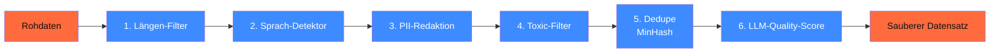

## Worum es geht

> Stop training on garbage data. — Modell-Qualität ist 80 % Daten-Qualität. Diese Lektion zeigt, wie du Instruction-Tuning-Datasets baust, die wirklich besser machen statt verschlechtern.

## Voraussetzungen

- Lektion 12.01 (Trade-offs)
- Phase 11.02 (Pydantic AI — du kennst strukturierte Outputs)

## Konzept

### Drei Instruction-Tuning-Formate

#### 1. Alpaca-Format (Stanford, 2023)

```json
{
  "instruction": "Klassifiziere die folgende Support-E-Mail.",
  "input": "Mein Passwort funktioniert seit gestern nicht mehr.",
  "output": "Kategorie: Login. Dringlichkeit: 3."
}
```

Einfachster Format. Wann: einfache Aufgaben mit klarer Input/Output-Struktur.

#### 2. ChatML (OpenAI, 2023+, jetzt Standard)

```json
{
  "messages": [
    {"role": "system", "content": "Du bist Support-Klassifikator."},
    {"role": "user", "content": "Mein Passwort funktioniert nicht."},
    {"role": "assistant", "content": "Kategorie: Login. Dringlichkeit: 3."}
  ]
}
```

**Empfohlen für 2026.** Multi-Turn-tauglich, mit System-Prompt. Alle modernen Modelle (Llama 3.3, Qwen3, Mistral) erwarten dieses Format.

#### 3. ShareGPT-Format (Konversationen)

```json
{
  "conversations": [
    {"from": "human", "value": "..."},
    {"from": "gpt", "value": "..."}
  ]
}
```

Älteres Format, kommt aus den frühen LLaMA-Forks. Die meisten Tools (axolotl, Unsloth) konvertieren intern zu ChatML.

### Mengen-Faustregeln 2026

| Aufgabe | Min. Samples | Empfohlen |
|---|---|---|
| Tone-of-Voice / Stil | 200 | 500–2.000 |
| Domain-Vokabular | 1.000 | 5.000–20.000 |
| Strukturierte Outputs | 500 | 2.000 |
| Multi-Turn-Conversations | 2.000 | 10.000 |
| Komplexe Reasoning | 5.000 | 50.000+ |

> Bei < 200 Beispielen: **Few-Shot im Prompt** (Phase 11.01) ist oft besser als Finetuning.

### Qualitätsfilter — sechs Pflicht-Schritte



#### Schritt 1: Längen-Filter

```python
def laengen_filter(sample: dict) -> bool:
    user = sample["messages"][-2]["content"]
    assistant = sample["messages"][-1]["content"]
    return (
        20 <= len(user) <= 4000
        and 10 <= len(assistant) <= 2000
        and len(assistant.split()) >= 3
    )
```

#### Schritt 2: Sprach-Detektor (Deutsch)

```python
import fasttext

# Kleines Modell (~ 130 MB), 99 % Accuracy auf DE
modell = fasttext.load_model("lid.176.bin")

def ist_deutsch(text: str) -> bool:
    pred = modell.predict(text.replace("\n", " "), k=1)
    return pred[0][0] == "__label__de" and pred[1][0] > 0.85
```

#### Schritt 3: PII-Redaktion

```python
import re

PII_PATTERNS = {
    "email": re.compile(r"[\w.+-]+@[\w-]+\.[\w.-]+"),
    "telefon": re.compile(r"\+?[\d\s\-\(\)]{10,18}"),
    "iban": re.compile(r"DE\d{20}"),
    "ust_id": re.compile(r"DE\d{9}"),
}

def redaktiere(text: str) -> str:
    for typ, pattern in PII_PATTERNS.items():
        text = pattern.sub(f"<{typ.upper()}>", text)
    return text
```

> Für Production: nimm **Presidio** (Microsoft, [microsoft.github.io/presidio](https://microsoft.github.io/presidio/)) oder kommerzielle PII-Detektoren mit DE-Sprachunterstützung.

#### Schritt 4: Toxic-Filter

Llama Guard 3 (8B, [huggingface.co/meta-llama/Llama-Guard-3-8B](https://huggingface.co/meta-llama/Llama-Guard-3-8B)) lokal als Filter:

```python
from transformers import pipeline

guard = pipeline(
    "text-generation",
    model="meta-llama/Llama-Guard-3-8B",
    torch_dtype="bfloat16",
    device_map="auto",
)

def ist_safe(text: str) -> bool:
    result = guard(text, max_new_tokens=20)
    return "safe" in result[0]["generated_text"].lower()
```

#### Schritt 5: Deduplizierung mit MinHash

Duplikate (auch Near-Duplicates) verschmutzen Datasets. Pattern mit `datasketch`:

```python
from datasketch import MinHash, MinHashLSH

lsh = MinHashLSH(threshold=0.85, num_perm=128)
unique_samples = []

for i, sample in enumerate(samples):
    m = MinHash(num_perm=128)
    for token in sample["messages"][-1]["content"].split():
        m.update(token.encode())
    if not lsh.query(m):  # noch nicht ähnlich genug zu existierendem
        lsh.insert(f"sample-{i}", m)
        unique_samples.append(sample)
```

#### Schritt 6: LLM-Quality-Score

Mit Pydantic AI (Phase 11.02):

```python
from pydantic_ai import Agent
from pydantic import BaseModel, Field

class QualityScore(BaseModel):
    accuracy: int = Field(ge=1, le=5)
    completeness: int = Field(ge=1, le=5)
    style: int = Field(ge=1, le=5)
    pii_clean: bool

scorer = Agent(
    "anthropic:claude-haiku-4-5",  # günstig + schnell
    output_type=QualityScore,
    system_prompt="Bewerte die folgende Instruction-Response-Paar nach Genauigkeit, Vollständigkeit und Stil. PII-Check.",
)
```

Gefiltert wird auf z. B. `accuracy >= 4 and completeness >= 4 and pii_clean`.

### Synthetische Daten — wann ja, wann nein

**Ja**, wenn:

- Du ein **Klassifikations-Schema** anreichern willst (Beispiele pro Klasse)
- Du **Edge-Cases** brauchst, die in echten Daten selten sind
- Du **Tone-of-Voice** demonstrierst (Stil-Beispiele generieren)

**Nein**, wenn:

- Du **Faktenwissen** trainieren willst (Halluzinationen werden gelernt)
- Du **Kreativität** trainieren willst (Mode Collapse)
- Du das mit demselben Modell machst, das du dann finetunest (kein Information-Gain)

> Pattern 2026: synthetische Daten mit **stärkerem Modell** (Claude Sonnet 4.6, GPT-5.5) generieren, damit das **schwächere Modell** (Llama-3.3-7B) lernt. Asymmetrie ist Pflicht.

### Daten-Versionierung mit DVC

Pflicht für AI-Act Art. 10:

```bash
# Setup
uv pip install "dvc[s3]"
dvc init && dvc remote add -d storage s3://meine-trainings-daten

# Daten hinzufügen
dvc add datasets/instruktionen-2026-04.jsonl
git add datasets/instruktionen-2026-04.jsonl.dvc
git commit -m "data: instruktionen v1 (12.345 samples, sha256:abc...)"
dvc push
```

Im Trainings-Manifest:

```yaml
dataset:
  name: "instruktionen-2026-04"
  dvc_path: "datasets/instruktionen-2026-04.jsonl.dvc"
  sha256: "abc123..."
  samples: 12345
  filter_pipeline: ["laengen", "deutsch>=0.85", "pii-redacted", "toxic-filtered", "deduped", "llm-score>=4"]
  source_consent: "interne MA, Einwilligung 2026-03"
```

### Deutsche Datasets als Bausteine

| Dataset | Zweck | Lizenz | URL |
|---|---|---|---|
| **GermanQuAD** | QA / Reading-Comprehension | CC-BY-4.0 | <https://huggingface.co/datasets/deepset/germanquad> |
| **10kGNAD** | Klassifikation (News-Topics) | CC-BY-NC-SA | <https://github.com/tblock/10kGNAD> |
| **GermEval-2024 GerMS-Detect** | Sexismus-Detection | CC-BY-NC | <https://ofai.github.io/GermEval2024-GerMS/> |
| **LLäMmlein-Dataset** | Instruction-Mix | check pro Subset | <https://huggingface.co/datasets/LSX-UniWue/LLaMmlein-Dataset> |
| **Aleph-Alpha-GermanWeb** | Pretraining (628 Mrd. Wörter) | open-aleph-license | <https://huggingface.co/datasets/Aleph-Alpha/Aleph-Alpha-GermanWeb> |
| **EuroLLM-Instruct** | Multilingual Instruction-Tuning | check Lizenz | <https://huggingface.co/utter-project/EuroLLM-22B-Instruct-2512> |

> Lizenz-Disziplin: bei kommerziellem Einsatz **NC-Lizenzen ausschließen** (10kGNAD ist NC! → nur Forschung). Aleph-Alpha-GermanWeb hat eine eigene Lizenz, die im Detail gegen die Use-Case-Bedingungen geprüft werden muss.

## Hands-on

1. Bau einen einfachen `qualitaets_pipeline.py` mit den 6 Filter-Schritten
2. Lade GermanQuAD (1.000 samples) und konvertiere zu ChatML
3. Führe Pipeline durch — wie viele samples überleben?
4. Erzeuge mit Claude Haiku 4.5 100 synthetische Edge-Cases für deine Domäne — bewerte mit Quality-Score-Agent

## Selbstcheck

- [ ] Du kennst Alpaca, ChatML und ShareGPT-Formate.
- [ ] Du baust eine 6-Schritt-Qualitätspipeline.
- [ ] Du nutzt Llama Guard 3 für Toxic-Filter.
- [ ] Du dedupliziertst mit MinHash.
- [ ] Du versionierst Datasets mit DVC + SHA-256.

## Compliance-Anker

- **Daten-Governance (AI-Act Art. 10)**: Datenherkunft, Lizenz, Filter dokumentiert
- **DSGVO Art. 5 lit. b (Zweckbindung)**: Trainings-Daten dürfen nur für den ursprünglichen Zweck verwendet werden — Mandanten-Daten brauchen separate Einwilligung
- **DSGVO Art. 9**: bei Gesundheits-/Religion-/Politik-Daten besondere Anforderungen — meistens vermeiden
- **Privacy by Design (Art. 25)**: PII-Redaktion vor Training, kein Reverse-Engineering möglich

## Quellen

- Alpaca-Format (Stanford 2023) — <https://github.com/tatsu-lab/stanford_alpaca>
- ChatML — <https://github.com/openai/openai-python/blob/main/chatml.md>
- Microsoft Presidio (PII) — <https://microsoft.github.io/presidio/>
- Llama Guard 3 — <https://huggingface.co/meta-llama/Llama-Guard-3-8B>
- datasketch (MinHash-LSH) — <https://github.com/ekzhu/datasketch>
- DVC Docs — <https://dvc.org/doc>
- GermanQuAD-Paper — <https://arxiv.org/abs/2104.12741>

## Weiterführend

→ Lektion **12.04** (Qualitätsfilter im Detail mit Code)
→ Lektion **12.05** (Trainings-Stack)
→ Phase **20.04** (UrhG-§-44b-TDM-Schranke + Daten-Lizenz)
