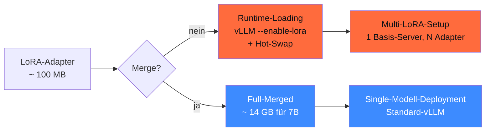

## Worum es geht

> Stop confusing adapter and full-merged weights. — beide haben ihre Use-Cases. Diese Lektion zeigt: wann ist Merging sinnvoll, wann sind separate Adapter besser.

## Voraussetzungen

- Lektion 12.05 (Trainings-Stack)

## Konzept

### Zwei Pfade



### Wann mergen

- **Single-Domain-Modell** im Production: ein Adapter, eine Use-Case-Spezialisierung
- **Quantisierung post-merge** (z. B. AWQ-Quantization) — Adapter müssen vorher gemerged sein
- **Modell-Distribution** über HF Hub als „custom model" (kein Adapter-Hub-Pflicht)
- **Multi-Stage-Training**: Adapter mergen, dann zweites LoRA drüber trainieren

### Wann **nicht** mergen (Multi-LoRA-Pattern)

- **Mehrere Spezialisierungen** auf einem Server (z. B. Recht + Medizin + Code)
- **Tenant-Isolation**: jeder Mandant hat seinen eigenen Adapter
- **A/B-Testing**: zwei Adapter-Varianten parallel auf demselben Basis-Modell
- **Speicher-Optimierung**: 100 MB pro Adapter vs. 14 GB pro merged Modell

### Mergen — Code-Pattern

```python
from peft import AutoPeftModelForCausalLM
from transformers import AutoTokenizer

# Adapter laden
modell = AutoPeftModelForCausalLM.from_pretrained(
    "adapters/llama33-8b-germanquad",
    torch_dtype="bfloat16",
)
tokenizer = AutoTokenizer.from_pretrained("meta-llama/Llama-3.3-8B-Instruct")

# Mergen — Adapter ins Basis-Modell einrechnen
gemerged = modell.merge_and_unload()

# Save als Standard HF-Modell
gemerged.save_pretrained("merged/llama33-8b-germanquad-merged",
                         safe_serialization=True)
tokenizer.save_pretrained("merged/llama33-8b-germanquad-merged")
```

> Output: Standard-HF-Modell-Verzeichnis mit `model.safetensors` + `config.json` + `tokenizer*`. Kann mit jedem Inference-Server geladen werden.

### Disk-Storage-Trade-off

Bei Llama-3.3-8B:

| Format | Größe |
|---|---|
| Adapter (LoRA r=16, FP16) | ~ 100 MB |
| Adapter (LoRA r=64, FP16) | ~ 400 MB |
| Merged-Modell (FP16) | ~ 16 GB |
| Merged-Modell (BF16) | ~ 16 GB |
| Merged-Modell (4-bit AWQ) | ~ 5 GB |

Wenn du 10 Adapter speicherst: 1 GB. Wenn du 10 Merged-Modelle speicherst: 160 GB.

### Latency-Trade-off

| Modus | TTFT | Throughput |
|---|---|---|
| **Merged** (Standard vLLM) | Baseline | Baseline |
| **Adapter-Loading** (vLLM `--enable-lora`) | + 5–10 % | gleich |
| **Hot-Swap** (Adapter pro Request) | + 30–50 % bei kalt | bei warm cache normal |

> Faustregel 2026: für ≤ 5 Spezialisierungen mit konstanter Last ist Multi-LoRA-Hot-Swap ausreichend. Ab > 10 Adaptern oder bei sehr engen Latenz-SLAs: Merged-Modelle pro Adapter.

### Mergen + Quantisieren

Nach dem Mergen kannst du quantisieren — das geht **nur** nach dem Merge:

```bash
# AWQ-Quantization (post-merge)
uv pip install autoawq

python -c "
from awq import AutoAWQForCausalLM
from transformers import AutoTokenizer

model_path = 'merged/llama33-8b-germanquad-merged'
quant_path = 'quantized/llama33-8b-germanquad-awq'

modell = AutoAWQForCausalLM.from_pretrained(model_path)
tokenizer = AutoTokenizer.from_pretrained(model_path)

quant_config = {'zero_point': True, 'q_group_size': 128, 'w_bit': 4, 'version': 'GEMM'}
modell.quantize(tokenizer, quant_config=quant_config)

modell.save_quantized(quant_path)
tokenizer.save_pretrained(quant_path)
"
```

Output: ~ 5 GB AWQ-Modell, lädt schnell in vLLM, ~ 80 % der FP16-Qualität bei 25 % VRAM.

### HF Hub-Upload

```python
from huggingface_hub import HfApi

api = HfApi()
api.upload_folder(
    folder_path="merged/llama33-8b-germanquad-merged",
    repo_id="dein-namespace/llama33-8b-germanquad-merged",
    repo_type="model",
    token=os.environ["HF_TOKEN"],
    commit_message="Initial release: LoRA-merged Llama-3.3-8B auf GermanQuAD",
)
```

Pflicht in der Modell-Card (`README.md` im Repo):

```markdown
---
license: llama3.3-community
language: ["de"]
base_model: meta-llama/Llama-3.3-8B-Instruct
tags: ["lora", "german", "qa"]
datasets: ["deepset/germanquad"]
---

# Llama-3.3-8B GermanQuAD

LoRA-Finetuning auf GermanQuAD (12.345 samples), 3 Epochen, r=16.

**Beabsichtigter Use-Case**: deutsche QA-Tasks im Mandanten-Bot.

**Bias-Audit**: GerBBQ+ Score 0.78 (Baseline 0.72 — leichte Verbesserung).

**Lizenz**: Llama-Community-License (vom Basis-Modell geerbt).
```

> **Pflicht für AI-Act Art. 12**: Modell-Card mit Datenherkunft, Hyperparametern, Eval-Scores, Lizenz, Daten-Hash.

### Versionierung

```bash
git tag llama33-8b-germanquad-v1.0
git tag -a llama33-8b-germanquad-v1.0 -m "Initial release"

# HF Hub: Tag im Repo
api.create_tag(
    repo_id="dein-namespace/llama33-8b-germanquad-merged",
    tag="v1.0",
    repo_type="model",
)
```

## Hands-on

1. Adapter aus Lektion 12.05 mergen
2. Größen-Vergleich: Adapter (MB) vs. Merged (GB)
3. AWQ-Quantization auf Merged-Modell durchführen
4. Beide Versionen in vLLM laden und Throughput vergleichen
5. Modell-Card schreiben + zu HF Hub uploaden (privater Test-Repo)

## Selbstcheck

- [ ] Du nennst die Trade-offs Merging vs. Runtime-Loading.
- [ ] Du mergest einen LoRA-Adapter mit `merge_and_unload()`.
- [ ] Du quantisierst ein Merged-Modell mit AWQ.
- [ ] Du schreibst eine vollständige Modell-Card.
- [ ] Du versionierst Modelle mit Git-Tags + HF-Tags.

## Compliance-Anker

- **Modell-Version-Tracking (AI-Act Art. 12)**: jede Version = Tag, Modell-Card mit Datenherkunft
- **Lizenz-Erbung**: bei Llama-Basis bleibt Llama-Community-License + Attribution-Pflicht

## Quellen

- PEFT `merge_and_unload()` — <https://huggingface.co/docs/peft/main/en/package_reference/lora>
- AutoAWQ — <https://github.com/casper-hansen/AutoAWQ>
- HF Hub Upload — <https://huggingface.co/docs/huggingface_hub/guides/upload>
- Modell-Card-Template — <https://huggingface.co/docs/hub/model-cards>

## Weiterführend

→ Lektion **12.07** (Multi-LoRA-Inference mit vLLM)
→ Phase **17.02** (vLLM mit Adapter-Hot-Swap)
