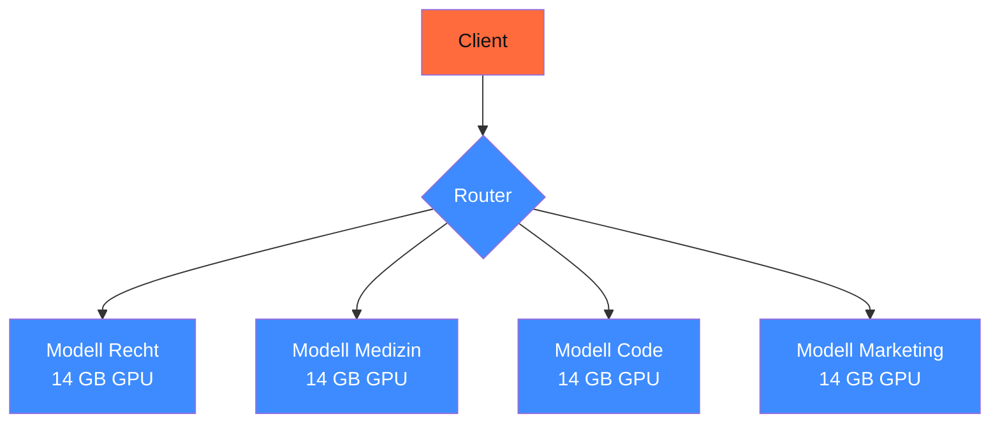
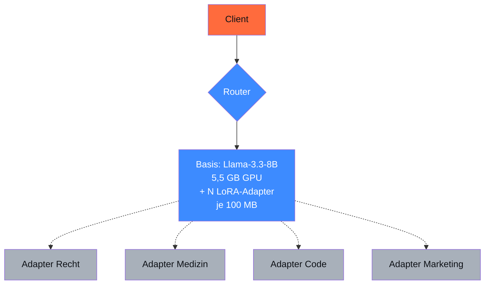

## Worum es geht

> Stop deploying 10 modelle for 10 specializations. — vLLM Multi-LoRA: ein Basis-Modell, beliebig viele Adapter, Hot-Swap pro Request. Massive Cost-Ersparnis bei Mandanten-Stacks.

## Voraussetzungen

- Lektion 12.06 (Merging vs. Runtime)
- Phase 17.02 (vLLM Production-Stack)

## Konzept

### Architektur-Vergleich

#### Pattern 1: separate Modelle pro Spezialisierung (naiv)



GPU-Bedarf: 4 × 14 GB = 56 GB. Cost: 4× H100. Plus: jede Modell-Switch braucht Reload.

#### Pattern 2: Multi-LoRA auf einem Basis-Modell



GPU-Bedarf: 1× H100 (5,5 GB Basis + 4 × 100 MB Adapter = 6 GB). Cost: 1 GPU statt 4. Latency-Penalty: 5–10 % beim Adapter-Switch (gecached).

### vLLM-Setup für Multi-LoRA

Stand vLLM v0.20.0 (siehe Lektion 17.02):

```bash
# Server mit Multi-LoRA-Support starten
uv run python -m vllm.entrypoints.openai.api_server \
    --model meta-llama/Llama-3.3-8B-Instruct \
    --enable-lora \
    --max-loras 8 \
    --max-lora-rank 32 \
    --max-cpu-loras 16 \
    --port 8000
```

Wichtige Flags:

| Flag | Zweck |
|---|---|
| `--enable-lora` | Multi-LoRA aktivieren |
| `--max-loras` | max. Anzahl simultan auf GPU geladener Adapter |
| `--max-lora-rank` | max. r-Wert (muss ≥ allen Adaptern sein) |
| `--max-cpu-loras` | LRU-Cache-Größe für nicht-aktive Adapter |
| `--lora-modules` | initiale Adapter beim Start |

### Adapter dynamisch hinzufügen

Stand 2026 (`VLLM_ALLOW_RUNTIME_LORA_UPDATING=True`):

```bash
# Adapter zur Laufzeit registrieren
curl -X POST http://localhost:8000/v1/load_lora_adapter \
  -H "Content-Type: application/json" \
  -d '{
    "lora_name": "recht",
    "lora_path": "./adapters/llama33-8b-recht"
  }'

# Adapter wieder entfernen
curl -X POST http://localhost:8000/v1/unload_lora_adapter \
  -H "Content-Type: application/json" \
  -d '{"lora_name": "recht"}'
```

### Request mit spezifischem Adapter

```python
from openai import OpenAI

client = OpenAI(base_url="http://localhost:8000/v1", api_key="dummy")

response = client.chat.completions.create(
    model="recht",  # statt Basis-Modell-Name
    messages=[
        {"role": "user", "content": "Erkläre § 5 DSGVO."}
    ],
)
```

vLLM lädt automatisch den `recht`-Adapter (oder cached aus LRU), wendet ihn auf die Inferenz an.

### LRU-Cache und Performance

Bei `--max-loras 8 --max-cpu-loras 16`:

- 8 Adapter aktiv auf GPU (Hot-Cache)
- weitere 16 Adapter im RAM (Warm-Cache)
- ältere Adapter aus dem Disk-Storage geladen (Cold-Cache)

Latency:

| Cache-Level | Adapter-Switch-Latency |
|---|---|
| Hot (auf GPU) | ~ 0 ms |
| Warm (im RAM) | ~ 50–100 ms |
| Cold (vom Disk) | ~ 500–2.000 ms |

### Use-Case: Mandanten-Isolation

Pattern für Multi-Mandanten-SaaS:

```python
# Jeder Mandant hat eigenen LoRA-Adapter
mandanten_adapter_map = {
    "kanzlei-mueller": "kanzlei-mueller-style-v3",
    "kanzlei-schmidt": "kanzlei-schmidt-style-v2",
    "ag-saskia": "ag-saskia-style-v1",
}

def request_fuer_mandant(mandant_id: str, frage: str):
    adapter = mandanten_adapter_map[mandant_id]
    return client.chat.completions.create(
        model=adapter,
        messages=[{"role": "user", "content": frage}],
    )
```

Vorteile:

- Mandant A's Stil leakt nicht in Mandant B's Antworten
- Jeder Mandant kann eigene Beispiele zur Verbesserung beisteuern
- DSGVO-saubere Trennung (Adapter = mandanten-spezifisch)

### Performance-Tuning

Bei vielen kleinen Adaptern auf einem 8B-Basis-Modell:

```bash
uv run python -m vllm.entrypoints.openai.api_server \
    --model meta-llama/Llama-3.3-8B-Instruct \
    --enable-lora \
    --max-loras 16 \           # mehr aktive Adapter
    --max-lora-rank 32 \
    --max-cpu-loras 64 \       # größerer LRU-Cache
    --gpu-memory-utilization 0.85 \  # mehr Buffer für Adapter-VRAM
    --quantization awq \       # Basis quantisieren — Adapter bleiben FP16
    --max-model-len 16384
```

### Audit-Trail für Adapter-Calls

Pflicht für Mandanten-isolierte Setups:

```python
import logging
from datetime import datetime, UTC

def request_with_audit(mandant_id: str, adapter: str, frage: str):
    logging.info(
        "lora_request",
        extra={
            "mandant": mandant_id,
            "adapter": adapter,
            "ts": datetime.now(UTC).isoformat(),
            "request_hash": hash(frage),
        }
    )
    return client.chat.completions.create(
        model=adapter,
        messages=[{"role": "user", "content": frage}],
    )
```

Im Audit-Log nachvollziehbar: welcher Mandant hat wann welchen Adapter genutzt → DSFA-tauglich.

### Limitationen

- **Adapter-Rank**: alle Adapter müssen ≤ `--max-lora-rank` haben — Mix von r=16 + r=64 nur mit `--max-lora-rank 64`
- **Basis-Modell**: alle Adapter müssen auf dasselbe Basis-Modell trainiert sein — kein Mix Llama+Mistral
- **Quantisierung**: Adapter bleibt FP16 selbst bei AWQ-Basis. Plant +200 MB pro Adapter ein
- **Cold-Start**: erster Request pro Adapter ist langsamer (Cold-Cache)

## Hands-on

1. vLLM mit `--enable-lora` starten + 2 Adapter aus Lektion 12.05 laden
2. Request mit Adapter A schicken, dann mit Adapter B — Latency messen
3. Dynamisches Adapter-Loading via REST-API testen
4. Mandanten-Pattern: 3 Test-Adapter, 9 Requests, prüfen ob keine Cross-Contamination

## Selbstcheck

- [ ] Du erklärst Multi-LoRA-Architektur und ihren Cost-Vorteil.
- [ ] Du startest vLLM mit `--enable-lora` und korrekten Flags.
- [ ] Du lädst Adapter dynamisch via REST-API.
- [ ] Du implementierst Mandanten-Isolation mit Adapter-Map.
- [ ] Du loggst jeden Adapter-Call audit-fähig.

## Compliance-Anker

- **Mandanten-Isolation (DSGVO)**: jeder Adapter = ein Mandant, keine Cross-Contamination
- **Audit-Trail (AI-Act Art. 12)**: Adapter-Name + Mandant + Request-Hash strukturiert geloggt
- **Robustness (Art. 15)**: Cost-Cap pro Adapter über LiteLLM-Proxy (Phase 17.07)

## Quellen

- vLLM LoRA-Adapter — <https://docs.vllm.ai/en/latest/features/lora/>
- vLLM Releases v0.20.0 — <https://github.com/vllm-project/vllm/releases>
- Unsloth vLLM-Hot-Swap-Guide — <https://unsloth.ai/docs/basics/inference-and-deployment/vllm-guide/lora-hot-swapping-guide>

## Weiterführend

→ Lektion **12.08** (Hands-on: QLoRA auf Qwen3 + Multi-LoRA-Deployment)
→ Phase **17.06** (Helm-Chart-Deployment für Multi-LoRA-Setup)
