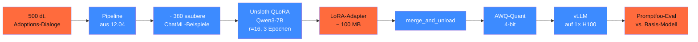

## Worum es geht

> Stop talking, start training. — diese Lektion baut **end-to-end** ein QLoRA auf Qwen3-7B mit 500 deutschen Charity-Dialogen. Auf RTX 4090 in ~ 2 h Trainingszeit, danach merged + AWQ-quantisiert + auf vLLM deployed.

## Voraussetzungen

- Lektionen 12.05–12.07 durchgearbeitet
- NVIDIA-GPU mit ≥ 24 GB VRAM (RTX 4090 / RTX 5090) oder Cloud-H100
- HuggingFace-Account mit Qwen3-Lizenz-Akzeptanz

## Konzept

### Das Szenario

Eine Tierschutz-Organisation hat:

- 500 echte Adoptions-Anfragen + Antworten (anonymisiert)
- Ziel: Modell soll **Stil + Tonfall** der Mitarbeiter:innen lernen
- Constraint: lokal lauffähig (kein Cloud-Provider mit AVV-Pflicht)

### Pipeline-Übersicht



### Schritt 1 — Daten laden + filtern

```python
import json
from pathlib import Path

# 500 ChatML-Beispiele
roh = [json.loads(zeile) for zeile in Path("daten/adoptions_dialoge.jsonl").read_text().splitlines()]

# Pipeline aus Lektion 12.04
from werkzeuge.qualitaets_pipeline import de_qualitaets_pipeline

sauber = list(de_qualitaets_pipeline(iter(roh)))
print(f"Sauber: {len(sauber)} / {len(roh)} = {len(sauber)/len(roh)*100:.0f}%")
# Erwartung: ~ 380 Beispiele (76 % Yield-Rate)

# Speichern für Reproduzierbarkeit
Path("daten/adoptions_sauber.jsonl").write_text(
    "\n".join(json.dumps(s) for s in sauber)
)
```

### Schritt 2 — Unsloth + Qwen3-7B laden

```python
from unsloth import FastLanguageModel
from datasets import Dataset

modell, tokenizer = FastLanguageModel.from_pretrained(
    model_name="unsloth/Qwen3-7B-Instruct-bnb-4bit",
    max_seq_length=2048,
    dtype=None,
    load_in_4bit=True,
)

modell = FastLanguageModel.get_peft_model(
    modell,
    r=16,
    lora_alpha=32,
    lora_dropout=0.05,
    target_modules=["q_proj", "k_proj", "v_proj", "o_proj",
                    "gate_proj", "up_proj", "down_proj"],
    bias="none",
    use_gradient_checkpointing="unsloth",
    random_state=42,
)
```

### Schritt 3 — Datensatz vorbereiten

```python
def format_chatml(eintrag: dict) -> dict:
    """ChatML-Format → reiner Text für SFT."""
    text = ""
    for msg in eintrag["messages"]:
        role = msg["role"]
        content = msg["content"]
        text += f"<|im_start|>{role}\n{content}<|im_end|>\n"
    return {"text": text}

dataset = Dataset.from_list(sauber).map(format_chatml)
print(f"Dataset: {len(dataset)} samples")
```

### Schritt 4 — SFT-Training

```python
from trl import SFTTrainer
from transformers import TrainingArguments

trainer = SFTTrainer(
    model=modell,
    tokenizer=tokenizer,
    train_dataset=dataset,
    dataset_text_field="text",
    max_seq_length=2048,
    packing=True,
    args=TrainingArguments(
        per_device_train_batch_size=4,
        gradient_accumulation_steps=4,  # eff. Batch 16
        warmup_ratio=0.1,
        num_train_epochs=3,
        learning_rate=2e-4,
        bf16=True,
        logging_steps=10,
        save_strategy="epoch",
        optim="adamw_8bit",
        weight_decay=0.01,
        lr_scheduler_type="cosine",
        seed=42,
        output_dir="outputs/qwen3-7b-charity",
        report_to="tensorboard",  # oder "wandb"
    ),
)

# Training läuft ~ 2 h auf RTX 4090
trainer.train()

# Adapter speichern
modell.save_pretrained("adapters/qwen3-7b-charity")
tokenizer.save_pretrained("adapters/qwen3-7b-charity")
```

### Schritt 5 — Adapter testen (vor Merge)

```python
from peft import AutoPeftModelForCausalLM
from transformers import AutoTokenizer

modell_test = AutoPeftModelForCausalLM.from_pretrained(
    "adapters/qwen3-7b-charity",
    torch_dtype="bfloat16",
    device_map="auto",
)
tokenizer = AutoTokenizer.from_pretrained("adapters/qwen3-7b-charity")

prompt = "Hallo, ich interessiere mich für die Adoption eines älteren Hundes. Was muss ich beachten?"
inputs = tokenizer(prompt, return_tensors="pt").to("cuda")
out = modell_test.generate(**inputs, max_new_tokens=200, do_sample=True, temperature=0.7)
print(tokenizer.decode(out[0], skip_special_tokens=True))
```

### Schritt 6 — Adapter mergen + quantisieren

```python
gemerged = modell_test.merge_and_unload()
gemerged.save_pretrained("merged/qwen3-7b-charity-merged",
                         safe_serialization=True)

# AWQ-Quantization
from awq import AutoAWQForCausalLM

modell_awq = AutoAWQForCausalLM.from_pretrained("merged/qwen3-7b-charity-merged")
modell_awq.quantize(tokenizer, quant_config={
    "zero_point": True, "q_group_size": 128, "w_bit": 4, "version": "GEMM"
})
modell_awq.save_quantized("quantized/qwen3-7b-charity-awq")
```

### Schritt 7 — vLLM-Deployment

```bash
uv run python -m vllm.entrypoints.openai.api_server \
    --model quantized/qwen3-7b-charity-awq \
    --quantization awq \
    --max-model-len 16384 \
    --gpu-memory-utilization 0.85 \
    --port 8000
```

### Schritt 8 — Promptfoo-Eval

`promptfooconfig.yaml`:

```yaml
description: "Vergleich Basis vs. QLoRA-Charity"

prompts:
  - "{{frage}}"

providers:
  - id: openai:qwen3-7b-instruct
    config:
      apiHost: localhost
      apiBase: http://localhost:8001/v1  # Port 8001 = Basis-Modell
  - id: openai:qwen3-7b-charity-awq
    config:
      apiHost: localhost
      apiBase: http://localhost:8000/v1  # Port 8000 = Finetune

tests:
  - vars:
      frage: "Hallo, ich möchte einen Hund adoptieren. Wie läuft das ab?"
    assert:
      - type: llm-rubric
        value: "Antwort enthält empathischen Tonfall, Fragen zur Lebenssituation, kein Verkaufston"
  - vars:
      frage: "Sind Bürohunde willkommen?"
    assert:
      - type: contains-any
        value: ["Probetage", "Schnupperbesuch", "Termin"]
  # 8 weitere Tests …
```

```bash
npx promptfoo eval --config promptfooconfig.yaml
```

Erwartung: das Finetune-Modell schneidet 15–25 % besser auf der LLM-Rubric ab (Stil + Domänen-Wissen).

### Reproduzierbarkeits-Manifest

```yaml
# manifests/qwen3-7b-charity-v1.0.yaml
basis_modell: "Qwen/Qwen3-7B-Instruct"
adapter_pfad: "adapters/qwen3-7b-charity"
merged_pfad: "merged/qwen3-7b-charity-merged"
quantisiert_pfad: "quantized/qwen3-7b-charity-awq"

datensatz:
  pfad: "daten/adoptions_sauber.jsonl"
  sha256: "abc123..."
  samples: 380
  filter_yield_rate: 0.76

hyperparameter:
  r: 16
  lora_alpha: 32
  lora_dropout: 0.05
  target_modules: 7
  optimizer: "adamw_8bit"
  learning_rate: 2e-4
  num_epochs: 3
  batch_size_eff: 16
  seed: 42

eval:
  basis_score: 0.62
  finetune_score: 0.81
  benchmark: "promptfoo-charity-10-tests"

zeitstempel: "2026-04-29T14:00:00Z"
trainings_dauer_h: 2.0
gpu: "RTX 4090"
```

## Hands-on (4–6 h, je nach GPU)

1. Daten besorgen (eigene oder synthetische 500 dt. Charity-Dialoge)
2. Pipeline-Filter laufen lassen → Yield-Rate dokumentieren
3. Unsloth-Training starten (~ 2 h auf RTX 4090)
4. Adapter testen mit 5 Beispiel-Prompts
5. Mergen + AWQ-Quantization
6. vLLM-Deployment + Promptfoo-Eval gegen Basis-Modell
7. Manifest committen für Audit-Trail

## Selbstcheck

- [ ] Du baust eine End-to-End-QLoRA-Pipeline.
- [ ] Du dokumentierst Yield-Rate, Hyperparameter, Eval-Scores.
- [ ] Du mergest + quantisierst + deployest auf vLLM.
- [ ] Du vergleichst Finetune mit Basis-Modell via Promptfoo.
- [ ] Du committest ein Reproduzierbarkeits-Manifest.

## Compliance-Anker

- **Daten-Governance (AI-Act Art. 10)**: Datenherkunft + Pseudonymisierung + Filter dokumentiert
- **Audit-Trail (Art. 12)**: Manifest mit Hash + Hyperparametern + Eval-Scores
- **Robustness (Art. 15)**: Promptfoo-Eval als CI-Gate
- **Privacy by Design (DSGVO Art. 25)**: PII vor Training redaktiert
- **Zweckbindung (Art. 5)**: Trainings-Daten = nur für Adoptions-Use-Case

## Quellen

- Unsloth Qwen3-Notebooks — <https://github.com/unslothai/notebooks>
- Qwen3-Modell auf HF — <https://huggingface.co/Qwen>
- AutoAWQ — <https://github.com/casper-hansen/AutoAWQ>
- Promptfoo — <https://www.promptfoo.dev/docs/intro/>

## Weiterführend

→ Phase **13** (RAG — kombiniere LoRA-Spezialisierung mit RAG-Wissensbasis)
→ Phase **17** (Production EU-Hosting — deploy den Stack auf STACKIT)
→ Phase **18** (Bias-Audit — GerBBQ+ vs. dein Finetune)
→ Phase **19.C** (Capstone — Tierheim-Bot mit diesem Adapter)
