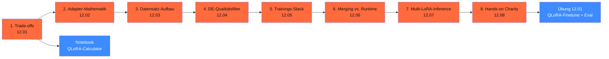

# Phase 12 · Finetuning & Adapter

> **Stop full-finetuning a 70B model.** — QLoRA + Unsloth machen das auf einer 4090. 80 % der DACH-Mittelstand-Use-Cases sind mit RAG (Phase 13) gelöst, weitere 15 % mit LoRA-Adaptern. Diese Phase zeigt, wann Finetuning wirklich lohnt — und wann nicht.

**Status**: ✅ vollständig ausgearbeitet · **Dauer**: ~ 12 h · **Schwierigkeit**: fortgeschritten

## 🎯 Was du in diesem Modul lernst

- **Trade-offs**: Full FT vs. LoRA vs. QLoRA mit klarer Entscheidungs-Reihenfolge
- **LoRA-Mathematik**: rank, alpha, target_modules, dropout — was wirklich zählt
- **Datensatz-Disziplin**: ChatML-Format, Qualitätsfilter, synthetische Daten mit Eval-Loop
- **DACH-spezifische Daten-Filter**: Komposita, Umlaute, Du/Sie, GerBBQ+ als Eval-Filter
- **Trainings-Stack 2026**: Unsloth (`2026.4.x`), axolotl (`v0.16.1`), TRL (`v1.3.0`), PEFT (`v0.19.1`)
- **Adapter-Workflow**: trainieren → testen → mergen → quantisieren → deployen
- **Multi-LoRA-Inference**: ein Basis-Modell, N Adapter, vLLM-Hot-Swap
- **End-to-End-Hands-on**: QLoRA auf Qwen3-7B mit 500 dt. Charity-Dialogen, ~ 2 h auf RTX 4090

## 🧭 Wie du diese Phase nutzt



## 📚 Inhalts-Übersicht

| Lektion | Titel | Dauer | Datei |
|---|---|---|---|
| 12.01 | Full Finetuning vs. LoRA vs. QLoRA — Trade-offs | 60 min | [`lektionen/01-finetuning-trade-offs.md`](lektionen/01-finetuning-trade-offs.md) ✅ |
| 12.02 | Adapter-Mathematik (rank, alpha, target_modules) | 45 min | [`lektionen/02-adapter-mathematik.md`](lektionen/02-adapter-mathematik.md) ✅ |
| 12.03 | Datensatz-Aufbau (Instruction-Tuning-Format) | 60 min | [`lektionen/03-datensatz-aufbau.md`](lektionen/03-datensatz-aufbau.md) ✅ |
| 12.04 | Qualitätsfilter für deutsche Datasets | 60 min | [`lektionen/04-qualitaetsfilter-deutsch.md`](lektionen/04-qualitaetsfilter-deutsch.md) ✅ |
| 12.05 | **Trainings-Stack 2026** (Unsloth, axolotl, TRL) | 75 min | [`lektionen/05-trainings-stack.md`](lektionen/05-trainings-stack.md) ✅ |
| 12.06 | Merging vs. Runtime-Loading | 45 min | [`lektionen/06-merging-vs-runtime.md`](lektionen/06-merging-vs-runtime.md) ✅ |
| 12.07 | Multi-LoRA-Inference mit vLLM | 60 min | [`lektionen/07-multi-lora-inference.md`](lektionen/07-multi-lora-inference.md) ✅ |
| 12.08 | **Hands-on: QLoRA auf Qwen3-7B mit dt. Charity-Dialogen** | 180 min | [`lektionen/08-hands-on-qlora-charity.md`](lektionen/08-hands-on-qlora-charity.md) ✅ |

## 💻 Hands-on-Projekt

**QLoRA-Calculator**: Marimo-Notebook, das VRAM-Bedarf, Trainings-Zeit und EUR-Kosten für QLoRA-Setups schätzt — basierend auf Modell-Größe, Rank, Datensatz und GPU-Wahl. Pricing-Stand 29.04.2026 (Scaleway H100 € 2,73/h, OVHcloud H200 € 3,50/h).

[](https://colab.research.google.com/github/s-a-s-k-i-a/ki-engineering-werkstatt/blob/main/dist-notebooks/phasen/12-finetuning-und-adapter/code/01_qlora_calculator.ipynb)

```bash
uv run marimo edit phasen/12-finetuning-und-adapter/code/01_qlora_calculator.py
```

Plus die [Übung 12.01](uebungen/01-aufgabe.md): End-to-End QLoRA-Finetune mit deutschem Domain-Datensatz, Pipeline + Trainings-Manifest + vLLM-Deployment + Promptfoo-Eval ([Lösungs-Skelett](loesungen/01_loesung.py)).

## 🧱 Stack-Wahl 2026 (Faustregel)

| Use-Case | Empfohlener Stack |
|---|---|
| Single-GPU-Prototyping | **Unsloth** (`2026.4.x`) — 2× schneller, 70 % weniger VRAM |
| Reproduzierbare Configs für Team | **axolotl** (`v0.16.1`) — YAML-First |
| Custom-Trainer / Forschung | **TRL** (`v1.3.0`) direkt |
| MoE-Finetuning | **axolotl** mit Fused-Kernels (15× schneller) |
| GRPO / Reasoning-Training | **TRL GRPOTrainer** |
| Multi-Mandanten-Deployment | **Multi-LoRA-vLLM** (Lektion 12.07) |
| 7B QLoRA, < 50 € Compute | **Unsloth + RTX 4090 lokal** oder Scaleway H100 |
| 70B QLoRA, < 200 € Compute | **axolotl + 1× H100/H200** auf Scaleway / OVHcloud |
| 405B QLoRA | **axolotl + Multi-GPU H100/H200** auf Scaleway / OVHcloud |

## ✅ Voraussetzungen

- Phase 11 (Pydantic AI + Eval) — du kennst Type-Safety + Promptfoo
- Phase 17.02 (vLLM) — für Multi-LoRA-Deployment
- Optional: NVIDIA-GPU mit ≥ 24 GB VRAM (RTX 4090 / 5090) oder EU-Cloud-Account

## ⚖️ DACH-Compliance-Anker

→ [`compliance.md`](compliance.md): Daten-Governance (AI-Act Art. 10), Reproduzierbarkeits-Manifest (Art. 12), UrhG-§-44b für Trainings-Daten, DSGVO Art. 5/25 für PII-Disziplin.

Phasen-spezifisch:

- **Trainings-Daten-Lizenz** — eigene Daten brauchen Einwilligung (DSGVO Art. 6/7); 10kGNAD ist NC (nur Forschung); Aleph-Alpha-GermanWeb hat eigene Lizenz (im Detail prüfen)
- **Modell-Lizenz-Erbung** — bei Llama-Basis bleibt Llama-Community-License + Attribution
- **PII-Disziplin** — Pipeline-Filter mit Audit-Log; lokale Pseudonymisierung
- **Reproduzierbarkeit** — axolotl-YAML / Unsloth-Manifest committed ins Repo

## 📖 Quellen (Auswahl)

- LoRA-Paper — <https://arxiv.org/abs/2106.09685>
- QLoRA-Paper — <https://arxiv.org/abs/2305.14314>
- Unsloth — <https://github.com/unslothai/unsloth>
- axolotl v0.16.1 — <https://github.com/axolotl-ai-cloud/axolotl/releases>
- TRL v1.3.0 — <https://github.com/huggingface/trl/releases>
- PEFT v0.19.1 — <https://github.com/huggingface/peft/releases>
- GermanQuAD — <https://huggingface.co/datasets/deepset/germanquad>
- Vollständig in [`weiterfuehrend.md`](weiterfuehrend.md).

## 🔄 Wartung

Stand: 29.04.2026 · Reviewer: Saskia Teichmann ([@s-a-s-k-i-a](https://github.com/s-a-s-k-i-a)) · Nächster Review: 07/2026 (Unsloth/axolotl/TRL-Versions-Update; HF-Datasets-Refresh). **Frameworks ändern sich quartalsweise** — bei Production-Einsatz Versions-Pinning Pflicht.
