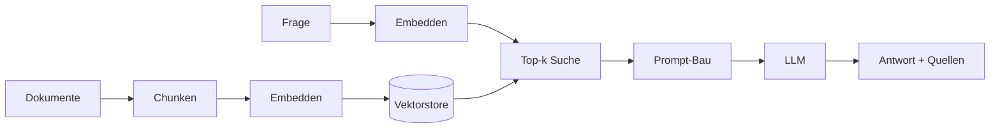

<!-- colab-badge:begin -->
[](https://colab.research.google.com/github/s-a-s-k-i-a/ki-engineering-werkstatt/blob/main/dist-notebooks/phasen/13-rag-tiefenmodul/code/01_vanilla_rag.ipynb)
<!-- colab-badge:end -->

## Worum es geht

> Stop pasting whole documents into prompts. — RAG holt nur die relevanten Schnipsel.

Die einfachste RAG-Pipeline hat **vier Schritte**:

1. **Chunken** — Dokumente in 200–500-Wort-Stücke schneiden.
2. **Embedden** — jedes Chunk zu einem Vektor.
3. **Retrieven** — Frage embedden, k ähnlichste Chunks finden.
4. **Generieren** — LLM mit „Frage + Chunks + Anweisung" prompten.



Das funktioniert erstaunlich gut. Vanilla RAG ist die **Baseline**, gegen die alle anderen Varianten antreten.

## Voraussetzungen

- Phase 0 (Werkstatt) — `uv sync` einmal gelaufen
- Phase 5 (Tokenizer/Embeddings) — du verstehst, was ein Embedding ist
- Phase 11 (LLM-Engineering) — du hast einen Pydantic-AI-Agent geschrieben

## Konzept

### Chunking

Faustregeln:

- **200–500 Tokens** pro Chunk für Antwort-Qualität
- **10–20 % Overlap** zwischen Chunks (vermeidet Schnitte mitten im Satz)
- **Strukturelle Boundaries** wenn möglich (Absatz, Überschrift)
- Auf **Deutsch besonders**: nicht mitten in Komposita schneiden — `langchain_text_splitters.RecursiveCharacterTextSplitter` mit `["\n\n", "\n", ". ", "! ", "? ", " "]` als Separatoren funktioniert gut

### Embedding-Wahl

Für Deutsch April 2026:

| Modell | Dim | Lizenz | DE-Qualität | EU-Hosting |
|---|---|---|---|---|
| `intfloat/multilingual-e5-large-instruct` | 1024 | MIT | sehr gut | self-host |
| `BAAI/bge-m3` | 1024 | MIT | sehr gut, multilingual | self-host |
| `Aleph-Alpha/Luminous-base-control` | varies | proprietär | exzellent für Deutsch | Heidelberg |
| `mistral-embed` | 1024 | proprietär | gut | Frankreich (AVV) |
| `openai/text-embedding-3-large` | 3072 | proprietär | sehr gut | USA (EU-Routing) |
| `nomic-ai/nomic-embed-text-v2` | 768 | Apache 2.0 | gut | self-host |

### Retrieval

Cosine-Similarity ist die einfachste Distanz-Funktion. Auf normierten Vektoren ist es äquivalent zum Skalarprodukt.

```python
sim = (a @ b) / (np.linalg.norm(a) * np.linalg.norm(b))
```

In der Praxis nutzt man eine Vektor-DB (Qdrant, pgvector, LanceDB) — sie machen das schnell auf Millionen Dokumenten via HNSW oder IVF.

### Prompt-Bau

```text
Du bist eine hilfreiche Assistenz. Beantworte die Frage NUR auf Basis der
folgenden Quellen. Wenn die Quellen nicht reichen, sag das.

Quellen:
[1] {{chunk1}}
[2] {{chunk2}}
[3] {{chunk3}}

Frage: {{frage}}

Antworte und nenne die verwendeten Quellen-Nummern.
```

## Code-Walkthrough

Im Notebook [`code/01_vanilla_rag.py`](../code/01_vanilla_rag.py):

1. Mini-Korpus mit 8 deutschen Wikipedia-Snippets (Recht, Tierwelt, Geschichte)
2. Chunking mit `RecursiveCharacterTextSplitter`
3. Embedding mit `sentence-transformers` `paraphrase-multilingual-MiniLM` (klein, smoke-test-tauglich)
4. In-Memory-Cosine-Search (NumPy)
5. Prompt-Bau und Stub-LLM-Aufruf (Antwort wird hier extrahiert, nicht generiert — für CI-Tests)
6. Quellen-Attribution

## Hands-on

Bearbeite [`uebungen/01-aufgabe.md`](../uebungen/01-aufgabe.md). Du wirst:

- Den Korpus auf 50 dt. Wikipedia-Artikel erweitern
- Chunking-Größe systematisch variieren
- Top-k variieren und gegen Ragas-Score plotten
- Pharia-1 oder Mistral-Large als Generator anbinden (mit AVV)

## Selbstcheck

- [ ] Du kannst die vier RAG-Schritte erklären, ohne ins Diagramm zu schauen
- [ ] Du kennst zwei Risiken bei zu großen / zu kleinen Chunks
- [ ] Du erklärst, warum Cosine-Similarity auf normalisierten Vektoren funktioniert
- [ ] Du baust eine Quellen-Attribution, die AI-Act Art. 50.4 erfüllt

## Compliance-Anker

- **Quellen-Attribution**: Pflicht für generierte Antworten (siehe `compliance.md`)
- **Wikipedia-Lizenz**: CC BY-SA 4.0 — Attribution + ShareAlike
- **Vektorstore**: in-memory NumPy ist für Lehre/Demos ok; produktiv → Qdrant EU-Region oder pgvector
- **Personenbezug**: vor Indexierung prüfen (Personennamen, E-Mails)

## Quellen

- Karpukhin et al. (2020): Dense Passage Retrieval — <https://arxiv.org/abs/2004.04906>
- Lewis et al. (2020): Retrieval-Augmented Generation — <https://arxiv.org/abs/2005.11401>
- LangChain Text Splitters Docs — <https://python.langchain.com/docs/modules/data_connection/document_transformers/>
- AI-Act Art. 50 — <https://eur-lex.europa.eu/legal-content/DE/TXT/?uri=CELEX:32024R1689>

## Weiterführend

→ Lektion 13.02 (Hybrid: BM25 + Dense + RRF)
→ Lektion 13.03 (ColBERT/Late-Interaction)
