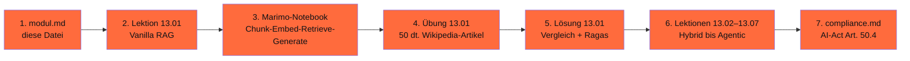

# Phase 13 · RAG-Tiefenmodul

> **Stop pasting whole documents into prompts.** — RAG ist 2026 das Standard-Pattern für Wissens-Anwendungen.

**Status**: ✅ Showcase-Modul, Vanilla-RAG ausgearbeitet, weitere Varianten als Skelett · **Dauer**: ~ 14 h · **Schwierigkeit**: mittel

> Im Original (rohitg00) hat RAG nur eine kurze Sektion. Hier ein vollständiges Vertiefungsmodul mit deutscher Datenbasis.

## 🎯 Was du in diesem Modul lernst

- Du baust 7 RAG-Varianten (Vanilla, Hybrid, ColBERT/Late-Interaction, Re-Ranking, GraphRAG, LazyGraphRAG, Agentic)
- Du misst RAG-Qualität mit Ragas — und weißt, was die Werte konkret bedeuten
- Du wählst die richtige Variante: Vanilla für FAQ, Hybrid für Code-Doku, ColBERT für Recht, GraphRAG/LazyGraphRAG für komplexe Wissensbasen
- Du implementierst Quellen-Attribution AI-Act-konform

## 🧭 Wie du diese Phase nutzt

## 📚 Inhalts-Übersicht

| Lektion | Titel | Dauer | Datei |
|---|---|---|---|
| 13.01 | Vanilla RAG — Chunk → Embed → Retrieve → Generate | 60 min | [`lektionen/01-vanilla-rag.md`](lektionen/01-vanilla-rag.md) ✅ |
| 13.02 | Hybrid Retrieval (BM25 + Dense + RRF) | 60 min | _geplant_ |
| 13.03 | ColBERT / Late-Interaction (jina-colbert-v2) | 60 min | _geplant_ |
| 13.04 | Re-Ranking mit bge-reranker-v2-m3 | 45 min | _geplant_ |
| 13.05 | GraphRAG (Microsoft 2024) | 90 min | _geplant_ |
| 13.06 | LazyGraphRAG — 700× günstiger | 60 min | _geplant_ |
| 13.07 | Agentic RAG (Self-RAG, Corrective RAG) | 90 min | _geplant_ |
| 13.08 | Eval mit Ragas: faithfulness, answer-relevancy, context-precision | 60 min | _geplant_ |
| 13.09 | Quellen-Attribution AI-Act-konform | 30 min | _geplant_ |

## 💻 Hands-on-Projekt (Pflicht)

Vier RAG-Varianten auf demselben deutschen Wikipedia-Subset (Themen: Recht, Tierwelt, Geschichte) mit Ragas-Score + Latenz + EUR-Kosten-Vergleich. Pharia-1 vs. Mistral-Large als Generator.

## ✅ Voraussetzungen

- Phase 00 (Werkstatt einrichten)
- Phase 05 (Tokenizer + Embeddings für Deutsch)
- Phase 11 (LLM-Engineering Grundlagen)

## ⚖️ DACH-Compliance-Anker

→ [`compliance.md`](compliance.md) — AI-Act Art. 50.4 (Quellen-Attribution), Wikipedia-Lizenz CC BY-SA 4.0, Personenbezug im Vektorstore, EU-Vector-DB-Wahl.

## 📖 Quellen (Auswahl)

- Lewis et al. (2020): „RAG" — <https://arxiv.org/abs/2005.11401>
- Khattab & Zaharia (2020): „ColBERT" — <https://arxiv.org/abs/2004.12832>
- Microsoft Research (2024): „GraphRAG" — <https://arxiv.org/abs/2404.16130>
- Microsoft Research (2024): „LazyGraphRAG" — <https://www.microsoft.com/en-us/research/blog/lazygraphrag-setting-a-new-standard-for-quality-and-cost/>
- Asai et al. (2023): „Self-RAG" — <https://arxiv.org/abs/2310.11511>
- Vollständig in [`weiterfuehrend.md`](weiterfuehrend.md).

## 🔄 Wartung

Stand: 28.04.2026 · Reviewer: Saskia Teichmann ([@s-a-s-k-i-a](https://github.com/s-a-s-k-i-a)) · Nächster Review: 07/2026 (Quellen + Modell-Preise).
