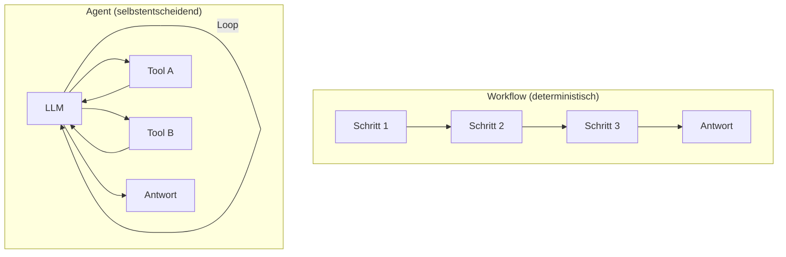
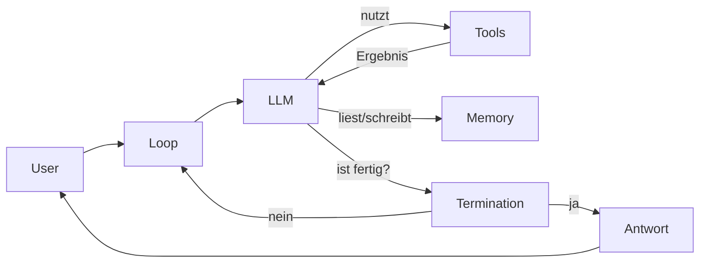

## Worum es geht

> Stop calling everything an „agent". — der Begriff ist 2026 verwässert. Klare Definitionen helfen.

Ein **Agent** ist ein LLM-System, das **selbst** entscheidet, welcher nächste Schritt sinnvoll ist (Tool-Call, weitere Frage, Antwort). Ein **Workflow** ist deterministisch programmiert. Anthropic („Building Effective Agents", Dez. 2024) empfiehlt: **erst Workflow versuchen, Agent nur wenn Flexibilität nötig**.

## Voraussetzungen

- Phase 11 (LLM-Engineering) bis Lektion 11.03 (Function Calling)

## Konzept

### Workflow vs. Agent

| Frage | Workflow | Agent |
|---|---|---|
| Reihenfolge der Schritte | fix programmiert | LLM entscheidet |
| Anzahl der Schritte | bekannt | offen |
| Debugging | einfach | schwer |
| Kontrolle | hoch | gering |
| Flexibilität bei Variation | gering | hoch |

**Faustregel**: 80 % der „Agent"-Use-Cases sind eigentlich Workflows. Die restlichen 20 % brauchen echte Agent-Flexibilität.

### Die vier Agent-Bausteine

#### 1. Loop

Der Agent ruft das LLM **mehrfach** auf, bis es entscheidet: „Ich habe genug Information, hier ist die Antwort." Jeder Loop-Durchgang:

1. LLM bekommt Konversations-State + verfügbare Tools
2. LLM entscheidet: weiteres Tool aufrufen ODER finale Antwort
3. Bei Tool-Call: Tool-Ergebnis ans LLM zurück, Loop neu

#### 2. Tools

Die **Aktions-Schnittstelle** des Agents. Pydantic AI: `@agent.tool_plain` (siehe Lektion 11.03). MCP-basiert: externe MCP-Server (Lektion 14.02–14.03).

Wichtig:

- Tools mit klarem Docstring (das LLM liest ihn!)
- Pydantic-Schemas für Argumente
- **Keine** Side-Effects ohne Audit-Log

#### 3. Memory

Drei Schichten:

| Memory-Typ | Was | Lebensdauer |
|---|---|---|
| **Working Memory** | Konversations-State innerhalb eines Runs | bis Session endet |
| **Short-Term Memory** | Letzte N Konversationen | Stunden bis Tage |
| **Long-Term Memory** | Persistente Facts (User-Präferenzen) | persistent |

Implementierungen:

- **Working Memory**: built-in in Pydantic AI (Message-History)
- **Short-Term**: LangGraph-Checkpointer (Lektion 14.05)
- **Long-Term**: Mem0, Letta, eigene Vector-DB-basierte Lösung

#### 4. Termination

Der Agent muss **wissen, wann er fertig ist**. Drei Mechanismen:

1. **LLM gibt finale Antwort** statt Tool-Call (Default)
2. **Max-Iterations-Limit** (Pydantic AI: `result_retries`; LangGraph: `recursion_limit=25`)
3. **Human-in-the-Loop**-Trigger („soll ich weitermachen?")

⚠️ **Ohne Termination** kann ein Agent in **Endlosschleifen** geraten. Das ist nicht nur ein Bug — es ist ein **Cost-Problem**. Hard-Limits sind Pflicht.

### „Building Effective Agents" — Anthropic-Empfehlungen

Anthropic veröffentlichte Dezember 2024 die einflussreichste Referenz-Lektüre. Kernaussagen 2026 immer noch gültig:

1. **Workflows zuerst**: deterministische Verkettung schlägt Agents in den meisten Fällen
2. **Augmented LLM** als Baustein: LLM + Retrieval + Tools + Memory
3. **Five Workflow Patterns**: Prompt Chaining, Routing, Parallelization, Orchestrator-Worker, Evaluator-Optimizer
4. **Two Agent Patterns**: autonomer Agent (Single LLM, Tool-Loop) und Multi-Agent (mehrere LLMs koordiniert)
5. **Simplicity**: weniger Frameworks, weniger Abstraktion. Direkt mit OpenAI/Anthropic-SDK starten, Frameworks nur bei nachweisbarem Bedarf.

→ Pflicht-Lektüre: <https://www.anthropic.com/research/building-effective-agents>

### Wann Workflow, wann Agent?

| Use-Case | Empfehlung |
|---|---|
| Daten-Extraktion aus Dokument (immer gleich) | **Workflow** |
| Klassifikation (immer gleicher Schritt) | **Workflow** |
| RAG mit fester Pipeline | **Workflow** |
| Code-Refactoring (variable Schritt-Anzahl) | **Agent** |
| Recherche-Aufgabe mit unbekanntem Pfad | **Agent** |
| Customer-Support-Bot mit variablen Pfaden (Eskalieren? Rückfrage? Termin? Kontostand?) | **Agent** |

## Hands-on

Diskutiere für deinen eigenen Use-Case (oder einen aus dem Repo):

1. **Ist das ein Workflow oder ein Agent?**
2. **Welche Tools braucht es?**
3. **Welche Memory-Schicht ist nötig?**
4. **Wie weiß der Agent, wann er fertig ist?**

## Selbstcheck

- [ ] Du erklärst Workflow vs. Agent in einem Satz.
- [ ] Du benennst die vier Agent-Bausteine ohne Lehrbuch.
- [ ] Du hast Anthropics „Building Effective Agents" gelesen oder zumindest überflogen.
- [ ] Du verstehst: für 80 % der Use-Cases ist Agent overkill.

## Compliance-Anker

- **Human Oversight (AI-Act Art. 14)**: bei Hochrisiko-Anwendungen ist menschlicher Eingriffspfad Pflicht. Agent-Termination muss Human-in-the-Loop-Pattern unterstützen.
- **Cost-Limits**: Endlosschleifen sind nicht nur teuer, sondern können auch DSGVO-relevant werden, wenn jeder Loop-Durchgang Daten verarbeitet.

## Quellen

- Anthropic, „Building Effective Agents" (Dez. 2024) — <https://www.anthropic.com/research/building-effective-agents> (Zugriff 2026-04-28)
- Pydantic AI Agent-Doc — <https://ai.pydantic.dev/agents/>
- LangGraph Tutorials — <https://langchain-ai.github.io/langgraph/tutorials/>
- OWASP LLM Top 10 — <https://genai.owasp.org/llm-top-10/>

## Weiterführend

→ Lektion **14.02** (MCP-Spec deep dive)
→ Lektion **14.04** (Pydantic AI als Default)
→ Lektion **14.05** (LangGraph für komplexe Workflows)
→ Lektion **14.07** (Multi-Agent-Patterns)
