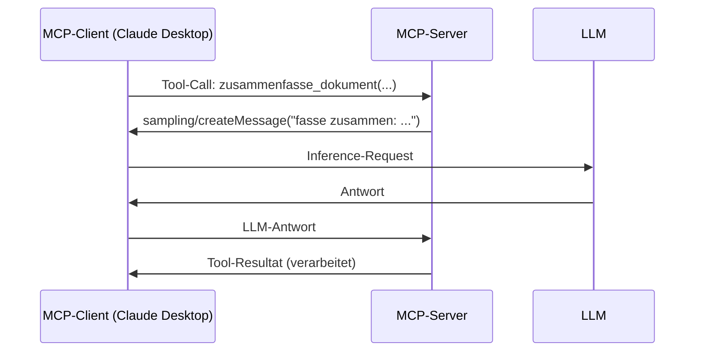

## Worum es geht

> Stop using MCP only for tools. — Resources und Prompts sind ebenso wichtig, und Sampling ist der Trumpf für Server-LLMs.

Phase 11.04 hat dir die **Basics** gezeigt. Diese Lektion vertieft: **Multi-Server-Setups, Auth-Mechanik, Sampling, Production-Pattern**.

## Voraussetzungen

- Lektion 11.04 (MCP-Basics — du hast einen `FastMCP`-Server geschrieben)
- Phase 14.01 (Agent-Definition)

## Konzept

### Die drei Feature-Typen vertieft

| Feature | Wer kontrolliert? | Use-Case |
|---|---|---|
| **Tools** | Modell entscheidet, ob Aufruf | Side-Effect-Operationen (E-Mail, DB-Insert, API-POST) |
| **Resources** | Client / App entscheidet, was sichtbar | Read-only Daten (Files, DB-Records, Konfig) |
| **Prompts** | User entscheidet (Slash-Commands) | parametrisierte Vorlagen |

Drei verschiedene Steuerungs-Verantwortliche — wichtig zu trennen.

### Resources im Detail

Eine Resource hat eine **URI** wie `file:///pfad/zur/datei.md`, `postgres://table/row/123`, `adoption://richtlinien`.

```python
@mcp.resource("adoption://richtlinien")
def adoptions_richtlinien() -> str:
    """Aktuelle Adoptions-Richtlinien als Markdown."""
    return open("data/richtlinien.md").read()

@mcp.resource("adoption://tier/{tier_id}")
def tier_profil(tier_id: str) -> dict:
    """Profil eines Tieres als JSON."""
    return db.tier_by_id(tier_id)
```

Der **Client** entscheidet, ob er eine Resource dem Modell gibt:

- automatisch (alle, wenn Liste klein)
- per Slash-Command vom User („/include richtlinien")
- per Such-Funktion (semantic search über alle Resources)

Vorteil gegenüber Tool: Resources sind **read-only** — sicher gegen Prompt-Injection-Side-Effects.

### Prompts als Slash-Commands

```python
@mcp.prompt()
def beratungsgespraech(thema: str, ton: str = "freundlich") -> str:
    """Vorlage für ein Adoptions-Beratungsgespräch."""
    return f"""Du bist Berater:in im Tierheim. Thema: {thema}.
Antworte im Ton: {ton}. Auf Deutsch.

Was sind typische Erstfragen?"""
```

Im Client (z. B. Claude Desktop) erscheint das als **`/beratungsgespraech`**-Slash-Command. User-Input für `thema` und `ton` wird abgefragt, dann wird der Prompt an das LLM geschickt.

→ Trennt **vorgefertigte Prompt-Logik** von Tool-Aufrufen.

### Multi-Server-Setup

Die Stärke von MCP zeigt sich, wenn du **mehrere Server gleichzeitig** anschließt.

`claude_desktop_config.json`:

```json
{
  "mcpServers": {
    "adoption-bot": {
      "command": "uv",
      "args": ["--directory", "/projekte/tierheim", "run", "python", "server.py"]
    },
    "github": {
      "command": "npx",
      "args": ["-y", "@modelcontextprotocol/server-github"],
      "env": { "GITHUB_TOKEN": "ghp_..." }
    },
    "filesystem": {
      "command": "npx",
      "args": ["-y", "@modelcontextprotocol/server-filesystem", "/Users/saskia/Documents"]
    }
  }
}
```

Claude Desktop spawnt drei MCP-Server, mergt deren Tools und Resources, und das LLM hat Zugriff auf alle.

In **Pydantic AI** (Stand 1.85+):

```python
from pydantic_ai import Agent
from pydantic_ai.mcp import MCPServerStdio, MCPServerStreamableHTTP

agent = Agent(
    "anthropic:claude-sonnet-4-6",
    toolsets=[
        MCPServerStdio("uv", ["run", "python", "adoption_server.py"]),
        MCPServerStreamableHTTP("https://api.example.de/mcp"),
    ],
)
```

**Best Practice**: Tool-Namen prefixen (`github_create_issue`, `adoption_termin_buchen`), um Kollisionen zu vermeiden.

### Sampling — der Trumpf

**Sampling** = der Server fragt den Client nach einer LLM-Completion, statt einen eigenen API-Key zu benutzen.



Vorteile:

- **Server braucht keinen eigenen LLM-API-Key**
- **Client-Konfig** (welches Modell, welche Settings) wird respektiert
- **Cost-Control** beim User, nicht beim Server-Betreiber

Stand 04 / 2026: Sampling-Adoption ist **gemischt** — Claude Desktop unterstützt es, andere Clients implementieren es schrittweise.

### Auth für HTTP-Transport

MCP-Spec 2025-06-18 (oder neuer) hat eine **Authorization-Section** mit OAuth2-Flow. Wichtige Regeln:

- **Stdio-Transport**: lokal, vertrauensbasiert, keine Auth
- **HTTP-Transport**: OAuth2 Pflicht für Multi-Tenant

Beispiel (Server-Seite, FastMCP):

```python
from mcp.server.fastmcp import FastMCP
from mcp.server.auth import AuthProvider

mcp = FastMCP("Adoption-Server", auth=MyOAuthProvider())
```

Details in der MCP-Spec → <https://modelcontextprotocol.io/specification/latest>.

### Production-Best-Practices

| Bereich | Empfehlung |
|---|---|
| **Schema** | strikte JSON-Schemas, `additionalProperties: false` |
| **Auth** | OAuth2 für HTTP, Stdio nur lokal |
| **Rate Limiting** | Token-Bucket pro Tool, klare Error-Messages |
| **Logging** | strukturiert (JSON), keine Geheimnisse, Audit-Log jeder Request |
| **Error-Handling** | MCP-Errors mit `isError: true` + lesbarer Message statt Exception |
| **Versioning** | `serverInfo.version` setzen, Capabilities-Negotiation respektieren |
| **Schema-Tests** | `mcp dev` als Inspector-Tool nutzen |

## Hands-on

Erweitere deinen Adoption-MCP-Server (aus 11.04) um:

1. **Resource** `adoption://faq` mit FAQ als Markdown
2. **Prompt** `beratungsgespraech(thema, ton)` als Slash-Command
3. **Im Client** (Claude Desktop) registrieren und testen

```bash
mcp dev adoption_server.py  # Inspector-UI auf http://localhost:6274
```

## Selbstcheck

- [ ] Du erklärst Tools / Resources / Prompts und ihre Steuerungs-Verantwortlichen.
- [ ] Du kennst die Spec-Felder für Multi-Server-Konfig.
- [ ] Du verstehst Sampling und sein Hauptargument (kein Server-API-Key).
- [ ] Du nutzt OAuth2 für HTTP-Transport, Stdio nur lokal.

## Compliance-Anker

- **Tool-Whitelisting**: bei Multi-Server-Setups noch wichtiger — explizit prefixen, Tool-Listen reviewen.
- **Audit-Logging (AI-Act Art. 12)**: jeder Tool-Call **und** Resource-Read gehört ins Audit-Log.
- **Datenresidenz**: Stdio-Server lokal, HTTP-Server prüfen (wo läuft der Endpoint?).

## Quellen

- MCP Spec — <https://modelcontextprotocol.io/specification/latest> (Zugriff 2026-04-28)
- MCP Hub — <https://modelcontextprotocol.io/>
- MCP Server-Liste (offiziell + community) — <https://github.com/modelcontextprotocol/servers>
- Pydantic AI MCP-Toolset-Doc — <https://ai.pydantic.dev/mcp/>

## Weiterführend

→ Lektion **14.03** (eigenen MCP-Server bauen, vertieft)
→ Lektion **14.04** (Pydantic AI mit MCP)
