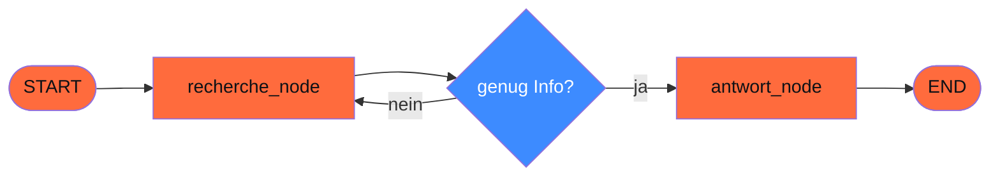

## Worum es geht

> Stop forcing complex workflows into a single Pydantic-AI-Agent. — LangGraph macht State-Machines mit Zyklen, Human-Approval und Checkpointing.

**LangGraph** (Repo-Lockfile: `langgraph 1.1.9`) ist die Bibliothek von LangChain Inc., wenn dein Workflow:

- mehrere Schritte mit konditionaler Verzweigung hat
- Zyklen braucht (Reflektion, Self-Correction)
- Human-in-the-Loop-Pausen ermöglicht
- über mehrere Sessions hinweg persistent state braucht

## Voraussetzungen

- Lektion 14.04 (Pydantic AI Agents)
- `uv add langgraph` (verifiziert: 1.1.9)

## Konzept

### Mental Model: Graph statt Loop



Im Gegensatz zu Pydantic AI (impliziter Loop) ist LangGraph **explizit**:

- Du definierst einen `StateGraph`
- Nodes sind Funktionen `(state) -> partial_state`
- Edges verbinden Nodes statisch oder konditional
- `START` und `END` sind Sentinels

### State definieren

```python
from typing import TypedDict, Annotated
from langgraph.graph import StateGraph, START, END
from langgraph.graph.message import add_messages

class AgentState(TypedDict):
    messages: Annotated[list, add_messages]  # Reducer: append statt überschreiben
    iterationen: int
    fertig: bool
```

`Annotated[list, add_messages]` heißt: wenn ein Node `{"messages": [neue_msg]}` zurückgibt, wird die neue Nachricht **angehängt** statt der ganzen Liste überschrieben.

### Nodes definieren

```python
from langchain_anthropic import ChatAnthropic

llm = ChatAnthropic(model="claude-sonnet-4-6")

def recherche_node(state: AgentState) -> dict:
    """Ruft das LLM mit den bisherigen Messages auf."""
    response = llm.invoke(state["messages"])
    return {
        "messages": [response],
        "iterationen": state["iterationen"] + 1,
    }

def antwort_node(state: AgentState) -> dict:
    """Generiert die finale Antwort."""
    return {"messages": [{"role": "assistant", "content": "Final"}], "fertig": True}
```

### Conditional Edges

```python
def routing_funktion(state: AgentState) -> str:
    """Entscheidet, welcher Node als Nächstes kommt."""
    if state["iterationen"] >= 3:
        return "antwort"  # Limit erreicht
    if state["fertig"]:
        return END
    return "recherche"  # weiter recherchieren

graph = StateGraph(AgentState)
graph.add_node("recherche", recherche_node)
graph.add_node("antwort", antwort_node)
graph.add_edge(START, "recherche")
graph.add_conditional_edges(
    "recherche",
    routing_funktion,
    {"recherche": "recherche", "antwort": "antwort", END: END},
)
graph.add_edge("antwort", END)

app = graph.compile()
```

### Run

```python
result = app.invoke({
    "messages": [{"role": "user", "content": "Erkläre Adoption."}],
    "iterationen": 0,
    "fertig": False,
})
print(result["messages"][-1])
```

### Persistent State (Checkpointer)

```python
from langgraph.checkpoint.sqlite import SqliteSaver

checkpointer = SqliteSaver.from_conn_string("agent_state.db")
app = graph.compile(checkpointer=checkpointer)

config = {"configurable": {"thread_id": "user-123-session-456"}}

# Erste Anfrage
app.invoke({"messages": [...]}, config=config)

# Später (z. B. nächster Tag): Resume
app.invoke({"messages": [...]}, config=config)
# State der vorherigen Session ist da
```

Postgres-Variante für Production:

```python
from langgraph.checkpoint.postgres import PostgresSaver
checkpointer = PostgresSaver.from_conn_string("postgresql://...")
```

→ **Time-Travel-Debugging**: du kannst zu jedem Checkpoint zurück und neu starten.

### Human-in-the-Loop

Modernes Pattern (LangGraph 0.2+):

```python
from langgraph.types import interrupt

def buchungs_node(state: AgentState) -> dict:
    """Tool-Call mit Human-Approval."""
    termin_vorschlag = state["termin_vorschlag"]
    # Pausiere und warte auf User-Bestätigung
    bestaetigt = interrupt({"frage": f"Termin {termin_vorschlag} bestätigen?"})
    if bestaetigt:
        return {"termin_status": "gebucht"}
    return {"termin_status": "abgelehnt"}
```

Im Frontend:

```python
# Externes UI fängt das Interrupt
result = app.invoke(input_state, config=config)
if "__interrupt__" in result:
    user_antwort = ui.ask(result["__interrupt__"][0]["frage"])
    # Resume mit User-Input
    final = app.invoke(Command(resume=user_antwort), config=config)
```

### Pydantic AI vs. LangGraph — wann was?

| Aspekt | Pydantic AI | LangGraph |
|---|---|---|
| Mental Model | Agent + Tools (Loop implizit) | Graph + State (Loop explizit) |
| Komplexe Verzweigung | begrenzt (über `iter()`) | nativ |
| Persistenz | manuell | eingebaut |
| Human-in-the-Loop | manuell | nativ über `interrupt()` |
| Type-Safety | sehr hoch | mittel |
| Multi-Agent | Sub-Agent-als-Tool | nativ über Subgraphen |

**Faustregel**:

- **80 %** der Use-Cases: Pydantic AI reicht
- **20 %**: LangGraph zahlt sich aus, weil State-Machine, HITL, Long-Running

## Hands-on

Schreibe einen LangGraph-Adoptions-Bot:

1. **Nodes**: `frage_verstehen`, `tier_suchen`, `termin_vorschlagen`, `human_bestaetigung`, `termin_buchen`
2. **Conditional Edges** zwischen ihnen
3. **Checkpointer** mit SQLite
4. **`interrupt()`** vor `termin_buchen` für Mitarbeiter-Approval

## Selbstcheck

- [ ] Du baust einen `StateGraph` mit mind. 3 Nodes und einer conditional Edge.
- [ ] Du verstehst Reducer-Annotations (`add_messages`).
- [ ] Du kennst den `MemorySaver` / `SqliteSaver` / `PostgresSaver`-Trade-off.
- [ ] Du nutzt `interrupt()` für Human-in-the-Loop.

## Compliance-Anker

- **Human Oversight (AI-Act Art. 14)**: `interrupt()` ist die saubere Implementation der HITL-Pflicht für Hochrisiko-Anwendungen.
- **Audit-Trail (Art. 12)**: Checkpointer **ist** der Audit-Trail. Keine separate Logging-Pipeline nötig (zusätzlich zu OpenTelemetry).
- **Datenschutz**: PostgresSaver-DB enthält Plaintext-State. Verschlüsseln, Retention-Pflicht beachten.

## Quellen

- LangGraph Docs — <https://langchain-ai.github.io/langgraph/> (Zugriff 2026-04-28)
- LangGraph Releases — <https://github.com/langchain-ai/langgraph/releases> (verifiziert: 1.1.9)
- LangGraph Multi-Agent-Tutorials — <https://langchain-ai.github.io/langgraph/tutorials/multi_agent/multi-agent-collaboration/>
- LangGraph Persistence — <https://langchain-ai.github.io/langgraph/concepts/persistence/>
- LangGraph Human-in-the-Loop — <https://langchain-ai.github.io/langgraph/concepts/human_in_the_loop/>

## Weiterführend

→ Lektion **14.06** (DSPy für Pipeline-Optimierung)
→ Lektion **14.07** (Multi-Agent mit LangGraph)
