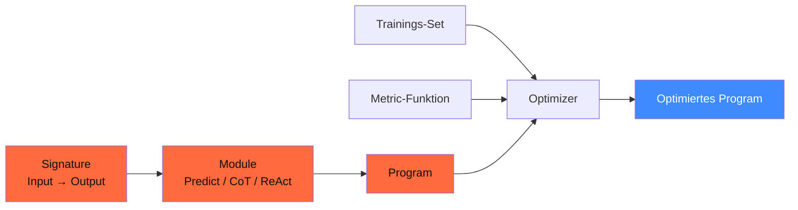

## Worum es geht

> Stop hand-tuning prompts. — DSPy macht aus Prompt-Engineering ein Optimierungs-Problem mit messbarer Metrik.

**DSPy** (PyPI `dspy 3.2.0`, vom 21.04.2026) ist ein Stanford-NLP-Projekt von Omar Khattab. Idee: du schreibst **deklarative Signaturen** + **Module** + eine **Metrik**, und ein **Optimizer** kompiliert automatisch optimale Few-Shot-Demos und Instruktionen aus deinen Trainingsdaten.

Slogan: **„Programming, not Prompting"**.

## Voraussetzungen

- Lektion 11.02 (Pydantic AI Structured Outputs)
- Lektion 11.08 (Promptfoo) — du verstehst Eval-Mindset

## Konzept

### Drei Bausteine



### Signatures

Verträge zwischen Input und Output:

```python
import dspy

# Inline (kurz):
qa = dspy.Predict("question -> answer")

# Als Klasse (typsicher):
class FAQAntwort(dspy.Signature):
    """Beantworte FAQ-Fragen knapp und korrekt."""
    frage: str = dspy.InputField()
    antwort: str = dspy.OutputField(desc="ein deutscher Satz")
    konfidenz: float = dspy.OutputField(desc="0-1")
```

### Modules

Vorgefertigte Bausteine:

| Module | Was |
|---|---|
| `dspy.Predict(sig)` | direkte Vorhersage |
| `dspy.ChainOfThought(sig)` | fügt automatisch ein `rationale`-Feld hinzu |
| `dspy.ReAct(sig, tools=[...])` | Tool-Use-Loop |
| `dspy.ProgramOfThought(sig)` | generiert Code statt Text |

```python
qa_cot = dspy.ChainOfThought(FAQAntwort)
result = qa_cot(frage="Was ist der AI Act?")
print(result.rationale)  # automatisch generiert
print(result.antwort)
print(result.konfidenz)
```

### Optimizers (Teleprompter)

Hier wird's interessant:

```python
import dspy

# 1. LLM konfigurieren
dspy.configure(lm=dspy.LM("anthropic/claude-sonnet-4-6"))

# 2. Programm definieren
qa = dspy.ChainOfThought(FAQAntwort)

# 3. Trainings-Set vorbereiten
train_set = [
    dspy.Example(frage="Wann ist DSGVO in Kraft?",
                 antwort="Seit 25. Mai 2018.").with_inputs("frage"),
    dspy.Example(frage="Was regelt der AI Act?",
                 antwort="Gestaffelte KI-Pflichten ab 2025.").with_inputs("frage"),
    # ... 8 weitere Beispiele
]

# 4. Metrik definieren
def korrekt_und_kurz(example, pred, trace=None) -> bool:
    return (
        pred.antwort.strip() != ""
        and len(pred.antwort.split()) <= 30
        and example.antwort.lower()[:20] in pred.antwort.lower()
    )

# 5. Optimizer kompilieren
from dspy.teleprompt import BootstrapFewShot

teleprompter = BootstrapFewShot(metric=korrekt_und_kurz, max_bootstrapped_demos=4)
optimized_qa = teleprompter.compile(student=qa, trainset=train_set)

# 6. Optimiertes Programm nutzen
result = optimized_qa(frage="Was ist GRPO?")
```

DSPy hat hinter den Kulissen:

1. Mit dem ungetunten `qa`-Modul über `train_set` gelaufen
2. Die erfolgreichen Aufrufe als Few-Shot-Demos extrahiert
3. Optimale Demo-Kombination via Random-Search gefunden
4. Final ein **kompiliertes Programm** mit eingebauten Demos zurückgegeben

### MIPROv2 — der State-of-the-Art-Optimizer

```python
from dspy.teleprompt import MIPROv2

teleprompter = MIPROv2(metric=korrekt_und_kurz, num_candidates=10)
optimized = teleprompter.compile(qa, trainset=train_set, valset=val_set)
```

MIPROv2 = **Multi-prompt Instruction PRoposal Optimizer v2**:

- Optimiert **Few-Shot-Demos UND System-Instruktionen** simultan
- Bayesian Search über den Prompt-Raum
- Aktueller State-of-the-Art (2024 / 2025)

### Wann DSPy einsetzen?

| Kriterium | DSPy einsetzen? |
|---|---|
| Du hast eine **klare Metrik** für Erfolg | ✅ |
| Du hast 10+ Trainings-Beispiele | ✅ |
| Performance-Optimierung > Code-Lesbarkeit | ✅ |
| Klassifikation / Extraktion / RAG | ✅ |
| Kreative Generierung ohne klare Metrik | ❌ |
| Single-Use-Anfragen | ❌ |

### DSPy vs. Pydantic AI vs. LangGraph

| Frage | Antwort |
|---|---|
| Single-Agent + Tools | **Pydantic AI** |
| Workflow mit Zyklen / HITL | **LangGraph** |
| Pipeline mit messbarer Metrik | **DSPy** |
| Kombi: DSPy als „Sub-Step" innerhalb LangGraph-Knoten | sehr mächtig |

DSPy ist nicht „statt" — sondern „zusätzlich zu". Du nutzt es **dort, wo du eine Pipeline wiederholt mit Trainingsdaten optimieren willst**.

## Hands-on (45 Min.)

Optimiere einen FAQ-Klassifikator:

1. Sammle 10–20 Beispiele aus deinem Repo (Issues, Discussions)
2. Definiere `FAQKlassifikation`-Signature
3. Wrap mit `ChainOfThought`
4. Schreibe Metrik (z. B. „korrekte Kategorie + max. 50 Wörter")
5. `BootstrapFewShot` kompilieren
6. Vergleich vor/nach Optimization auf Test-Set

## Selbstcheck

- [ ] Du erklärst „Programming, not Prompting" in einem Satz.
- [ ] Du schreibst eine Signature und ein ChainOfThought-Modul.
- [ ] Du nutzt `BootstrapFewShot` mit eigener Metrik.
- [ ] Du erkennst, wann DSPy passt und wann nicht.

## Compliance-Anker

- **Reproduzierbarkeit (AI-Act Art. 11)**: optimierte DSPy-Programme sind **deterministisch** dokumentierbar — die kompilierten Demos sind sichtbar in `optimized_qa.demos`.
- **Quality-Gate**: Metrik-Funktion ist Pflicht — ohne Metrik kein DSPy. Das ist eine **gute Disziplin** für Hochrisiko-Anwendungen.

## Quellen

- DSPy Docs — <https://dspy.ai/> (Zugriff 2026-04-28)
- DSPy GitHub — <https://github.com/stanfordnlp/dspy> (aktuell: v3.2.0, 21.04.2026)
- DSPy Tutorials — <https://dspy.ai/tutorials/>
- MIPROv2-Paper — <https://arxiv.org/abs/2406.11695>
- Khattab et al. (2024) „DSPy" — <https://arxiv.org/abs/2310.03714>

## Weiterführend

→ Lektion **14.07** (Multi-Agent mit Pydantic AI / LangGraph)
→ Phase **18** (Eval-Pipelines mit DSPy + Promptfoo + Ragas)
