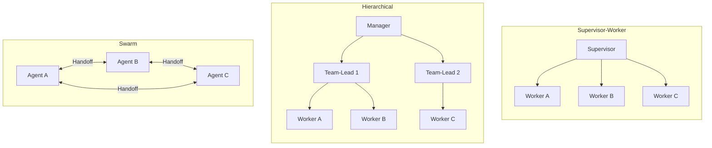

## Worum es geht

> Stop overengineering with multi-agent. — 80 % der Use-Cases sind Single-Agent-tauglich. Aber wenn Multi-Agent **wirklich** nötig ist: drei Patterns sind 2026 Standard.

## Voraussetzungen

- Lektion 14.04 (Pydantic AI Agents)
- Lektion 14.05 (LangGraph)

## Konzept

### Drei Patterns im Überblick



### 1. Supervisor-Worker (Anthropic „Orchestrator-Worker")

Ein zentraler Supervisor erhält die Aufgabe, **delegiert** an Spezialisten, sammelt Ergebnisse, gibt finale Antwort.

**Pydantic AI**:

```python
from pydantic_ai import Agent

# Sub-Agents
recherche_agent = Agent("anthropic:claude-haiku-4-5",
                         system_prompt="Du recherchierst im Web.")
mathe_agent = Agent("openai:gpt-5-4-mini",
                     system_prompt="Du löst mathematische Probleme.")

# Supervisor mit Sub-Agents als Tools
supervisor = Agent("anthropic:claude-sonnet-4-6",
                   system_prompt="Du delegierst Aufgaben an Spezialisten.")

@supervisor.tool_plain
async def web_recherche(frage: str) -> str:
    """Delegiert an Recherche-Spezialist."""
    return (await recherche_agent.run(frage)).output

@supervisor.tool_plain
async def mathe_loesen(aufgabe: str) -> str:
    """Delegiert an Mathe-Spezialist."""
    return (await mathe_agent.run(aufgabe)).output

result = await supervisor.run(
    "Was ist die Bevölkerung Berlins, und was ist 12 % davon?"
)
```

**LangGraph**:

```python
from langgraph_supervisor import create_supervisor

supervisor = create_supervisor(
    agents=[recherche_agent, mathe_agent],
    model=ChatAnthropic(model="claude-sonnet-4-6"),
)
```

**Wann**: 80 % der Multi-Agent-Use-Cases. Klare Aufgaben-Verteilung, single Source-of-Truth.

### 2. Hierarchical

Mehrere Supervisor-Ebenen. Ein Manager delegiert an Team-Leads, die wiederum an Worker.

```python
# LangGraph mit Subgraphen
research_team = create_supervisor(agents=[web_agent, paper_agent], model=...)
math_team = create_supervisor(agents=[arithmetic_agent, statistics_agent], model=...)

manager = create_supervisor(
    agents=[research_team, math_team],
    model=ChatAnthropic(model="claude-opus-4-7"),  # stärkstes Modell oben
)
```

**Wann**: ab ~ 7 Spezialisten — sonst überfordert ein einzelner Supervisor. Auch bei klaren Domänen-Trennungen (Recherche-Team vs. Schreib-Team vs. Math-Team).

### 3. Swarm

Gleichberechtigte Agents mit **Handoff**-Mechanik. Kein zentraler Supervisor.

```python
# Konzept (vereinfacht):
class HandoffAgent:
    def run(self, message):
        if "math" in message:
            return mathe_agent.run(message)  # Handoff
        if "research" in message:
            return recherche_agent.run(message)
        return self.process(message)
```

**OpenAI Agents SDK** hat das mit `handoff()` als First-Class-Pattern.

**Wann nicht**: Termination-Probleme (Agent A ruft B, B ruft A, …). Schwer zu debuggen. 2026 in Production **selten** empfohlen.

### Welches Pattern wann?

| Aufgabe | Pattern |
|---|---|
| Single-Step + Tools | **Single-Agent** (Pydantic AI) |
| Klare Aufgaben-Verteilung an Spezialisten | **Supervisor-Worker** |
| Komplexe Domänen mit Sub-Teams | **Hierarchical** |
| Gleichberechtigte Agents, dynamische Übergabe | **Swarm** (selten produktiv) |

### Anthropic-Empfehlung

In „Building Effective Agents" (Dez. 2024, weiter aktuell): **Workflows zuerst**. Multi-Agent erst, wenn:

- Skalierungs-Limit eines Single-Agents erreicht
- Klare Sub-Domain-Spezialisierung
- Parallel-Verarbeitung sinnvoll

Faustregel 2026:

- **Single-Agent + Tools**: 70 % der Fälle (Pydantic AI)
- **Supervisor-Worker**: 25 % (LangGraph)
- **Hierarchical / Swarm**: 5 %

### Audit-Pattern für Multi-Agent

Pflicht für Hochrisiko (AI-Act Art. 12):

```python
# Bei jedem Sub-Agent-Aufruf:
logger.info("agent_handoff",
    parent="supervisor",
    child="recherche_agent",
    task_id="task-4711",
    user="user-pseudonym-abc")
```

Mit **OpenTelemetry GenAI** + Phoenix / Langfuse (Lektion 11.10) bekommst du das automatisch — jeder Sub-Agent-Call wird als eigenes Span getraced, mit Parent-Child-Beziehung.

## Hands-on

Baue einen **Tierheim-Multi-Agent**:

- **Supervisor**: nimmt Anfrage entgegen, entscheidet
- **Recherche-Agent**: liest aus Vector-DB (Tier-Profile)
- **Termin-Agent**: findet freie Termine
- **Bestätigungs-Agent**: schreibt formelle Bestätigungs-E-Mail

Implementiere in **Pydantic AI** (Sub-Agent als Tool). Falls du Lust hast: parallel die LangGraph-Variante.

## Selbstcheck

- [ ] Du nennst die drei Patterns und ihre Use-Cases.
- [ ] Du implementierst Supervisor-Worker in Pydantic AI mit 2+ Sub-Agents.
- [ ] Du erkennst Swarm-Risiken (Termination, Debugging).
- [ ] Du logst jeden Sub-Agent-Aufruf als eigenes Audit-Event.

## Compliance-Anker

- **Audit-Trail (AI-Act Art. 12)**: Sub-Agent-Aufrufe = separate Tracing-Spans, alle ans Audit-Log.
- **Human Oversight (Art. 14)**: Supervisor-Pattern eignet sich gut für HITL — der Supervisor pausiert vor kritischen Worker-Aufrufen.
- **Cost-Multiplikator**: Multi-Agent kostet schnell 5–10× mehr Tokens. Cost-Cap pro Run pflichtbewusst setzen.

## Quellen

- Anthropic „Building Effective Agents" — <https://www.anthropic.com/research/building-effective-agents>
- LangGraph Multi-Agent Tutorials — <https://langchain-ai.github.io/langgraph/tutorials/multi_agent/multi-agent-collaboration/>
- LangGraph Supervisor — <https://github.com/langchain-ai/langgraph/tree/main/libs/langgraph-supervisor>
- OpenAI Agents SDK Handoffs — <https://platform.openai.com/docs/guides/agents>
- Pydantic AI Multi-Agent Examples — <https://ai.pydantic.dev/multi-agent/>

## Weiterführend

→ Lektion **14.08** (Sicherheit — Prompt-Injection in Multi-Agent vertieft)
→ Lektion **14.09** (Hands-on Charity-Adoptions-Bot mit Multi-Agent)
→ Phase **15** (Autonome Systeme — wenn Multi-Agent autonom läuft)
