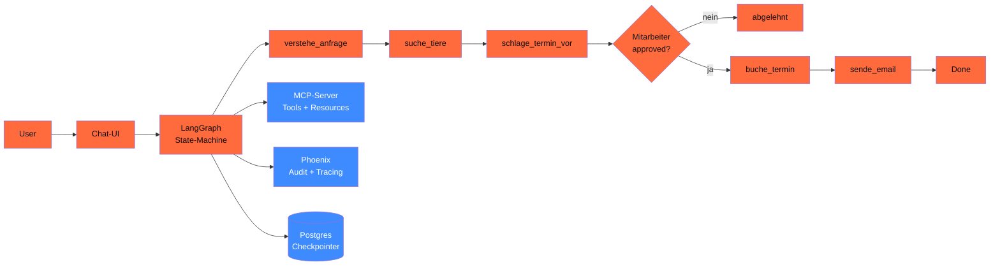

## Worum es geht

> Stop staying in toy examples. — diese Lektion baut **das gesamte Phase-14-Material** in einen Real-World-Charity-Adoptions-Bot.

## Voraussetzungen

- Lektionen 14.01 bis 14.08
- Optional: API-Key für Anthropic / IONOS (sonst Ollama lokal)

## Konzept

### Das Szenario

Eine **deutsche Tierschutz-Organisation** will einen Adoptions-Assistenten:

- nimmt Adoptions-Anfragen via Chat entgegen
- klassifiziert Tier-Vorlieben aus User-Beschreibung
- sucht in Tier-DB nach Match-Kandidaten
- schlägt Termin vor
- **wartet auf Mitarbeiter-Approval**, bevor gebucht wird
- schickt Bestätigungs-E-Mail (mit Mitarbeiter-Approval)
- DSGVO-konform: kein Personenbezug in System-Prompts, Audit-Logs, EU-Hosting

### Architektur



### Komponenten

#### 1. MCP-Server (aus 14.03)

`adoption_server.py` mit Tools:

- `freie_termine(woche, jahr) -> list`
- `tier_suche(art, alter_max, eigenschaften) -> list[dict]`
- `buche_termin(...)` (im Notebook als Stub)
- `sende_bestaetigungs_email(...)` (im Notebook als Stub)

Plus Resources `adoption://richtlinien` und `adoption://faq`.

#### 2. LangGraph-State-Machine

```python
class AdoptionState(TypedDict):
    messages: Annotated[list, add_messages]
    user_pseudonym: str  # KEIN Klarname!
    tier_kandidaten: list[dict]
    termin_vorschlag: dict
    mitarbeiter_approved: bool
    bestaetigungs_id: str
```

Sechs Nodes (oben in Architektur), zwei mit `interrupt()` für HITL.

#### 3. Pydantic AI als Sub-Agent

Innerhalb von `verstehe_anfrage`:

```python
from pydantic import BaseModel
from pydantic_ai import Agent

class TierVorlieben(BaseModel):
    art: Literal["Hund", "Katze", "Kleintier"]
    alter_max: int = Field(ge=0, le=20)
    eigenschaften: list[str] = Field(max_length=5)

verstehe_agent = Agent(
    "anthropic:claude-sonnet-4-6",
    output_type=TierVorlieben,
    system_prompt="Extrahiere Tier-Vorlieben aus User-Anfrage. KEIN PERSONENBEZUG.",
)

def verstehe_anfrage(state: AdoptionState) -> dict:
    user_msg = state["messages"][-1].content
    vorlieben = verstehe_agent.run_sync(user_msg).output
    # Suche Tiere via MCP-Tool
    return {"tier_kandidaten": tier_suche(vorlieben.art, vorlieben.alter_max,
                                           vorlieben.eigenschaften)}
```

#### 4. Human-in-the-Loop

```python
from langgraph.types import interrupt

def schlage_termin_vor(state: AdoptionState) -> dict:
    # Termin-Logik
    termin = berechne_passenden_termin(state["tier_kandidaten"])

    # Pause für Mitarbeiter-Bestätigung
    bestaetigt = interrupt({
        "mitarbeiter_frage": f"Termin {termin['datum']} {termin['uhrzeit']} "
                             f"für {state['user_pseudonym']} ok?",
        "tier_id": termin["tier_id"],
    })

    return {
        "termin_vorschlag": termin,
        "mitarbeiter_approved": bestaetigt,
    }
```

Mitarbeiter-UI bekommt das `interrupt`-Event, klickt „Ja" / „Nein", State läuft weiter.

#### 5. Audit-Logging (Phoenix)

```python
import os
os.environ["PHOENIX_PROJECT_NAME"] = "adoption-bot-prod"

from phoenix.otel import register
register(project_name="adoption-bot-prod", auto_instrument=True)
```

Alle LangGraph-Nodes, alle Pydantic-AI-Calls, alle MCP-Tool-Calls werden automatisch ge-traced. Im Phoenix-UI siehst du jeden Schritt mit Token-Counts, Latenz, Argumenten (Hashes).

#### 6. DSGVO-Pattern

| Anforderung | Wie umgesetzt |
|---|---|
| **Datenminimierung (Art. 5 lit. c)** | nur `user_pseudonym`, `tier_id` (Hashes), keine Klarnamen |
| **AVV (Art. 28)** | Anthropic Enterprise-Tier mit EU-Datazone |
| **Drittland-Schutz (Art. 44)** | Anthropic Münchner Office + DPA + EU-Region + SCC-Backup |
| **Automatisierte Entscheidung (Art. 22)** | Mitarbeiter-Approval bei jedem Termin → kein „rein automatisch" |
| **TOM (Art. 32)** | Audit-Logging, Postgres-Encryption, Token-Limits |
| **Right to be Forgotten (Art. 17)** | Lösch-Workflow auf Pseudonym-zu-Daten-Mapping |

### Self-Censorship-Audit (falls asiatisches Modell)

Wenn du Qwen3 oder DeepSeek als Sub-Agent nutzt: **Pflicht-Eval** auf 50 deutschen Prompts in 5 Kategorien (Tiananmen, Taiwan, Xinjiang, Xi, Hongkong).

→ Phase 18 hat das Hands-on. Für diesen Bot ist es **nicht** primär nötig (Adoption ist nicht politisch), aber für seriöse DACH-Praxis: dokumentieren, dass es nicht-relevant ist.

### Compliance-Checkliste vor Production

- [ ] AVV mit allen Cloud-Anbietern signiert
- [ ] DSFA durchgeführt (Phase 20.03)
- [ ] AI-Act-Klassifizierung dokumentiert (Phase 20.01) — vermutlich „begrenzt" wegen Chatbot
- [ ] Audit-Logging-Aufbewahrung min. 6 Monate
- [ ] Mitarbeiter-Approval-UI vorhanden (HITL)
- [ ] Cost-Caps gesetzt (max. 1.000 Tokens/Run, 100 Runs/User/Tag)
- [ ] Prompt-Injection-Mitigation aktiv (Lektion 14.08)
- [ ] DSGVO-Lösch-Workflow getestet

## Hands-on (4–8 h, je nach Tiefe)

Setze die obige Architektur in deiner eigenen Umgebung um:

1. **MCP-Server** schreiben (siehe 14.03)
2. **LangGraph-State-Machine** mit allen 6 Nodes bauen (Lektion 14.05)
3. **Pydantic-AI-Sub-Agent** für `verstehe_anfrage` (14.04)
4. **HITL** mit `interrupt()` an `schlage_termin_vor`
5. **Phoenix-Tracing** aktivieren
6. **DSGVO-Pattern** prüfen (Pseudonyme, EU-Hosting, Audit-Hashes)
7. **Promptfoo-Eval-Suite** mit 5 Beispiel-Anfragen (Lektion 11.08)
8. **Compliance-Checkliste** durchgehen

→ Vollständiges Codebase-Skelett: [`code/01_charity_bot.py`](../code/01_charity_bot.py).

Die Volllösung ist als **Capstone 19.C** im Repo angelegt — du kannst dort den Bot vollständig bauen und in dein Portfolio packen.

## Selbstcheck

- [ ] Du verbindest MCP-Server, LangGraph, Pydantic AI in einem End-to-End-Flow.
- [ ] Du implementierst Human-in-the-Loop mit `interrupt()`.
- [ ] Du nutzt Phoenix für Tracing und Audit.
- [ ] Du erfüllst die DSGVO-Checkliste (mind. 6/8 Punkte).
- [ ] Du dokumentierst die AI-Act-Klassifizierung und DSFA.

## Compliance-Anker

- **Vollständige DSGVO-Pipeline**: dieser Bot ist ein Lehrbuch-Beispiel für DSGVO-konforme KI-Anwendung.
- **AI-Act Art. 14**: HITL via `interrupt()` ist die saubere Implementierung.
- **AI-Act Art. 50**: Chatbot-Hinweis im UI Pflicht („Du sprichst mit einer KI").
- **DSGVO Art. 22**: Mitarbeiter-Approval = keine vollautomatische Entscheidung.

## Quellen

- Phasen 11.02, 11.03, 11.04, 11.05, 11.08, 11.10
- Lektionen 14.01 bis 14.08
- Phase 20: AVV, DSFA, AI-Literacy, Audit-Logging
- Phase 19.C als Capstone-Erweiterung

## Weiterführend

→ Phase **17** (Production EU-Hosting) — diesen Bot auf StackIT / IONOS deployen
→ Phase **18** (Eval mit Promptfoo / Ragas / Self-Censorship-Audit)
→ Phase **19.C** (Capstone — vollständige Implementation)
→ Phase **20** (Recht & Governance — DSFA, AI-Literacy, Audit)
