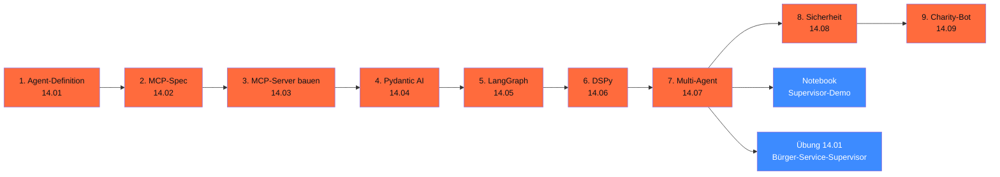

# Phase 14 · Agenten & MCP

> **MCP = USB-C der Agents.** — ein Standard für Tool-Anbindung statt 17 Vendor-SDKs. Plus: 80 % deiner Use-Cases sind Single-Agent-tauglich — die anderen 20 % brauchen klare Multi-Agent-Patterns.

**Status**: ✅ vollständig ausgearbeitet · **Dauer**: ~ 16 h · **Schwierigkeit**: fortgeschritten

## 🎯 Was du in diesem Modul lernst

- **Agent-Definition** — Tools + Memory + Loop + Termination, vier Bausteine, klare Begriffe
- **MCP-Spec deep dive** — Resources, Tools, Prompts, Transport (stdio + HTTP+SSE), Capability-Negotiation
- **Eigener MCP-Server** — Python SDK 1.27.0, Stub für `freie_termine`, Resource-Beispiele
- **Pydantic AI** — der Default für 80 % der Agent-Use-Cases (Type-Safety, Streaming, MCP-Integration)
- **LangGraph** — wenn du State-Machines, Cycles, Postgres-Checkpointer und HITL brauchst
- **DSPy** — wenn deine Prompts lernbar werden sollen (MIPROv2, GEPA-Optimizer)
- **Multi-Agent** — Supervisor (80 %), Hierarchical (15 %), Swarm (5 %, selten produktiv)
- **Sicherheit** — OWASP LLM Top 10, indirect Prompt Injection, Tool-Whitelisting, Sandboxing
- **Hands-on Charity-Adoptions-Bot** — End-to-End-DSGVO-konform mit Phoenix-Tracing

## 🧭 Wie du diese Phase nutzt



## 📚 Inhalts-Übersicht

| Lektion | Titel | Dauer | Datei |
|---|---|---|---|
| 14.01 | Agent-Definition: Tools, Memory, Loop, Termination | 60 min | [`lektionen/01-agent-definition.md`](lektionen/01-agent-definition.md) ✅ |
| 14.02 | MCP-Spec deep dive (Spec 2025-11-25) | 60 min | [`lektionen/02-mcp-spec-deep-dive.md`](lektionen/02-mcp-spec-deep-dive.md) ✅ |
| 14.03 | Eigenen MCP-Server bauen (Python SDK 1.27.0) | 60 min | [`lektionen/03-mcp-server-bauen.md`](lektionen/03-mcp-server-bauen.md) ✅ |
| 14.04 | Pydantic AI als Default-Framework | 90 min | [`lektionen/04-pydantic-ai-default.md`](lektionen/04-pydantic-ai-default.md) ✅ |
| 14.05 | LangGraph für State-Machines mit Cycles + HITL | 90 min | [`lektionen/05-langgraph-state-machines.md`](lektionen/05-langgraph-state-machines.md) ✅ |
| 14.06 | DSPy für Pipeline-Optimierung | 60 min | [`lektionen/06-dspy-pipeline-optimierung.md`](lektionen/06-dspy-pipeline-optimierung.md) ✅ |
| 14.07 | **Multi-Agent: Supervisor, Hierarchical, Swarm** | 90 min | [`lektionen/07-multi-agent-patterns.md`](lektionen/07-multi-agent-patterns.md) ✅ |
| 14.08 | Sicherheit: Prompt Injection, Tool-Whitelisting, Cost-Caps | 75 min | [`lektionen/08-sicherheit.md`](lektionen/08-sicherheit.md) ✅ |
| 14.09 | **Hands-on: Charity-Adoptions-Bot (DSGVO-konform)** | 120 min | [`lektionen/09-charity-adoptions-bot.md`](lektionen/09-charity-adoptions-bot.md) ✅ |

## 💻 Hands-on-Projekt

**Supervisor-Agent-Demo**: Marimo-Notebook mit Stub-Multi-Agent-Pattern (Supervisor + 3 Sub-Agents: Recherche, Mathe, Termin). Smoke-Test-tauglich (keine API-Calls), mit klarer Anleitung, wie du den Stub gegen echte `pydantic_ai.Agent`-Instanzen tauschst.

[](https://colab.research.google.com/github/s-a-s-k-i-a/ki-engineering-werkstatt/blob/main/dist-notebooks/phasen/14-agenten-und-mcp/code/01_supervisor_agent.ipynb)

```bash
uv run marimo edit phasen/14-agenten-und-mcp/code/01_supervisor_agent.py
```

Plus die [Übung 14.01](uebungen/01-aufgabe.md): Bürger-Service-Supervisor mit drei Sub-Agents, MCP-Tool, Audit-Trail und Cost-Cap ([Lösungs-Skelett](loesungen/01_loesung.py)).

## 🧱 Framework-Wahl 2026 (Faustregel)

| Use-Case | Framework | Begründung |
|---|---|---|
| **Single-Agent + Tools** (70 %) | **Pydantic AI** | Type-Safety, Streaming, MCP-Integration |
| **State-Machine mit Cycles + HITL** | **LangGraph** | Postgres-Checkpointer, `interrupt()`, Subgraphs |
| **Lernbare Pipelines** | **DSPy** | MIPROv2 / GEPA optimieren Prompts gegen Eval-Set |
| **Supervisor-Worker** (25 %) | **Pydantic AI** (Sub-Agent als Tool) oder **LangGraph** | Anthropic „Building Effective Agents"-Pattern |
| **Hierarchical** (5 %) | **LangGraph** mit Subgraphs | mehrere Supervisor-Ebenen |
| **Swarm** (selten produktiv) | **OpenAI Agents SDK** | mit Vorsicht, Termination-Probleme |

## ✅ Voraussetzungen

- Phase 11 (Pydantic AI Basics, MCP-Anbindung, Eval) — wird hier vertieft
- Phase 13 (RAG) — als Tool für Wissens-Sub-Agent nützlich
- Optional: API-Keys für Anthropic / OpenAI / Mistral (sonst Ollama lokal als Fallback)

## ⚖️ DACH-Compliance-Anker

→ [`compliance.md`](compliance.md): Human Oversight (Art. 14), Tool-Authorization, Datenminimierung im System-Prompt, Audit-Logging, automatisierte Entscheidungen (DSGVO Art. 22).

Multi-Agent-spezifisch:

- **Audit-Trail** — jeder Sub-Agent-Aufruf = eigenes Phoenix-Span (siehe Lektion 11.10)
- **Cost-Caps** — Multi-Agent kostet schnell 5–10× mehr Tokens; Token-Budget Pflicht
- **Tool-Whitelisting** — Sub-Agents als Tools, nicht „alle Funktionen"
- **HITL** — Supervisor pausiert via `interrupt()` vor kritischen Worker-Aufrufen (Adoption, Buchung, Zahlung)

## 📖 Quellen (Auswahl)

- Anthropic „Building Effective Agents" — <https://www.anthropic.com/research/building-effective-agents>
- Pydantic AI Multi-Agent — <https://ai.pydantic.dev/multi-agent/>
- LangGraph Supervisor — <https://github.com/langchain-ai/langgraph/tree/main/libs/langgraph-supervisor>
- MCP Spec 2025-11-25 — <https://modelcontextprotocol.io/specification/latest>
- OWASP LLM Top 10 v2.0 — <https://genai.owasp.org/llm-top-10/>
- Vollständig in [`weiterfuehrend.md`](weiterfuehrend.md).

## 🔄 Wartung

Stand: 28.04.2026 · Reviewer: Saskia Teichmann ([@s-a-s-k-i-a](https://github.com/s-a-s-k-i-a)) · Nächster Review: 07/2026 (Pydantic AI 2.x-Watch, MCP-Spec-Update auf Quartals-Cadence). **Frameworks ändern sich quartalsweise** — bei Production-Einsatz Versions-Pinning Pflicht.
