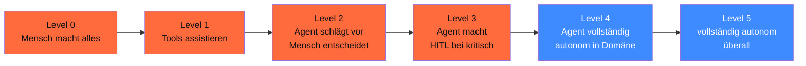
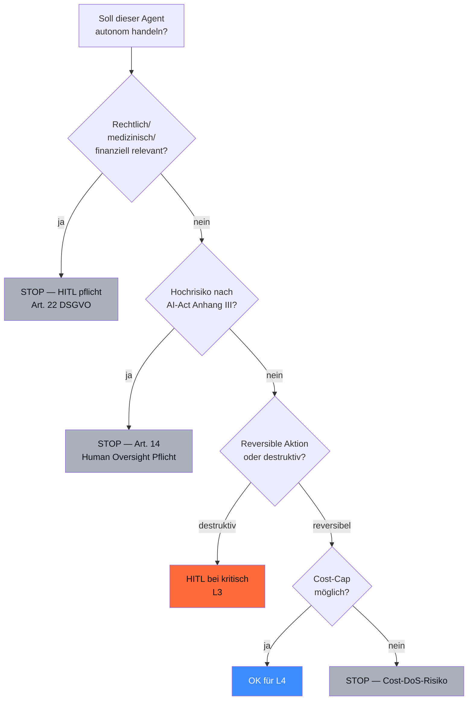
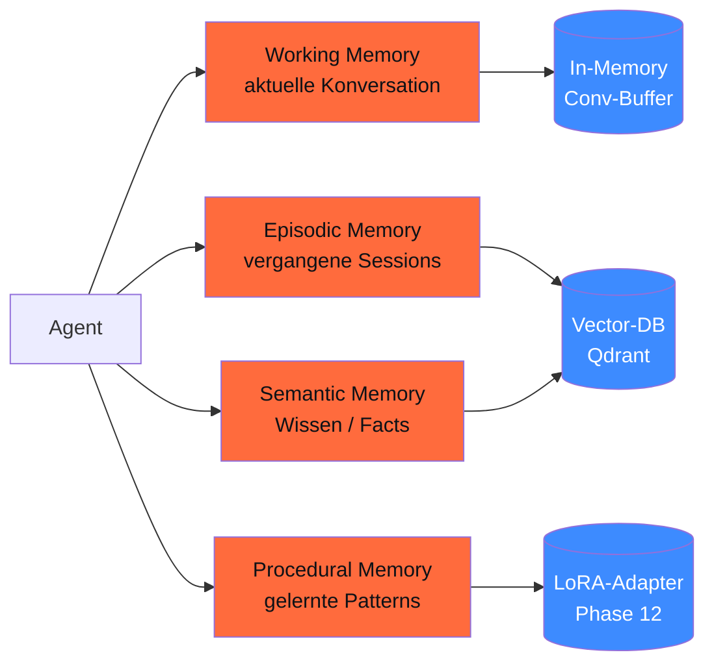

<!-- colab-badge:begin -->
[](https://colab.research.google.com/github/s-a-s-k-i-a/ki-engineering-werkstatt/blob/main/dist-notebooks/phasen/15-autonome-systeme/code/01_autonomie_klassifikator.ipynb)
<!-- colab-badge:end -->

## Worum es geht

> Stop calling everything an "autonomous agent". — die meisten „autonomen Agenten" sind tatsächlich **Supervisor-Worker mit HITL**. Echte Autonomie hat hohe Compliance-Hürden (AI-Act Art. 14, DSGVO Art. 22).

## Voraussetzungen

- Phase 14.07 (Multi-Agent-Patterns)
- Phase 14.08 (Sicherheit + OWASP LLM Top 10)

## Konzept

### Autonomie-Stufen



### Wo „autonome" Systeme 2026 wirklich sind

| Use-Case | Reale Stufe |
|---|---|
| **„autonomer" Email-Assistent** | meist L2 (Vorschläge mit User-Bestätigung) |
| **Customer-Service-Bot** | L2-L3 (HITL bei Eskalation) |
| **Code-Agent** (Cursor, Claude Code) | L3 (Human reviewt Code) |
| **Trading-Bot** | L4 in Domäne, mit Cost-Caps |
| **Selbstfahrende Autos** | L3-L4 (mit Driver-Override) |
| **„AGI"** | nicht existent 2026 |

> **Pattern 2026**: 95 % der „autonomen" Production-Systeme sind tatsächlich L2-L3 mit klarer HITL-Stelle.

### AI-Act Art. 14 — Human Oversight Pflicht

URL: <https://artificialintelligenceact.eu/article/14/>

Hochrisiko-KI-Systeme **müssen** so gestaltet sein, dass:

1. **Mensch kann eingreifen** während Operation
2. **Mensch kann ablehnen / abbrechen** (Stop-Button-Pflicht)
3. **Mensch versteht** was das System macht (Explainability)
4. **Konfidenzwerte sichtbar** (Modell-Unsicherheit kommuniziert)
5. **Kritische Entscheidungen** explizit Mensch-bestätigt

### DSGVO Art. 22 — automatisierte Entscheidungen

> „Die betroffene Person hat das Recht, **nicht** einer ausschließlich auf einer automatisierten Verarbeitung — einschließlich Profiling — beruhenden Entscheidung unterworfen zu werden, die ihr gegenüber rechtliche Wirkung entfaltet oder sie in ähnlicher Weise erheblich beeinträchtigt."

**Praxis-Pattern**: bei Entscheidungen über Personen (Bewerbung, Kredit, Versicherung, Bürger-Service) **Mensch-im-Loop pflicht** — entweder:

- Vorab-Mensch-Review oder
- Nachträgliche Anfechtungs-Möglichkeit

### Wann NICHT autonom



### Selbst-Reflexion + ReAct

URL: <https://arxiv.org/abs/2210.03629>

Zentrales Pattern für autonome Agenten: **ReAct** (Reasoning + Action):

```text
Thought: Was soll ich als Nächstes tun?
Action: Tool-X mit Argument-Y aufrufen
Observation: Tool-Output
Thought: Macht das Sinn? Brauch ich noch was?
Action: ...
```

Plus **Reflexion** (Shinn et al. 2023): Agent kritisiert eigene Outputs:

```python
# Pattern aus Phase 14.07
class AgentLoop:
    def step(self, state):
        thought = await self.reflect(state)
        if thought.confidence < 0.5:
            return await self.escalate_to_human(state, thought)
        action = await self.act(thought)
        observation = await self.execute(action)
        return self.update_state(observation)
```

### Cost-Caps für Autonomie

Pflicht für L4-Autonomie:

| Cap-Typ | Pflicht-Wert (Default) |
|---|---|
| **Tool-Calls pro Run** | max. 20 |
| **Tokens pro Run** | max. 50.000 |
| **Recursion-Limit (LangGraph)** | 25 |
| **Time-Budget** | 5–10 Minuten |
| **Cost-Cap Tokens/User/Tag** | 100k Tokens |
| **HITL-Trigger** | bei Konfidenz < 0,7 oder destruktiver Aktion |

Phase 14.08 hat Detail.

### Memory-Architekturen für Long-Running-Agenten



**LangGraph Postgres-Checkpointer** (Phase 14.05) deckt Working + Episodic Memory ab. Semantic Memory via RAG (Phase 13). Procedural Memory via LoRA-Finetune (Phase 12).

### Wann Long-Running-Agenten?

| Use-Case | Pattern |
|---|---|
| **Customer-Support-Bot** mit Multi-Session | Working + Episodic Memory |
| **Personal-Assistent** | + Semantic Memory (User-Profil) |
| **Lern-Agent** | + Procedural Memory (LoRA-Update) |
| **Autonome Pipeline** | alle 4 Memory-Typen |

> **Realität 2026**: vollständig autonome L4-Agenten sind in Production **selten**. Customer-Support-Bots, Code-Assistants und ähnliche bleiben L2-L3 mit klaren HITL-Stellen.

## Hands-on

1. Klassifiziere 5 deiner Agent-Use-Cases nach Autonomie-Stufe
2. Identifiziere für jeden HITL-Pflicht-Stellen
3. Lies AI-Act Art. 14 + DSGVO Art. 22
4. Bau ein Cost-Cap-Pattern für einen LangGraph-Agent

## Selbstcheck

- [ ] Du nennst die fünf Autonomie-Stufen.
- [ ] Du erkennst, dass 95 % der „autonomen" Systeme tatsächlich L2-L3 sind.
- [ ] Du kennst AI-Act Art. 14 + DSGVO Art. 22 als HITL-Pflicht.
- [ ] Du wählst Use-Cases, wo NICHT autonom (Recht, Medizin, Finanzen).
- [ ] Du planst 4-Schicht-Memory für Long-Running-Agenten.

## Compliance-Anker

- **AI-Act Art. 14**: Human Oversight für Hochrisiko-Systeme
- **DSGVO Art. 22**: Mensch bei automatisierten Entscheidungen
- **Cost-Caps**: Pflicht für L4-Autonomie

## Quellen

- AI-Act Art. 14 — <https://artificialintelligenceact.eu/article/14/>
- DSGVO Art. 22 — <https://eur-lex.europa.eu/legal-content/DE/TXT/?uri=CELEX:32016R0679>
- ReAct (Yao et al. 2022) — <https://arxiv.org/abs/2210.03629>
- Reflexion (Shinn et al. 2023) — <https://arxiv.org/abs/2303.11366>

## Weiterführend

→ Lektion **15.02** (Long-Running-Agenten in Production)
→ Phase **14.05** (LangGraph + Postgres-Checkpointer)
→ Phase **18.07** (Red-Teaming für Autonomie-Risiken)
