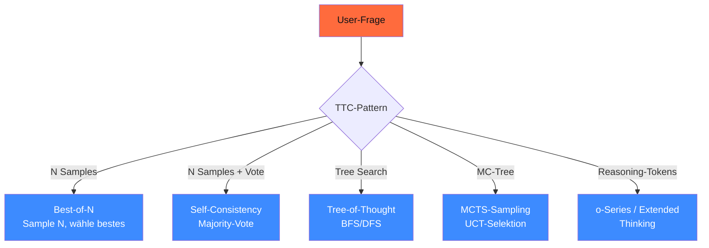

<!-- colab-badge:begin -->
[](https://colab.research.google.com/github/s-a-s-k-i-a/ki-engineering-werkstatt/blob/main/dist-notebooks/phasen/16-reasoning-und-test-time/code/01_reasoning_modell_selektor.ipynb)
<!-- colab-badge:end -->

## Worum es geht

> Stop assuming bigger model = better. — länger nachdenken kann mehr bringen als mehr Parameter. Test-Time-Compute (TTC) ist 2026 die zweite Skalierungsachse neben Modell-Größe. Diese Lektion zeigt: wann lohnt sich TTC, wann ist es Token-Verbrennung.

## Voraussetzungen

- Phase 11.01 (Prompt-Patterns: Zero/Few-Shot, CoT, Self-Consistency-Basics)
- Phase 11.08 (Promptfoo-Eval)

## Konzept

### Die TTC-Familien-Übersicht



### Pattern 1: Best-of-N (BoN)

Sample **N** Antworten unabhängig, wähle die beste. „Beste" wird durch ein Reward-Model oder einen Verifier bestimmt.

```python
async def best_of_n(frage: str, n: int = 8, judge=None) -> str:
    candidates = await asyncio.gather(*[
        agent.run(frage, model_settings={"temperature": 0.7})
        for _ in range(n)
    ])
    if judge is None:
        # ohne Reward: längste / strukturierteste
        return max(candidates, key=lambda c: len(c.output))
    # Reward-basiert
    scores = await judge.score_all([c.output for c in candidates])
    return candidates[scores.argmax()].output
```

**Wann sinnvoll**:

- Mathe / Code mit verifizierbaren Ergebnissen (Pytest, Lean-Compiler)
- Wenn ein günstiges Reward-Model verfügbar ist
- Wenn N = 4–16 reicht (≥ 32 wird selten besser)

**Cost**: linear in N. Bei N=8 zahlst du 8× Tokens.

### Pattern 2: Self-Consistency (SC)

Erweiterung von BoN: Sample N Reasoning-Pfade, **Majority-Vote** über die finalen Antworten.

Original: Wang et al. 2022, [arxiv.org/abs/2203.11171](https://arxiv.org/abs/2203.11171). 2026 immer noch der **stabilste TTC-Pattern** für Aufgaben mit numerischen / kategorialen Antworten.

```python
from collections import Counter

async def self_consistency(frage: str, n: int = 8) -> str:
    candidates = await asyncio.gather(*[
        agent.run(frage, model_settings={"temperature": 0.8})
        for _ in range(n)
    ])
    final_answers = [extract_final_answer(c.output) for c in candidates]
    most_common, count = Counter(final_answers).most_common(1)[0]
    konfidenz = count / n
    return f"{most_common} (Konfidenz: {konfidenz:.0%})"
```

**Wann sinnvoll**:

- Mathe-Aufgaben mit numerischer Endantwort
- Klassifikation mit definiertem Label-Raum
- Kategorische Entscheidungen (ja/nein, klassifiziert)

**Wann **nicht** sinnvoll**:

- Freitext-Generierung (zwei Antworten sind selten identisch)
- Kreative Tasks
- Bei sehr starken Reasoning-Modellen (o3 / R1) — schon implizit eingebaut

### Pattern 3: Tree-of-Thought (ToT)

Yao et al. 2023 ([arxiv.org/abs/2305.10601](https://arxiv.org/abs/2305.10601)): jede Reasoning-Ebene generiert mehrere Branches, die expandiert oder gepruned werden.

Stand 04/2026: in Production **selten** eingesetzt. Komplexer als BoN/SC, kaum bessere Ergebnisse außer bei sehr spezifischen Forschungs-Tasks. Nachfolger:

- **Forest-of-Thought** (2024)
- **AB-MCTS** (Adaptive Branching, 2025)

> Faustregel 2026: **ToT skip** für Production. Bei Reasoning-Bedarf: Self-Consistency + ein Reasoning-Modell (o3 / R1).

### Pattern 4: MCTS (Monte Carlo Tree Search)

ReST-MCTS* (NeurIPS 2024) und **AB-MCTS** (2025) sind State-of-the-Art-Forschung. UCT-Selektion + LLM-basierte Expansion + Reward-Backpropagation.

Use-Cases:

- Math-Olympiade-Niveau (AIME, IMO)
- Code mit Lean-Verifier
- Spiele (Schach-Annotation, Go-Move-Analyse)

Cost: 100–1.000× Vanilla-Inferenz. Nicht für Mainstream-DACH-Mittelstand.

### Pattern 5: Reasoning-Tokens (versteckte CoT)

OpenAI o-Series und Anthropic Extended Thinking haben TTC **eingebaut**: das Modell generiert intern Reasoning-Tokens, die du **nicht siehst**, aber bezahlst (siehe Lektion 16.02).

```python
# OpenAI GPT-5.5 mit reasoning_effort
response = client.chat.completions.create(
    model="gpt-5.5",
    messages=[{"role": "user", "content": "Was ist die 100. Fibonacci-Zahl mod 1024?"}],
    reasoning={"effort": "high"},  # low / medium / high / xhigh
)
# response.usage.reasoning_tokens — sichtbar abgerechnet
```

> **2026 Realität**: für ≥ 90 % der TTC-Use-Cases nimm ein **Reasoning-Modell mit eingebautem Thinking** (o3, GPT-5.5, Claude Opus 4.7, DeepSeek-R1) statt selbst BoN/SC/MCTS zu bauen.

### Process-Reward-Models (PRMs)

Klassischer Reward-Model: bewertet die **finale** Antwort. PRM bewertet **jeden Schritt** im Reasoning-Pfad. Vorteil: erkennt früh, dass ein Pfad falsch läuft.

Stand 2026 produktiv:

- **OpenAI** intern (verstärkt o-Series)
- **DeepSeek-Prover-V2** für Math-Reward
- **ThinkPRM** open-source ([github.com/deepseek-ai/DeepSeek-Prover-V2](https://github.com/deepseek-ai/DeepSeek-Prover-V2))

Reward-Hacking + Domain-Transfer bleiben offene Probleme.

### Verifizierbare Tasks vs. nicht-verifizierbare

TTC funktioniert **nur dort gut**, wo du eine objektive Verifikation hast:

| Task-Typ | TTC-Eignung | Verifier |
|---|---|---|
| Math (Endergebnis) | sehr gut | Lean / Wolfram / Pytest |
| Code (Tests) | sehr gut | pytest / Compiler |
| Klassifikation | gut | Label-Match |
| Multiple-Choice | gut | Antwort-Match |
| Freitext-Übersetzung | mittel | LLM-Judge (subjektiv) |
| Kreatives Schreiben | schlecht | nur LLM-Judge — bias-anfällig |
| Recht-Auskunft | schlecht | kein objektiver Verifier |

> Saskia-Empfehlung 2026: TTC nur, wenn dein Use-Case einen objektiven Verifier hat. Sonst: standardmäßig single-pass mit Reasoning-Modell.

### Cost-Realität (Stand 28.04.2026)

Bei Self-Consistency mit N=8 auf einem typischen 500-Token-Prompt + 200-Token-Response:

| Provider | Single-Pass | SC N=8 | Kosten-Faktor |
|---|---|---|---|
| Claude Haiku 4.5 | ~ 0,002 € | ~ 0,016 € | 8× |
| Claude Sonnet 4.6 | ~ 0,005 € | ~ 0,040 € | 8× |
| GPT-5.5 (xhigh effort) | ~ 0,015 € | ~ 0,015 € | **eingebaut** |
| DeepSeek-R1 (CN-API) | ~ 0,001 € | — (already reasoning) | — |

> **Kosten-Vergleich**: ein Reasoning-Modell mit `effort=high` kostet oft weniger als 8× Self-Consistency mit einem Non-Reasoning-Modell. Eingebaute TTC schlägt explizite TTC fast immer.

### Cost-Cap für TTC

Pflicht-Pattern (siehe Lektion 17.07):

```python
# LiteLLM mit Token-Budget
config = {
    "max_tokens": 1024,
    "n": 8,  # bei BoN/SC
    "timeout": 60,  # bei MCTS unbegrenzt — gefährlich
}
```

Im Audit-Log: pro Run Token-Verbrauch + TTC-Pattern + Konfidenz dokumentieren.

## Hands-on

1. Implementiere BoN mit N=8 auf einer dt. Mathe-Aufgabe — vergleiche mit Single-Pass
2. Self-Consistency auf MMLU-DE-Subset (50 Fragen) — Accuracy + Cost
3. GPT-5.5 mit `effort=low/medium/high/xhigh` vergleichen — wann lohnt sich xhigh?
4. Cost-Tracking pro Pattern dokumentieren

## Selbstcheck

- [ ] Du erklärst Best-of-N, Self-Consistency, MCTS und Reasoning-Tokens.
- [ ] Du wählst den richtigen TTC-Pattern für ein verifizierbares Task.
- [ ] Du verstehst, wann eingebaute TTC schlägt explizite TTC.
- [ ] Du setzt Token-Budgets als Cost-Cap.
- [ ] Du erkennst, wann TTC **nicht** sinnvoll ist (Freitext, Recht-Auskunft).

## Compliance-Anker

- **Cost-Cap (AI-Act Art. 13)**: TTC-Patterns sind Cost-Multiplikatoren, Pflicht-Cap pro Run
- **Robustness (Art. 15)**: TTC mit Verifier-Loop = höhere Robustheit für Hochrisiko-Tasks
- **Quality Management (Art. 17)**: TTC-Cost als KPI tracken (Phase 17.09)

## Quellen

- Self-Consistency-Paper (Wang et al. 2022) — <https://arxiv.org/abs/2203.11171>
- Tree-of-Thought-Paper (Yao et al. 2023) — <https://arxiv.org/abs/2305.10601>
- Awesome-Inference-Time-Scaling — <https://github.com/ThreeSR/Awesome-Inference-Time-Scaling>
- Awesome-RLVR (Reward + Verifier) — <https://github.com/opendilab/awesome-RLVR>
- Forest-of-Thought (2024) — <https://arxiv.org/html/2412.09078v1>

## Weiterführend

→ Lektion **16.02** (o-Series / Extended Thinking — produktive Reasoning-Modelle)
→ Lektion **16.06** (Verifier-Loops für Math und Code)
→ Phase **11.01** (CoT-Basics, falls noch nicht durch)
